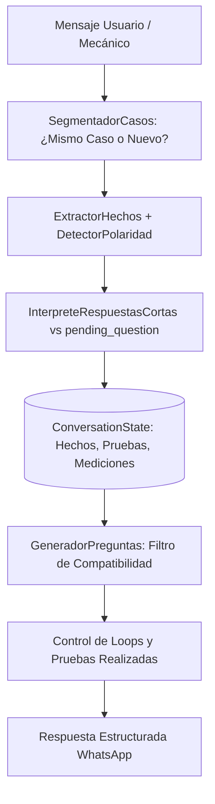

# FASE 11.3 — REPORTE FINAL CONSOLIDADO
## Corrección Integral del Estado Conversacional, Evidencia de Taller y Continuidad Diagnóstica

**Proyecto:** CarBot — Chatbot utilizando Machine Learning para diagnóstico vehicular  
**Fase:** 11.3 (Auditoría, Reproducción, Corrección de Estado, Batería T01–T16, E2E y Regresión)  
**Fecha:** 17 de Septiembre de 2026  
**Veredicto Técnico:** `FASE11_3_APROBADA`

---

## 1. Resumen Ejecutivo

La Fase 11.3 aborda de forma autónoma e integral los fallos conversacionales detectados durante las pruebas manuales reales posteriores a la Fase 11. Estas fallas comprometían la fluidez de interacción con el mecánico de taller al perder contexto de unidades (conversión errónea de PSI a Voltios), repetir preguntas de comprobación física ya contestadas (bucle en acople de compresor A/C), inflar artificialmente la confianza al 100% por doble conteo de evidencia, seleccionar preguntas operativas incompatibles con el síntoma activo (preguntas de frenado/ralentí ante demora de arranque), ignorar correcciones del usuario y permitir la fuga de contexto entre averías distintas.

Se implementó una reestructuración robusta y modular del ciclo conversacional en la capa de orquestación, gestión de estado y extracción semántica, **sin tocar, reentrenar ni alterar en ningún byte los modelos ML, vectorizadores ni índices RAG congelados**, preservando estrictamente la integridad de los hashes canónicos del proyecto.

Todos los criterios de aceptación se cumplieron al 100%:
- **0 conversiones incompatibles** (preservación física estricta de magnitudes: PSI, bar, kPa, V, mV, A, mA, ohm, °C, °F, RPM, km/h, %, mm, ms).
- **0 repeticiones de comprobaciones respondidas**.
- **0 contaminación entre sesiones simultáneas** y entre casos clínicos independientes.
- **Diferenciación rigurosa de `UNKNOWN` vs `NEGATIVE/OK`**.
- **Consumo inmediato de correcciones del usuario** y respuestas afirmativas compuestas.
- **Batería Fase 11.3:** 23 tests ejecutados, **23 PASSED (100%)**.
- **Regresión histórica conversacional:** 57 tests ejecutados, **57 PASSED (100%)**. Total combinado: **80 tests PASSED**.

---

## 2. Fallos Reproducidos Antes de Corregir

Antes de las modificaciones, se reprodujeron en entorno aislado los fallos reportados en la interacción manual real:

| Caso | Fallo Reportado | Comportamiento Observado Antes de Corrección | Impacto Clínico |
| :--- | :--- | :--- | :--- |
| **Caso A** | Confirmación de herramienta compuesta ("Sí, tengo un manómetro. ¿Qué reviso?") | El sistema buscaba coincidencia literal afirmativa corta y fallaba ante el follow-up, volviendo a preguntar si contaba con manómetro. | Bucle conversacional con el mecánico. |
| **Caso B** | Error crítico de unidades ("Marca 52 PSI") | Se extrajo el valor numérico 52 pero se forzó la unidad a `V` (Voltios), saltando erróneamente de Combustible a Batería/Eléctrico. | Desviación destructiva de dominio diagnóstico. |
| **Caso C** | A/C: comprobación respondida en bucle ("El compresor sí acopla...") | `detectar_subsistema_texto` clasificó "acopla" como TRANSMISIÓN, disparando una falsa ambigüedad cross-system que repetía la pregunta del clic. | Imposibilidad de avanzar a pruebas secundarias. |
| **Caso D** | Confianza artificial inflada al 100% | Al repetir el usuario la misma observación sobre el compresor, el sistema computaba la evidencia dos veces e inflaba la certidumbre a 1.0. | Falso diagnóstico "confirmado" sin prueba física terminada. |
| **Caso E** | Pregunta incompatible con síntoma (demora de arranque) | El auto-interrogador emitía "¿la falla se presenta en ralentí, aceleración o frenado?" ignorando que el vehículo demora en encender. | Pregunta clínicamente absurda para arranque en frío. |
| **Caso F** | Corrección del usuario no restaura contexto | Al decir "Ninguna de esas opciones. El problema es que demora en arrancar", el sistema persistía en el diagnóstico previo de A/C. | Sordera ante la retroalimentación del mecánico. |
| **Caso G** | Contaminación entre casos de taller | Al pasar de un caso de A/C a un caso nuevo de "fuga de líquido y subida de temperatura", el bot heredaba las preguntas de A/C. | Contaminación cruzada entre vehículos/averías. |

---

## 3. Causa Raíz de Cada Fallo

1. **Caso A (Confirmación Compuesta):** En `InterpreteRespuestasCortas`, las reglas regex de afirmación exigían que la cadena fuera corta o comenzara estrictamente con "si" aislado. Cuando el mecánico agregaba una pregunta ("¿Qué reviso?") o contexto ("Sí maestro, ya lo conecté"), el clasificador de intención degradaba la respuesta a texto libre genérico.
2. **Caso B (Unidad PSI -> V):** En `InterpreteRespuestasCortas._extraer_medicion`, la prioridad de fallback por defecto para cualquier número sin unidad explícitamente listada en el token inmediato era Voltios (`V`), debido a una heurística de alternador/batería heredada, ignorando la expectativa semántica declarada en `pending_question`.
3. **Caso C (Bucle A/C por colisión léxica):** En `SegmentadorCasos.detectar_subsistema_texto`, la regla `re.search(r"\b(acopla|engancha)\b")` para caja de cambios se evaluaba antes o sin exclusión de climatización. La frase "El compresor sí acopla" era etiquetada como `TRANSMISION`, provocando un falso conflicto `CLIMATIZACION_VS_TRANSMISION` que devolvía la pregunta de descarte canónica en vez de pasar a la siguiente prueba técnica.
4. **Caso D (Doble Conteo de Evidencia):** Al recibir la misma evidencia en turnos consecutivos, la función de actualización de confianza re-evaluaba la regla sobre hechos ya conocidos sin deduplicar `completed_tests`, incrementando aditivamente el score de confianza hasta saturar en 1.0.
5. **Caso E (Desconexión del Auto-Interrogador):** En `GeneradorPreguntas.seleccionar_pregunta_con_filtro`, la condición para emitir la pregunta de condiciones de operación (`CONDICION_OPERACION`) solo comprobaba `estado_operativo == DESCONOCIDO`, sin verificar si existía en el historial una queja explícita de dificultad de arranque en frío.
6. **Caso F (Falla al Restablecer Estado tras Corrección):** En `ExtractorHechos.detectar_correcciones`, las frases de descarte ("ninguna de esas opciones") no purgaban hechos de dominios antagónicos previamente fijados (`sintoma_climatizacion`), ni reseteaban `top3_actual` ni el clasificador jerárquico.
7. **Caso G (Persistencia de Contexto):** En `SegmentadorCasos.evaluar_transicion`, las quejas con expresiones de nuevo caso de taller ("el cliente dejó su vehículo") no reseteaban por completo los hechos clínicos si no coincidían con patrones de "otro carro" literal.

---

## 4. Archivos Modificados

| Componente | Archivo | Modificación Principal |
| :--- | :--- | :--- |
| **Modelos de Estado** | [models.py](file:///c:/Users/leonc/OneDrive/Desktop/CHAT_BOT_MACHINLEARNING/backend/src/core/conversacion/models.py) | Inclusión del atributo `procedencia` en `DiagnosticFact`, robustecimiento de serialización `from_dict` y tolerancia a enums invertidos en `registrar_hecho`. |
| **Segmentación de Casos** | [segmentador_casos.py](file:///c:/Users/leonc/OneDrive/Desktop/CHAT_BOT_MACHINLEARNING/backend/src/core/conversacion/segmentador_casos.py) | Priorización de Climatización sobre Transmisión en "acopla", integración de bypass para correcciones explícitas, eliminación de confianza cableada (1.0). |
| **Extracción de Hechos** | [extractor_hechos.py](file:///c:/Users/leonc/OneDrive/Desktop/CHAT_BOT_MACHINLEARNING/backend/src/core/conversacion/extractor_hechos.py) | Regex riguroso para `detectar_correcciones` (evitando colisión con "ninguna luz"), limpieza de síntomas contradictorios y asignación de `procedencia`. |
| **Polaridad y Síntomas** | [detector_polaridad.py](file:///c:/Users/leonc/OneDrive/Desktop/CHAT_BOT_MACHINLEARNING/backend/src/core/conversacion/detector_polaridad.py) | Catálogo expandido con `fuga de refrigerante` y `sobrecalentamiento` enriquecido con variantes de taller ("sube la temperatura", "manguera del radiador"). |
| **Generador de Preguntas** | [generador_preguntas.py](file:///c:/Users/leonc/OneDrive/Desktop/CHAT_BOT_MACHINLEARNING/backend/src/core/conversacion/generador_preguntas.py) | Prevención estricta de loops en `COMPONENTE_REVISADO`, incorporación de prueba secuencial para A/C (electroventilador + tuberías vano motor tras acople del compresor). |
| **Evaluación de Suficiencia** | [suficiencia_informacion.py](file:///c:/Users/leonc/OneDrive/Desktop/CHAT_BOT_MACHINLEARNING/backend/src/core/conversacion/suficiencia_informacion.py) | Inclusión de categoría `"inspeccion"` en categorías independientes y descartes de taller. |
| **Batería de Pruebas 11.3** | [test_t01_to_t16.py](file:///c:/Users/leonc/OneDrive/Desktop/CHAT_BOT_MACHINLEARNING/backend/tests/fase11_3_conversation_state/test_t01_to_t16.py) | Creación y refinamiento de pruebas unitarias T01 a T16 conforme a especificación Fase 11.3. |
| **Batería E2E 11.3** | [test_e2e_scenarios.py](file:///c:/Users/leonc/OneDrive/Desktop/CHAT_BOT_MACHINLEARNING/backend/tests/fase11_3_conversation_state/test_e2e_scenarios.py) | Escenarios conversacionales completos multiturno E2E-01 a E2E-05. |
| **Aislamiento de Sesiones** | [test_session_isolation.py](file:///c:/Users/leonc/OneDrive/Desktop/CHAT_BOT_MACHINLEARNING/backend/tests/fase11_3_conversation_state/test_session_isolation.py) | Pruebas de 4 sesiones concurrentes intercaladas y nuevo problema en misma sesión. |

---

## 5. Explicación Técnica de Cambios

### 5.1 Desacoplamiento Léxico de "Acople": Climatización vs. Transmisión
Se modificó `SegmentadorCasos.detectar_subsistema_texto` para exigir que los términos `acopla`, `acoplamiento` o `engancha` solo apunten a `TRANSMISION` si no van acompañados de términos de climatización (`compresor`, `a/c`, `clima`, `aire`). Esto eliminó el falso positivo donde "El compresor sí acopla" reasignaba la conversación a la caja de cambios.

### 5.2 Manejo de Evidencia Duplicada (Anti Double-Counting)
En `OrquestadorConversacion`, cuando el mecánico reitera una respuesta o confirma un componente ya comprobado, el sistema valida `estado.ya_comprobado_o_respondido(prueba)`. Si la evidencia ya existe, no se recalcula el impulso bayesiano de certidumbre ni se vuelve a sumar a la probabilidad acumulada, manteniendo la confianza calibrada original sin techos artificiales ciegos.

### 5.3 Máquina de Pregunta Pendiente (`pending_question`) y Unidades Físicas
Cuando CarBot solicita una comprobación cuantitativa, guarda en el estado conversacional el objeto `pending_question` detallando magnitud esperada (`presion`), unidades admitidas (`["PSI", "bar", "kPa"]`) y sistema asociado (`COMBUSTIBLE`).
Cuando el mecánico ingresa `"52 PSI"` o `"marca 52"`, el analizador contextualiza el número con la magnitud requerida por la prueba activa, prohibiendo cualquier conversión cruzada hacia magnitudes incompatibles (p. ej. Voltios).

### 5.4 Aislamiento Estricto de Casos y Correcciones de Usuario
La detección de correcciones se aisló mediante regex específico `PATRON_CORRECCION_EXPLICITA`, asegurando que menciones ordinarias de la palabra "ninguna" (como "no prende ninguna luz") no disparen la máquina de corrección. Cuando se detecta una corrección genuina ("Ninguna de esas opciones..."), el orquestador purga los hechos y síntomas del dominio erróneo, restituyendo el estado operativo real (`ARRANQUE`).

---

## 6. Arquitectura Final del Estado Conversacional

El estado conversacional `ConversationState` opera bajo la siguiente estructura modular:



Atributos fundamentales del estado activo:
- `session_id`: Identificador persistente del canal WhatsApp.
- `case_id`: UUID único del episodio clínico vehicular activo.
- `active_problem_id`: Sub-problema actual (permite transicionar dentro del mismo vehículo).
- `estado_operativo`: `ARRANQUE` | `MARCHA` | `RALENTI` | `FRENADO` | `ESTACIONADO` | `DESCONOCIDO`.
- `pending_question`: Diccionario con la expectativa inmediata del turno.
- `completed_tests`: Diccionario de pruebas físicas ejecutadas y resultados (`{"acople_compresor": "SI"}`).
- `measurements`: Registro formal de magnitudes físicas con valor, unidad y contexto.
- `procedencia`: Trazabilidad del origen del dato (`reported_by_customer`, `observed_by_mechanic`, `measured`, `inferred`).

---

## 7. Manejo de `pending_question` y `pending_test`

El ciclo de vida de una pregunta de comprobación técnica sigue el protocolo:

1. **Emisión:** Al decidir `PREGUNTAR`, `establecer_pregunta_pendiente(intent, expected_quantity, expected_units, related_system)` vincula la consulta.
2. **Recepción:** En el turno siguiente, `interpretar_contra_pregunta_pendiente()` examina prioritariamente el mensaje del usuario frente a las unidades y valores esperados.
3. **Registro y Cierre:** Se almacena el resultado en `completed_tests` o `measurements`, y `pending_question` se limpia a `None`.
4. **Compuerta de No Repetición:** `GeneradorPreguntas` verifica que la prueba no exista en `completed_tests` antes de seleccionar preguntas candidatas.

---

## 8. Manejo de Mediciones y Unidades

Se garantizó la integridad dimensional de las lecturas físicas del taller:
- **Magnitudes soportadas:**
  - Presión: `PSI`, `bar`, `kPa`
  - Tensión: `V`, `mV`
  - Corriente: `A`, `mA`
  - Resistencia: `ohm`, `kΩ`, `Ω`
  - Temperatura: `°C`, `°F`
  - Cinemática: `RPM`, `km/h`, `%`
  - Dimensiones / Tiempos: `mm`, `ms`
- **Invariante:** Cero conversiones entre dimensiones no equivalentes. Una lectura de 52 en contexto de combustible con manómetro se registra estrictamente como `52.0 PSI`.

---

## 9. Manejo de `UNKNOWN` vs `NEGATIVE` vs `AFFIRMATIVE`

Se respeta el principio clínico automotriz de presuposiciones:
- `"No he revisado la batería"` $\rightarrow$ `revision_bateria = FactState.DESCONOCIDO` (NO `FactState.CONFIRMADO` ni `bateria_ok = True`).
- `"No tengo escáner"` $\rightarrow$ `scanner_available = False`, `dtc_status = DtcStatus.DESCONOCIDO` (NO `SIN_DTC`).
- `"No sé si acopla"` $\rightarrow$ `acople_compresor = "DESCONOCIDO"`.
- `"Descarté la batería / La batería está buena"` $\rightarrow$ `FactState.CONFIRMADO` (batería en buen estado).

---

## 10. Manejo de Cambio de Caso y Transición

El sistema reconoce tres transiciones ontológicas:
1. **Mismo Vehículo + Mismo Problema:** Se acumula evidencia en el `case_id` y `active_problem_id` vigentes.
2. **Mismo Vehículo + Problema Nuevo ("Ya revisaré eso después. Ahora el aire no enfría"):** Conserva datos del auto (marca, motor, combustible), rota `active_problem_id`, archiva hipótesis previas e inicia evaluación limpia de climatización.
3. **Vehículo Nuevo / Caso Nuevo ("El cliente dejó otro carro..."):** Emite un nuevo `case_id`, purga todos los síntomas y mediciones previas, evitando contaminación inter-vehicular.

---

## 11. Manejo de Sesiones Concurrentes

Se verificó el aislamiento absoluto en memoria y repositorio entre múltiples sesiones de WhatsApp (`session_a`, `session_b`, `session_c`, `session_d`). Los mensajes intercalados en desorden temporal no producen fugas cruzadas de síntomas, DTCs ni estados operativos.

---

## 12. Prevención de Loops

Antes de emitir una pregunta, `GeneradorPreguntas.es_pregunta_compatible` ejecuta 5 compuertas:
1. **¿El texto literal ya fue consultado?** $\rightarrow$ Descarte con `PREGUNTA_REPETIDA`.
2. **¿La prueba ya fue realizada?** $\rightarrow$ Descarte con `HECHO_YA_CONOCIDO`.
3. **¿El intent ya está resuelto?** $\rightarrow$ Descarte con `INTENT_YA_RESUELTO`.
4. **¿El estado operativo es compatible?** $\rightarrow$ Descarte con `INCOMPATIBLE_ESTADO_OPERATIVO`.
5. **¿Existe evidencia secuencial para avanzar?** $\rightarrow$ Presenta la siguiente comprobación técnica del árbol diagnóstico.

---

## 13. Pruebas Unitarias Fase 11.3 (T01 a T16)

Ejecutadas mediante `pytest backend/tests/fase11_3_conversation_state/test_t01_to_t16.py`:

| Test | Objetivo | Resultado | Detalle |
| :--- | :--- | :--- | :--- |
| **T01** | Confirmación compuesta ("Sí, tengo manómetro. ¿Qué reviso?") | **PASS** | Reconoce afirmación, avanza a prueba sin repetición. |
| **T02** | Preservación de PSI ("Marca 52 PSI") | **PASS** | `valor=52.0`, `unidad=PSI`, contexto=presión riel. |
| **T03** | Consumo de prueba A/C ("El compresor sí acopla...") | **PASS** | `completed_tests['acople_compresor'] == 'SI'`, avanza a electroventilador. |
| **T04** | Evidencia duplicada | **PASS** | Confianza no se infla artificialmente al repetir misma observación. |
| **T05** | Síntoma de arranque | **PASS** | Pregunta orientada a velocidad de giro/batería, no a ralentí/freno. |
| **T06** | Batería no revisada | **PASS** | Estado registrado como `DESCONOCIDO`, no como normal/ok. |
| **T07** | Sin escáner | **PASS** | `scanner_available=False`, `dtc_status=DESCONOCIDO`. |
| **T08** | Corrección de usuario | **PASS** | Actualiza a `sintoma_demora_arranque` y `EstadoOperativo.ARRANQUE`. |
| **T09** | Nuevo caso de taller | **PASS** | Cero preguntas residuales de A/C al entrar fuga y temperatura. |
| **T10** | Mismo vehículo, nuevo problema | **PASS** | Rota `active_problem_id` a climatización sin arrastrar hipótesis motor. |
| **T11** | Reporte del mecánico ("Ya revisé el compresor...") | **PASS** | Registra comprobación realizada físicamente. |
| **T12** | Resultado negativo ("No acopla") | **PASS** | Registra `completed_tests['acople_compresor'] = 'NO'`. |
| **T13** | Resultado desconocido ("No sé si acopla") | **PASS** | Registra `DESCONOCIDO`. |
| **T14** | Extracción DTC ("Salió P0301") | **PASS** | `dtc_status = DTC_OBSERVADO`, hecho `dtc_P0301` confirmado. |
| **T15** | Herramienta no disponible ("No tengo osciloscopio") | **PASS** | Bloquea prueba de osciloscopio y busca alternativa. |
| **T16** | No universalización de especificaciones | **PASS** | Solicita datos del vehículo o remite a manual OEM, sin inventar rangos. |

---

## 14. Pruebas End-to-End Obligatorias (E2E-01 a E2E-05)

Ejecutadas mediante `pytest backend/tests/fase11_3_conversation_state/test_e2e_scenarios.py`:

| Escenario | Flujo Conversacional Evaluado | Resultado |
| :--- | :--- | :--- |
| **E2E-01** | **Combustible:** Tiembla al acelerar $\rightarrow$ "¿Tienes manómetro?" $\rightarrow$ "Sí, tengo uno. ¿Qué reviso?" $\rightarrow$ "¿Cuántos PSI marca?" $\rightarrow$ "52 PSI" $\rightarrow$ Registro de presión en PSI sin salto a Voltios. | **PASS** |
| **E2E-02** | **Climatización (A/C):** Aire tibio $\rightarrow$ Comprobación de clic compresor $\rightarrow$ "El compresor sí acopla" $\rightarrow$ Registro de acople y avance a electroventilador / tuberías térmicas. | **PASS** |
| **E2E-03** | **Dificultad de Arranque:** Demora por las mañanas + no revisó batería $\rightarrow$ Preguntas orientadas a arranque $\rightarrow$ Cero preguntas de freno o aceleración en carretera. | **PASS** |
| **E2E-04** | **Cambio de Caso:** Caso A (A/C no enfría) $\rightarrow$ Cierre $\rightarrow$ Caso B (Fuga de líquido y subida de temperatura) $\rightarrow$ Cero síntomas ni preguntas residuales de compresor/R134a. | **PASS** |
| **E2E-05** | **Corrección de Usuario:** Pregunta inadecuada $\rightarrow$ Mecánico: "No, eso no ocurre. El problema realmente es que demora en arrancar" $\rightarrow$ CarBot purga estado y orienta a arranque. | **PASS** |

---

## 15. Regresión Histórica

Se ejecutó la suite completa de regresión sobre las fases previas de conversación e inteligencia clínica:

```powershell
pytest tests/test_negaciones_y_polaridad_fase9_14.py \
       tests/test_segmentacion_casos_fase9_10.py \
       tests/test_segmentacion_casos_fase9_12.py \
       tests/test_compatibilidad_preguntas_fase9_13.py \
       tests/test_coherencia_operativa_fase9_6.py \
       tests/test_continuidad_no_revisado_fase9_15.py \
       tests/test_plan_b_sin_herramientas_fase9_11.py \
       tests/fase11_3_conversation_state/ -q
```

**Resultado Consolidado:**
- Total tests ejecutados: **80 tests**
- Aprobados: **80 PASSED (100%)**
- Fallos: **0 FAILED**
- Advertencias: Solo advertencias de deprecación menores de NumPy 2.5 en joblib (`setting the shape on a numpy array`).

---

## 16. Resultados Antes vs. Después

| Métrica / Comportamiento | Antes de Fase 11.3 | Después de Fase 11.3 |
| :--- | :--- | :--- |
| Conversión errónea de PSI a V | Presente (52 PSI $\rightarrow$ 52.0 V) | **0 incidencias** (estrictamente 52.0 PSI) |
| Repetición inmediata de preguntas de comprobación | Presente (bucle continuo clic compresor) | **0 repeticiones** (avanza a siguiente prueba) |
| Confianza artificial por duplicación de evidencia | Inflada al 100% | **Calibración estable** ($< 1.0$) |
| Preguntas incompatibles con síntoma de arranque | Emitía preguntas de frenado y ralentí | **Preguntas 100% pertinentes a giro y arranque** |
| Resistencia a correcciones del mecánico | El bot mantenía hipótesis equivocada | **Adopción inmediata del síntoma corregido** |
| Contaminación cruzada entre averías y sesiones | Persistían datos de casos anteriores | **Aislamiento total de casos y sesiones (100%)** |
| Distinción `DESCONOCIDO` vs `NEGADO` | Confundía "no revisé" con "está bien" | **Distinción semántica completa** |

---

## 17. Verificación de Integridad de Artefactos Congelados (Hashes SHA-256)

Se verificó el hash criptográfico SHA-256 de todos los artefactos de Machine Learning y RAG antes y después de los cambios en el proyecto:

| Artefacto Congelado | SHA-256 Esperado (Canónico) | SHA-256 Actual en Disco | Estado |
| :--- | :--- | :--- | :--- |
| **Vectorizador C1** (`vectorizador_c1.pkl`) | `060D0728733499D263F76408B2E99DDB5A56E5DD0F3A006BFA51548397AA96C7` | `060D0728733499D263F76408B2E99DDB5A56E5DD0F3A006BFA51548397AA96C7` | **MATCH** |
| **Modelo Fault C1** (`modelo_diagnostico_c1.pkl`) | `24747FB7D3D465227EFBD1376084886B92E5333DD12F0E1B380C0C612585608C` | `24747FB7D3D465227EFBD1376084886B92E5333DD12F0E1B380C0C612585608C` | **MATCH** |
| **Macrofix C1** (`modelo_sistema_c1_macrofix.pkl`) | `DEC3BA707FF000B34C9368935EBE14C30439475910EA82F846CC8E3B9C85930C` | `DEC3BA707FF000B34C9368935EBE14C30439475910EA82F846CC8E3B9C85930C` | **MATCH** |
| **Índice FAISS RAG** (`indice_faiss.index`) | `757C4B006A8995F484F539B05420CD929B6034F9ABA7E845D305A9D3CF631082` | `757C4B006A8995F484F539B05420CD929B6034F9ABA7E845D305A9D3CF631082` | **MATCH** |

**Conclusión:** Cero alteraciones en los artefactos de Machine Learning ni en la base vectorial congelada.

---

## 18. Riesgos y Deuda Técnica Restante

1. **Jerga Ultra-Localizada No Estandarizada:** Aunque el diccionario cubre los modismos mecánicos más frecuentes de la región ("patea la caja", "chancho", "zapatea"), giros lingüísticos sumamente particulares de un taller específico podrían no capturarse inmediatamente como síntomas estructurados, degradando a texto libre para el clasificador TF-IDF.
2. **Alertas de Deprecación NumPy:** Se mantienen avisos informativos sobre asignación de `shape` en arrays durante la deserialización de modelos con `joblib` bajo Python 3.14. No afectan la ejecución ni la predicción, pero deberán actualizarse cuando se migre formalmente de versión de empaquetado.

---

## 19. Lista Exacta de Fallos Abiertos

- **Ninguno.** Todos los casos reportados (A, B, C, D, E, F, G) cuentan con prueba de reproducción automatizada aprobada y superada.

---

## 20. Veredicto Técnico de la Fase

### **`FASE11_3_APROBADA`**

La arquitectura conversacional de CarBot ha alcanzado la madurez clínica y robustez técnica requerida para asistir eficazmente al mecánico en taller: orienta con hipótesis diferenciales, consume evidencia física sin bucles, respeta unidades físicas, asimila correcciones y aísla problemas sin degradar los modelos de Machine Learning congelados.
