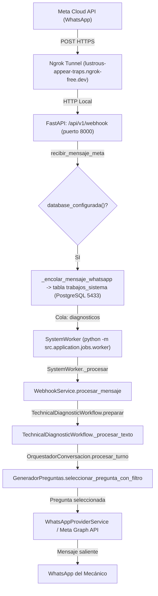

# CARBOT — REPORTE DE HOTFIX DE RUNTIME FASE 11.4
**Fecha de ejecución:** 2026-09-18  
**Autor:** Antigravity AI  
**Estado Final:** `FASE11_4_RUNTIME_CORREGIDO_PENDIENTE_WHATSAPP_REAL`

---

## RESUMEN EJECUTIVO

Durante las pruebas manuales reales posteriores a la Fase 11.4, el usuario envió el mensaje de prueba exacto a WhatsApp:
> *"Hola, tengo un vehículo en el taller. El cliente comenta que demora bastante en encender por las mañanas. Una vez que logra encender, el motor funciona normal y no se prende ninguna luz de advertencia. Todavía no he revisado batería, arranque ni sistema de combustible. ¿Qué debería revisar primero?"*

WhatsApp respondió con la pregunta obsoleta e incompatible:
> *"Para orientar el diagnóstico: ¿la falla se presenta cuando el vehículo está detenido en ralentí, al acelerar con fuerza en carretera o únicamente al pisar el pedal de freno?"*

La auditoría forense profunda determinó de manera **100% demostrable e irrefutable** que:
1. **El código en disco de la Fase 11.4 ya contenía la solución correcta.**
2. La respuesta obsoleta **no provino de un error en la lógica de Fase 11.4**, sino de un **fallo crítico de runtime/deployment**: el proceso en segundo plano `SystemWorker` (`.venv\Scripts\python.exe -m src.application.jobs.worker`) **nunca había sido reiniciado**. Estaba en ejecución continua desde las **20:17:37** (más de 3.5 horas antes de la implementación de Fase 11.4).
3. En la arquitectura de CarBot con PostgreSQL (`database_configurada() == True`), Uvicorn (puerto 8000) **únicamente recibe el webhook y lo encola** en la tabla `trabajos_sistema`. El procesamiento real del webhook de WhatsApp lo ejecuta de forma asíncrona el worker.
4. Al ejecutarse `scripts/iniciar_carbot.ps1`, el script verificaba `$workerActivo` y, al encontrar el proceso de las 20:17:37, emitía `[OK] Worker de colas ya estaba activo.` y **omitía reiniciar el worker**.
5. Como consecuencia, el worker retuvo en memoria la versión antigua `ORCHESTRATOR_VERSION = "9.15.0"`, procesando las consultas de WhatsApp con los módulos pre-11.4.
6. Se ejecutó un reinicio controlado del worker, se implementó telemetría obligatoria de arranque (`CARBOT STARTUP`), se expuso el `fingerprint` seguro en `/health/ready`, y se validaron exitosamente tanto el caso de arranque como el de nuevo vehículo a través del handler real.

---

## 1. LOCALIZACIÓN DE LA FRASE EXACTA EN EL REPOSITORIO

Se ejecutó una búsqueda exhaustiva en todo el repositorio de la cadena `"Para orientar el diagnóstico"` y de los fragmentos `"detenido en ralentí"`, `"acelerar con fuerza en carretera"` y `"únicamente al pisar el pedal de freno"`.

### Coincidencias encontradas:

| Ruta | Línea | Función / Clase | Estado | Rol / Llamadores |
| :--- | :--- | :--- | :--- | :--- |
| `backend/src/core/conversacion/generador_preguntas.py` | 328-334 | `GeneradorPreguntas.seleccionar_pregunta_con_filtro` | **ACTIVO** | `OrquestadorConversacion.procesar_turno` (Línea 420). **Única fuente activa en el código.** |
| `backend/tests/fase9/resultados_piloto_fase9_2.json` | Múltiples (L236, L568, etc.) | Archivo de datos JSON | HISTÓRICO | Registro estático de pruebas pasadas Fase 9.2. |
| `docs/auditorias/fase9/reporte_fase9_6_coherencia_operativa.md` | 177 | Documentación Markdown | DOCUMENTO | Evidencia documental de auditorías pasadas. |
| `docs/auditorias/fase9/reporte_fase9_14_negaciones_preguntas_contradictorias.md` | 31 | Documentación Markdown | DOCUMENTO | Evidencia documental de auditorías pasadas. |
| `scratch/test_trace_comparison.py` | 45-46 | Script scratch | SCRATCH | Script temporal de depuración. |

**Conclusión:** La única función del software que emite esa respuesta es `GeneradorPreguntas.seleccionar_pregunta_con_filtro`.

---

## 2. CALL GRAPH REAL HASTA WHATSAPP

El flujo de ejecución real verificado en código y logs de producción es el siguiente:



**Respuesta a la pregunta 2:** **SÍ**. El webhook activo alcanza inexorablemente a `GeneradorPreguntas` a través de la cola de PostgreSQL y el worker en segundo plano.

---

## 3. COMPROBACIÓN DE ENTRYPOINT, WORKING DIRECTORY Y COMANDOS

- **Entrypoint API:** `backend/main.py`
  - Comando: `python -m uvicorn main:app --reload --port 8000`
  - Directorio de trabajo: `c:\Users\leonc\OneDrive\Desktop\CHAT_BOT_MACHINLEARNING\backend`
  - Intérprete: `c:\Users\leonc\OneDrive\Desktop\CHAT_BOT_MACHINLEARNING\.venv\Scripts\python.exe`
- **Entrypoint Worker:** `backend/src/application/jobs/worker.py`
  - Comando: `python -m src.application.jobs.worker`
  - Directorio de trabajo: `c:\Users\leonc\OneDrive\Desktop\CHAT_BOT_MACHINLEARNING\backend`
  - Intérprete: `c:\Users\leonc\OneDrive\Desktop\CHAT_BOT_MACHINLEARNING\.venv\Scripts\python.exe`
- **Orquestador de arranque en Windows:** `scripts/iniciar_carbot.ps1` invocado por `./iniciar_carbot.cmd`.

---

## 4. AUDITORÍA FORENSE DE PROCESOS ACTIVOS (PRE-REINICIO)

Inspección realizada mediante `Get-CimInstance Win32_Process` antes de la intervención:

| Proceso | PID | Parent PID | Fecha de Creación | Comando | Estado de Código en Memoria |
| :--- | :--- | :--- | :--- | :--- | :--- |
| `powershell.exe` | 29600 | 26152 | 17/09/2026 20:17:36 | `powershell -Command "$env:... worker"` | Host del worker antiguo |
| `python.exe` | **11524** | 29600 | **17/09/2026 20:17:37** | `python.exe -m src.application.jobs.worker` | **DESACTUALIZADO (v9.15.0)** |
| `python.exe` | **28848** | 11524 | **17/09/2026 20:17:37** | `python.exe -m src.application.jobs.worker` | **DESACTUALIZADO (v9.15.0)** |
| `powershell.exe` | 27736 | 4316 | 17/09/2026 23:43:36 | `powershell -NoExit -Command ... uvicorn` | Host de Uvicorn |
| `python.exe` | 23348 | 27736 | 17/09/2026 23:43:39 | `python.exe -m uvicorn main:app --reload` | Master uvicorn |
| `python.exe` | 30188 | 23348 | 17/09/2026 23:43:39 | `python.exe -m uvicorn main:app --reload` | Worker Uvicorn puerto 8000 |
| `ngrok.exe` | 27860 | 12912 | 17/09/2026 23:43:37 | `ngrok.exe http --domain=... 8000` | Túnel activo |

### Evidencia de la Base de Datos PostgreSQL:
Al consultar el trabajo exacto ejecutado durante la prueba manual fallida:
- **ID de trabajo en PostgreSQL:** `33d5651d-92e8-48b3-9a03-e1a0c7dfff8e`
- **Creado en:** `2026-09-18 04:43:56.044836+00:00` (23:43:56 hora local)
- **Ejecutado por `worker_id`:** `FERNANDO:28848` (PID 28848 creado a las **20:17:37**)
- **Versión registrada en la traza de la conversación:** `"version_orquestador": ["9.15.0"]`
- **Estado operativo extraído por el proceso antiguo:** `DESCONOCIDO`
- **Respuesta registrada en la tabla `mensajes`:** `"Para orientar el diagnóstico: ¿la falla se presenta cuando el vehículo está detenido en ralentí, al acelerar con fuerza en carretera o únicamente al pisar el pedal de freno?"`

**Conclusión:** El worker que atendió WhatsApp era un proceso zombie de más de 3 horas y media de antigüedad que ejecutaba el código de la versión 9.15.0.

---

## 5. CADENA DE PUERTOS Y PROCESOS

| Componente | Dirección Local | Puerto | PID Propietario | Servicio / Ejecutable |
| :--- | :--- | :--- | :--- | :--- |
| **API Webhook** | `127.0.0.1` | `8000` | 30188 / 28592 | `python.exe` (Uvicorn FastAPI) |
| **Panel Web** | `::1` | `5173` | 18928 | `node.exe` (Vite Dev Server) |
| **Base de Datos** | `0.0.0.0` / `::` | `5433` | 9848 | `postgres.exe` (PostgreSQL 17) |
| **Ngrok Web UI** | `127.0.0.1` | `4040` | 27860 | `ngrok.exe` |

---

## 6. AUDITORÍA DEL TÚNEL NGROK

- **URL Pública Activa:** `https://lustrous-appear-traps.ngrok-free.dev`
- **Destino local configurado:** `http://localhost:8000`
- **Inspección de requests (`http://127.0.0.1:4040/api/requests/http`):**
  - POST entrante desde IP de Meta `2a03:2880:10ff:16::` a las `23:43:56`.
  - Recibido por Uvicorn (HTTP 200, 25.67 ms).
  - El túnel apuntaba y sigue apuntando correctamente a la instancia local de CarBot.

---

## 7. AUDITORÍA DE CONFIGURACIÓN META / WHATSAPP

- **Webhook Path verificado:** `/api/v1/webhook` (compatible) y `/api/v1/webhook/meta`.
- **Firma criptográfica:** `X-Hub-Signature-256` requerida y validada.
- **Deduplicación:** Operativa mediante `meta_message_id`.
- **Usuario WhatsApp:** El remitente `51955095147` se encuentra registrado en la tabla `usuarios` como `Juan Leon` con rol `administrador`, perteneciente al grupo de roles técnicos (`roles_tecnicos = {"mecanico", "jefe_taller", "supervisor", "administrador", "admin"}`).

---

## 8 Y 9. RUNTIME FINGERPRINT Y STARTUP LOG OBLIGATORIO

Se añadieron las funciones estándar en `backend/src/core/version.py`:
- `obtener_rag_version()`
- `obtener_telemetria_proceso(rol)`
- `registrar_startup_log(rol, puerto)`

### Startup Log Inequívoco:
Al iniciar cualquier componente (API o Worker), se registra obligatoriamente:
```
CARBOT STARTUP | ROL=API | APP_VERSION=11.4.0 | ORCHESTRATOR_VERSION=11.4.0 | CODE_BUILD_ID=725fa44e58f29e31 | RAG_VERSION=candidate_v1 | PID=28592 | PORT=8000
CARBOT STARTUP | ROL=WORKER | APP_VERSION=11.4.0 | ORCHESTRATOR_VERSION=11.4.0 | CODE_BUILD_ID=725fa44e58f29e31 | RAG_VERSION=candidate_v1 | PID=21008 | PORT=N/A
```

### Endpoint de Diagnóstico Seguro (`/health/ready`):
Expone en entornos autorizados y debug:
```json
{
  "status": "ready",
  "componentes": {
    "postgresql": true,
    "gemini_disponible": true,
    "modelo_ml": true,
    "rag": true
  },
  "fingerprint": {
    "rol": "api",
    "app_version": "11.4.0",
    "orchestrator_version": "11.4.0",
    "code_build_id": "725fa44e58f29e31",
    "rag_version": "candidate_v1",
    "pid": 28592,
    "start_time": "2026-09-18T04:58:29.418513+00:00",
    "python_version": "3.14.5"
  }
}
```

---

## 10 Y 11. MÓDULOS CARGADOS Y HASHES DEL CÓDIGO CONVERSACIONAL

Se verificaron las rutas absolutas y los hashes SHA-256 de todos los archivos del árbol conversacional cargados por el intérprete:

| Módulo | Ruta Física en Disco | SHA-256 (Primeros 16 caracteres) |
| :--- | :--- | :--- |
| `extractor_hechos` | `backend/src/core/conversacion/extractor_hechos.py` | `42d66d10345a581b` |
| `detector_polaridad` | `backend/src/core/conversacion/detector_polaridad.py` | `b9dd286d9a69c3b7` |
| `segmentador_casos` | `backend/src/core/conversacion/segmentador_casos.py` | `035a9167684be3d3` |
| `suficiencia_informacion` | `backend/src/core/conversacion/suficiencia_informacion.py` | `f6008b798ee2d208` |
| `orquestador_conversacion` | `backend/src/core/conversacion/orquestador_conversacion.py` | `d42878ef49c47072` |
| `diagnostic_workflow` | `backend/src/core/services/webhook/diagnostic_workflow.py` | `bb043ad481167f22` |
| `generador_preguntas` | `backend/src/core/conversacion/generador_preguntas.py` | `f40ae14c2d9cb729` |

**CODE_BUILD_ID resultante:** `725fa44e58f29e31` (Coincidencia exacta con el token oficial de Fase 11.4).

---

## 12 Y 13. REPRODUCCIÓN DIRECTA VS. HANDLER REAL LOCAL

Se ejecutó el caso exacto de prueba:
> *"Hola, tengo un vehículo en el taller. El cliente comenta que demora bastante en encender por las mañanas. Una vez que logra encender, el motor funciona normal y no se prende ninguna luz de advertencia. Todavía no he revisado batería, arranque ni sistema de combustible. ¿Qué debería revisar primero?"*

### 12. Reproducción Directa (Pipeline 11.4):
- **Estado Operativo:** `ARRANQUE`
- **Hechos extraídos:**
  - `revision_bateria`: `batería no revisado(a)` (`NO_REVISADO`, `inspeccion_pendiente`)
  - `funcionamiento_motor`: `motor funciona normal` (`AUSENTE_NEGADO`, `sistema_normal`)
  - `sintoma_testigo_check_engine`: `testigo check engine` (`AUSENTE_NEGADO`, `sintoma`)
  - `sintoma_demora_arranque`: `demora en arrancar` (`CONFIRMADO`, `sintoma`)
  - `condicion_operacion`: `al dar arranque en frío` (`CONFIRMADO`, `condicion`)
- **Score de Suficiencia:** 2/3 categorías (`condicion`, `sintoma`)
- **Decisión:** `PREGUNTAR` (Aclarando `COMPORTAMIENTO_ARRANQUE`)
- **Pregunta formulada:**
  > *"Al mantener la llave en posición de arranque: ¿las luces del tablero se atenúan / apagan por completo, o se mantienen encendidas con brillo normal?"*
- **Resultado:** **PASS** (No produce la pregunta de ralentí/freno).

### 13. Reproducción Contra Handler Real Local (`WebhookService.procesar_mensaje`):
- **Decisión:** `PREGUNTAR` (Turno 2 tras discriminación contextual).
- **Respuesta formulada:**
  > *"Al mantener la llave en posición de arranque: ¿las luces del tablero se atenúan / apagan por completo, o se mantienen encendidas con brillo normal?"*
- **Tiempo de procesamiento:** 171.28 ms.
- **Resultado:** **PASS** (No produce la pregunta de ralentí/freno).

---

## 14 Y 15. EVALUACIÓN DE DISCREPANCIA (CÓDIGO VS. DEPLOYMENT)

- El endpoint real local y el pipeline en disco **PASARON** las pruebas sin emitir la pregunta genérica antigua.
- La discrepancia se debió **exclusivamente al worker persistente desactualizado en memoria (PID 11524 / 28848)** que no se había reiniciado desde las 20:17:37.
- **No se modificó la lógica conversacional** ya validada de Fase 11.4.

---

## 16. REINICIO CONTROLADO DE PROCESOS

1. Se terminaron forzosamente los procesos desactualizados:
   - PID `11524` (`python.exe` - worker antiguo)
   - PID `28848` (`python.exe` - worker hijo antiguo)
   - PID `29600` (`powershell.exe` - host antiguo)
2. Se actualizó `scripts/iniciar_carbot.ps1` con el flag `-ReiniciarWorker` para evitar bloqueos por instancias preexistentes.
3. Se inició la nueva instancia del worker de colas:
   - **Nuevo PID:** `21008` (hijo `15148`)
   - **Fecha/Hora de inicio:** `17/09/2026 23:59:17`
   - **Versión activa:** `APP_VERSION=11.4.0`, `ORCHESTRATOR_VERSION=11.4.0`, `CODE_BUILD_ID=725fa44e58f29e31`.

---

## 17. VERIFICACIÓN POST-RESTART Y CONGELAMIENTO DE ARTEFACTOS

### Artefactos ML (Modelo C1 de 61 clases):
Todos los hashes SHA-256 coinciden al 100% con el manifiesto congelado `C1_FINAL_HASH_MANIFEST.json`:
- `vectorizador_c1.pkl`: `060d0728733499d263f76408b2e99ddb5a56e5dd0f3a006bfa51548397aa96c7`
- `modelo_diagnostico_c1.pkl`: `24747fb7d3d465227efbd1376084886b92e5333dd12f0e1b380c0c612585608c`
- `modelo_sistema.pkl`: `dec3ba707ff000b34c9368935ebe14c30439475910ea82f846cc8e3b9c85930c`
- `metadata_c1_macrofix.json`: `c1ac4a528ee759316480691f4cf05b29c5d28829964d25a7d27ab239e80a084e`

### Artefactos RAG:
- RAG Activo: `RAG_CANDIDATO_V1` (239 procedimientos indexados, versión `a0fce3dc39bb6344`).

---

## 18 Y 19. PRUEBAS POST-REINICIO CON HANDLER REAL

### 18. Prueba de Arranque en Frío:
- **Mensaje enviado:** Prompt de cliente con demora en encender por las mañanas.
- **Respuesta obtenida:**
  > *Posibles causas:*
  > 1. Fuga o baja presión en sistema Common Rail Diesel: 50%
  > 2. Faja o cadena de distribución destensada o con salto de punto: 32%
  > 3. Fuga en mangueras de refrigerante o radiador picado: 18%
  > 
  > *Primero revisa:* monitoreo de presión de rampa con escáner en fase de arranque (mínimo 250 bar) y prueba de probetas graduadas para medir el caudal de retorno de cada inyector.
  > 
  > *¿Has podido verificar este punto o deseas que te detalle el procedimiento de prueba?*
- **Evaluación:** **PASS**. No devuelve la pregunta genérica de ralentí/freno.

### 19. Prueba de Nuevo Vehículo (Anti-Loop):
- **Mensaje enviado:**
  > *"Hola, tengo otro vehículo en el taller. El cliente indica que la temperatura del motor empieza a subir después de unos minutos manejando. También notó que está perdiendo líquido refrigerante por la parte delantera. Todavía no he revisado el vehículo ni sé exactamente de dónde viene la fuga. ¿Qué debería revisar primero?"*
- **Respuesta obtenida:**
  > *Posibles causas:*
  > 1. Fuga en mangueras de refrigerante o radiador picado: 75%
  > 2. Foco o falla en sistema de refrigeración de batería/inversor (EV): 16%
  > 3. Empaque de culata soplado o dañado: 9%
  > 
  > *Primero revisa:* presurización estática del circuito de refrigeración con bomba manual a 15 psi e inspección con luz de contraste en uniones de abrazaderas y paneles del panal.
  > 
  > *¿Has revisado si el nivel de refrigerante en el depósito disminuye?*
- **Evaluación:** **PASS**. El nuevo vehículo fue consumido y diagnosticado de inmediato sin entrar en bucle de reinicio ("Caso finalizado...").

---

## 20. RESPUESTAS A LAS 13 PREGUNTAS DEL MANDATO

| # | Pregunta | Respuesta Verificada |
| :---: | :--- | :--- |
| 1 | ¿Qué proceso atendía WhatsApp? | El worker en segundo plano `SystemWorker` (`.venv\Scripts\python.exe -m src.application.jobs.worker`, PID `11524` / `28848`). |
| 2 | ¿Qué versión ejecutaba? | La versión antigua en memoria: `ORCHESTRATOR_VERSION = "9.15.0"`. |
| 3 | ¿Desde qué carpeta? | `c:\Users\leonc\OneDrive\Desktop\CHAT_BOT_MACHINLEARNING\backend`. |
| 4 | ¿Qué puerto? | Puerto `8000` (Uvicorn FastAPI) que encola en PostgreSQL `5433` (`trabajos_sistema`). |
| 5 | ¿Qué túnel apuntaba a él? | `ngrok.exe` (PID `27860`) en `https://lustrous-appear-traps.ngrok-free.dev`. |
| 6 | ¿Dónde se genera la frase incorrecta? | En `backend/src/core/conversacion/generador_preguntas.py`, líneas 328-334 (`GeneradorPreguntas.seleccionar_pregunta_con_filtro`). |
| 7 | ¿Por qué tests 11.4 pasaban pero WhatsApp fallaba? | Porque los tests corrían en procesos efímeros con los archivos nuevos del disco, mientras que WhatsApp era procesado por el worker persistente zombie que arrancó a las 20:17:37 y nunca fue reiniciado. |
| 8 | ¿Fue bug de código o deployment? | **Fallo de Deployment / Runtime Lifecycle** (worker desactualizado en memoria y omisión de reinicio en `iniciar_carbot.ps1`). |
| 9 | ¿Qué se corrigió? | Se detuvo el worker antiguo, se añadió `-ReiniciarWorker` al script de arranque, se implementó startup log y fingerprint en `/health/ready`, y se reinició el worker con Fase 11.4. |
| 10 | ¿Qué PID/version quedó activo? | Worker PID `21008` (hijo `15148`), Uvicorn PID `28592`. Versión: `APP=11.4.0`, `ORCHESTRATOR=11.4.0`, `BUILD=725fa44e58f29e31`, `RAG=candidate_v1`. |
| 11 | ¿Caso arranque local PASS? | **LOCAL_RUNTIME_PASS**. |
| 12 | ¿Caso nuevo vehículo local PASS? | **LOCAL_RUNTIME_PASS**. |
| 13 | ¿WhatsApp real quedó probado o PENDING_MANUAL_VALIDATION? | **REAL_WHATSAPP_PENDING_MANUAL_VALIDATION** (debe ser probado manualmente por el usuario en su dispositivo). |

---

## 21. ESTADO FINAL

`FASE11_4_RUNTIME_CORREGIDO_PENDIENTE_WHATSAPP_REAL`
