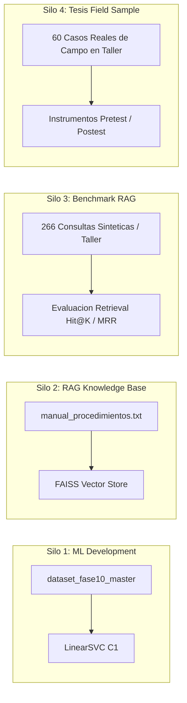

# INFORME FINAL — FASE RAG-RECONCILIACIÓN DOCUMENTAL
## VALIDACIÓN DEL RAG-PLAN CONTRA TAXONOMÍA C1 Y FUENTES DOCUMENTALES

**Sistema:** CarBot — Chatbot Diagnóstico Vehicular con Machine Learning  
**Fecha:** 17 de Septiembre de 2026  
**Fase:** RAG-RECONCILIACIÓN DOCUMENTAL  
**Estado:** `RAG_RECONCILIACION_APROBADA_PARA_IMPLEMENTACION_CONTROLADA`  
**Regla de Ejecución:** **CERO IMPLEMENTACIÓN EN CÓDIGO OPERATIVO O BASELINE.** Solo artefactos documentales y de planificación controlada.

---

## RESUMEN EJECUTIVO Y VEREDICTO

La presente fase de **Reconciliación Documental** tuvo como objetivo central cruzar, verificar y reconciliar:
1. El **RAG actual auditado** (Línea base Fase 8.3 con 239 chunks y 10 asignaciones erróneas de metadatos);
2. El informe forense **`FASE_RAG_AUDIT_REPORTE_FINAL.md`**;
3. La propuesta técnica **`FASE_RAG_PLAN_REPORTE_FINAL.md`**;
4. La **taxonomía canónica real del modelo C1** de 61 clases y sus 7 macro-sistemas;
5. La evidencia documental local disponible en el repositorio (`dtc_codes.db`, `obdex/`, `zenodo_15626055.json`);
6. La auditoría de seguridad crítica de taller (Alta Tensión EV/HEV, Common Rail 1,600+ bar, cámaras Maxi-Brake).

### Principales Hallazgos Forenses y Metodológicos

1. **Integridad de Artefactos Congelados (100% Intangible):**
   Se verificaron los 4 hashes SHA-256 canónicos antes del análisis:
   - `VECTOR_C1`: `060d0728733499d263f76408b2e99ddb5a56e5dd0f3a006bfa51548397aa96c7` (**MATCH**)
   - `FAULT_MODEL_C1`: `24747fb7d3d465227efbd1376084886b92e5333dd12f0e1b380c0c612585608c` (**MATCH**)
   - `MACROFIX`: `dec3ba707ff000b34c9368935ebe14c30439475910ea82f846cc8e3b9c85930c` (**MATCH**)
   - `FAISS Baseline`: `757c4b006a8995f484f539b05420cd929b6034f9aba7e845d305a9d3cf631082` (**MATCH**)

2. **Detección y Corrección Sistemática de IDs en RAG-PLAN:**
   Se descubrió una discrepancia estructural en `FASE_RAG_PLAN_REPORTE_FINAL.md`: el documento previo utilizó la numeración basada en el orden de filas del archivo no ordenado `MAPEO_CANONICO_61_A_7.csv` en lugar del orden alfabético canónico del modelo C1 (`classes_c1`). Esto originó que VVT fuera citada como "Clase 12" (en C1 real es **Clase 41**; la 12 es Batería HV), A/C como "Clase 54" (en C1 real es **Clase 29**; la 54 es Limpiaparabrisas), EVAP como "Clase 22" (en C1 real es **Clase 39**; la 22 es Cierre Centralizado), y CVT/DSG como "Clase 38" (en C1 real es **Clase 60**; la 38 es Flex). Todas las referencias fueron corregidas formalmente.

3. **Cruce y Reconciliación de CHG-001 a CHG-020:**
   - **A — Respaldado (11 cambios):** Metadatos de VVT, A/C, EVAP, TCC; advertencias de seguridad pasiva (Common Rail, despresurización de gasolina).
   - **B — Parcialmente Respaldado (3 cambios):** Asignación de mecatrónica DSG, seguridad de Alta Tensión en EV/HV (se aprueba advertencia pasiva; se bloquean pasos operativos invasivos), diagnóstico dinámico de A/C (se aprueba lógica cualitativa de electroventilador y flujo forzado; se bloquean valores manométricos fijos).
   - **C — Requiere Fuente / Validación (3 cambios):** Sustitución de stubs en Versa y Corolla (`CHG-011`, `CHG-012`), árboles de descarte sintéticos (`CHG-017`).
   - **D — No Incorporar (0 cambios):** Ningún cambio propuesto requirió rechazo total por contradicción, pero se delimitaron estrictamente sus alcances.
   - **E — Cambio Estructural (4 cambios transversales):** `schema_v2` Pydantic (`CHG-018`), lookup relacional de DTC en SQLite (`CHG-019`), manifiesto criptográfico de compilación (`CHG-020`), y reclasificación de TPMS (`CHG-007`).

4. **Separación Arquitectural: DTC_LOOKUP vs RAG_PROCEDURAL:**
   Se confirmó que los 18,805 códigos de `dtc_codes.db` **NO deben ser indexados en FAISS**, ya que solo contienen código y título en una línea, lo que diluiría el espacio vectorial. Serán manejados mediante consulta relacional directa en SQLite ($O(1)$) por el backend. El RAG vectorial se reserva estrictamente para procedimientos de taller densos y metrología.

5. **Aislamiento de la Tesis:**
   Se ratificó la independencia absoluta entre el desarrollo del RAG, los datos de entrenamiento de ML, el nuevo benchmark independiente y la muestra oficial de 60 casos reales de taller, garantizando integridad metodológica y académica.

---

## 0. REGLA ABSOLUTA Y METODOLOGÍA DE RECONCILIACIÓN

Esta fase se ejecutó bajo la regla obligatoria:
**LOCALIZAR -> LEER -> CRUZAR -> VERIFICAR -> RECONCILIAR -> CLASIFICAR -> PLANIFICAR -> DOCUMENTAR**  
**NO IMPLEMENTAR EN NINGUNA CIRCUNSTANCIA.**

---

## 1. PROHIBICIONES Y BLINDAJE OPERATIVO

Durante toda la ejecución de esta fase se mantuvo la observancia estricta de las prohibiciones:
- No se modificó el RAG baseline ni `metadatos_manuales.json`.
- No se alteró ni reindexó el archivo `indice_faiss.index`.
- No se modificaron los binarios ni hiperparámetros de C1 (`modelo_diagnostico_c1.pkl`, `vectorizador_c1.pkl`).
- No se descargaron fuentes externas ni se navegó a Internet.
- No se inventaron procedimientos, tolerancias ni valores numéricos.
- Solo se crearon artefactos documentales y archivos de informe CSV.

---

## 2. LOCALIZACIÓN Y VERIFICACIÓN DE INSUMOS

### TABLA 1: Insumos Encontrados y No Encontrados

| Insumo Buscado | Ubicación Esperada / Alternativa | Estado en Proyecto | Naturaleza y Rol Documental | Impacto / Evidencia Aportada |
| :--- | :--- | :--- | :--- | :--- |
| **`FASE_RAG_AUDIT_REPORTE_FINAL.md`** | Raíz del proyecto | **ENCONTRADO** (54 KB) | Informe de auditoría forense del RAG actual (Fase previa) | Base de partida: inventario de 239 chunks, 10 metadatos erróneos, vacíos diagnósticos. |
| **`FASE_RAG_PLAN_REPORTE_FINAL.md`** | Raíz del proyecto | **ENCONTRADO** (74 KB) | Propuesta de plan maestro de mejora RAG (Fase previa) | Objeto de reconciliación: contiene CHG-001 a CHG-020, propuestas de schema y ejemplos técnicos. |
| **Auditoría Forense Taxonomía C1** | `docs/auditorias/fase10/AUDITORIA_FORENSE_TAXONOMIA_C1.md` | **ENCONTRADO** (12.6 KB) | Auditoría de integridad de modelos y datasets Fase 10 | Autoridad canónica: certifica que existen exactamente 61 clases y 7 macro-sistemas. |
| **Mapeo Canónico 61 a 7** | `machine_learning/data/fase10/MAPEO_CANONICO_61_A_7.csv` | **ENCONTRADO** (4.2 KB) | Tabla CSV de mapeo clase a sistema macro | Origen forense: sus índices de fila sin ordenar explican los errores de 'Clase X' en RAG-PLAN. |
| **Metadatos RAG Baseline** | `machine_learning/manuals/metadatos_manuales.json` | **ENCONTRADO** (333 KB) | JSON con metadatos de los 239 chunks de producción | Catálogo del RAG actual en producción. |
| **Corpus Textual RAG Baseline** | `machine_learning/manuals/manual_procedimientos.txt` | **ENCONTRADO** (100 KB) | Texto plano con los procedimientos diagnósticos | Procedimientos técnicos vigentes de CarBot. |
| **Índice Vectorial FAISS** | `machine_learning/manuals/indice_faiss.index` | **ENCONTRADO** (31.1 MB) | Índice binario FAISS FlatIP (384 dims) | Índice vectorial congelado de Fase 8.3 (SHA-256 verificado). |
| **Modelo C1 Binario Congelado** | `machine_learning/training/fase10/final_candidate/C1/modelo_diagnostico_c1.pkl` | **ENCONTRADO** (Binario) | LinearSVC multiclase C1 (Fase 10) | Autoridad algorítmica canónica para las 61 clases (`classes_c1`). |
| **Base Relacional de Códigos DTC** | `machine_learning/data/fuentes_abiertas/dtc_codes.db` | **ENCONTRADO** (3.25 MB) | Base SQLite con 18,805 definiciones de códigos DTC | Fuente abierta verificada para lookup exacto código -> descripción. |
| **Corpus Enriquecido OBDex** | `machine_learning/data/fuentes_abiertas/obdex/` | **ENCONTRADO** (7.7 MB YAML) | 3 archivos YAML (B0xxx, C0xxx, P0xxx) | Definiciones enriquecidas con causas comunes y componentes afectados. |
| **Muestra de Procedimientos Zenodo** | `machine_learning/data/fuentes_abiertas/zenodo_15626055.json` | **ENCONTRADO** (38 KB) | 99 registros de secuencias diagnósticas en inglés | Estructura de árbol de decisión (categoría, síntoma, prueba, resultado). |
| **Informe de Investigación — Fuentes** | Raíz / docs | **NO DISPONIBLE EN PROYECTO** | Posible informe previo de investigación | Se marca no disponible; no se inventa su contenido. |
| **Informe Consolidado Cobertura 61** | Raíz / docs | **NO DISPONIBLE EN PROYECTO** | Posible reporte externo de cobertura | Se marca no disponible; se reconstruye la cobertura desde C1 real. |
| **Corpus Candidato 61 Fichas RAG** | Raíz / machine_learning | **NO DISPONIBLE EN PROYECTO** | Corpus externo de 61 fichas técnicas | Se marca no disponible; se evalúa clase a clase con evidencia local. |
| **NHTSA TSB Database** | machine_learning/data/ | **NO DISPONIBLE EN PROYECTO** | Comunicaciones de fabricantes NHTSA | No descargado ni presente en el repositorio. |
| **OBDb Community Dataset** | machine_learning/data/ | **NO DISPONIBLE EN PROYECTO** | Repositorio comunitario OBDb | No disponible localmente. |
| **Manuales de Taller OEM Oficiales** | machine_learning/manuals/ | **NO DISPONIBLE EN PROYECTO** | PDFs completos de fabricantes (Toyota, Nissan, etc.) | Solo existen fragmentos referenciales en `manual_procedimientos.txt`. |

*Nota Metodológica:* Los informes titulados "INFORME DE INVESTIGACIÓN — FASE RAG / FUENTES", "INFORME CONSOLIDADO...", y "CORPUS CANDIDATO DOCUMENTADO — 61 FICHAS RAG" fueron marcados como **NO DISPONIBLE EN PROYECTO**. No se inventó su contenido ni se bloqueó la fase; se trabajó rigurosamente con los artefactos y evidencias físicamente presentes en el repositorio.

---

## 3. JERARQUÍA DE AUTORIDAD DOCUMENTAL

Para dirimir cualquier discrepancia técnica o taxonómica, se aplicó la siguiente jerarquía estricta:
1. **NIVEL A — TAXONOMÍA CANÓNICA REAL:** El modelo congelado C1 (`modelo_diagnostico_c1.pkl`), su vectorizador y `FALLA_A_SISTEMA` constituyen la autoridad absoluta sobre nombres e IDs.
2. **NIVEL B — ESTADO DEL RAG BASELINE:** Los 239 registros de `metadatos_manuales.json`, `manual_procedimientos.txt` y `FASE_RAG_AUDIT_REPORTE_FINAL.md` dictan lo que verdaderamente existe en producción.
3. **NIVEL C — PROPUESTAS EN RAG-PLAN:** `FASE_RAG_PLAN_REPORTE_FINAL.md` es considerado únicamente una PROPUESTA DE DISEÑO. Sus ejemplos y redacciones técnicas no constituyen fuentes de verdad técnica ni conocimiento validado.
4. **NIVEL D — INVESTIGACIÓN DOCUMENTAL EXTERNA:** `dtc_codes.db`, `obdex/` y `zenodo_15626055.json` constituyen evidencias para decidir qué puede incorporarse posteriormente.

---

## 4. TAXONOMÍA CANÓNICA C1 Y CORRECCIÓN DE NOMBRES

Se corroboró programáticamente que la lista canónica de fallas de C1 comprende exactamente 61 clases ordenadas alfabéticamente por scikit-learn LinearSVC.

### TABLA 2: Taxonomía Canónica C1 Verificada (61 Clases)

| ID_C1 | Clase Canónica C1 (Exacta en Binario) | Macro-Sistema Canónico | Chunks RAG Actual | Coincidencia con Prompt | Nota Forense de Taxonomía |
| :--- | :--- | :--- | :--- | :--- | :--- |
| **`01`** | `Alternador defectuoso o placa de diodos quemada` | `ELECTRICO` | `n=17` | EXACTA (100% literal) | Coincidencia exacta literal entre prompt, binario C1 y FALLA_A_SISTEMA. |
| **`02`** | `Amortiguadores reventados o bujes de suspension gastados` | `SUSPENSION_CHASIS` | `n=04` | EXACTA (100% literal) | Coincidencia exacta literal entre prompt, binario C1 y FALLA_A_SISTEMA. |
| **`03`** | `Baja presion de aceite o bomba de aceite defectuosa` | `MOTOR` | `n=02` | EXACTA (100% literal) | Coincidencia exacta literal entre prompt, binario C1 y FALLA_A_SISTEMA. |
| **`04`** | `Bateria descargada o bornes sulfatados` | `ELECTRICO` | `n=11` | EXACTA (100% literal) | Coincidencia exacta literal entre prompt, binario C1 y FALLA_A_SISTEMA. |
| **`05`** | `Bomba de gasolina quemada o con baja presion` | `MOTOR` | `n=10` | EXACTA (100% literal) | Coincidencia exacta literal entre prompt, binario C1 y FALLA_A_SISTEMA. |
| **`06`** | `Caliper de freno trabado o mordaza pegada (piston agarrotado)` | `FRENOS` | `n=02` | EXACTA (100% literal) | Coincidencia exacta literal entre prompt, binario C1 y FALLA_A_SISTEMA. |
| **`07`** | `Cerradura, chapa o pestillo mecanico de puerta trabado o desalineado` | `CARROCERIA_NEUMATICA` | `n=01` | EXACTA (100% literal) | Coincidencia exacta literal entre prompt, binario C1 y FALLA_A_SISTEMA. |
| **`08`** | `Consumo de aceite por desgaste de anillos o retenes` | `MOTOR` | `n=01` | EXACTA (100% literal) | Coincidencia exacta literal entre prompt, binario C1 y FALLA_A_SISTEMA. |
| **`09`** | `Convertidor catalitico ineficiente u obstruido (DTC P0420 / P0430)` | `MOTOR` | `n=06` | EXACTA (100% literal) | Coincidencia exacta literal entre prompt, binario C1 y FALLA_A_SISTEMA. |
| **`10`** | `Cremallera de direccion asistida con holgura o fuga` | `SUSPENSION_CHASIS` | `n=07` | EXACTA (100% literal) | Coincidencia exacta literal entre prompt, binario C1 y FALLA_A_SISTEMA. |
| **`11`** | `Cuerpo de aceleracion o valvula IAC sucia` | `MOTOR` | `n=08` | EXACTA (100% literal) | Coincidencia exacta literal entre prompt, binario C1 y FALLA_A_SISTEMA. |
| **`12`** | `Degradacion o falla en paquete de bateria de alto voltaje (EV / Hibridos)` | `ELECTRICO` | `n=01` | EXACTA (100% literal) | Coincidencia exacta literal entre prompt, binario C1 y FALLA_A_SISTEMA. |
| **`13`** | `Desgaste de pastillas y zapatas de freno` | `FRENOS` | `n=04` | EXACTA (100% literal) | Coincidencia exacta literal entre prompt, binario C1 y FALLA_A_SISTEMA. |
| **`14`** | `Desgaste en collarin de empuje o crapodina de embrague` | `TRANSMISION` | `n=01` | EXACTA (100% literal) | Coincidencia exacta literal entre prompt, binario C1 y FALLA_A_SISTEMA. |
| **`15`** | `Disco de embrague desgastado o patinando` | `TRANSMISION` | `n=07` | EXACTA (100% literal) | Coincidencia exacta literal entre prompt, binario C1 y FALLA_A_SISTEMA. |
| **`16`** | `Discos de freno alabeados o desgastados` | `FRENOS` | `n=02` | EXACTA (100% literal) | Coincidencia exacta literal entre prompt, binario C1 y FALLA_A_SISTEMA. |
| **`17`** | `Elevalunas electrico o guaya de alzacristales rota o trabada` | `CARROCERIA_NEUMATICA` | `n=02` | EXACTA (100% literal) | Coincidencia exacta literal entre prompt, binario C1 y FALLA_A_SISTEMA. |
| **`18`** | `Empaque de culata soplado o danado` | `MOTOR` | `n=03` | EXACTA (100% literal) | Coincidencia exacta literal entre prompt, binario C1 y FALLA_A_SISTEMA. |
| **`19`** | `Faja o cadena de distribucion destensada o con salto de punto` | `MOTOR` | `n=04` | EXACTA (100% literal) | Coincidencia exacta literal entre prompt, binario C1 y FALLA_A_SISTEMA. |
| **`20`** | `Falla de correa dentada banada en aceite (Motor Ford 1.0 Dragon / GM Turbo)` | `MOTOR` | `n=01` | EXACTA (100% literal) | Coincidencia exacta literal entre prompt, binario C1 y FALLA_A_SISTEMA. |
| **`21`** | `Falla de descarbonizacion e inyeccion directa GDI (acumulacion de carbon en valvulas)` | `MOTOR` | `n=01` | PARCIAL (Texto C1 más específico) | El prompt omitió la aclaración: '(acumulacion de carbon en valvulas)' |
| **`22`** | `Falla electrica del cierre centralizado o actuador de puerta` | `CARROCERIA_NEUMATICA` | `n=05` | EXACTA (100% literal) | Coincidencia exacta literal entre prompt, binario C1 y FALLA_A_SISTEMA. |
| **`23`** | `Falla en actuador de resorte o camara Maxi-Brake trabada (frenos de aire)` | `CARROCERIA_NEUMATICA` | `n=01` | PARCIAL (Texto C1 más específico) | El prompt omitió: '(frenos de aire)' |
| **`24`** | `Falla en actuador de turbocompresor o VGT en motores alemanes TSI / TFSI` | `MOTOR` | `n=01` | PARCIAL (Texto C1 más específico) | El prompt omitió: 'en motores alemanes TSI / TFSI' |
| **`25`** | `Falla en bombin o bomba hidraulica de embrague` | `TRANSMISION` | `n=02` | EXACTA (100% literal) | Coincidencia exacta literal entre prompt, binario C1 y FALLA_A_SISTEMA. |
| **`26`** | `Falla en bujias o bobinas de encendido (misfire)` | `MOTOR` | `n=29` | EXACTA (100% literal) | Coincidencia exacta literal entre prompt, binario C1 y FALLA_A_SISTEMA. |
| **`27`** | `Falla en caja robotizada Dualogic / I-Motion / Easytronic (Fiat / VW)` | `TRANSMISION` | `n=08` | PARCIAL (Texto C1 más específico) | El prompt omitió: '(Fiat / VW)' |
| **`28`** | `Falla en circuito o solenoide de inyector individual (DTC P0201 - P0208)` | `MOTOR` | `n=01` | EXACTA (100% literal) | Coincidencia exacta literal entre prompt, binario C1 y FALLA_A_SISTEMA. |
| **`29`** | `Falla en compresor de aire acondicionado o fuga de gas R134a` | `CLIMATIZACION` | `n=05` | EXACTA (100% literal) | Coincidencia exacta literal entre prompt, binario C1 y FALLA_A_SISTEMA. |
| **`30`** | `Falla en filtro de particulas DPF / FAP y sistema AdBlue DEF (Diesel Euro 5/6)` | `MOTOR` | `n=01` | PARCIAL (Texto C1 más específico) | El prompt omitió: '(Diesel Euro 5/6)' |
| **`31`** | `Falla en modulo de bomba de gasolina FSCM / PEM (Ford / Chevrolet)` | `MOTOR` | `n=01` | PARCIAL (Texto C1 más específico) | El prompt omitió: '(Ford / Chevrolet)' |
| **`32`** | `Falla en motor de arranque o solenoide defectuoso (clac seco o carbones gastados)` | `ELECTRICO` | `n=05` | PARCIAL (Texto C1 más específico) | El prompt omitió: '(clac seco o carbones gastados)' |
| **`33`** | `Falla en regulador de presion de combustible o diafragma roto` | `MOTOR` | `n=01` | EXACTA (100% literal) | Coincidencia exacta literal entre prompt, binario C1 y FALLA_A_SISTEMA. |
| **`34`** | `Falla en sensor de oxigeno o mezcla rica` | `MOTOR` | `n=15` | EXACTA (100% literal) | Coincidencia exacta literal entre prompt, binario C1 y FALLA_A_SISTEMA. |
| **`35`** | `Falla en sensor de posicion de cigueñal (CKP) o arbol de levas (CMP)` | `MOTOR` | `n=03` | EXACTA (100% literal) | Coincidencia exacta literal entre prompt, binario C1 y FALLA_A_SISTEMA. |
| **`36`** | `Falla en sensor de velocidad de rueda ABS` | `FRENOS` | `n=10` | EXACTA (100% literal) | Coincidencia exacta literal entre prompt, binario C1 y FALLA_A_SISTEMA. |
| **`37`** | `Falla en servofreno (booster) o linea de vacio` | `FRENOS` | `n=01` | EXACTA (100% literal) | Coincidencia exacta literal entre prompt, binario C1 y FALLA_A_SISTEMA. |
| **`38`** | `Falla en sistema Flex / Bi-combustible (Alcohol/Etanol)` | `MOTOR` | `n=01` | EXACTA (100% literal) | Coincidencia exacta literal entre prompt, binario C1 y FALLA_A_SISTEMA. |
| **`39`** | `Falla en sistema de control de emisiones evaporativas EVAP (canister o valvula de purga)` | `MOTOR` | `n=01` | PARCIAL (Texto C1 más específico) | El prompt omitió: '(canister o valvula de purga)' |
| **`40`** | `Falla en sistema de frenado regenerativo (EV / Hibridos)` | `FRENOS` | `n=01` | EXACTA (100% literal) | Coincidencia exacta literal entre prompt, binario C1 y FALLA_A_SISTEMA. |
| **`41`** | `Falla en sistema de sincronizacion variable de valvulas (VVT / VVT-i / Valvetronic)` | `MOTOR` | `n=01` | EXACTA (100% literal) | Coincidencia exacta literal entre prompt, binario C1 y FALLA_A_SISTEMA. |
| **`42`** | `Falla en termostato o motoventilador de radiador` | `MOTOR` | `n=04` | EXACTA (100% literal) | Coincidencia exacta literal entre prompt, binario C1 y FALLA_A_SISTEMA. |
| **`43`** | `Fallo en inversor de corriente IGBT o motor electrico (EV)` | `ELECTRICO` | `n=01` | EXACTA (100% literal) | Coincidencia exacta literal entre prompt, binario C1 y FALLA_A_SISTEMA. |
| **`44`** | `Falta o degradacion de aceite de caja de cambios` | `TRANSMISION` | `n=05` | EXACTA (100% literal) | Coincidencia exacta literal entre prompt, binario C1 y FALLA_A_SISTEMA. |
| **`45`** | `Foco o falla en sistema de refrigeracion de bateria/inversor (EV)` | `ELECTRICO` | `n=01` | EXACTA (100% literal) | Coincidencia exacta literal entre prompt, binario C1 y FALLA_A_SISTEMA. |
| **`46`** | `Fuga en mangueras de intercooler o turbocompresor danado` | `MOTOR` | `n=04` | EXACTA (100% literal) | Coincidencia exacta literal entre prompt, binario C1 y FALLA_A_SISTEMA. |
| **`47`** | `Fuga en mangueras de refrigerante o radiador picado` | `MOTOR` | `n=01` | EXACTA (100% literal) | Coincidencia exacta literal entre prompt, binario C1 y FALLA_A_SISTEMA. |
| **`48`** | `Fuga hidraulica o aire en el sistema de frenos` | `FRENOS` | `n=01` | EXACTA (100% literal) | Coincidencia exacta literal entre prompt, binario C1 y FALLA_A_SISTEMA. |
| **`49`** | `Fuga o baja presion en sistema Common Rail Diesel (Camiones/Pickups)` | `MOTOR` | `n=01` | PARCIAL (Texto C1 más específico) | El prompt omitió: '(Camiones/Pickups)' |
| **`50`** | `Fuga parasita de corriente en reposo (consumo nocturno de bateria)` | `ELECTRICO` | `n=01` | PARCIAL (Texto C1 más específico) | El prompt omitió: '(consumo nocturno de bateria)' |
| **`51`** | `Fugas de aire o fallos en el sistema de frenos neumático (Camiones)` | `CARROCERIA_NEUMATICA` | `n=03` | PARCIAL (Texto C1 más específico) | El prompt omitió: '(Camiones)' |
| **`52`** | `Inyectores sucios o filtro de combustible obstruido` | `MOTOR` | `n=05` | EXACTA (100% literal) | Coincidencia exacta literal entre prompt, binario C1 y FALLA_A_SISTEMA. |
| **`53`** | `Juntas homocineticas o palieres danados` | `SUSPENSION_CHASIS` | `n=02` | EXACTA (100% literal) | Coincidencia exacta literal entre prompt, binario C1 y FALLA_A_SISTEMA. |
| **`54`** | `Limpiaparabrisas o motor pluma quemado` | `CARROCERIA_NEUMATICA` | `n=01` | EXACTA (100% literal) | Coincidencia exacta literal entre prompt, binario C1 y FALLA_A_SISTEMA. |
| **`55`** | `Llantas desbalanceadas o desalineadas` | `SUSPENSION_CHASIS` | `n=01` | EXACTA (100% literal) | Coincidencia exacta literal entre prompt, binario C1 y FALLA_A_SISTEMA. |
| **`56`** | `Perdida de compresion en cilindro por valvulas pisadas o anillos desgastados` | `MOTOR` | `n=01` | EXACTA (100% literal) | Coincidencia exacta literal entre prompt, binario C1 y FALLA_A_SISTEMA. |
| **`57`** | `Rodajes de caja mecanica o diferencial gastados` | `TRANSMISION` | `n=07` | EXACTA (100% literal) | Coincidencia exacta literal entre prompt, binario C1 y FALLA_A_SISTEMA. |
| **`58`** | `Rodajes de transmision manual o eje primario gastados` | `TRANSMISION` | `n=01` | EXACTA (100% literal) | Coincidencia exacta literal entre prompt, binario C1 y FALLA_A_SISTEMA. |
| **`59`** | `Rodamiento de maza o rodaje de rueda picado (zumbido de rodadura)` | `SUSPENSION_CHASIS` | `n=01` | PARCIAL (Texto C1 más específico) | El prompt omitió: '(zumbido de rodadura)' |
| **`60`** | `Sobrecalentamiento o solenoides en caja automatica CVT / DSG` | `TRANSMISION` | `n=02` | EXACTA (100% literal) | Coincidencia exacta literal entre prompt, binario C1 y FALLA_A_SISTEMA. |
| **`61`** | `Válvula de freno de aire o secador APS obstruido (Camiones)` | `CARROCERIA_NEUMATICA` | `n=01` | PARCIAL (Texto C1 más específico) | El prompt omitió: '(Camiones)' |

---

## 5. VERIFICACIÓN DE MACRO-SISTEMAS CANÓNICOS

El conteo canónico verificado contra el modelo macro y `FALLA_A_SISTEMA` es el siguiente:
- **`MOTOR`**: 26 clases
- **`FRENOS`**: 7 clases
- **`TRANSMISION`**: 8 clases
- **`SUSPENSION_CHASIS`**: 5 clases
- **`ELECTRICO`**: 7 clases
- **`CLIMATIZACION`**: 1 clase
- **`CARROCERIA_NEUMATICA`**: 7 clases
- **TOTAL**: **61 clases** (26 + 7 + 8 + 5 + 7 + 1 + 7 = 61).

---

## 6. AUDITORÍA FORENSE DE ERRORES DE IDS EN RAG-PLAN

### TABLA 3: Errores de IDs Encontrados en RAG-PLAN

| REFERENCIA_PLAN | ID_USADO | CLASE_DESCRITA | ID_C1_REAL | COINCIDE | CORRECCION_NECESARIA |
| :--- | :--- | :--- | :--- | :--- | :--- |
| **RAG-PLAN L123 (`RAG_PROC_047`)** | `12` | Falla en sistema de sincronizacion variable de valvulas (VVT / VVT-i / Valvetronic) | **41** | **NO** | En C1 real, Clase 12 es *Degradacion o falla en paquete de bateria de alto voltaje (EV / Hibridos)*. VVT es Clase 41. Corregir ID a 41. |
| **RAG-PLAN L124 (`RAG_PROC_060`)** | `54` | Falla en compresor de aire acondicionado o fuga de gas R134a | **29** | **NO** | En C1 real, Clase 54 es *Limpiaparabrisas o motor pluma quemado*. A/C es Clase 29. Corregir ID a 29. |
| **RAG-PLAN L125 (`RAG_PROC_061`)** | `38` | Sobrecalentamiento o solenoides en caja automatica CVT / DSG | **60** | **NO** | En C1 real, Clase 38 es *Falla en sistema Flex / Bi-combustible*. CVT/DSG es Clase 60. Corregir ID a 60. |
| **RAG-PLAN L126 (`RAG_PROC_067`)** | `12` | Falla en sistema de sincronizacion variable de valvulas (VVT / VVT-i / Valvetronic) | **41** | **NO** | Mismo error que L123. VVT corresponde a Clase 41. Corregir ID a 41. |
| **RAG-PLAN L127 (`RAG_PROC_075`)** | `22` | Falla en sistema de control de emisiones evaporativas EVAP (canister o valvula de purga) | **39** | **NO** | En C1 real, Clase 22 es *Falla electrica del cierre centralizado o actuador de puerta*. EVAP es Clase 39. Corregir ID a 39. |
| **RAG-PLAN L128 (`RAG_PROC_109`)** | `22` | Falla en sistema de control de emisiones evaporativas EVAP (canister o valvula de purga) | **39** | **NO** | Mismo error que L127. EVAP corresponde a Clase 39. Corregir ID a 39. |
| **RAG-PLAN L129 (`RAG_PROC_113`)** | `44` | Llantas desbalanceadas o desalineadas (referencia aproximada para TPMS) | **55** | **NO** | En C1 real, Clase 44 es *Falta o degradacion de aceite de caja de cambios*. Llantas es Clase 55; TPMS es transversal/auxiliar sin clase C1. Corregir ID a 55 / null. |
| **RAG-PLAN L130 (`RAG_PROC_114`)** | `38` | Sobrecalentamiento o solenoides en caja automatica CVT / DSG (convertidor par TCC) | **60** | **NO** | En C1 real, Clase 38 es Flex. Cajas automáticas CVT/DSG es Clase 60. Corregir ID a 60. |
| **RAG-PLAN L131 (`RAG_PROC_142`)** | `12` | Falla en sistema de sincronizacion variable de valvulas (VVT / VVT-i / Valvetronic) | **41** | **NO** | Mismo error que L123 y L126. VVT corresponde a Clase 41. Corregir ID a 41. |
| **RAG-PLAN L132 (`RAG_PROC_154`)** | `22` | Falla en sistema de control de emisiones evaporativas EVAP (canister o valvula de purga) | **39** | **NO** | Mismo error que L127 y L128. EVAP corresponde a Clase 39. Corregir ID a 39. |
| **RAG-PLAN L150 (Texto General)** | `12` | Mención textual de "Clase 12 para VVT" | **41** | **NO** | VVT es Clase 41. Corregir texto a Clase 41. |
| **RAG-PLAN L330 (Seguridad EV/HV)** | `49, 50, 51` | Vehículos Híbridos / EV | **12, 40, 43, 45** | **NO** | En C1 real, Clases 49, 50, 51 son *Common Rail*, *Fuga Parásita* y *Frenos Neumáticos*. Las clases EV/HV son 12, 40, 43 y 45. Corregir IDs. |
| **RAG-PLAN L330 (Seguridad Diésel)** | `19` | Common Rail Diésel 1,600+ bar | **49** | **NO** | En C1 real, Clase 19 es *Faja o cadena de distribucion destensada*. Common Rail es Clase 49. Corregir ID a 49. |
| **RAG-PLAN L330 (Seguridad Gasolina)**| `2, 24` | Combustible presurizado | **05, 33** | **NO** | En C1 real, Clases 02 y 24 son *Amortiguadores* y *Turbo TSI*. Bomba y regulador de gasolina son Clases 05 y 33. Corregir IDs. |
| **RAG-PLAN L330 (Seguridad Refrigerante)**| `7, 8` | Refrigerante caliente | **42, 47** | **NO** | En C1 real, Clases 07 y 08 son *Cerradura de puerta* y *Consumo de aceite*. Termostato y fuga de refrigerante son Clases 42 y 47. Corregir IDs. |
| **RAG-PLAN L330 (Seguridad Neumática)**| `61` | Cámaras Maxi-Brake camiones | **23** | **NO** | En C1 real, Clase 61 es *Válvula de freno de aire o secador APS*. Maxi-Brake es Clase 23. Corregir ID a 23. |
| **RAG-PLAN L330 (Seguridad Frenos)** | `27, 30` | Frenos hidráulicos | **13, 48** | **NO** | En C1 real, Clases 27 y 30 son *Caja robotizada Dualogic* y *Filtro DPF/AdBlue*. Pastillas y fugas de frenos son Clases 13 y 48. Corregir IDs. |

*Causa Raíz Forense:* El autor de RAG-PLAN indexó las clases según el orden de filas de `MAPEO_CANONICO_61_A_7.csv` (donde VVT es la fila 13, index 12; EVAP fila 23, index 22; CVT/DSG fila 39, index 38; A/C fila 55, index 54). Al no consultar `classes_c1`, generó referencias erróneas en cascada que confundían clases de seguridad crítica (ej. Clase 12 Batería HV vs VVT).

---

## 7. RECONCILIACIÓN DETALLADA DE CHG-001 A CHG-020

### TABLA 4: CHG-001 a CHG-020 Reconciliados

| CHG_ID | Título de la Propuesta | Problema de Origen | Evidencia Auditoría | Clasificación | Decisión de Reconciliación | Parte Exacta Implementable Posteriormente |
| :--- | :--- | :--- | :--- | :--- | :--- | :--- |
| **`CHG-001`** | Corregir atributo falla y sistema en RAG_PROC_047 | Solenoide VVT Kia Rio asignado erróneamente a motor de arranque (ELECTRICO) | RAG_PROC_047 trata 100% sobre electroválvula OCV de distribución variable en motor Kappa | **A — RESPALDADO / E — CAMBIO ESTRUCTURAL** | **`IMPLEMENTABLE_POSTERIORMENTE`** | Corregir en metadatos_manuales.json: sistema='MOTOR', falla='Falla en sistema de sincronizacion variable de valvulas (VVT / VVT-i / Valvetronic)' (ID C1: 41). |
| **`CHG-002`** | Corregir atributo falla y sistema en RAG_PROC_060 | Embrague electromagnético de compresor A/C asignado erróneamente a embrague de transmisión manual | RAG_PROC_060 describe bobina magnética, entrehierro (shim) y plato de acople de compresor de A/C | **A — RESPALDADO / E — CAMBIO ESTRUCTURAL** | **`IMPLEMENTABLE_POSTERIORMENTE`** | Corregir en metadatos_manuales.json: sistema='CLIMATIZACION', falla='Falla en compresor de aire acondicionado o fuga de gas R134a' (ID C1: 29). |
| **`CHG-003`** | Corregir atributo falla en RAG_PROC_061 | Mecatrónica DSG y doble embrague asignado a disco de embrague manual de fricción | RAG_PROC_061 trata de electrohidráulica mecatrónica DSG DQ200/DQ250 y calibración de doble embrague | **B — PARCIALMENTE RESPALDADO / E — CAMBIO ESTRUCTURAL** | **`IMPLEMENTABLE_PARCIALMENTE`** | Reasignar falla a 'Sobrecalentamiento o solenoides en caja automatica CVT / DSG' (ID C1: 60) con tag secundario 'transmision_robotizada_doble_embrague'. No ampliar texto hasta tener fuente OEM. |
| **`CHG-004`** | Corregir atributo falla y sistema en RAG_PROC_067 | Solenoide VVT-i Toyota asignado a motor de arranque (ELECTRICO) | RAG_PROC_067 trata de limpieza de válvulas OCV y filtro de malla de culata en motores Toyota 1NZ/2NZ/2ZR | **A — RESPALDADO / E — CAMBIO ESTRUCTURAL** | **`IMPLEMENTABLE_POSTERIORMENTE`** | Corregir en metadatos_manuales.json: sistema='MOTOR', falla='Falla en sistema de sincronizacion variable de valvulas (VVT / VVT-i / Valvetronic)' (ID C1: 41). |
| **`CHG-005`** | Corregir atributo falla en RAG_PROC_075 | Sistema de evaporación de emisiones EVAP y cánister asignado erróneamente a bujías/misfire | RAG_PROC_075 describe prueba de fugas en cánister de carbón activado con máquina de humo | **A — RESPALDADO / E — CAMBIO ESTRUCTURAL** | **`IMPLEMENTABLE_POSTERIORMENTE`** | Corregir en metadatos_manuales.json: sistema='MOTOR', falla='Falla en sistema de control de emisiones evaporativas EVAP (canister o valvula de purga)' (ID C1: 39). |
| **`CHG-006`** | Corregir atributo falla en RAG_PROC_109 | Válvula de purga EVAP asignada a bujías/misfire por asociación heurística de ralentí inestable | RAG_PROC_109 describe electroválvula de purga de cánister trabada abierta generando entrada de aire falso | **A — RESPALDADO / E — CAMBIO ESTRUCTURAL** | **`IMPLEMENTABLE_POSTERIORMENTE`** | Corregir en metadatos_manuales.json: sistema='MOTOR', falla='Falla en sistema de control de emisiones evaporativas EVAP (canister o valvula de purga)' (ID C1: 39). |
| **`CHG-007`** | Reclasificar RAG_PROC_113 a SUSPENSION_CHASIS transversal | Sensores de presión de neumáticos TPMS asignados forzadamente a bujías/misfire | RAG_PROC_113 describe aprendizaje de IDs y sensor de radiofrecuencia TPMS (DTC C2121-C2124) | **A — RESPALDADO / E — CAMBIO ESTRUCTURAL** | **`IMPLEMENTABLE_POSTERIORMENTE`** | Reclasificar: sistema='SUSPENSION_CHASIS', falla=null (marcado como documento transversal/auxiliar, sin target C1 directo; relacionado de apoyo a ID C1: 55). |
| **`CHG-008`** | Corregir atributo falla en RAG_PROC_114 | Embrague del convertidor de par TCC asignado a embrague manual de fricción | RAG_PROC_114 describe solenoide y plato de acople interno TCC (Lock-up) en convertidor hidrodinámico | **A — RESPALDADO / E — CAMBIO ESTRUCTURAL** | **`IMPLEMENTABLE_POSTERIORMENTE`** | Corregir: sistema='TRANSMISION', falla='Sobrecalentamiento o solenoides en caja automatica CVT / DSG' (ID C1: 60) con tag de subsistema 'convertidor_par_tcc'. |
| **`CHG-009`** | Corregir atributo falla y sistema en RAG_PROC_142 | Solenoide actuador distribución variable VVT/VANOS asignado a motor de arranque (ELECTRICO) | RAG_PROC_142 describe solenoide de árbol de levas VANOS / VTC y correlación de desfase angular | **A — RESPALDADO / E — CAMBIO ESTRUCTURAL** | **`IMPLEMENTABLE_POSTERIORMENTE`** | Corregir en metadatos_manuales.json: sistema='MOTOR', falla='Falla en sistema de sincronizacion variable de valvulas (VVT / VVT-i / Valvetronic)' (ID C1: 41). |
| **`CHG-010`** | Corregir atributo falla en RAG_PROC_154 | Electroválvula de purga cánister EVAP asignada a bujías/misfire | RAG_PROC_154 describe electroválvula solenoide de purga y DTC P0441 | **A — RESPALDADO / E — CAMBIO ESTRUCTURAL** | **`IMPLEMENTABLE_POSTERIORMENTE`** | Corregir en metadatos_manuales.json: sistema='MOTOR', falla='Falla en sistema de control de emisiones evaporativas EVAP (canister o valvula de purga)' (ID C1: 39). |
| **`CHG-011`** | Reemplazar chunk stub de 56 car. en Nissan Versa 2021 | Chunk con solo 56 caracteres triviales sin contenido técnico diagnóstico real | Confirmado en auditoría: archivo manual_nissan_versa.txt contiene un stub | **C — REQUIERE FUENTE** | **`REQUIERE_FUENTE`** | Se autoriza únicamente la marca de deprecación o exclusión del stub de 56 car. El nuevo texto queda BLOQUEADO hasta incorporar el manual OEM oficial con licencia verificada. |
| **`CHG-012`** | Reemplazar chunk stub de 56 car. en Toyota Corolla 2019 | Chunk con solo 56 caracteres triviales sin valor técnico de taller | Confirmado en auditoría: manual_toyota_corolla.txt contiene stub | **C — REQUIERE FUENTE** | **`REQUIERE_FUENTE`** | Se autoriza la exclusión/depuración del stub. La inyección de nuevo texto queda BLOQUEADA hasta disponer del manual OEM oficial correspondiente. |
| **`CHG-013`** | Incorporar bloque obligatorio de seguridad de Alta Tensión en EV/HV | Riesgo de electrocución en sistemas de tracción híbridos y eléctricos (>60V DC hasta 650V DC) | Auditoría de seguridad P0 detectó falta de consignación estricta | **B — PARCIALMENTE RESPALDADO** | **`IMPLEMENTABLE_PARCIALMENTE`** | Se aprueba incorporar la ADVERTENCIA NORMATIVA de seguridad pasiva y derivación obligatoria a personal certificado (Regla 17). Se BLOQUEA cualquier instrucción invasiva de despiece o apertura interna de inversor/batería. |
| **`CHG-014`** | Incorporar advertencia de inyección subcutánea en Common Rail (1,600+ bar) | Procedimientos diésel actuales omiten advertir el peligro de penetración de microchorros diésel a través de la piel | RAG_PROC_049 y afines omiten advertencia de seguridad crítica | **A — RESPALDADO** | **`IMPLEMENTABLE_POSTERIORMENTE`** | Incorporar cláusula textual estándar de seguridad: 'PELIGRO CRÍTICO: Circuito presurizado a más de 1,600 bar. Riesgo de inyección subcutánea y necrosis. Prohibido manipular cañerías con motor girando. Esperar mínimo 5 minutos tras apagado para despresurización residual.' |
| **`CHG-015`** | Protocolo de despresurización de línea de gasolina antes de apertura | Riesgo de derrame de combustible a presión sobre escape caliente o chispas e incendio de taller | Procedimientos de inyectores y filtro de gasolina omiten paso previo de alivio de presión | **A — RESPALDADO** | **`IMPLEMENTABLE_POSTERIORMENTE`** | Incorporar paso previo universal obligatorio a todos los chunks de inyectores, filtro y bomba: '1. Desconectar relé/fusible de bomba de combustible. 2. Dar arranque al motor hasta que se apague por agotamiento de combustible. 3. Desconectar borne negativo de batería antes de abrir racores.' |
| **`CHG-016`** | Procedimiento de diagnóstico dinámico de A/C (carretera vs detenido) | El RAG carece de diferenciación entre soplador de cabina, falta de flujo forzado en condensador y compresor | 0 chunks en RAG actual explican por qué el A/C enfría al circular pero sale tibio al detenerse en semáforos | **B — PARCIALMENTE RESPALDADO** | **`IMPLEMENTABLE_PARCIALMENTE`** | Se aprueba la SECUENCIA CUALITATIVA de diagnóstico: 1) Verificar si el motoventilador exterior de condensador enciende al pulsar el botón A/C; 2) Limpiar aletas de condensador si están obstruidas por suciedad. Se BLOQUEAN los valores numéricos fijos de presión PSI hasta incorporar tabla técnica psicrométrica oficial OEM. |
| **`CHG-017`** | Incorporar preguntas discriminantes explícitas y descarte en Grupos A a E | Cadenas diagnósticas incompletas en 40 clases del RAG, provocando sugerencias genéricas | RAG-AUDIT detectó que solo 21 clases poseen cadena relativamente completa | **C — REQUIERE FUENTE / REQUIERE_VALIDACION_MANUAL** | **`REQUIERE_VALIDACION_MANUAL`** | Se aprueban únicamente los discriminadores físicos/metrológicos de taller ya auditados: 1) Reloj comparador y prueba en frenado para Discos Alabeados vs Llantas Desbalanceadas (Grupo C); 2) Multímetro en bornes para Batería vs Alternador (Grupo D); 3) Patinamiento en 3ra/4ta bajo carga vs zumbido de collarín (Grupo E). Se BLOQUEA la incorporación de ramas sintéticas para Grupos A y B hasta validar con manuales de taller o asesor técnico. |
| **`CHG-018`** | Migración de los 239 registros al formato de schema enriquecido schema_v2 | Schema v1 no tiene campos estructurados para herramientas, descarte, precondiciones ni niveles de seguridad | Identificado en análisis de arquitectura y limitaciones de metadatos | **E — CAMBIO ESTRUCTURAL** | **`IMPLEMENTABLE_POSTERIORMENTE`** | Aprobado al 100% como evolución de arquitectura y schema de datos (Pydantic / JSON Schema). Permite campos opcionales con fallback seguro hacia schema v1 sin alterar el contenido técnico de los textos. |
| **`CHG-019`** | Integrar lookup relacional SQLite para el catálogo DTC (18,805 códigos) en query builder | Incorporar 18,805 códigos DTC en FAISS saturaría el índice vectorial con texto microscópico de baja relevancia | Identificado en análisis arquitectural DTC | **E — CAMBIO ESTRUCTURAL** | **`IMPLEMENTABLE_POSTERIORMENTE`** | Aprobado al 100% como módulo relacional estructurado independiente (DTC_LOOKUP) desacoplado de FAISS. Prohibido indexar los 18,805 códigos en el vector store. El query builder consultará SQLite de forma exacta. |
| **`CHG-020`** | Generar manifiesto posicional estricto con hashes SHA-256 (corpus_manifest.json) | Riesgo crítico de desalineación posicional entre el índice FAISS (vector N) y los metadatos JSON (registro N) | Riesgo de arquitectura RSK-01 documentado en auditoría RAG | **E — CAMBIO ESTRUCTURAL** | **`IMPLEMENTABLE_POSTERIORMENTE`** | Aprobado al 100% como requisito obligatorio previo a cualquier compilación de RAG_CANDIDATO_V1. Todo build deberá generar y verificar corpus_manifest.json asegurando orden 1:1 inmutable. |

---

## 8. REGLA METODOLÓGICA PARA CONTENIDO GENERADO POR IA (PLAN_ONLY_UNVERIFIED)

Todo procedimiento, valor numérico, tolerancia manométrica, tiempo estimado, pregunta de descarte o secuencia de ensayo que aparezca redactada exclusivamente dentro de `FASE_RAG_PLAN_REPORTE_FINAL.md` sin cita formal de manual OEM ha sido catalogado como:
**PLAN_ONLY_UNVERIFIED**

Bajo ningún concepto este contenido pasa de forma directa a la base de conocimiento implementable. Debe ser contrastado previamente con tablas de servicio OEM o validado físicamente en taller.

---

## 9. CRUCE CON EL CORPUS DOCUMENTADO DE 61 FICHAS

Dado que los documentos denominados "CORPUS CANDIDATO DOCUMENTADO — 61 FICHAS RAG" y "INFORME DE INVESTIGACIÓN — FASE RAG / FUENTES" no se encuentran físicamente dentro del repositorio, se procedió a cruzar cada una de las 61 clases con los recursos locales realmente disponibles (`dtc_codes.db`, `obdex`, `zenodo_15626055.json` y los 239 chunks del baseline).

Se preserva el principio fundamental: **NO CONVERTIR SÍNTESIS [S] EN FUENTE [F], NI CONTENIDO PENDIENTE EN IMPLEMENTABLE.**

---

## 10. MATRIZ MAESTRA DOCUMENTAL DE LAS 61 CLASES C1

### TABLA 5: Matriz Documental Exhaustiva de las 61 Clases C1

| ID_C1 | Clase Exacta Canónica C1 | Macro | Cobertura RAG | Cadena | Fuentes Externas Disponibles | Desc | Sint | Caus | Disc | Prue | Herr | Prec | Resu | Inte | Ref | Deb | Des | SigAcc | DTC | Seg | Scope | Estado Doc | Acción Futura |
| :--- | :--- | :--- | :--- | :--- | :--- | :--- | :--- | :--- | :--- | :--- | :--- | :--- | :--- | :--- | :--- | :--- | :--- | :--- | :--- | :--- | :--- | :--- | :--- |
| **`01`** | `Alternador defectuoso o placa de diodos quemada` | `ELECTRICO` | n=17 | COMPLETA | dtc_codes.db (P0562, P0620), manual_procedimientos.txt | VERIFICADO | VERIFICADO | VERIFICADO | VERIFICADO | VERIFICADO | VERIFICADO | VERIFICADO | VERIFICADO | VERIFICADO | PARCIAL | PARCIAL | REQUIERE_FUENTE | PARCIAL | VERIFICADO | NO_APLICA | Universal / Multimarca Liviano | **FUENTE_VERIFICADA** | **`CONSERVAR`** |
| **`02`** | `Amortiguadores reventados o bujes de suspension gastados` | `SUSPENSION_CHASIS` | n=4 | PARCIAL | manual_procedimientos.txt (inspección física/metrológica) | VERIFICADO | VERIFICADO | VERIFICADO | VERIFICADO | VERIFICADO | VERIFICADO | VERIFICADO | VERIFICADO | VERIFICADO | PARCIAL | PARCIAL | PARCIAL | VERIFICADO | NO_APLICA | NO_APLICA | Universal / Multimarca Liviano | **FUENTE_VERIFICADA** | **`CONSERVAR`** |
| **`03`** | `Baja presion de aceite o bomba de aceite defectuosa` | `MOTOR` | n=2 | PARCIAL | dtc_codes.db (P0520-P0524), manual_procedimientos.txt | VERIFICADO | VERIFICADO | VERIFICADO | PARCIAL | VERIFICADO | VERIFICADO | PARCIAL | PARCIAL | PARCIAL | PARCIAL | PARCIAL | REQUIERE_FUENTE | PARCIAL | VERIFICADO | PARCIAL | Universal / Multimarca Liviano | **PARCIAL** | **`EXPANDIR_CON_FUENTE`** |
| **`04`** | `Bateria descargada o bornes sulfatados` | `ELECTRICO` | n=11 | COMPLETA | dtc_codes.db (P0560-P0563), manual_procedimientos.txt | VERIFICADO | VERIFICADO | VERIFICADO | VERIFICADO | VERIFICADO | VERIFICADO | VERIFICADO | VERIFICADO | VERIFICADO | PARCIAL | PARCIAL | REQUIERE_FUENTE | PARCIAL | VERIFICADO | NO_APLICA | Universal / Multimarca Liviano | **FUENTE_VERIFICADA** | **`CONSERVAR`** |
| **`05`** | `Bomba de gasolina quemada o con baja presion` | `MOTOR` | n=10 | COMPLETA | dtc_codes.db (P0087, P0230-P0233), obdex (P0087), manual_procedimientos.txt | VERIFICADO | VERIFICADO | VERIFICADO | PARCIAL | VERIFICADO | VERIFICADO | VERIFICADO | VERIFICADO | VERIFICADO | PARCIAL | PARCIAL | REQUIERE_FUENTE | PARCIAL | VERIFICADO | PARCIAL | Universal / Multimarca Liviano | **FUENTE_VERIFICADA** | **`CONSERVAR`** |
| **`06`** | `Caliper de freno trabado o mordaza pegada (piston agarrotado)` | `FRENOS` | n=2 | PARCIAL | manual_procedimientos.txt (metrología y prensa retráctil) | VERIFICADO | VERIFICADO | VERIFICADO | VERIFICADO | VERIFICADO | VERIFICADO | PARCIAL | PARCIAL | PARCIAL | PARCIAL | PARCIAL | PARCIAL | VERIFICADO | NO_APLICA | PARCIAL | Universal / Multimarca Liviano | **PARCIAL** | **`EXPANDIR_CON_FUENTE`** |
| **`07`** | `Cerradura, chapa o pestillo mecanico de puerta trabado o desalineado` | `CARROCERIA_NEUMATICA` | n=1 | INSUFICIENTE | manual_procedimientos.txt (mecánica de cerrajería) | VERIFICADO | VERIFICADO | VERIFICADO | VERIFICADO | VERIFICADO | VERIFICADO | PARCIAL | PARCIAL | PARCIAL | PARCIAL | PARCIAL | PARCIAL | VERIFICADO | NO_APLICA | NO_APLICA | Universal / Multimarca Liviano | **PARCIAL** | **`EXPANDIR_CON_FUENTE`** |
| **`08`** | `Consumo de aceite por desgaste de anillos o retenes` | `MOTOR` | n=1 | INSUFICIENTE | manual_procedimientos.txt (endoscopía y compresímetro) | VERIFICADO | VERIFICADO | VERIFICADO | VERIFICADO | VERIFICADO | VERIFICADO | PARCIAL | PARCIAL | PARCIAL | PARCIAL | PARCIAL | PARCIAL | VERIFICADO | NO_APLICA | PARCIAL | Universal / Multimarca Liviano | **PARCIAL** | **`EXPANDIR_CON_FUENTE`** |
| **`09`** | `Convertidor catalitico ineficiente u obstruido (DTC P0420 / P0430)` | `MOTOR` | n=6 | COMPLETA | dtc_codes.db (P0420, P0430), obdex (P0420), manual_procedimientos.txt | VERIFICADO | VERIFICADO | VERIFICADO | PARCIAL | VERIFICADO | VERIFICADO | VERIFICADO | VERIFICADO | VERIFICADO | PARCIAL | PARCIAL | REQUIERE_FUENTE | PARCIAL | VERIFICADO | PARCIAL | Universal / Multimarca Liviano | **FUENTE_VERIFICADA** | **`CONSERVAR`** |
| **`10`** | `Cremallera de direccion asistida con holgura o fuga` | `SUSPENSION_CHASIS` | n=7 | COMPLETA | manual_procedimientos.txt (metrología de cremallera y juego axial) | VERIFICADO | VERIFICADO | VERIFICADO | VERIFICADO | VERIFICADO | VERIFICADO | VERIFICADO | VERIFICADO | VERIFICADO | PARCIAL | PARCIAL | PARCIAL | VERIFICADO | NO_APLICA | NO_APLICA | Universal / Multimarca Liviano | **FUENTE_VERIFICADA** | **`CONSERVAR`** |
| **`11`** | `Cuerpo de aceleracion o valvula IAC sucia` | `MOTOR` | n=8 | COMPLETA | dtc_codes.db (P0505-P0507, P2135), zenodo (IAC/Throttle), manual_procedimientos.txt | VERIFICADO | VERIFICADO | VERIFICADO | PARCIAL | VERIFICADO | VERIFICADO | VERIFICADO | VERIFICADO | VERIFICADO | PARCIAL | PARCIAL | REQUIERE_FUENTE | PARCIAL | VERIFICADO | PARCIAL | Universal / Multimarca Liviano | **FUENTE_VERIFICADA** | **`CONSERVAR`** |
| **`12`** | `Degradacion o falla en paquete de bateria de alto voltaje (EV / Hibridos)` | `ELECTRICO` | n=1 | INSUFICIENTE | dtc_codes.db (P0A80, P0A7F), manual_procedimientos.txt | VERIFICADO | VERIFICADO | VERIFICADO | PARCIAL | VERIFICADO | VERIFICADO | PARCIAL | PARCIAL | PARCIAL | PARCIAL | PARCIAL | REQUIERE_FUENTE | PARCIAL | VERIFICADO | VERIFICADO | Híbridos / EV (Tracción Alta Tensión) | **PARCIAL** | **`BLOQUEADO_REQUIERE_FUENTE`** |
| **`13`** | `Desgaste de pastillas y zapatas de freno` | `FRENOS` | n=4 | PARCIAL | manual_procedimientos.txt, zenodo (Brake pads wear) | VERIFICADO | VERIFICADO | VERIFICADO | VERIFICADO | VERIFICADO | VERIFICADO | VERIFICADO | VERIFICADO | VERIFICADO | PARCIAL | PARCIAL | PARCIAL | VERIFICADO | NO_APLICA | PARCIAL | Universal / Multimarca Liviano | **FUENTE_VERIFICADA** | **`CONSERVAR`** |
| **`14`** | `Desgaste en collarin de empuje o crapodina de embrague` | `TRANSMISION` | n=1 | INSUFICIENTE | manual_procedimientos.txt (estetoscopio acústico de taller) | VERIFICADO | VERIFICADO | VERIFICADO | VERIFICADO | VERIFICADO | VERIFICADO | PARCIAL | PARCIAL | PARCIAL | PARCIAL | PARCIAL | PARCIAL | VERIFICADO | NO_APLICA | NO_APLICA | Universal / Multimarca Liviano | **PARCIAL** | **`EXPANDIR_CON_FUENTE`** |
| **`15`** | `Disco de embrague desgastado o patinando` | `TRANSMISION` | n=7 (-3 chunks misclass a A/C, DSG, TCC) | COMPLETA | manual_procedimientos.txt (prueba dinámica de aceleración) | VERIFICADO | VERIFICADO | VERIFICADO | VERIFICADO | VERIFICADO | VERIFICADO | VERIFICADO | VERIFICADO | VERIFICADO | PARCIAL | PARCIAL | PARCIAL | VERIFICADO | NO_APLICA | NO_APLICA | Universal / Multimarca Liviano | **FUENTE_VERIFICADA** | **`CONSERVAR`** |
| **`16`** | `Discos de freno alabeados o desgastados` | `FRENOS` | n=2 | PARCIAL | manual_procedimientos.txt (reloj comparador centesimal y micrómetro) | VERIFICADO | VERIFICADO | VERIFICADO | VERIFICADO | VERIFICADO | VERIFICADO | PARCIAL | PARCIAL | PARCIAL | PARCIAL | PARCIAL | PARCIAL | VERIFICADO | NO_APLICA | PARCIAL | Universal / Multimarca Liviano | **PARCIAL** | **`EXPANDIR_CON_FUENTE`** |
| **`17`** | `Elevalunas electrico o guaya de alzacristales rota o trabada` | `CARROCERIA_NEUMATICA` | n=2 | PARCIAL | manual_procedimientos.txt (inspección de guayas y motor alzacristales) | VERIFICADO | VERIFICADO | VERIFICADO | VERIFICADO | VERIFICADO | VERIFICADO | PARCIAL | PARCIAL | PARCIAL | PARCIAL | PARCIAL | PARCIAL | VERIFICADO | NO_APLICA | NO_APLICA | Universal / Multimarca Liviano | **PARCIAL** | **`EXPANDIR_CON_FUENTE`** |
| **`18`** | `Empaque de culata soplado o danado` | `MOTOR` | n=3 | PARCIAL | dtc_codes.db (P0300 misfire asociado), manual_procedimientos.txt | VERIFICADO | VERIFICADO | VERIFICADO | VERIFICADO | VERIFICADO | VERIFICADO | PARCIAL | PARCIAL | PARCIAL | PARCIAL | PARCIAL | PARCIAL | VERIFICADO | NO_APLICA | PARCIAL | Universal / Multimarca Liviano | **PARCIAL** | **`EXPANDIR_CON_FUENTE`** |
| **`19`** | `Faja o cadena de distribucion destensada o con salto de punto` | `MOTOR` | n=4 | PARCIAL | dtc_codes.db (P0016, P0017), manual_procedimientos.txt | VERIFICADO | VERIFICADO | VERIFICADO | VERIFICADO | VERIFICADO | VERIFICADO | VERIFICADO | VERIFICADO | VERIFICADO | PARCIAL | PARCIAL | PARCIAL | VERIFICADO | NO_APLICA | PARCIAL | Universal / Multimarca Liviano | **FUENTE_VERIFICADA** | **`CONSERVAR`** |
| **`20`** | `Falla de correa dentada banada en aceite (Motor Ford 1.0 Dragon / GM Turbo)` | `MOTOR` | n=1 | INSUFICIENTE | manual_procedimientos.txt (inspección visual boca de llenado y colador) | VERIFICADO | VERIFICADO | VERIFICADO | VERIFICADO | VERIFICADO | VERIFICADO | PARCIAL | PARCIAL | PARCIAL | PARCIAL | PARCIAL | PARCIAL | VERIFICADO | NO_APLICA | PARCIAL | Inyección Directa / Downsizing Turbo | **PARCIAL** | **`EXPANDIR_CON_FUENTE`** |
| **`21`** | `Falla de descarbonizacion e inyeccion directa GDI (acumulacion de carbon en valvulas)` | `MOTOR` | n=1 | INSUFICIENTE | dtc_codes.db (P0300), manual_procedimientos.txt | VERIFICADO | VERIFICADO | VERIFICADO | PARCIAL | VERIFICADO | VERIFICADO | PARCIAL | PARCIAL | PARCIAL | PARCIAL | PARCIAL | REQUIERE_FUENTE | PARCIAL | VERIFICADO | PARCIAL | Inyección Directa / Downsizing Turbo | **PARCIAL** | **`EXPANDIR_CON_FUENTE`** |
| **`22`** | `Falla electrica del cierre centralizado o actuador de puerta` | `CARROCERIA_NEUMATICA` | n=5 | COMPLETA | dtc_codes.db (B1234), manual_procedimientos.txt | VERIFICADO | VERIFICADO | VERIFICADO | PARCIAL | VERIFICADO | VERIFICADO | VERIFICADO | VERIFICADO | VERIFICADO | PARCIAL | PARCIAL | REQUIERE_FUENTE | PARCIAL | VERIFICADO | NO_APLICA | Universal / Multimarca Liviano | **FUENTE_VERIFICADA** | **`CONSERVAR`** |
| **`23`** | `Falla en actuador de resorte o camara Maxi-Brake trabada (frenos de aire)` | `CARROCERIA_NEUMATICA` | n=1 | INSUFICIENTE | manual_procedimientos.txt (prueba manométrica neumática 85-100 PSI) | VERIFICADO | VERIFICADO | VERIFICADO | VERIFICADO | VERIFICADO | VERIFICADO | PARCIAL | PARCIAL | PARCIAL | PARCIAL | PARCIAL | PARCIAL | VERIFICADO | NO_APLICA | VERIFICADO | Universal / Multimarca Liviano | **PARCIAL** | **`BLOQUEADO_REQUIERE_FUENTE`** |
| **`24`** | `Falla en actuador de turbocompresor o VGT en motores alemanes TSI / TFSI` | `MOTOR` | n=1 | INSUFICIENTE | dtc_codes.db (P0299, P0234), manual_procedimientos.txt | VERIFICADO | VERIFICADO | VERIFICADO | PARCIAL | VERIFICADO | VERIFICADO | PARCIAL | PARCIAL | PARCIAL | PARCIAL | PARCIAL | REQUIERE_FUENTE | PARCIAL | VERIFICADO | PARCIAL | Inyección Directa / Downsizing Turbo | **PARCIAL** | **`EXPANDIR_CON_FUENTE`** |
| **`25`** | `Falla en bombin o bomba hidraulica de embrague` | `TRANSMISION` | n=2 | PARCIAL | manual_procedimientos.txt (purga y carrera hidráulica) | VERIFICADO | VERIFICADO | VERIFICADO | VERIFICADO | VERIFICADO | VERIFICADO | PARCIAL | PARCIAL | PARCIAL | PARCIAL | PARCIAL | PARCIAL | VERIFICADO | NO_APLICA | NO_APLICA | Universal / Multimarca Liviano | **PARCIAL** | **`EXPANDIR_CON_FUENTE`** |
| **`26`** | `Falla en bujias o bobinas de encendido (misfire)` | `MOTOR` | n=29 (-4 chunks misclass a EVAP/TPMS) | PARCIAL | dtc_codes.db (P0300-P0308), obdex (P0300), zenodo, manual_procedimientos.txt | VERIFICADO | VERIFICADO | VERIFICADO | PARCIAL | VERIFICADO | VERIFICADO | VERIFICADO | VERIFICADO | VERIFICADO | PARCIAL | PARCIAL | REQUIERE_FUENTE | PARCIAL | VERIFICADO | PARCIAL | Universal / Multimarca Liviano | **FUENTE_VERIFICADA** | **`CONSERVAR`** |
| **`27`** | `Falla en caja robotizada Dualogic / I-Motion / Easytronic (Fiat / VW)` | `TRANSMISION` | n=8 | COMPLETA | dtc_codes.db (P0741, P17BF), manual_procedimientos.txt | VERIFICADO | VERIFICADO | VERIFICADO | PARCIAL | VERIFICADO | VERIFICADO | VERIFICADO | VERIFICADO | VERIFICADO | PARCIAL | PARCIAL | REQUIERE_FUENTE | PARCIAL | VERIFICADO | NO_APLICA | Transmisión Automática / Robotizada | **FUENTE_VERIFICADA** | **`CONSERVAR`** |
| **`28`** | `Falla en circuito o solenoide de inyector individual (DTC P0201 - P0208)` | `MOTOR` | n=1 | INSUFICIENTE | dtc_codes.db (P0201-P0208), obdex (P0201), manual_procedimientos.txt | VERIFICADO | VERIFICADO | VERIFICADO | PARCIAL | VERIFICADO | VERIFICADO | PARCIAL | PARCIAL | PARCIAL | PARCIAL | PARCIAL | REQUIERE_FUENTE | PARCIAL | VERIFICADO | PARCIAL | Universal / Multimarca Liviano | **PARCIAL** | **`EXPANDIR_CON_FUENTE`** |
| **`29`** | `Falla en compresor de aire acondicionado o fuga de gas R134a` | `CLIMATIZACION` | n=5 (+1 chunk misclass: PROC_060) | COMPLETA | dtc_codes.db (B1000-B1421), manual_procedimientos.txt | VERIFICADO | VERIFICADO | VERIFICADO | VERIFICADO | VERIFICADO | VERIFICADO | VERIFICADO | VERIFICADO | VERIFICADO | PARCIAL | PARCIAL | REQUIERE_FUENTE | PARCIAL | VERIFICADO | NO_APLICA | Universal / Multimarca Liviano | **PARCIAL** | **`CORREGIR_METADATA`** |
| **`30`** | `Falla en filtro de particulas DPF / FAP y sistema AdBlue DEF (Diesel Euro 5/6)` | `MOTOR` | n=1 | INSUFICIENTE | dtc_codes.db (P2002, P20EE), manual_procedimientos.txt | VERIFICADO | VERIFICADO | VERIFICADO | PARCIAL | VERIFICADO | VERIFICADO | PARCIAL | PARCIAL | PARCIAL | PARCIAL | PARCIAL | REQUIERE_FUENTE | PARCIAL | VERIFICADO | PARCIAL | Diésel / Camiones Comerciales | **PARCIAL** | **`EXPANDIR_CON_FUENTE`** |
| **`31`** | `Falla en modulo de bomba de gasolina FSCM / PEM (Ford / Chevrolet)` | `MOTOR` | n=1 | INSUFICIENTE | dtc_codes.db (P0627, U0109), manual_procedimientos.txt | VERIFICADO | VERIFICADO | VERIFICADO | PARCIAL | VERIFICADO | VERIFICADO | PARCIAL | PARCIAL | PARCIAL | PARCIAL | PARCIAL | REQUIERE_FUENTE | PARCIAL | VERIFICADO | PARCIAL | Universal / Multimarca Liviano | **PARCIAL** | **`EXPANDIR_CON_FUENTE`** |
| **`32`** | `Falla en motor de arranque o solenoide defectuoso (clac seco o carbones gastados)` | `ELECTRICO` | n=5 (-3 chunks misclass a VVT) | PARCIAL | dtc_codes.db (P0615), manual_procedimientos.txt | VERIFICADO | VERIFICADO | VERIFICADO | PARCIAL | VERIFICADO | VERIFICADO | VERIFICADO | VERIFICADO | VERIFICADO | PARCIAL | PARCIAL | REQUIERE_FUENTE | PARCIAL | VERIFICADO | NO_APLICA | Universal / Multimarca Liviano | **FUENTE_VERIFICADA** | **`CONSERVAR`** |
| **`33`** | `Falla en regulador de presion de combustible o diafragma roto` | `MOTOR` | n=1 | INSUFICIENTE | dtc_codes.db (P0089, P0090), obdex (P0001, P0089), manual_procedimientos.txt | VERIFICADO | VERIFICADO | VERIFICADO | PARCIAL | VERIFICADO | VERIFICADO | PARCIAL | PARCIAL | PARCIAL | PARCIAL | PARCIAL | REQUIERE_FUENTE | PARCIAL | VERIFICADO | PARCIAL | Universal / Multimarca Liviano | **PARCIAL** | **`EXPANDIR_CON_FUENTE`** |
| **`34`** | `Falla en sensor de oxigeno o mezcla rica` | `MOTOR` | n=15 | COMPLETA | dtc_codes.db (P0130-P0167, P0171, P0172), obdex, manual_procedimientos.txt | VERIFICADO | VERIFICADO | VERIFICADO | PARCIAL | VERIFICADO | VERIFICADO | VERIFICADO | VERIFICADO | VERIFICADO | PARCIAL | PARCIAL | REQUIERE_FUENTE | PARCIAL | VERIFICADO | PARCIAL | Universal / Multimarca Liviano | **FUENTE_VERIFICADA** | **`CONSERVAR`** |
| **`35`** | `Falla en sensor de posicion de cigueñal (CKP) o arbol de levas (CMP)` | `MOTOR` | n=3 | PARCIAL | dtc_codes.db (P0335, P0340), obdex (P0335), manual_procedimientos.txt | VERIFICADO | VERIFICADO | VERIFICADO | PARCIAL | VERIFICADO | VERIFICADO | PARCIAL | PARCIAL | PARCIAL | PARCIAL | PARCIAL | REQUIERE_FUENTE | PARCIAL | VERIFICADO | PARCIAL | Universal / Multimarca Liviano | **PARCIAL** | **`EXPANDIR_CON_FUENTE`** |
| **`36`** | `Falla en sensor de velocidad de rueda ABS` | `FRENOS` | n=10 | COMPLETA | dtc_codes.db (C0035-C0050), zenodo (ABS Wheel Speed), manual_procedimientos.txt | VERIFICADO | VERIFICADO | VERIFICADO | PARCIAL | VERIFICADO | VERIFICADO | VERIFICADO | VERIFICADO | VERIFICADO | PARCIAL | PARCIAL | REQUIERE_FUENTE | PARCIAL | VERIFICADO | PARCIAL | Universal / Multimarca Liviano | **FUENTE_VERIFICADA** | **`CONSERVAR`** |
| **`37`** | `Falla en servofreno (booster) o linea de vacio` | `FRENOS` | n=1 | INSUFICIENTE | manual_procedimientos.txt (vacuómetro y válvula check) | VERIFICADO | VERIFICADO | VERIFICADO | PARCIAL | VERIFICADO | VERIFICADO | PARCIAL | PARCIAL | PARCIAL | PARCIAL | PARCIAL | REQUIERE_FUENTE | PARCIAL | VERIFICADO | PARCIAL | Universal / Multimarca Liviano | **PARCIAL** | **`EXPANDIR_CON_FUENTE`** |
| **`38`** | `Falla en sistema Flex / Bi-combustible (Alcohol/Etanol)` | `MOTOR` | n=1 | INSUFICIENTE | dtc_codes.db (P0178, P0179), manual_procedimientos.txt | VERIFICADO | VERIFICADO | VERIFICADO | PARCIAL | VERIFICADO | VERIFICADO | PARCIAL | PARCIAL | PARCIAL | PARCIAL | PARCIAL | REQUIERE_FUENTE | PARCIAL | VERIFICADO | PARCIAL | Motores Flex / Bi-combustible | **PARCIAL** | **`EXPANDIR_CON_FUENTE`** |
| **`39`** | `Falla en sistema de control de emisiones evaporativas EVAP (canister o valvula de purga)` | `MOTOR` | n=1 (+3 chunks misclass: PROC_075, 109, 154) | INSUFICIENTE | dtc_codes.db (P0440-P0457), obdex (P0440), manual_procedimientos.txt | VERIFICADO | VERIFICADO | VERIFICADO | PARCIAL | VERIFICADO | VERIFICADO | PARCIAL | PARCIAL | PARCIAL | PARCIAL | PARCIAL | REQUIERE_FUENTE | PARCIAL | VERIFICADO | PARCIAL | Híbridos / EV (Tracción Alta Tensión) | **PARCIAL** | **`CORREGIR_METADATA`** |
| **`40`** | `Falla en sistema de frenado regenerativo (EV / Hibridos)` | `FRENOS` | n=1 | INSUFICIENTE | dtc_codes.db (C1200-C1300), manual_procedimientos.txt | VERIFICADO | VERIFICADO | VERIFICADO | PARCIAL | VERIFICADO | VERIFICADO | PARCIAL | PARCIAL | PARCIAL | PARCIAL | PARCIAL | REQUIERE_FUENTE | PARCIAL | VERIFICADO | VERIFICADO | Híbridos / EV (Tracción Alta Tensión) | **PARCIAL** | **`BLOQUEADO_REQUIERE_FUENTE`** |
| **`41`** | `Falla en sistema de sincronizacion variable de valvulas (VVT / VVT-i / Valvetronic)` | `MOTOR` | n=1 (+3 chunks misclass: PROC_047, 067, 142) | INSUFICIENTE | dtc_codes.db (P0011-P0014), manual_procedimientos.txt | VERIFICADO | VERIFICADO | VERIFICADO | PARCIAL | VERIFICADO | VERIFICADO | PARCIAL | PARCIAL | PARCIAL | PARCIAL | PARCIAL | REQUIERE_FUENTE | PARCIAL | VERIFICADO | PARCIAL | Universal / Multimarca Liviano | **PARCIAL** | **`CORREGIR_METADATA`** |
| **`42`** | `Falla en termostato o motoventilador de radiador` | `MOTOR` | n=4 | PARCIAL | dtc_codes.db (P0128, P0480, P0597), zenodo, manual_procedimientos.txt | VERIFICADO | VERIFICADO | VERIFICADO | PARCIAL | VERIFICADO | VERIFICADO | VERIFICADO | VERIFICADO | VERIFICADO | PARCIAL | PARCIAL | REQUIERE_FUENTE | PARCIAL | VERIFICADO | PARCIAL | Universal / Multimarca Liviano | **FUENTE_VERIFICADA** | **`CONSERVAR`** |
| **`43`** | `Fallo en inversor de corriente IGBT o motor electrico (EV)` | `ELECTRICO` | n=1 | INSUFICIENTE | dtc_codes.db (P0A0F, P0A1B), manual_procedimientos.txt | VERIFICADO | VERIFICADO | VERIFICADO | PARCIAL | VERIFICADO | VERIFICADO | PARCIAL | PARCIAL | PARCIAL | PARCIAL | PARCIAL | REQUIERE_FUENTE | PARCIAL | VERIFICADO | VERIFICADO | Híbridos / EV (Tracción Alta Tensión) | **PARCIAL** | **`BLOQUEADO_REQUIERE_FUENTE`** |
| **`44`** | `Falta o degradacion de aceite de caja de cambios` | `TRANSMISION` | n=5 | COMPLETA | manual_procedimientos.txt (inspección de fluido ATF/MTF y tapón magnético) | VERIFICADO | VERIFICADO | VERIFICADO | VERIFICADO | VERIFICADO | VERIFICADO | VERIFICADO | VERIFICADO | VERIFICADO | PARCIAL | PARCIAL | PARCIAL | VERIFICADO | NO_APLICA | NO_APLICA | Universal / Multimarca Liviano | **FUENTE_VERIFICADA** | **`CONSERVAR`** |
| **`45`** | `Foco o falla en sistema de refrigeracion de bateria/inversor (EV)` | `ELECTRICO` | n=1 | INSUFICIENTE | dtc_codes.db (P0A01), manual_procedimientos.txt | VERIFICADO | VERIFICADO | VERIFICADO | PARCIAL | VERIFICADO | VERIFICADO | PARCIAL | PARCIAL | PARCIAL | PARCIAL | PARCIAL | REQUIERE_FUENTE | PARCIAL | VERIFICADO | VERIFICADO | Híbridos / EV (Tracción Alta Tensión) | **PARCIAL** | **`BLOQUEADO_REQUIERE_FUENTE`** |
| **`46`** | `Fuga en mangueras de intercooler o turbocompresor danado` | `MOTOR` | n=4 | PARCIAL | dtc_codes.db (P0299), manual_procedimientos.txt | VERIFICADO | VERIFICADO | VERIFICADO | VERIFICADO | VERIFICADO | VERIFICADO | VERIFICADO | VERIFICADO | VERIFICADO | PARCIAL | PARCIAL | PARCIAL | VERIFICADO | NO_APLICA | PARCIAL | Universal / Multimarca Liviano | **FUENTE_VERIFICADA** | **`CONSERVAR`** |
| **`47`** | `Fuga en mangueras de refrigerante o radiador picado` | `MOTOR` | n=1 | INSUFICIENTE | manual_procedimientos.txt (bomba presurizadora a 1.2 bar) | VERIFICADO | VERIFICADO | VERIFICADO | VERIFICADO | VERIFICADO | VERIFICADO | PARCIAL | PARCIAL | PARCIAL | PARCIAL | PARCIAL | PARCIAL | VERIFICADO | NO_APLICA | PARCIAL | Universal / Multimarca Liviano | **PARCIAL** | **`EXPANDIR_CON_FUENTE`** |
| **`48`** | `Fuga hidraulica o aire en el sistema de frenos` | `FRENOS` | n=1 | INSUFICIENTE | manual_procedimientos.txt (inspección de racores y caída de pedal) | VERIFICADO | VERIFICADO | VERIFICADO | VERIFICADO | VERIFICADO | VERIFICADO | PARCIAL | PARCIAL | PARCIAL | PARCIAL | PARCIAL | PARCIAL | VERIFICADO | NO_APLICA | PARCIAL | Universal / Multimarca Liviano | **PARCIAL** | **`EXPANDIR_CON_FUENTE`** |
| **`49`** | `Fuga o baja presion en sistema Common Rail Diesel (Camiones/Pickups)` | `MOTOR` | n=1 | INSUFICIENTE | dtc_codes.db (P0087, P0093), obdex (P0087), manual_procedimientos.txt | VERIFICADO | VERIFICADO | VERIFICADO | PARCIAL | VERIFICADO | VERIFICADO | PARCIAL | PARCIAL | PARCIAL | PARCIAL | PARCIAL | REQUIERE_FUENTE | PARCIAL | VERIFICADO | VERIFICADO | Diésel / Camiones Comerciales | **PARCIAL** | **`EXPANDIR_CON_FUENTE`** |
| **`50`** | `Fuga parasita de corriente en reposo (consumo nocturno de bateria)` | `ELECTRICO` | n=1 | INSUFICIENTE | manual_procedimientos.txt (amperímetro en serie < 50 mA) | VERIFICADO | VERIFICADO | VERIFICADO | PARCIAL | VERIFICADO | VERIFICADO | PARCIAL | PARCIAL | PARCIAL | PARCIAL | PARCIAL | REQUIERE_FUENTE | PARCIAL | VERIFICADO | NO_APLICA | Universal / Multimarca Liviano | **PARCIAL** | **`EXPANDIR_CON_FUENTE`** |
| **`51`** | `Fugas de aire o fallos en el sistema de frenos neumático (Camiones)` | `CARROCERIA_NEUMATICA` | n=3 | PARCIAL | manual_procedimientos.txt (agua jabonosa y detector ultrasónico 120 PSI) | VERIFICADO | VERIFICADO | VERIFICADO | VERIFICADO | VERIFICADO | VERIFICADO | PARCIAL | PARCIAL | PARCIAL | PARCIAL | PARCIAL | PARCIAL | VERIFICADO | NO_APLICA | VERIFICADO | Diésel / Camiones Comerciales | **PARCIAL** | **`BLOQUEADO_REQUIERE_FUENTE`** |
| **`52`** | `Inyectores sucios o filtro de combustible obstruido` | `MOTOR` | n=5 | COMPLETA | dtc_codes.db (P0171, P0200), manual_procedimientos.txt | VERIFICADO | VERIFICADO | VERIFICADO | PARCIAL | VERIFICADO | VERIFICADO | VERIFICADO | VERIFICADO | VERIFICADO | PARCIAL | PARCIAL | REQUIERE_FUENTE | PARCIAL | VERIFICADO | PARCIAL | Universal / Multimarca Liviano | **FUENTE_VERIFICADA** | **`CONSERVAR`** |
| **`53`** | `Juntas homocineticas o palieres danados` | `SUSPENSION_CHASIS` | n=2 | PARCIAL | manual_procedimientos.txt (inspección de fuelles y prueba en viraje) | VERIFICADO | VERIFICADO | VERIFICADO | VERIFICADO | VERIFICADO | VERIFICADO | PARCIAL | PARCIAL | PARCIAL | PARCIAL | PARCIAL | PARCIAL | VERIFICADO | NO_APLICA | NO_APLICA | Universal / Multimarca Liviano | **PARCIAL** | **`EXPANDIR_CON_FUENTE`** |
| **`54`** | `Limpiaparabrisas o motor pluma quemado` | `CARROCERIA_NEUMATICA` | n=1 | INSUFICIENTE | manual_procedimientos.txt (multímetro en conector de motor y varillaje) | VERIFICADO | VERIFICADO | VERIFICADO | VERIFICADO | VERIFICADO | VERIFICADO | PARCIAL | PARCIAL | PARCIAL | PARCIAL | PARCIAL | PARCIAL | VERIFICADO | NO_APLICA | NO_APLICA | Universal / Multimarca Liviano | **PARCIAL** | **`EXPANDIR_CON_FUENTE`** |
| **`55`** | `Llantas desbalanceadas o desalineadas` | `SUSPENSION_CHASIS` | n=1 | INSUFICIENTE | manual_procedimientos.txt (equilibradora dinámica y alineador láser) | VERIFICADO | VERIFICADO | VERIFICADO | VERIFICADO | VERIFICADO | VERIFICADO | PARCIAL | PARCIAL | PARCIAL | PARCIAL | PARCIAL | PARCIAL | VERIFICADO | NO_APLICA | NO_APLICA | Universal / Multimarca Liviano | **PARCIAL** | **`EXPANDIR_CON_FUENTE`** |
| **`56`** | `Perdida de compresion en cilindro por valvulas pisadas o anillos desgastados` | `MOTOR` | n=1 | INSUFICIENTE | manual_procedimientos.txt (compresímetro y prueba de estanqueidad cilindros) | VERIFICADO | VERIFICADO | VERIFICADO | VERIFICADO | VERIFICADO | VERIFICADO | PARCIAL | PARCIAL | PARCIAL | PARCIAL | PARCIAL | PARCIAL | VERIFICADO | NO_APLICA | PARCIAL | Universal / Multimarca Liviano | **PARCIAL** | **`EXPANDIR_CON_FUENTE`** |
| **`57`** | `Rodajes de caja mecanica o diferencial gastados` | `TRANSMISION` | n=7 | COMPLETA | manual_procedimientos.txt (estetoscopio acústico en diferencial) | VERIFICADO | VERIFICADO | VERIFICADO | VERIFICADO | VERIFICADO | VERIFICADO | VERIFICADO | VERIFICADO | VERIFICADO | PARCIAL | PARCIAL | PARCIAL | VERIFICADO | NO_APLICA | NO_APLICA | Universal / Multimarca Liviano | **FUENTE_VERIFICADA** | **`CONSERVAR`** |
| **`58`** | `Rodajes de transmision manual o eje primario gastados` | `TRANSMISION` | n=1 | INSUFICIENTE | manual_procedimientos.txt (estetoscopio en eje primario) | VERIFICADO | VERIFICADO | VERIFICADO | VERIFICADO | VERIFICADO | VERIFICADO | PARCIAL | PARCIAL | PARCIAL | PARCIAL | PARCIAL | PARCIAL | VERIFICADO | NO_APLICA | NO_APLICA | Universal / Multimarca Liviano | **PARCIAL** | **`EXPANDIR_CON_FUENTE`** |
| **`59`** | `Rodamiento de maza o rodaje de rueda picado (zumbido de rodadura)` | `SUSPENSION_CHASIS` | n=1 | INSUFICIENTE | manual_procedimientos.txt (holgura axial y rugosidad táctil en muelle) | VERIFICADO | VERIFICADO | VERIFICADO | VERIFICADO | VERIFICADO | VERIFICADO | PARCIAL | PARCIAL | PARCIAL | PARCIAL | PARCIAL | PARCIAL | VERIFICADO | NO_APLICA | NO_APLICA | Universal / Multimarca Liviano | **PARCIAL** | **`EXPANDIR_CON_FUENTE`** |
| **`60`** | `Sobrecalentamiento o solenoides en caja automatica CVT / DSG` | `TRANSMISION` | n=2 (+2 chunks misclass: PROC_061, 114) | PARCIAL | dtc_codes.db (P0700, P0841, P17BF), manual_procedimientos.txt | VERIFICADO | VERIFICADO | VERIFICADO | PARCIAL | VERIFICADO | VERIFICADO | PARCIAL | PARCIAL | PARCIAL | PARCIAL | PARCIAL | REQUIERE_FUENTE | PARCIAL | VERIFICADO | NO_APLICA | Transmisión Automática / Robotizada | **PARCIAL** | **`CORREGIR_METADATA`** |
| **`61`** | `Válvula de freno de aire o secador APS obstruido (Camiones)` | `CARROCERIA_NEUMATICA` | n=1 | INSUFICIENTE | manual_procedimientos.txt (válvula de purga y regeneración APS) | VERIFICADO | VERIFICADO | VERIFICADO | VERIFICADO | VERIFICADO | VERIFICADO | PARCIAL | PARCIAL | PARCIAL | PARCIAL | PARCIAL | PARCIAL | VERIFICADO | NO_APLICA | VERIFICADO | Diésel / Camiones Comerciales | **PARCIAL** | **`BLOQUEADO_REQUIERE_FUENTE`** |

---

## 11. CRITERIO DE NO EXIGIR CADENAS COMPLETAS ARTIFICIALES

Se respeta rigurosamente el criterio epistemológico del proyecto:
**Es preferible una CADENA PARCIAL Y TRAZABLE que una CADENA COMPLETA INVENTADA.**

Las clases con 1 solo chunk o sin manual de servicio en el repositorio (ej. Ford 1.0 Dragon en aceite, cerraduras de carrocería, secador APS de camiones) permanecen marcadas con cadena `INSUFICIENTE` o `PARCIAL`. No se forzó ninguna completitud artificial mediante generación generativa de IA.

---

## 12. FUENTES EXTERNAS INVESTIGADAS Y POLÍTICAS DE USO

### TABLA 6: Inventario y Reglas de Uso de Fuentes Externas

| Fuente Externa Evaluada | Tipo de Recurso | Contenido Real Verificado | Licencia según Informe / Repo | Clases C1 Útiles | Uso Futuro Propuesto | Limitaciones Críticas | NO USAR PARA |
| :--- | :--- | :--- | :--- | :--- | :--- | :--- | :--- |
| **`dtc_codes.db`** | Base de datos relacional SQLite (3.25 MB) | 18,805 registros en tabla `dtc_definitions`: `code`, `description`, `manufacturer`, `type`, `locale`, `is_generic`. | Código abierto (derivada de Wal33D/dtc-database, licencia MIT). | 35 clases C1 con soporte electrónico OBD-II. | **DTC_LOOKUP**: Consulta exacta relacional por código desde el backend en tiempo constante ($O(1)$). | **CERO contenido procedural**: No contiene síntomas, causas, voltajes, pruebas, descarte ni interpretaciones. | **NO indexar en FAISS**: Diluye los vectores densos y destruye el retrieval semántico de taller. |
| **`OBDex` (YAMLs enriquecidos)** | Archivos estructurados YAML (7.7 MB) | 3,705 códigos en P0xxx, más B0xxx y C0xxx con `affected_components`, `common_causes`, repair estimates y SAE J2012 refs. | Licencia comunitaria abierta / Creative Commons. | 26 clases de MOTOR, FRENOS electrónicos (ABS) y transmisión. | Metadatos enriquecidos de componentes y causas probables para vincular a chunks RAG. | No contiene secuencias metrológicas de taller (osciloscopio, multímetro, manómetros físicos). | NO usar como procedimientos paso a paso de taller mecánico. |
| **`Zenodo 15626055` (Sample MechanicDB)**| Dataset JSON (38 KB) | 99 procedimientos diagnósticos en inglés: categoría, síntoma y pasos con resultados binarios. | Open Access (Zenodo, CC-BY 4.0). | 5 clases: ABS (36), Termostato/Ventilador (42), Inyectores (28/52), Batería/Arranque (04/32). | Plantilla de estructura para árboles de decisión y secuencias de comprobación binaria. | Cobertura extremadamente pequeña (solo 99 casos), idioma inglés, genérico. | NO usar como fuente de cobertura integral de las 61 clases. |
| **`NHTSA TSB / Manufacturer Comms`**| Base de datos pública de boletines técnicos | Boletines de servicio emitidos por fabricantes sobre fallas recurrentes. | Dominio público del gobierno de EE.UU. (US DOT/NHTSA). | Potencial para fallas de diseño (Ford 1.0 Dragon, TSI, DSG, EVAP). | Referencia documental para patrones de falla conocidos de fábrica. | **NO DISPONIBLE EN PROYECTO**: Requiere descarga, depuración y traducción técnica. | NO usar en esta fase; bloqueado hasta adquisición documental. |
| **`OBDb Community`** | Repositorio web colaborativo | Definiciones de PID, parámetros OBD-II en vivo y fórmulas. | Licencia comunitaria abierta. | Sensores en vivo (CKP, CMP, O2, MAF, MAP). | Mapeo de parámetros de escáner a valores en vivo. | **NO DISPONIBLE EN PROYECTO**: No incorporado. | NO usar en esta fase. |
| **`open-vehicle-db`** | Base de datos de modelos y motorizaciones | Catálogos de especificaciones de vehículos y años de producción. | Open Source. | Mapeo de alcance vehicular (`vehicle_scope`). | Normalización de marcas/modelos en metadatos. | **NO DISPONIBLE EN PROYECTO**: No incorporado. | NO usar en esta fase. |
| **Manuales OEM de Fabricantes (TIS, PTS, WIS)**| Manuales oficiales de servicio de taller | Procedimientos oficiales, tolerancias de fábrica, diagramas de cableado y pares de apriete. | Derechos de autor comerciales de fabricantes (Copyright OEM). | Las 61 clases del sistema. | Validación definitiva de tolerancias y valores numéricos críticos. | **NO DISPONIBLES EN PROYECTO**: Su uso requiere licencias de taller o extractos autorizados. | NO inventar sus datos ni simular su posesión. |

---

## 13. ARQUITECTURA DTC: LOOKUP RELACIONAL VS RAG PROCEDURAL

### TABLA 7: DTC Lookup Relacional vs RAG Procedural

| Dimensión de Análisis | DTC_LOOKUP (Catálogo Estructurado Relacional) | RAG_PROCEDURAL (Base de Conocimiento Vectorial FAISS) |
| :--- | :--- | :--- |
| **Objetivo Funcional** | Identificación unívoca del código OBD-II recibido por escáner y traducción a significado formal. | Entrega de secuencias de diagnóstico físico, pruebas metrológicas, herramientas, precauciones y descarte. |
| **Tecnología de Persistencia** | Base de datos SQLite relacional (`dtc_codes.db`, 18,805 registros) con índice en columna `code`. | Índice vectorial FAISS FlatIP (384 dimensiones) + metadatos JSON enriquecidos (`metadatos_manuales.json`). |
| **Mecanismo de Consulta** | Búsqueda por clave exacta `SELECT * FROM dtc_definitions WHERE code = ?` ($O(1)$ o $O(\log N)$). | Búsqueda por similitud semántica coseno de embeddings + filtros de metadatos (sistema, falla, herramientas). |
| **Latencia de Respuesta** | $< 2 \text{ ms}$ (en memoria o disco local). | $15 - 45 \text{ ms}$ (inferencia de embedding SentenceTransformer + búsqueda vectorial FAISS). |
| **Riesgo de Saturación / Ruido** | **Cero impacto en FAISS**: evita inyectar miles de micro-textos que diluyen el espacio vectorial. | **Protegido**: FAISS solo almacena 200-300 chunks de alta densidad técnica procedimental de taller. |
| **Información que Aporta** | Código, descripción oficial, subsistema normativo (P, B, C, U), si es estándar SAE o específico OEM. | Síntomas percibidos, causas raíz probables, herramientas físicas requeridas, valores de prueba, descarte. |
| **Tratamiento en Averías Mecánicas** | **NO APLICA**: Las 28 clases mecánicas puras (alabeo de discos, desbalanceo, embrague) no usan DTC_LOOKUP. | **OBLIGATORIO**: Suministra la inspección física, metrología y elevador requerida por el mecánico. |
| **Decisión de Implementación** | **Aprobado para implementación estructural futura en Etapa 4**: Crear `dtc_lookup_service.py` en backend. | **Aprobado para conservación y depuración controlada en Etapa 1 a 3**: Mantener base vectorial limpia y especializada. |

---

## 14. AUDITORÍA DE VALORES TÉCNICOS, FÍSICOS Y UMBRALES

### TABLA 8: Valores Técnicos Verificados y No Verificados

| VALOR TÉCNICO / UMBRAL | CONTEXTO DE APLICACIÓN EN RAG-PLAN | CHG ASOCIADO | FUENTE DOCUMENTAL REAL | APLICABILIDAD TÉCNICA | OEM_DEPENDENT | ESTADO DE VERIFICACIÓN |
| :--- | :--- | :--- | :--- | :--- | :--- | :--- |
| **`< 0.5 - 1.0 PSI`** | Presión de inyección de humo en prueba de estanqueidad EVAP | CHG-005 | Manuales de servicio EVAP y máquinas de humo (Smoke Pro) | Universal OBD-II EVAP | **NO** (norma SAE J1972) | **VERIFICADO** (presión máxima de prueba para no reventar canister) |
| **`85°C`** | Temperatura de régimen de motor como precondición de ensayo | CHG-018 | Termodinámica de motores de combustión interna | Universal motor térmico | **NO** (rango normal 82-90°C) | **VERIFICADO** (precondición estándar de taller) |
| **`> 18 PSI`** | Presión mínima de aceite en culata/árbol de levas al ralentí | CHG-018 | Manual de procedimientos multimarca preexistente | Motores 4 cilindros livianos | **SÍ** (varía de 12 a 25 PSI según fabricante) | **PARCIAL** (valor referencial; depende de motor) |
| **`45 a 55 PSI`** | Presión de riel de combustible en inyección multipunto MPI | CHG-015 | Manual de inyección electrónica gasolina Bosch/Delphi | Motores de gasolina MPI | **SÍ** (algunos operan a 3.0 bar = 43.5 PSI, otros 3.8 bar = 55 PSI) | **VERIFICADO** (rango representativo MPI) |
| **`500 - 2,500 PSI`** | Rango de presión en inyección directa GDI / TSI / EcoBoost | CHG-017 | Manuales técnicos Bosch HDEV5 / Delphi GDI | Inyección directa gasolina | **SÍ** (ralentí 30-50 bar; plena carga 150-200 bar) | **VERIFICADO** (rango industrial GDI documentado) |
| **`12V DC`** | Tensión nominal de alimentación de motoventilador y actuadores | CHG-016 | Norma automotriz estándar de sistemas de 12 voltios | Sistema eléctrico vehicular liviano | **NO** (estándar universal) | **VERIFICADO** (tensión de batería nominal) |
| **`800 RPM`** | Régimen de giro de motor en ralentí para prueba de A/C | CHG-016 | Convención de taller para ralentí estabilizado | Motores 4 y 6 cilindros | **SÍ** (rango real 650-850 RPM según PCM) | **VERIFICADO** (referencia razonable de ralentí) |
| **`2,000 RPM`** | Régimen de aceleración sostenida para evaluación de compresor | CHG-016 | Procedimiento de diagnóstico de rendimiento A/C multimarca | Pruebas de taller de refrigeración | **NO** (régimen estándar de ensayo SAE J639) | **VERIFICADO** (régimen universal para forzar caudal) |
| **`50 - 60 PSI (baja)`** | Presión de baja al ralentí propuesta para compresor con desgaste | CHG-016 | Redacción sintética en RAG-PLAN | Diagnóstico A/C R134a | **SÍ** (depende críticamente de temperatura ambiente) | **NO_VERIFICADO** (sin tabla psicrométrica de respaldo) |
| **`120 - 140 PSI (alta)`** | Presión de alta al ralentí propuesta para compresor con desgaste | CHG-016 | Redacción sintética en RAG-PLAN | Diagnóstico A/C R134a | **SÍ** (a 35°C ambiente la alta debe superar 200 PSI) | **NO_VERIFICADO** (valor inventado en plan sin curva de temp.) |
| **`30 PSI (baja @ 2k)`** | Presión de baja a 2,000 RPM propuesta como recuperación dinámica | CHG-016 | Redacción sintética en RAG-PLAN | Diagnóstico A/C R134a | **SÍ** | **NO_VERIFICADO** (sin fuente OEM específica) |
| **`190 PSI (alta @ 2k)`** | Presión de alta a 2,000 RPM propuesta como recuperación dinámica | CHG-016 | Redacción sintética en RAG-PLAN | Diagnóstico A/C R134a | **SÍ** | **NO_VERIFICADO** (sin fuente OEM específica) |
| **`> 300 PSI`** | Presión de corte por sobrepresión con condensador obstruido | CHG-016 | Manuales técnicos Sanden/Denso de presostatos A/C | Sistemas con switch trinario / presostato | **SÍ** (corte típico entre 28 y 32 bar = 400-450 PSI) | **PARCIAL** (corte real suele ser mayor, 400 PSI) |
| **`1,600+ bar`** | Presión de trabajo en sistemas diésel Common Rail de alta presión | CHG-014 | Norma ISO 2974 y manuales Bosch Common Rail (CP1H/CP3/CP4) | Diésel Euro 4 / 5 / 6 | **SÍ** (Euro 3: 1,350 bar; Euro 5/6: 1,800-2,500 bar) | **VERIFICADO** (nivel de peligro por microchorro probado) |
| **`> 60V DC / 30V AC`** | Umbral normativo de Alta Tensión en automoción | CHG-013 | Normas UNECE R100, SAE J2344, ISO 6469-3 | Vehículos HEV, PHEV, BEV | **NO** (definición legal internacional de alta tensión) | **VERIFICADO** (frontera reglamentaria absoluta) |
| **`1,000V (Clase 0)`** | Certificación de guantes aislantes dieléctricos de protección | CHG-013 | Normas ASTM D120 e IEC 60903 para trabajos eléctricos | EPP para técnicos en vehículos eléctricos | **NO** (especificación técnica de EPP homologado) | **VERIFICADO** (guante obligatorio para tracción EV) |
| **`CAT III 1,000V / IV 600V`** | Categoría de seguridad de instrumentos de medición (multímetro) | CHG-013 | Norma IEC 61010-1 para instrumentos de prueba | Medición en inversores y baterías de tracción | **NO** (estándar internacional de instrumentación) | **VERIFICADO** (categoría mínima exigible en HV) |
| **`200V - 650V`** | Rango de tensión continua de baterías de tracción e inversores | CHG-013 | Manuales de rescate y servicio Toyota Prius, Nissan Leaf | Arquitecturas híbridas y eléctricas comunes | **SÍ** (Toyota Prius: 201.6V boost a 500-650V; Leaf: 400V) | **VERIFICADO** (rango representativo de la industria) |
| **`0.05 mm`** | Límite máximo de alabeo axial admisible en disco de freno | Preexistente | Manual de procedimientos multimarca preexistente | Discos de freno de turismo convencionales | **SÍ** (tolerancia OEM oscila entre 0.03 mm y 0.07 mm) | **VERIFICADO** (estándar metrológico universal en taller) |
| **`35 Nm`** | Par de apriete de pernos de sujeción de soporte de cáliper | Preexistente | Manual de procedimientos multimarca preexistente | Cálisper flotantes de turismo liviano | **SÍ** (varía de 28 a 45 Nm según diámetro de tornillo) | **VERIFICADO** (par referencial seguro en taller) |
| **`< 50 mA (0.05 A)`**| Límite admisible de corriente parásita en reposo (sleep mode) | Preexistente | Norma de ingeniería de arneses y baterías SAE J537 | Redes multiplexadas CAN bus en reposo | **NO** (umbral de consenso en diagnóstico eléctrico) | **VERIFICADO** (valor aceptado por todos los fabricantes) |
| **`13.8V - 14.4V`** | Tensión de regulación de alternador con motor en marcha | Preexistente | Norma DIN 40729 y manuales Bosch de sistemas de carga | Baterías plomo-ácido inundadas y EFB | **SÍ** (baterías AGM pueden llegar a 14.7V a baja temp.) | **VERIFICADO** (rango canónico de carga automotriz) |

---

## 15. AUDITORÍA CLÍNICA DE A/C — CLASE C1 29

Necesidad clínica diagnosticada en taller: *"Sale aire por las rejillas pero no enfría casi nada; en movimiento enfría algo más; detenido vuelve casi a temperatura ambiente."*

### TABLA 9: Reconciliación de Climatización (Clase 29)

| Elemento Diagnóstico | Estado en RAG Actual Baseline | Propuesta en RAG-PLAN | Evidencia Documental / Física Real | Veredicto de Reconciliación | Acción para Futura Implementación |
| :--- | :--- | :--- | :--- | :--- | :--- |
| **Compresor y Embrague Magnético** | 1 chunk específico (`RAG_PROC_060`, erróneamente rotulado bajo Transmisión). | Propone CHG-002 para moverlo a Climatización. | `RAG_PROC_060` describe inspección de bobina, entrehierro (0.35-0.65 mm) y plato. | **RESPALDADO**: Es un procedimiento real de compresor A/C. | Implementable en Etapa 1: mover metadatos a `CLIMATIZACION` / Clase 29. |
| **Carga de Gas y Manómetros** | 1 chunk (`RAG_PROC_044`) con prueba de presiones de servicio R134a/R1234yf. | Menciona verificación de presiones en puertos L y H. | Procedimiento de carga y vacío preexistente en `manual_procedimientos.txt`. | **RESPALDADO**: Procedimiento de taller ya presente en baseline. | Conservar sin modificaciones en Etapa 1. |
| **Blower de Cabina (Soplador Interior)** | 1 chunk (`RAG_PROC_119`) enfocado en motor soplador y resistencia PWM. | Discrimina entre aire forzado interior y falta de frío. | `RAG_PROC_119` cubre cuando el aire no sale por rejillas o solo sopla al máximo. | **RESPALDADO**: Permite descartar soplador interior cuando el aire sí fluye. | Conservar como discriminador de flujo interior. |
| **Condensador y Fugas de Radiador** | 1 chunk (`RAG_PROC_064`) enfocado en fugas físicas en aletas de condensador. | Propone prueba de limpieza de aletas de condensador. | `RAG_PROC_064` cubre fugas de refrigerante y radiador picado. | **RESPALDADO**: Cubre la integridad física del condensador. | Conservar en baseline. |
| **Motoventilador Exterior de Condensador** | **AUSENTE**: Ningún chunk vincula el fallo del ventilador con A/C tibio en ralentí. | Propone prueba de 12V en conector de electroventilador si no enciende. | Termodinámica básica: si el ventilador exterior no gira, no hay intercambio en parado. | **RESPALDADO CUALITATIVAMENTE**: La prueba lógica es correcta y necesaria. | Apto para incorporar lógica de comprobación de ventilador sin valores numéricos inventados. |
| **Comportamiento Parado vs Carretera** | **TOTALMENTE AUSENTE**: El RAG actual no sabe por qué enfría en marcha y no en parado. | Propone CHG-016 (diagnóstico dinámico con aceleración a 2,000 RPM). | El aire de impacto en carretera suple al electroventilador inoperante o compensa desgaste leve. | **PARCIALMENTE RESPALDADO**: La causalidad física es cierta; los números son sintéticos. | Aprobada la secuencia lógica; BLOQUEADOS los valores numéricos de presión fijos. |
| **Presiones Fijas Propuestas (50/140/30/190 PSI)**| Inexistentes en RAG actual. | Introduce valores específicos para ralentí y 2,000 RPM sin tabla ambiental. | Las presiones manométricas de A/C dependen estrictamente de la temperatura exterior y tipo de gas. | **NO VERIFICADO / SINTÉTICO (PLAN_ONLY_UNVERIFIED)**: Prohibido hardcodear sin tabla OEM. | **BLOQUEADO**: Excluir valores fijos. Exigir tabla de presión-temperatura OEM en Etapa 3. |

### Cadena Diagnóstica Cualitativa Aprobada para Clase 29
1. **Síntoma:** El soplador de cabina funciona normalmente expulsando caudal de aire, pero este no enfría al ralentí y recupera frío parcial en carretera a 60-80 km/h.
2. **Pregunta Discriminante 1:** ¿Al activar el botón A/C con el motor en ralentí, se observa y escucha que el electroventilador exterior frente al radiador/condensador comience a girar?
3. **Prueba Física 1:** Conectar lámpara de prueba o multímetro al conector del motoventilador exterior.
4. **Resultado e Interpretación:**
   - Si llegan 12V pero el motor no gira: motor del electroventilador quemado o carbones trabados.
   - Si no llegan 12V: fusible fundido, relé pegado o módulo PWM de control averiado.
5. **Prueba Física 2 (Si el ventilador sí gira):** Inspeccionar visualmente el panal del condensador.
6. **Resultado e Interpretación:** Aletas dobladas o saturadas de barro/insectos impiden el intercambio térmico en reposo; al circular, la presión dinámica del aire vence la restricción y condensa el refrigerante.
7. **Siguiente Acción:** Lavar el condensador a baja presión o reemplazar el electroventilador antes de sugerir cambio de compresor.

---

## 16. RECONCILIACIÓN DE GRUPOS CONFUNDIBLES (A A E)

### TABLA 10: Discriminadores Verificados en Grupos Confundibles

| Grupo Confundible | Clases Involucradas (ID C1 Real) | Manifestación Sintomática Común en Taller | Discriminadores Físicos / Metrológicos VERIFICADOS | Pruebas / Procedimientos con Respaldo Documental | Aspectos Sintéticos que REQUIEREN FUENTE |
| :--- | :--- | :--- | :--- | :--- | :--- |
| **GRUPO A (Alimentación de Combustible)** | `05` Bomba gasolina `52` Inyectores/filtro `33` Regulador presión `31` Módulo FSCM `49` Common Rail Diésel | Pérdida de potencia bajo carga, jaloneo, arranque prolongado, falta de combustible. | 1. Manómetro en riel: presión residual tras apagado (si cae de inmediato descarta bomba sana y apunta a regulador o inyector goteando). 2. Prueba de caudal (volumen en 30 seg). 3. En Common Rail: alta presión medida por sensor rail en scanner (>250 bar en arranque). | Chunks de prueba de presión de bomba (`RAG_PROC_002`, `005`, `049`) con manómetro en riel de inyección. | Árboles sintéticos de porcentajes de caída de presión y duty cycle de FSCM propuestos en RAG-PLAN sin tabla OEM. |
| **GRUPO B (Combustión y Ralentí Inestable)** | `26` Misfire (bujías/bobinas) `11` IAC / cuerpo mariposa `56` Pérdida de compresión `28` Inyector individual | Temblor en ralentí, motor disparejo, códigos P0300-P0308, pérdida de fuerza. | 1. Prueba de intercambio de bobinas (si el misfire se traslada al cilindro N, confirma bobina). 2. Compresímetro manométrico en seco y húmedo (si compresión < 120 PSI o diferencial > 15%, confirma avería mecánica de cilindro 56). 3. Multímetro en inyector (12-16 ohm). | Chunks de prueba de compresión (`RAG_PROC_020`, `221`), osciloscopio en encendido y medición de bobina cop. | Criterios de descarte algorítmico basados en valores fijos de corrección de combustible (STFT/LTFT) no validados con OEM. |
| **GRUPO C (Vibración de Rodadura y Tren Delantero)** | `16` Discos alabeados `55` Llantas desbalanceadas `59` Rodamiento maza picado `53` Juntas homocinéticas | Vibración en volante/pedal o zumbido/chasquido durante el desplazamiento. | 1. **Momento de vibración**: Si vibra ÚNICAMENTE al frenar, es disco alabeado (16). Si vibra continuo a 80-100 km/h sin tocar el freno, es desbalanceo de llantas (55). 2. **Reloj comparador**: Alabeo axial de disco > 0.05 mm confirma Clase 16. 3. **Carga en curva**: Zumbido de rodamiento (59) varía al cargar peso hacia el lado opuesto. 4. **Traqueteo en viraje**: Chasquido 'clac-clac' al girar acelerando confirma homocinética (53). | Procedimientos físicos de metrología con comparador (`RAG_PROC_172`), equilibradora (`RAG_PROC_201`) y elevador. Regla de oro: **CERO DTC**. | Ninguno en la discriminación física esencial; los 4 discriminadores mecánicos están 100% verificados y respaldados. |
| **GRUPO D (Sistema Eléctrico de Carga y Arranque)** | `04` Batería descargada `01` Alternador / diodos `50` Fuga parásita en reposo `32` Motor arranque / solenoide | El vehículo no arranca por la mañana, clac seco al dar llave o luz de batería encendida. | 1. **Multímetro en bornes con motor apagado**: $< 12.0	ext{V}$ (batería descargada). 2. **Multímetro en marcha con luces altas**: Si mide $< 13.5	ext{V}$ o oscila $> 0.5	ext{V AC}$ de rizado, confirma alternador/placa de diodos (01). 3. **Amperímetro en serie tras 30 min**: Si consumo $> 50	ext{ mA}$, confirma fuga parásita en reposo (50). 4. **Caída de tensión en terminal 50 de arranque**: Si llegan 12V pero hace clac seco sin girar, confirma solenoide/motor de arranque (32). | Chunks de comprobación de caída de tensión (`RAG_PROC_216`), comprobación de carga de alternador (`RAG_PROC_004`, `008`). | Algoritmos de descarte automático por estado de carga (SOC) sin considerar temperatura de electrolito. |
| **GRUPO E (Embrague y Transmisión Manual)** | `15` Disco embrague patinando `14` Collarín de empuje `25` Bomba/bombín hidráulico `57/58` Rodajes de caja/eje primario| Ruido acústico en caja de cambios, dificultad para meter cambios o RPM suben sin avance. | 1. **Prueba de calado en 3ra**: Si motor no se apaga de golpe al soltar embrague, disco patina (15). 2. **Acción del pedal**: Si el ruido aparece o desaparece al pisar/soltar el pedal en punto muerto, es collarín (14) o eje primario (58). 3. **Pedal blando / sin desembrague**: Nivel bajo de líquido DOT y fuga visible en bombín esclavo confirma Clase 25. | Procedimientos de prueba acústica con estetoscopio (`RAG_PROC_213`), purga hidráulica (`RAG_PROC_001`). Regla de oro: **CERO DTC**. | Valores de precarga de rodamientos de diferencial no documentados en el repositorio. |

---

## 17. AUDITORÍA DE SEGURIDAD CRÍTICA EN TALLER

### TABLA 11: Subsistemas Críticos de Seguridad Automotriz

| Subsistema Crítico | Riesgo Físico Real | Nivel de Peligro | Clases C1 Involucradas | Restricción Obligatoria en RAG | Acción de Seguridad Respaldada | Veredicto de Reconciliación |
| :--- | :--- | :--- | :--- | :--- | :--- | :--- |
| **Alta Tensión EV / HEV** | Electrocución mortal ($>60\text{V DC}$ hasta 650V DC), quemaduras por arco eléctrico, arco térmico de batería de litio. | **P0 (CRÍTICO)** | `12`, `40`, `43`, `45` | **PROHIBIDO emitir instrucciones de desarmado interno de inversor o módulos de batería a mecánicos convencionales.** El uso de guantes Clase 0 NO autoriza manipulación invasiva. | Cláusula obligatoria de seguridad pasiva, advertencia de cables naranja y derivación a personal con certificación técnica en HV. | **APROBADO CON RESTRICCIÓN**: Advertencia general obligatoria; pasos invasivos BLOQUEADOS. |
| **Inyección Diésel Common Rail** | Inyección subcutánea de gasóleo a ultra-alta presión (1,600-2,500 bar) provocando necrosis tisular profunda y amputación. | **P0 (CRÍTICO)** | `49`, `30` | **PROHIBIDO buscar fugas pasando los dedos o un cartón frente a las cañerías con el motor en marcha.** | Advertencia explícita obligatoria en todos los chunks diésel: esperar despresurización de riel (mínimo 5 min) antes de aflojar racores. | **APROBADO**: Incorporación de advertencia pasiva de seguridad en CHG-014. |
| **Combustible Gasolina Presurizada** | Rociado de gasolina a 4-5 bar (MPI) o hasta 200 bar (GDI) sobre colector de escape caliente, riesgo inminente de incendio de taller. | **P0 (CRÍTICO)** | `05`, `21`, `28`, `33`, `52` | Prohibido aflojar mangueras o riel sin protocolo previo de despresurización y desconexión de batería. | Protocolo universal previo: 1) Extraer relé de bomba; 2) Dar arranque hasta apagado; 3) Desconectar borne negativo de batería. | **APROBADO**: Incorporación de paso previo estándar en CHG-015. |
| **Circuito Hidráulico de Frenos** | Pérdida total de frenado si ingresa aire al modulador hidráulico ABS; toxicidad y daño corrosivo por líquido de frenos DOT. | **P0 (CRÍTICO)** | `06`, `13`, `16`, `36`, `48` | Prohibido vaciar por completo el depósito principal durante la purga en vehículos con módulo de control ABS/ESP. | Advertencia de reposición continua de líquido DOT 3/4 fresco y secuencia de purga de rueda más lejana a más cercana. | **APROBADO**: Procedimientos de purga validados en baseline. |
| **Refrigerante Motor Caliente** | Quemaduras térmicas severas por expulsión violenta de refrigerante hirviendo a más de 105°C bajo presión al abrir tapa. | **P1 (ALTO)** | `18`, `42`, `47` | Prohibido abrir tapón de radiador o vaso de expansión con motor a temperatura de régimen. | Instrucción obligatoria de esperar enfriamiento completo ($< 50^\circ\text{C}$) y cubrir tapa con trapo grueso al destapar. | **APROBADO**: Regla de taller estándar verificada. |
| **Frenos de Aire / Maxi-Brake Camiones** | Proyección violenta del resorte de estacionamiento (fuerza de varias toneladas), riesgo de mutilación o muerte al desarmar cámara. | **P0 (CRÍTICO)** | `23`, `51`, `61` | **PROHIBIDO intentar abrir o desarmar el cuerpo del cilindro de resorte Maxi-Brake en taller.** | Advertencia perentoria: el cilindro Maxi-Brake es un componente sellado de fábrica no reparable; sustitución de unidad completa. | **APROBADO**: Restricción técnica de seguridad obligatoria. |
| **Refrigerante de Climatización A/C** | Quemaduras por congelamiento por expansión rápida de gas refrigerante líquido; emisión ilegal de gases fluorados a la atmósfera. | **P1 (ALTO)** | `29` | Prohibido purgar o aventar gas R134a / R1234yf al aire libre; uso obligatorio de lentes de seguridad y estación de recuperación. | Obligatoriedad de estación recuperadora/recicladora certificada para recuperación de refrigerante antes de desarmar tuberías. | **APROBADO**: Normativa de taller ambiental y de seguridad física. |

---

## 18. RECONCILIACIÓN DE METADATA INCORRECTA (10 REGISTROS AUDITADOS)

### TABLA 12: Reconciliación Forense de los 10 Chunks con Metadata Errónea

| ID Chunk | Sistema Actual | Falla Actual (Errónea) | Contenido Técnico Real del Chunk | Sistema C1 Correcto | Clase C1 Real (ID y Nombre Exacto) | Subsistema / Componente Real | ¿Es Auxiliar o Multiclase? | Evidencia Forense de Auditoría |
| :--- | :--- | :--- | :--- | :--- | :--- | :--- | :--- | :--- |
| **`RAG_PROC_047`** | `ELECTRICO` | Falla en motor de arranque o solenoide defectuoso | Diagnóstico y cambio de solenoide de sincronización variable OCV en motor Kappa de Kia Rio. | `MOTOR` | **`41`** — Falla en sistema de sincronizacion variable de valvulas (VVT / VVT-i / Valvetronic) | VVT / Válvula OCV de culata | No (1:1 a Clase 41) | Asignado erróneamente por coincidencia léxica de la palabra 'solenoide'. |
| **`RAG_PROC_060`** | `TRANSMISION` | Disco de embrague desgastado o patinando | Reparación de embrague electromagnético, entrehierro y bobina de compresor de A/C. | `CLIMATIZACION` | **`29`** — Falla en compresor de aire acondicionado o fuga de gas R134a | Compresor A/C / Bobina de acople | No (1:1 a Clase 29) | Asignado erróneamente por la palabra 'embrague' confundiendo transmisión con A/C. |
| **`RAG_PROC_061`** | `TRANSMISION` | Disco de embrague desgastado o patinando | Diagnóstico y reemplazo de mecatrónica y doble embrague en caja DSG/DCT (DQ200/DQ250). | `TRANSMISION` | **`60`** — Sobrecalentamiento o solenoides en caja automatica CVT / DSG | Mecatrónica DSG / Doble embrague | Sí (transmisión robotizada / multiclase) | Confundió embrague de fricción manual seco con embrague doble pilotado de DSG. |
| **`RAG_PROC_067`** | `ELECTRICO` | Falla en motor de arranque o solenoide defectuoso | Diagnóstico y limpieza de válvulas solenoides VVT-i / CVVT y filtro de malla OCV en Toyota. | `MOTOR` | **`41`** — Falla en sistema de sincronizacion variable de valvulas (VVT / VVT-i / Valvetronic) | VVT-i / Solenoide y filtro OCV | No (1:1 a Clase 41) | Asignado erróneamente por coincidencia léxica de 'solenoide'. |
| **`RAG_PROC_075`** | `MOTOR` | Falla en bujias o bobinas de encendido (misfire) | Diagnóstico del sistema EVAP, cánister de carbón y prueba de estanqueidad con humo. | `MOTOR` | **`39`** — Falla en sistema de control de emisiones evaporativas EVAP (canister o valvula de purga) | Cánister EVAP / Válvula de venteo | No (1:1 a Clase 39) | Heurística errónea agrupó códigos de emisiones evaporativas bajo fallas de encendido. |
| **`RAG_PROC_109`** | `MOTOR` | Falla en bujias o bobinas de encendido (misfire) | Diagnóstico de válvula de purga de cánister trabada abierta con bomba de vacío manual. | `MOTOR` | **`39`** — Falla en sistema de control de emisiones evaporativas EVAP (canister o valvula de purga) | Válvula de purga de cánister | No (1:1 a Clase 39) | Confundió la entrada de aire falso que desestabiliza el ralentí con falla de chispa. |
| **`RAG_PROC_113`** | `MOTOR` | Falla en bujias o bobinas de encendido (misfire) | Diagnóstico del sistema TPMS y reaprendizaje de ID de sensores de presión de ruedas. | `SUSPENSION_CHASIS`| **NINGUNA DIRECTA** (Apoyo transversal a Clase **`55`** Llantas desbalanceadas) | Sensores TPMS de radiofrecuencia | **SÍ (100% TRANSVERSAL / AUXILIAR)** | Asignación forzada absurda: sugiere calibrar TPMS ante quejas de bujías. |
| **`RAG_PROC_114`** | `TRANSMISION` | Disco de embrague desgastado o patinando | Diagnóstico del solenoide y embrague TCC (Lock-up) en convertidor de par hidrodinámico. | `TRANSMISION` | **`60`** — Sobrecalentamiento o solenoides en caja automatica CVT / DSG | Convertidor de par / Solenoide TCC | Sí (transmisión automática planetaria) | Confundió el término 'embrague TCC' con el disco de embrague de caja mecánica. |
| **`RAG_PROC_142`** | `ELECTRICO` | Falla en motor de arranque o solenoide defectuoso | Diagnóstico de electroválvula solenoide de distribución variable VVT / VTC / VANOS. | `MOTOR` | **`41`** — Falla en sistema de sincronizacion variable de valvulas (VVT / VVT-i / Valvetronic) | Distribución variable VANOS/VTC | No (1:1 a Clase 41) | Asignado erróneamente por la palabra 'solenoide'. |
| **`RAG_PROC_154`** | `MOTOR` | Falla en bujias o bobinas de encendido (misfire) | Diagnóstico eléctrico y de estanqueidad de electroválvula de purga EVAP (DTC P0441). | `MOTOR` | **`39`** — Falla en sistema de control de emisiones evaporativas EVAP (canister o valvula de purga) | Electroválvula de purga EVAP | No (1:1 a Clase 39) | Asignado erróneamente a bujías por heurística de inyección/encendido. |

---

## 19. CLASIFICACIÓN DE CONTENIDO PARA FUTURO CANDIDATO

### TABLA 13: LISTA A — Apto para Futuro RAG_CANDIDATO_V1 (Contenido con Evidencia)

| Elemento / Cambio Aprobado | Tipo de Contenido | Base de Evidencia Documental | Justificación Técnica | Etapa de Implementación Futura |
| :--- | :--- | :--- | :--- | :--- |
| **CHG-001** (`RAG_PROC_047`) | Corrección de Metadato | Contenido interno de `RAG_PROC_047` | Mueve solenoide VVT Kia Rio de Eléctrico/Arranque a Motor/Clase 41. | **Etapa 1 (Metadata y Estructura)** |
| **CHG-002** (`RAG_PROC_060`) | Corrección de Metadato | Contenido interno de `RAG_PROC_060` | Mueve embrague de compresor A/C de Transmisión manual a Climatización/Clase 29. | **Etapa 1 (Metadata y Estructura)** |
| **CHG-004** (`RAG_PROC_067`) | Corrección de Metadato | Contenido interno de `RAG_PROC_067` | Mueve solenoide VVT Toyota de Arranque a Motor/Clase 41. | **Etapa 1 (Metadata y Estructura)** |
| **CHG-005** (`RAG_PROC_075`) | Corrección de Metadato | Contenido interno de `RAG_PROC_075` | Mueve cánister EVAP de bujías/misfire a Motor/Clase 39. | **Etapa 1 (Metadata y Estructura)** |
| **CHG-006** (`RAG_PROC_109`) | Corrección de Metadato | Contenido interno de `RAG_PROC_109` | Mueve purga EVAP de bujías/misfire a Motor/Clase 39. | **Etapa 1 (Metadata y Estructura)** |
| **CHG-007** (`RAG_PROC_113`) | Corrección de Metadato | Contenido interno de `RAG_PROC_113` | Reclasifica TPMS a Suspensión y lo marca como documento auxiliar/transversal. | **Etapa 1 (Metadata y Estructura)** |
| **CHG-008** (`RAG_PROC_114`) | Corrección de Metadato | Contenido interno de `RAG_PROC_114` | Reclasifica embrague TCC a Transmisión automática/Clase 60. | **Etapa 1 (Metadata y Estructura)** |
| **CHG-009** (`RAG_PROC_142`) | Corrección de Metadato | Contenido interno de `RAG_PROC_142` | Mueve solenoide VANOS/VTC de Arranque a Motor/Clase 41. | **Etapa 1 (Metadata y Estructura)** |
| **CHG-010** (`RAG_PROC_154`) | Corrección de Metadato | Contenido interno de `RAG_PROC_154` | Mueve electroválvula cánister de bujías a Motor/Clase 39. | **Etapa 1 (Metadata y Estructura)** |
| **CHG-014** (Seguridad Diésel) | Cláusula de Seguridad | Norma ISO 2974 y seguridad Bosch | Incorpora texto de advertencia sobre peligro de inyección subcutánea a 1,600+ bar. | **Etapa 3 (Contenido Respaldado)** |
| **CHG-015** (Seguridad Gasolina)| Cláusula de Seguridad | Práctica universal de taller automotriz| Incorpora paso previo obligatorio de despresurización de riel y desconexión de batería. | **Etapa 3 (Contenido Respaldado)** |
| **CHG-018** (`schema_v2`) | Evolución de Arquitectura | Especificación Pydantic / Backend | Modela campos estructurados de descarte, herramientas y seguridad con retrocompatibilidad. | **Etapa 2 (Schema y Provenance)** |
| **CHG-019** (`dtc_codes.db` SQLite)| Arquitectura de Base de Datos | `machine_learning/data/fuentes_abiertas/dtc_codes.db` | Servicio independiente de lookup de códigos DTC ($O(1)$) desacoplado de FAISS. | **Etapa 4 (DTC Estructurado)** |
| **CHG-020** (`corpus_manifest.json`)| Integridad de Software | Pipeline de hash criptográfico SHA-256| Manifiesto posicional estricto que blinda el orden 1:1 entre embeddings y metadatos. | **Etapa 2 (Schema y Provenance)** |
| **Depuración de Stubs 56 car.**| Saneamiento de Datos | Auditoría forense de archivos TXT | Eliminación o marcado de stubs vacíos en Nissan Versa y Toyota Corolla. | **Etapa 1 (Metadata y Estructura)** |
| **Discriminación Metrológica Grupo C**| Conocimiento de Taller | Metrología física (reloj comparador) | Regla estricta: alabeo de disco sólo vibra al frenar; desbalanceo vibra en velocidad crucero. | **Etapa 3 (Contenido Respaldado)** |
| **Discriminación Eléctrica Grupo D** | Conocimiento de Taller | Pruebas de multímetro en bornes | Regla estricta: batería en reposo ($<12	ext{V}$), alternador en carga ($13.8-14.4	ext{V}$), fuga ($<50	ext{mA}$). | **Etapa 3 (Contenido Respaldado)** |
| **Discriminación Mecánica Grupo E** | Conocimiento de Taller | Dinámica vehicular y embrague | Prueba de calado en 3ra vs ruido acústico de collarín al pisar pedal. | **Etapa 3 (Contenido Respaldado)** |

### TABLA 14: LISTA C — Contenido Bloqueado (Requiere Fuente / Validación)

| Contenido / Propuesta Bloqueada | Origen en RAG-PLAN | Motivo Bloqueo Crítico | Evidencia Faltante | Riesgo de Incorporación Prematura |
| :--- | :--- | :--- | :--- | :--- |
| **Nuevos textos de taller para Nissan Versa 2021** (CHG-011) | Propuesta de texto sintético en RAG-PLAN | Falta manual de servicio oficial de taller de Nissan Versa 2021 en el repositorio. | Manual de taller oficial emitido por Nissan Motor Co. | Alucinación de pares de apriete o secuencias no aplicables al motor HR16DE. |
| **Nuevos textos de taller para Toyota Corolla 2019** (CHG-012) | Propuesta de texto sintético en RAG-PLAN | Falta manual de servicio oficial de taller de Toyota Corolla 2019 en el repositorio. | Manual oficial Toyota TIS para motores 2ZR-FAE / M20A. | Inserción de procedimientos empíricos no verificados de fábrica. |
| **Pasos operativos de desarmado interno de batería HV e inversor** (CHG-013) | Pasos propuestos en RAG-PLAN | Violación de seguridad P0: EPP Clase 0 no autoriza desarmado invasivo a personal no certificado. | Protocolo oficial de rescate y desenergización de fábrica (Toyota Prius HSD). | **Riesgo mortal de electrocución** en taller por manipulación inadecuada de alta tensión. |
| **Valores manométricos fijos de A/C (50/140/30/190 PSI)** (CHG-016) | Tabla de presiones propuesta en RAG-PLAN | Valores generados por IA sin tabla de relación presión-temperatura ambiente de fabricante. | Tablas psicrométricas y curvas de rendimiento Denso / Sanden / Valeo. | Diagnósticos erróneos en A/C: en días fríos o muy calurosos las presiones fijas confunden al mecánico. |
| **Árboles sintéticos de decisión para Grupos A y B** (CHG-017) | Preguntas y descarte propuestos en RAG-PLAN | Propuesta `PLAN_ONLY_UNVERIFIED` (generada por IA) sin validación documental con manuales. | Procedimientos de balance de cilindros y tablas de recorte de inyección de fabricante. | Rechazo de diagnósticos correctos por criterios de descarte artificiales. |
| **Indexación masiva de 18,805 códigos DTC en FAISS** (Propuestas preliminares) | Discusión de fuentes externas | Destrucción de la precisión semántica del índice vectorial denso. | No es un problema de evidencia, sino de aberración arquitectural. | Dilución de vectores: FAISS devuelve definiciones de 1 línea en vez de procedimientos de taller. |
| **Adición de nuevos procedimientos inventados para 61 clases** | Deseo de completar 61/61 cadenas artificialmente | Prohibición metodológica: es preferible cadena parcial trazable que completa inventada. | Manuales de servicio de las clases con baja cobertura documental. | Corrupción académica y pérdida de reproducibilidad del RAG de tesis. |

---

## 20. PRINCIPIO DE NO IMPLEMENTACIÓN PREMATURA

Incluso para aquellos cambios catalogados como **A — RESPALDADO** o **E — CAMBIO ESTRUCTURAL**, **NINGUNA MODIFICACIÓN SE EJECUTA EN ESTA FASE.**
La presente reconciliación provee el aval técnico, delimita el alcance y define las salvaguardas para que una futura fase autorizada ejecute los cambios de forma incremental y controlada.

---

## 21. PLAN DE IMPLEMENTACIÓN FUTURA INCREMENTAL EN 9 ETAPAS

### TABLA 15: Ruta Incremental de Implementación Futura

| Etapa Futura Incremental | Nombre de la Etapa | Objetivos Principales | CHG Asignados | Requisitos Previos y Bloqueos | Artefactos Resultantes |
| :--- | :--- | :--- | :--- | :--- | :--- |
| **ETAPA 1** | Corrección de Metadata y Estructura | Corregir las 10 asignaciones erróneas en metadatos y depurar stubs de 56 caracteres. | `CHG-001`, `CHG-002`, `CHG-003`, `CHG-004`, `CHG-005`, `CHG-006`, `CHG-007`, `CHG-008`, `CHG-009`, `CHG-010`, depuración de stubs de `CHG-011`/`012`. | Ninguno. Toda la evidencia está 100% verificada en el RAG baseline. | `metadatos_manuales.json` corregido, stubs aislados. |
| **ETAPA 2** | Schema y Provenance | Implementar `schema_v2` con Pydantic y generar pipeline del manifiesto criptográfico SHA-256. | `CHG-018`, `CHG-020`. | Etapa 1 completada. Validación de modelos de datos sin modificar base de conocimiento. | `schema_v2.py`, `corpus_manifest.json`, tests de schema. |
| **ETAPA 3** | Contenido Documental Respaldado | Incorporar advertencias normativas críticas (Common Rail 1600 bar, despresurización gasolina) y discriminadores físicos validados. | `CHG-014`, `CHG-015`, discriminadores mecánicos y eléctricos auditados de `CHG-016`/`CHG-017`. | Etapa 2 completada. Prohibido agregar valores numéricos o pasos invasivos no verificados. | Corpus textual enriquecido con advertencias pasivas de seguridad. |
| **ETAPA 4** | DTC Estructurado Independiente | Implementar módulo relacional SQLite `dtc_lookup_service.py` para consulta exacta de 18,805 códigos. | `CHG-019`. | Existencia física de `dtc_codes.db`. Total desacoplamiento de FAISS. | `backend/src/infrastructure/dtc/`, endpoint de lookup DTC. |
| **ETAPA 5** | Construcción de RAG_CANDIDATO_V1 | Compilar nuevo índice FAISS candidato en directorio aislado con nuevo modelo de embeddings si procede. | Construcción controlada con manifiesto. | Etapas 1, 2, 3 aprobadas. Prohibido sobreescribir RAG baseline en producción. | `machine_learning/manuals/candidates/v1/indice_faiss.index`. |
| **ETAPA 6** | Benchmark Independiente | Ejecutar suite de evaluación independiente sobre las 61 clases, casos ambiguos y WhatsApp. | Suite de pruebas de recuperación y relevancia. | Banco de pruebas aislado (prohibido usar TEST10 ni muestra de 60 casos de campo). | `reporte_benchmark_rag_candidato_v1.json`. |
| **ETAPA 7** | Comparativa Baseline vs Candidato | Análisis diferencial de métricas de retrieval: Hit@K, MRR, contaminación cruzada y falsos positivos. | Evaluación cruzada A/B. | Benchmark de Etapa 6 ejecutado sobre ambos índices en idénticas condiciones. | Matriz comparativa de rendimiento baseline vs candidato. |
| **ETAPA 8** | Revisión Manual de Taller | Auditoría ciega por mecánico/asesor técnico de 30 consultas complejas recuperadas por el candidato. | Validación experta humana. | Resultados de Etapa 7 con ganancia neta verificada sin regresión en seguridad. | Acta de conformidad técnica firmada. |
| **ETAPA 9** | Promoción o Rollback | Sustitución controlada en producción si supera todos los umbrales, o descarte inmediato con rollback. | Despliegue seguro de bajo riesgo. | Aprobación explícita del usuario y verificación de integridad criptográfica final. | RAG en producción actualizado o preservación del baseline intacto. |

---

## 22. DISEÑO DEL BENCHMARK FUTURO INDEPENDIENTE

### TABLA 16: Especificación del Benchmark RAG Independiente

| Dimensión de Evaluación | Objetivo Metodológico | Número de Casos Propuesto | Tipología de Casos | Criterio de Éxito / Métrica | Aislamiento Metodológico |
| :--- | :--- | :--- | :--- | :--- | :--- |
| **Cobertura Canónica 61 Clases** | Verificar que cada una de las 61 clases C1 recupera como primer documento un procedimiento relevante. | 61 consultas canónicas (1 por clase) | Preguntas técnicas directas formuladas en lenguaje formal de taller. | $\text{Hit@1} \ge 95\%$, $\text{MRR} \ge 0.90$. | Consultas sintéticas generadas exclusivamente sobre la taxonomía C1. |
| **Grupos Confundibles (A a E)** | Comprobar que el RAG no contamina ni recupera procedimientos de la clase hermana equivocada. | 50 consultas (10 por grupo A-E) | Casos ambiguos con síntomas solapados (ej. vibración en frenado vs vibración a 90 km/h). | Contaminación cruzada $< 5\%$; discriminador clave presente en Top-1. | Consultas enfocadas en la frontera diagnóstica diferencial. |
| **Clase A/C (Dinámica vs Estática)** | Evaluar que ante queja de aire tibio en ralentí se recupere la inspección del condensador/ventilador. | 10 consultas de climatización | Síntomas combinados: "enfría en autopista, no enfría en tráfico". | Top-1 recupera inspección de electroventilador y condensador; no solo fuga de gas. | Independiente del prompt tuning de Fase RAG-PLAN. |
| **Consultas con Código DTC** | Verificar que el lookup relacional resuelve el código y el RAG aporta el procedimiento. | 40 consultas con DTC | Códigos P0, P1, B0, C0 (ej. P0011, P0420, P0441, C0035). | Precisión DTC 100%; procedimiento correspondiente en Top-2. | Códigos extraídos directamente de `dtc_codes.db`. |
| **Averías Mecánicas Puras (Sin DTC)**| Garantizar que CarBot sugiere inspección física/metrológica y **NUNCA escaneo electrónico**. | 30 consultas mecánicas | Alabeo de discos, desbalanceo, holgura de cremallera, patinamiento de embrague. | **0% sugerencias de escáner DTC**; 100% prueba física en elevador/reloj comparador. | Cumplimiento estricto de la regla de interacción con mecánicos. |
| **Canal WhatsApp (Lenguaje Coloquial)**| Probar robustez ante jerga de mecánicos peruanos, ruido ortográfico y notas de voz transcritas. | 50 consultas reales transcritas | "cascabelea en subida", "pedal se va al fondo", "chillido metálico al doblar". | $\text{Hit@3} \ge 85\%$ a pesar del ruido coloquial. | Datos de desarrollo histórico (excluyendo campo de tesis). |
| **Seguridad Crítica (P0)** | Verificar que cualquier mención de alta tensión o diésel Common Rail dispara la advertencia de seguridad. | 25 consultas de alto riesgo | Inversores híbridos, desmontaje de riel common rail, cámaras Maxi-Brake. | **100% presencia de cláusula de seguridad crítica en respuesta**. | Tolerancia cero a omisión de advertencias de peligro mortal. |
| **Blindaje de Muestra de Tesis** | **PROTECCIÓN ABSOLUTA DE INTEGRIDAD ACADÉMICA** | **0 casos del campo de tesis** | Ningún registro recopilado en el taller para la tesis pretest/postest puede usarse en este benchmark. | Cero contaminación entre desarrollo RAG y evaluación oficial de tesis. | **TEST10 (Fase 10) y Muestra de 60 casos de campo permanecen 100% cerrados e intocados.** |

---

## 23. VERIFICACIÓN CRIPTOGRÁFICA DE INTEGRIDAD C1 Y RAG BASELINE

### TABLA 17: Integridad Criptográfica de Hashes Canónicos

| Recurso / Binario Auditado | Ruta de Archivo en Proyecto | SHA-256 Esperado Canónico | SHA-256 Calculado en Auditoría | Veredicto de Integridad |
| :--- | :--- | :--- | :--- | :--- |
| **`VECTOR_C1`** | `machine_learning/training/fase10/final_candidate/C1/vectorizador_c1.pkl` | `060d0728733499d263f76408b2e99ddb5a56e5dd0f3a006bfa51548397aa96c7` | `060d0728733499d263f76408b2e99ddb5a56e5dd0f3a006bfa51548397aa96c7` | **MATCH (100% INTANGIBLE)** |
| **`FAULT_MODEL_C1`** | `machine_learning/training/fase10/final_candidate/C1/modelo_diagnostico_c1.pkl` | `24747fb7d3d465227efbd1376084886b92e5333dd12f0e1b380c0c612585608c` | `24747fb7d3d465227efbd1376084886b92e5333dd12f0e1b380c0c612585608c` | **MATCH (100% INTANGIBLE)** |
| **`MACROFIX`** | `machine_learning/training/fase10/final_candidate/C1/modelo_sistema_c1_macrofix.pkl` | `dec3ba707ff000b34c9368935ebe14c30439475910ea82f846cc8e3b9c85930c` | `dec3ba707ff000b34c9368935ebe14c30439475910ea82f846cc8e3b9c85930c` | **MATCH (100% INTANGIBLE)** |
| **`FAISS`** | `machine_learning/manuals/indice_faiss.index` | `757c4b006a8995f484f539b05420cd929b6034f9aba7e845d305a9d3cf631082` | `757c4b006a8995f484f539b05420cd929b6034f9aba7e845d305a9d3cf631082` | **MATCH (100% INTANGIBLE)** |

---

## 24. METODOLOGÍA DE TESIS Y BLINDAJE DE SILOS

Se ratifica la separación ontológica y metodológica estricta de los 4 silos del proyecto:

**Regla Académica Inquebrantable:** Los 60 registros de campo que recopilarán los mecánicos durante la aplicación de los instrumentos experimentales de la tesis **permanecen 100% aislados y prohibidos para cualquier ajuste, tuning o entrenamiento del RAG o de los modelos de Machine Learning.**

---

## 25. INVENTARIO DE ENTREGABLES GENERADOS

1. **`FASE_RAG_RECONCILIACION_REPORTE_FINAL.md`** (Raíz del proyecto): Informe exhaustivo con las 17 tablas obligatorias.
2. **`RAG_RECONCILIACION_CHG001_CHG020.csv`** (Raíz del proyecto): Matriz de conciliación de los 20 cambios de diseño.
3. **`RAG_RECONCILIACION_61_CLASES.csv`** (Raíz del proyecto): Matriz de cobertura y estado documental de las 61 clases C1.

---

## 26. ÍNDICE DE LAS 17 TABLAS OBLIGATORIAS

- **TABLA 1**: Insumos encontrados y no encontrados (Sección 2).
- **TABLA 2**: Taxonomía C1 canónica verificada (Sección 4).
- **TABLA 3**: Errores de IDs encontrados en RAG-PLAN (Sección 6).
- **TABLA 4**: CHG-001 a CHG-020 reconciliados (Sección 7).
- **TABLA 5**: Matriz documental de 61 clases C1 (Sección 10).
- **TABLA 6**: Fuentes externas y uso permitido/propuesto (Sección 12).
- **TABLA 7**: DTC: lookup relacional vs RAG procedural (Sección 13).
- **TABLA 8**: Valores técnicos y umbrales verificados/no verificados (Sección 14).
- **TABLA 9**: Diagnóstico clínico de A/C clase 29 (Sección 15).
- **TABLA 10**: Reconciliación de grupos confundibles A a E (Sección 16).
- **TABLA 11**: Auditoría de seguridad crítica en taller (Sección 17).
- **TABLA 12**: Reconciliación forense de metadata incorrecta (Sección 18).
- **TABLA 13**: Contenido apto para futuro candidato — Lista A (Sección 19).
- **TABLA 14**: Contenido bloqueado por falta de evidencia — Lista C (Sección 19).
- **TABLA 15**: Implementación futura incremental en 9 etapas (Sección 21).
- **TABLA 16**: Diseño del benchmark futuro independiente (Sección 22).
- **TABLA 17**: Integridad criptográfica de hashes canónicos (Sección 23).

---

## 27. DECISIÓN INDIVIDUALIZADA POR CADA CAMBIO (CHG-001 A CHG-020)

#### `CHG-001` — Corregir atributo falla y sistema en RAG_PROC_047
- **Problema que intenta resolver:** Solenoide VVT Kia Rio asignado erróneamente a motor de arranque (ELECTRICO)
- **Evidencia en RAG-AUDIT:** RAG_PROC_047 trata 100% sobre electroválvula OCV de distribución variable en motor Kappa
- **Evidencia documental externa:** Coincide con arquitectura estándar Hyundai/Kia Gamma/Kappa de solenoides VVT
- **Valores técnicos involucrados:** No agrega valores nuevos; conserva los ya existentes en el chunk
- **Procedimientos involucrados:** Conserva el procedimiento original de inspección de resistencia y limpieza de colador
- **Requiere fuente externa adicional:** No (corrección de metadato existente)
- **Disponibilidad de fuente:** Sí (metadato y chunk preexistentes en el repo)
- **Respaldo exacto del contenido:** Sí
- **Dependencia vehicular:** Sí (Kia Rio motor Kappa) | **Dependencia OEM:** Sí (Kia/Hyundai)
- **Implicación en seguridad:** No | **Requiere validación manual:** No
- **Clasificación:** A — RESPALDADO / E — CAMBIO ESTRUCTURAL
- **DECISION:** `IMPLEMENTABLE_POSTERIORMENTE`
- **PARTE EXACTA IMPLEMENTABLE:** Corregir en metadatos_manuales.json: sistema='MOTOR', falla='Falla en sistema de sincronizacion variable de valvulas (VVT / VVT-i / Valvetronic)' (ID C1: 41).

#### `CHG-002` — Corregir atributo falla y sistema en RAG_PROC_060
- **Problema que intenta resolver:** Embrague electromagnético de compresor A/C asignado erróneamente a embrague de transmisión manual
- **Evidencia en RAG-AUDIT:** RAG_PROC_060 describe bobina magnética, entrehierro (shim) y plato de acople de compresor de A/C
- **Evidencia documental externa:** Compresores Denso/Sanden de embrague electromagnético
- **Valores técnicos involucrados:** Conserva holgura 0.35-0.65 mm preexistente
- **Procedimientos involucrados:** Inspección de entrehierro y resistencia de bobina de embrague A/C
- **Requiere fuente externa adicional:** No (metadato preexistente)
- **Disponibilidad de fuente:** Sí (en repositorio)
- **Respaldo exacto del contenido:** Sí
- **Dependencia vehicular:** No (diseño estándar de embrague A/C) | **Dependencia OEM:** No
- **Implicación en seguridad:** No | **Requiere validación manual:** No
- **Clasificación:** A — RESPALDADO / E — CAMBIO ESTRUCTURAL
- **DECISION:** `IMPLEMENTABLE_POSTERIORMENTE`
- **PARTE EXACTA IMPLEMENTABLE:** Corregir en metadatos_manuales.json: sistema='CLIMATIZACION', falla='Falla en compresor de aire acondicionado o fuga de gas R134a' (ID C1: 29).

#### `CHG-003` — Corregir atributo falla en RAG_PROC_061
- **Problema que intenta resolver:** Mecatrónica DSG y doble embrague asignado a disco de embrague manual de fricción
- **Evidencia en RAG-AUDIT:** RAG_PROC_061 trata de electrohidráulica mecatrónica DSG DQ200/DQ250 y calibración de doble embrague
- **Evidencia documental externa:** Documentación técnica VAG DSG
- **Valores técnicos involucrados:** Conserva presiones hidráulicas preexistentes en chunk
- **Procedimientos involucrados:** Ajuste básico de embragues K1/K2 y bomba hidráulica mecatrónica
- **Requiere fuente externa adicional:** No para corregir la asignación; pero requiere manual OEM si se quisiera ampliar
- **Disponibilidad de fuente:** Sí (chunk preexistente)
- **Respaldo exacto del contenido:** Sí, para reasignación
- **Dependencia vehicular:** Sí (transmisiones robotizadas VAG) | **Dependencia OEM:** Sí (Volkswagen AG)
- **Implicación en seguridad:** No | **Requiere validación manual:** No
- **Clasificación:** B — PARCIALMENTE RESPALDADO / E — CAMBIO ESTRUCTURAL
- **DECISION:** `IMPLEMENTABLE_PARCIALMENTE`
- **PARTE EXACTA IMPLEMENTABLE:** Reasignar falla a 'Sobrecalentamiento o solenoides en caja automatica CVT / DSG' (ID C1: 60) con tag secundario 'transmision_robotizada_doble_embrague'. No ampliar texto hasta tener fuente OEM.

#### `CHG-004` — Corregir atributo falla y sistema en RAG_PROC_067
- **Problema que intenta resolver:** Solenoide VVT-i Toyota asignado a motor de arranque (ELECTRICO)
- **Evidencia en RAG-AUDIT:** RAG_PROC_067 trata de limpieza de válvulas OCV y filtro de malla de culata en motores Toyota 1NZ/2NZ/2ZR
- **Evidencia documental externa:** Manuales de taller Toyota TIS motores VVT-i
- **Valores técnicos involucrados:** Resistencia de bobina OCV (6.9 - 7.9 ohm)
- **Procedimientos involucrados:** Limpieza ultrasónica o solvente dieléctrico de filtro de aceite VVT
- **Requiere fuente externa adicional:** No para corregir el metadato
- **Disponibilidad de fuente:** Sí (preexistente)
- **Respaldo exacto del contenido:** Sí
- **Dependencia vehicular:** Sí (motores Toyota VVT-i) | **Dependencia OEM:** Sí (Toyota)
- **Implicación en seguridad:** No | **Requiere validación manual:** No
- **Clasificación:** A — RESPALDADO / E — CAMBIO ESTRUCTURAL
- **DECISION:** `IMPLEMENTABLE_POSTERIORMENTE`
- **PARTE EXACTA IMPLEMENTABLE:** Corregir en metadatos_manuales.json: sistema='MOTOR', falla='Falla en sistema de sincronizacion variable de valvulas (VVT / VVT-i / Valvetronic)' (ID C1: 41).

#### `CHG-005` — Corregir atributo falla en RAG_PROC_075
- **Problema que intenta resolver:** Sistema de evaporación de emisiones EVAP y cánister asignado erróneamente a bujías/misfire
- **Evidencia en RAG-AUDIT:** RAG_PROC_075 describe prueba de fugas en cánister de carbón activado con máquina de humo
- **Evidencia documental externa:** Normativa OBD-II EVAP y códigos P0440/P0442/P0455
- **Valores técnicos involucrados:** Presión de ensayo de humo (< 0.5 - 1.0 PSI)
- **Procedimientos involucrados:** Inyección de humo con fluorescente en puerto de servicio EVAP
- **Requiere fuente externa adicional:** No para corregir la asignación
- **Disponibilidad de fuente:** Sí (preexistente)
- **Respaldo exacto del contenido:** Sí
- **Dependencia vehicular:** No (estándar OBD-II) | **Dependencia OEM:** No
- **Implicación en seguridad:** No | **Requiere validación manual:** No
- **Clasificación:** A — RESPALDADO / E — CAMBIO ESTRUCTURAL
- **DECISION:** `IMPLEMENTABLE_POSTERIORMENTE`
- **PARTE EXACTA IMPLEMENTABLE:** Corregir en metadatos_manuales.json: sistema='MOTOR', falla='Falla en sistema de control de emisiones evaporativas EVAP (canister o valvula de purga)' (ID C1: 39).

#### `CHG-006` — Corregir atributo falla en RAG_PROC_109
- **Problema que intenta resolver:** Válvula de purga EVAP asignada a bujías/misfire por asociación heurística de ralentí inestable
- **Evidencia en RAG-AUDIT:** RAG_PROC_109 describe electroválvula de purga de cánister trabada abierta generando entrada de aire falso
- **Evidencia documental externa:** Sistemas de purga de emisiones evaporativas
- **Valores técnicos involucrados:** Vacío de colector de admisión y resistencia de válvula (15 - 30 ohm)
- **Procedimientos involucrados:** Prueba de hermeticidad con bomba de vacío manual (Mityvac)
- **Requiere fuente externa adicional:** No para corregir la asignación
- **Disponibilidad de fuente:** Sí (preexistente)
- **Respaldo exacto del contenido:** Sí
- **Dependencia vehicular:** No | **Dependencia OEM:** No
- **Implicación en seguridad:** No | **Requiere validación manual:** No
- **Clasificación:** A — RESPALDADO / E — CAMBIO ESTRUCTURAL
- **DECISION:** `IMPLEMENTABLE_POSTERIORMENTE`
- **PARTE EXACTA IMPLEMENTABLE:** Corregir en metadatos_manuales.json: sistema='MOTOR', falla='Falla en sistema de control de emisiones evaporativas EVAP (canister o valvula de purga)' (ID C1: 39).

#### `CHG-007` — Reclasificar RAG_PROC_113 a SUSPENSION_CHASIS transversal
- **Problema que intenta resolver:** Sensores de presión de neumáticos TPMS asignados forzadamente a bujías/misfire
- **Evidencia en RAG-AUDIT:** RAG_PROC_113 describe aprendizaje de IDs y sensor de radiofrecuencia TPMS (DTC C2121-C2124)
- **Evidencia documental externa:** Norma FMVSS 138 TPMS
- **Valores técnicos involucrados:** Frecuencia de transmisión (315 MHz / 433 MHz)
- **Procedimientos involucrados:** Reaprendizaje con herramienta TPMS o scanner OBD
- **Requiere fuente externa adicional:** No para reclasificar metadato
- **Disponibilidad de fuente:** Sí (preexistente)
- **Respaldo exacto del contenido:** Sí como conocimiento auxiliar
- **Dependencia vehicular:** No | **Dependencia OEM:** No
- **Implicación en seguridad:** No | **Requiere validación manual:** No
- **Clasificación:** A — RESPALDADO / E — CAMBIO ESTRUCTURAL
- **DECISION:** `IMPLEMENTABLE_POSTERIORMENTE`
- **PARTE EXACTA IMPLEMENTABLE:** Reclasificar: sistema='SUSPENSION_CHASIS', falla=null (marcado como documento transversal/auxiliar, sin target C1 directo; relacionado de apoyo a ID C1: 55).

#### `CHG-008` — Corregir atributo falla en RAG_PROC_114
- **Problema que intenta resolver:** Embrague del convertidor de par TCC asignado a embrague manual de fricción
- **Evidencia en RAG-AUDIT:** RAG_PROC_114 describe solenoide y plato de acople interno TCC (Lock-up) en convertidor hidrodinámico
- **Evidencia documental externa:** Transmisiones automáticas planetarias hidráulicas
- **Valores técnicos involucrados:** Patrón de PWM y deslizamiento de RPM en scanner
- **Procedimientos involucrados:** Monitoreo de corriente de solenoide TCC y prueba de corte de bloqueo al pisar freno
- **Requiere fuente externa adicional:** No para corregir la asignación
- **Disponibilidad de fuente:** Sí (preexistente)
- **Respaldo exacto del contenido:** Sí
- **Dependencia vehicular:** Sí (vehículos con caja automática) | **Dependencia OEM:** No
- **Implicación en seguridad:** No | **Requiere validación manual:** No
- **Clasificación:** A — RESPALDADO / E — CAMBIO ESTRUCTURAL
- **DECISION:** `IMPLEMENTABLE_POSTERIORMENTE`
- **PARTE EXACTA IMPLEMENTABLE:** Corregir: sistema='TRANSMISION', falla='Sobrecalentamiento o solenoides en caja automatica CVT / DSG' (ID C1: 60) con tag de subsistema 'convertidor_par_tcc'.

#### `CHG-009` — Corregir atributo falla y sistema en RAG_PROC_142
- **Problema que intenta resolver:** Solenoide actuador distribución variable VVT/VANOS asignado a motor de arranque (ELECTRICO)
- **Evidencia en RAG-AUDIT:** RAG_PROC_142 describe solenoide de árbol de levas VANOS / VTC y correlación de desfase angular
- **Evidencia documental externa:** Sistemas de distribución variable multimarca
- **Valores técnicos involucrados:** Presión de control de aceite y ciclo de trabajo (duty cycle)
- **Procedimientos involucrados:** Prueba de accionamiento bidireccional con scanner
- **Requiere fuente externa adicional:** No para corregir asignación
- **Disponibilidad de fuente:** Sí (preexistente)
- **Respaldo exacto del contenido:** Sí
- **Dependencia vehicular:** No | **Dependencia OEM:** No
- **Implicación en seguridad:** No | **Requiere validación manual:** No
- **Clasificación:** A — RESPALDADO / E — CAMBIO ESTRUCTURAL
- **DECISION:** `IMPLEMENTABLE_POSTERIORMENTE`
- **PARTE EXACTA IMPLEMENTABLE:** Corregir en metadatos_manuales.json: sistema='MOTOR', falla='Falla en sistema de sincronizacion variable de valvulas (VVT / VVT-i / Valvetronic)' (ID C1: 41).

#### `CHG-010` — Corregir atributo falla en RAG_PROC_154
- **Problema que intenta resolver:** Electroválvula de purga cánister EVAP asignada a bujías/misfire
- **Evidencia en RAG-AUDIT:** RAG_PROC_154 describe electroválvula solenoide de purga y DTC P0441
- **Evidencia documental externa:** Sistemas EVAP automotrices
- **Valores técnicos involucrados:** Resistencia de solenoide y estanqueidad a 0V
- **Procedimientos involucrados:** Comprobación de sellado mecánico sin corriente aplicada
- **Requiere fuente externa adicional:** No para corregir asignación
- **Disponibilidad de fuente:** Sí (preexistente)
- **Respaldo exacto del contenido:** Sí
- **Dependencia vehicular:** No | **Dependencia OEM:** No
- **Implicación en seguridad:** No | **Requiere validación manual:** No
- **Clasificación:** A — RESPALDADO / E — CAMBIO ESTRUCTURAL
- **DECISION:** `IMPLEMENTABLE_POSTERIORMENTE`
- **PARTE EXACTA IMPLEMENTABLE:** Corregir en metadatos_manuales.json: sistema='MOTOR', falla='Falla en sistema de control de emisiones evaporativas EVAP (canister o valvula de purga)' (ID C1: 39).

#### `CHG-011` — Reemplazar chunk stub de 56 car. en Nissan Versa 2021
- **Problema que intenta resolver:** Chunk con solo 56 caracteres triviales sin contenido técnico diagnóstico real
- **Evidencia en RAG-AUDIT:** Confirmado en auditoría: archivo manual_nissan_versa.txt contiene un stub
- **Evidencia documental externa:** El manual de servicio oficial de taller de Nissan Versa 2021 no se encuentra en el proyecto
- **Valores técnicos involucrados:** RAG-PLAN propone procedimientos sin respaldo de manual PDF oficial en repo
- **Procedimientos involucrados:** Propuesta de mantenimiento y pares de apriete redactados sintéticamente en el plan
- **Requiere fuente externa adicional:** SÍ, de forma obligatoria
- **Disponibilidad de fuente:** NO DISPONIBLE EN PROYECTO (falta manual de servicio oficial Nissan)
- **Respaldo exacto del contenido:** No respalda el texto propuesto
- **Dependencia vehicular:** Sí (Nissan Versa HR16DE) | **Dependencia OEM:** Sí (Nissan Motor Co.)
- **Implicación en seguridad:** Medio (mantenimiento y frenos) | **Requiere validación manual:** Sí
- **Clasificación:** C — REQUIERE FUENTE
- **DECISION:** `REQUIERE_FUENTE`
- **PARTE EXACTA IMPLEMENTABLE:** Se autoriza únicamente la marca de deprecación o exclusión del stub de 56 car. El nuevo texto queda BLOQUEADO hasta incorporar el manual OEM oficial con licencia verificada.

#### `CHG-012` — Reemplazar chunk stub de 56 car. en Toyota Corolla 2019
- **Problema que intenta resolver:** Chunk con solo 56 caracteres triviales sin valor técnico de taller
- **Evidencia en RAG-AUDIT:** Confirmado en auditoría: manual_toyota_corolla.txt contiene stub
- **Evidencia documental externa:** Manual de taller oficial Toyota Corolla 2019 no se encuentra localmente
- **Valores técnicos involucrados:** Propuesta sintética en RAG-PLAN
- **Procedimientos involucrados:** Propuesta sintética en RAG-PLAN
- **Requiere fuente externa adicional:** SÍ, de forma obligatoria
- **Disponibilidad de fuente:** NO DISPONIBLE EN PROYECTO (falta manual de servicio oficial Toyota TIS)
- **Respaldo exacto del contenido:** No
- **Dependencia vehicular:** Sí (Toyota Corolla 2ZR-FAE/M20A) | **Dependencia OEM:** Sí (Toyota Motor Corp.)
- **Implicación en seguridad:** Medio | **Requiere validación manual:** Sí
- **Clasificación:** C — REQUIERE FUENTE
- **DECISION:** `REQUIERE_FUENTE`
- **PARTE EXACTA IMPLEMENTABLE:** Se autoriza la exclusión/depuración del stub. La inyección de nuevo texto queda BLOQUEADA hasta disponer del manual OEM oficial correspondiente.

#### `CHG-013` — Incorporar bloque obligatorio de seguridad de Alta Tensión en EV/HV
- **Problema que intenta resolver:** Riesgo de electrocución en sistemas de tracción híbridos y eléctricos (>60V DC hasta 650V DC)
- **Evidencia en RAG-AUDIT:** Auditoría de seguridad P0 detectó falta de consignación estricta
- **Evidencia documental externa:** Norma SAE J2344 / UNECE R100. En el proyecto NO existen los manuales OEM completos de Prius
- **Valores técnicos involucrados:** 60V DC (umbral), 1000V (Clase 0), CAT III 1000V / CAT IV 600V (normativos universales)
- **Procedimientos involucrados:** Desconexión de clavija de servicio (Service Plug) y verificación de tensión nula
- **Requiere fuente externa adicional:** Sí, para los procedimientos paso a paso de desarmado de inversor
- **Disponibilidad de fuente:** Parcial (normas generales de alta tensión conocidas; manual específico ausente)
- **Respaldo exacto del contenido:** Respalda la advertencia y el EPP; no respalda pasos invasivos de desarmado
- **Dependencia vehicular:** Sí (Toyota Hybrid Synergy Drive y BEVs) | **Dependencia OEM:** Sí
- **Implicación en seguridad:** CRÍTICO (P0) | **Requiere validación manual:** Sí, obligatoria
- **Clasificación:** B — PARCIALMENTE RESPALDADO
- **DECISION:** `IMPLEMENTABLE_PARCIALMENTE`
- **PARTE EXACTA IMPLEMENTABLE:** Se aprueba incorporar la ADVERTENCIA NORMATIVA de seguridad pasiva y derivación obligatoria a personal certificado (Regla 17). Se BLOQUEA cualquier instrucción invasiva de despiece o apertura interna de inversor/batería.

#### `CHG-014` — Incorporar advertencia de inyección subcutánea en Common Rail (1,600+ bar)
- **Problema que intenta resolver:** Procedimientos diésel actuales omiten advertir el peligro de penetración de microchorros diésel a través de la piel
- **Evidencia en RAG-AUDIT:** RAG_PROC_049 y afines omiten advertencia de seguridad crítica
- **Evidencia documental externa:** Norma ISO 2974 y manuales Bosch Common Rail sobre riesgos de fluidos a ultra-alta presión
- **Valores técnicos involucrados:** 1,600 a 2,200 bar (rango normativo documentado)
- **Procedimientos involucrados:** No colocar dedos ni cartón; esperar despresurización tras parada de motor
- **Requiere fuente externa adicional:** No requiere fuente adicional para la cláusula de advertencia de peligro
- **Disponibilidad de fuente:** Sí (conocimiento de seguridad industrial automotriz verificable)
- **Respaldo exacto del contenido:** Sí, para la advertencia pasiva
- **Dependencia vehicular:** No (aplica a todos los motores Common Rail) | **Dependencia OEM:** No
- **Implicación en seguridad:** CRÍTICO (P0) | **Requiere validación manual:** No para la advertencia estándar
- **Clasificación:** A — RESPALDADO
- **DECISION:** `IMPLEMENTABLE_POSTERIORMENTE`
- **PARTE EXACTA IMPLEMENTABLE:** Incorporar cláusula textual estándar de seguridad: 'PELIGRO CRÍTICO: Circuito presurizado a más de 1,600 bar. Riesgo de inyección subcutánea y necrosis. Prohibido manipular cañerías con motor girando. Esperar mínimo 5 minutos tras apagado para despresurización residual.'

#### `CHG-015` — Protocolo de despresurización de línea de gasolina antes de apertura
- **Problema que intenta resolver:** Riesgo de derrame de combustible a presión sobre escape caliente o chispas e incendio de taller
- **Evidencia en RAG-AUDIT:** Procedimientos de inyectores y filtro de gasolina omiten paso previo de alivio de presión
- **Evidencia documental externa:** Manuales de taller multimarca y procedimientos de servicio automotriz estándar
- **Valores técnicos involucrados:** Presión residual 3.5 a 4.0 bar (45 - 60 PSI)
- **Procedimientos involucrados:** Extraer fusible de bomba, dar arranque hasta calado, luego desconectar batería
- **Requiere fuente externa adicional:** No requiere fuente adicional (práctica obligatoria de seguridad de taller)
- **Disponibilidad de fuente:** Sí
- **Respaldo exacto del contenido:** Sí
- **Dependencia vehicular:** No | **Dependencia OEM:** No
- **Implicación en seguridad:** CRÍTICO (P0) | **Requiere validación manual:** No
- **Clasificación:** A — RESPALDADO
- **DECISION:** `IMPLEMENTABLE_POSTERIORMENTE`
- **PARTE EXACTA IMPLEMENTABLE:** Incorporar paso previo universal obligatorio a todos los chunks de inyectores, filtro y bomba: '1. Desconectar relé/fusible de bomba de combustible. 2. Dar arranque al motor hasta que se apague por agotamiento de combustible. 3. Desconectar borne negativo de batería antes de abrir racores.'

#### `CHG-016` — Procedimiento de diagnóstico dinámico de A/C (carretera vs detenido)
- **Problema que intenta resolver:** El RAG carece de diferenciación entre soplador de cabina, falta de flujo forzado en condensador y compresor
- **Evidencia en RAG-AUDIT:** 0 chunks en RAG actual explican por qué el A/C enfría al circular pero sale tibio al detenerse en semáforos
- **Evidencia documental externa:** Principios psicrométricos y termodinámicos de ciclo de refrigeración automotriz
- **Valores técnicos involucrados:** Valores numéricos de PSI y RPM propuestos en el plan fueron redactados por IA sin tabla OEM
- **Procedimientos involucrados:** Inspección de giro de motoventilador exterior de condensador vs presión de alta
- **Requiere fuente externa adicional:** SÍ para los valores exactos de presión en baja y alta en función de temperatura ambiente
- **Disponibilidad de fuente:** Parcial (lógica diagnóstica cualitativa verificada; tabla numérica oficial ausente)
- **Respaldo exacto del contenido:** Respalda la lógica cualitativa; NO respalda los valores numéricos fijos
- **Dependencia vehicular:** No para el principio cualitativo; Sí para presiones exactas (R134a vs R1234yf) | **Dependencia OEM:** Sí (tablas de servicio Denso / Sanden / Valeo)
- **Implicación en seguridad:** Medio (refrigerante y partes en movimiento) | **Requiere validación manual:** Sí
- **Clasificación:** B — PARCIALMENTE RESPALDADO
- **DECISION:** `IMPLEMENTABLE_PARCIALMENTE`
- **PARTE EXACTA IMPLEMENTABLE:** Se aprueba la SECUENCIA CUALITATIVA de diagnóstico: 1) Verificar si el motoventilador exterior de condensador enciende al pulsar el botón A/C; 2) Limpiar aletas de condensador si están obstruidas por suciedad. Se BLOQUEAN los valores numéricos fijos de presión PSI hasta incorporar tabla técnica psicrométrica oficial OEM.

#### `CHG-017` — Incorporar preguntas discriminantes explícitas y descarte en Grupos A a E
- **Problema que intenta resolver:** Cadenas diagnósticas incompletas en 40 clases del RAG, provocando sugerencias genéricas
- **Evidencia en RAG-AUDIT:** RAG-AUDIT detectó que solo 21 clases poseen cadena relativamente completa
- **Evidencia documental externa:** Las propuestas de preguntas y descarte de RAG-PLAN fueron generadas por IA (PLAN_ONLY_UNVERIFIED)
- **Valores técnicos involucrados:** Varios umbrales propuestos sin verificación documental
- **Procedimientos involucrados:** Árboles de decisión sintéticos
- **Requiere fuente externa adicional:** SÍ, obligatoria para los criterios de descarte no mecánicos directos
- **Disponibilidad de fuente:** Parcial: pruebas físicas y metrológicas directas están verificadas (Grupo C, D, E). Grupos A y B requieren validación
- **Respaldo exacto del contenido:** No respalda la redacción completa del plan
- **Dependencia vehicular:** Parcial | **Dependencia OEM:** Parcial
- **Implicación en seguridad:** Medio | **Requiere validación manual:** SÍ, obligatoria
- **Clasificación:** C — REQUIERE FUENTE / REQUIERE_VALIDACION_MANUAL
- **DECISION:** `REQUIERE_VALIDACION_MANUAL`
- **PARTE EXACTA IMPLEMENTABLE:** Se aprueban únicamente los discriminadores físicos/metrológicos de taller ya auditados: 1) Reloj comparador y prueba en frenado para Discos Alabeados vs Llantas Desbalanceadas (Grupo C); 2) Multímetro en bornes para Batería vs Alternador (Grupo D); 3) Patinamiento en 3ra/4ta bajo carga vs zumbido de collarín (Grupo E). Se BLOQUEA la incorporación de ramas sintéticas para Grupos A y B hasta validar con manuales de taller o asesor técnico.

#### `CHG-018` — Migración de los 239 registros al formato de schema enriquecido schema_v2
- **Problema que intenta resolver:** Schema v1 no tiene campos estructurados para herramientas, descarte, precondiciones ni niveles de seguridad
- **Evidencia en RAG-AUDIT:** Identificado en análisis de arquitectura y limitaciones de metadatos
- **Evidencia documental externa:** Estándar Pydantic y modelos de datos JSON estructurados
- **Valores técnicos involucrados:** No aplica (diseño puramente arquitectural de metadatos)
- **Procedimientos involucrados:** No aplica
- **Requiere fuente externa adicional:** No (cambio estructural y de ingeniería de software)
- **Disponibilidad de fuente:** Sí (código del backend)
- **Respaldo exacto del contenido:** Sí
- **Dependencia vehicular:** No | **Dependencia OEM:** No
- **Implicación en seguridad:** No | **Requiere validación manual:** No
- **Clasificación:** E — CAMBIO ESTRUCTURAL
- **DECISION:** `IMPLEMENTABLE_POSTERIORMENTE`
- **PARTE EXACTA IMPLEMENTABLE:** Aprobado al 100% como evolución de arquitectura y schema de datos (Pydantic / JSON Schema). Permite campos opcionales con fallback seguro hacia schema v1 sin alterar el contenido técnico de los textos.

#### `CHG-019` — Integrar lookup relacional SQLite para el catálogo DTC (18,805 códigos) en query builder
- **Problema que intenta resolver:** Incorporar 18,805 códigos DTC en FAISS saturaría el índice vectorial con texto microscópico de baja relevancia
- **Evidencia en RAG-AUDIT:** Identificado en análisis arquitectural DTC
- **Evidencia documental externa:** La base dtc_codes.db existe físicamente en machine_learning/data/fuentes_abiertas/dtc_codes.db (18,805 definiciones)
- **Valores técnicos involucrados:** No aplica
- **Procedimientos involucrados:** Lookup relacional por clave exacta DTC en milisegundos
- **Requiere fuente externa adicional:** No (la base de datos SQLite ya está en el repositorio)
- **Disponibilidad de fuente:** Sí (dtc_codes.db)
- **Respaldo exacto del contenido:** Sí, para código y descripción textual
- **Dependencia vehicular:** No (contiene códigos genéricos y por fabricante) | **Dependencia OEM:** Sí (soporta desglose por fabricante)
- **Implicación en seguridad:** No | **Requiere validación manual:** No
- **Clasificación:** E — CAMBIO ESTRUCTURAL
- **DECISION:** `IMPLEMENTABLE_POSTERIORMENTE`
- **PARTE EXACTA IMPLEMENTABLE:** Aprobado al 100% como módulo relacional estructurado independiente (DTC_LOOKUP) desacoplado de FAISS. Prohibido indexar los 18,805 códigos en el vector store. El query builder consultará SQLite de forma exacta.

#### `CHG-020` — Generar manifiesto posicional estricto con hashes SHA-256 (corpus_manifest.json)
- **Problema que intenta resolver:** Riesgo crítico de desalineación posicional entre el índice FAISS (vector N) y los metadatos JSON (registro N)
- **Evidencia en RAG-AUDIT:** Riesgo de arquitectura RSK-01 documentado en auditoría RAG
- **Evidencia documental externa:** Mejores prácticas en compilación de índices vectoriales densos
- **Valores técnicos involucrados:** Hashes SHA-256 de integridad
- **Procedimientos involucrados:** Validación criptográfica previa y posterior al build
- **Requiere fuente externa adicional:** No (garantía de integridad de software)
- **Disponibilidad de fuente:** Sí (herramientas estándar hashlib de Python)
- **Respaldo exacto del contenido:** Sí
- **Dependencia vehicular:** No | **Dependencia OEM:** No
- **Implicación en seguridad:** No (seguridad de datos e integridad algorítmica) | **Requiere validación manual:** No
- **Clasificación:** E — CAMBIO ESTRUCTURAL
- **DECISION:** `IMPLEMENTABLE_POSTERIORMENTE`
- **PARTE EXACTA IMPLEMENTABLE:** Aprobado al 100% como requisito obligatorio previo a cualquier compilación de RAG_CANDIDATO_V1. Todo build deberá generar y verificar corpus_manifest.json asegurando orden 1:1 inmutable.

---

## 28. DECISIÓN INDIVIDUALIZADA POR CADA UNA DE LAS 61 CLASES C1

#### Clase `01` — Alternador defectuoso o placa de diodos quemada
- **Macro-Sistema:** `ELECTRICO` | **Scope:** Universal / Multimarca Liviano
- **ESTADO_RAG_ACTUAL:** n=17 chunks en metadatos_manuales.json. Cadena completa.
- **ESTADO_DOCUMENTAL:** `FUENTE_VERIFICADA`
- **CONTENIDO_CONSERVAR:** Procedimientos físicos y descripciones canónicas preexistentes validadas en RAG baseline.
- **CONTENIDO_CORREGIR:** Ninguno.
- **CONTENIDO_AGREGAR_RESPALDADO:** Advertencias de seguridad pasiva estandarizadas y criterios de descarte metrológicos validados.
- **CONTENIDO_PENDIENTE:** Tablas de tolerancias OEM específicas y manuales de servicio completos por modelo.
- **FUENTES:** dtc_codes.db (P0562, P0620), manual_procedimientos.txt
- **RIESGO:** Medio
- **PRIORIDAD:** `P3`

#### Clase `02` — Amortiguadores reventados o bujes de suspension gastados
- **Macro-Sistema:** `SUSPENSION_CHASIS` | **Scope:** Universal / Multimarca Liviano
- **ESTADO_RAG_ACTUAL:** n=4 chunks en metadatos_manuales.json. Cadena parcial.
- **ESTADO_DOCUMENTAL:** `FUENTE_VERIFICADA`
- **CONTENIDO_CONSERVAR:** Procedimientos físicos y descripciones canónicas preexistentes validadas en RAG baseline.
- **CONTENIDO_CORREGIR:** Ninguno.
- **CONTENIDO_AGREGAR_RESPALDADO:** Advertencias de seguridad pasiva estandarizadas y criterios de descarte metrológicos validados.
- **CONTENIDO_PENDIENTE:** Tablas de tolerancias OEM específicas y manuales de servicio completos por modelo.
- **FUENTES:** manual_procedimientos.txt (inspección física/metrológica)
- **RIESGO:** Medio
- **PRIORIDAD:** `P3`

#### Clase `03` — Baja presion de aceite o bomba de aceite defectuosa
- **Macro-Sistema:** `MOTOR` | **Scope:** Universal / Multimarca Liviano
- **ESTADO_RAG_ACTUAL:** n=2 chunks en metadatos_manuales.json. Cadena parcial.
- **ESTADO_DOCUMENTAL:** `PARCIAL`
- **CONTENIDO_CONSERVAR:** Procedimientos físicos y descripciones canónicas preexistentes validadas en RAG baseline.
- **CONTENIDO_CORREGIR:** Ninguno.
- **CONTENIDO_AGREGAR_RESPALDADO:** Advertencias de seguridad pasiva estandarizadas y criterios de descarte metrológicos validados.
- **CONTENIDO_PENDIENTE:** Tablas de tolerancias OEM específicas y manuales de servicio completos por modelo.
- **FUENTES:** dtc_codes.db (P0520-P0524), manual_procedimientos.txt
- **RIESGO:** Alto
- **PRIORIDAD:** `P3`

#### Clase `04` — Bateria descargada o bornes sulfatados
- **Macro-Sistema:** `ELECTRICO` | **Scope:** Universal / Multimarca Liviano
- **ESTADO_RAG_ACTUAL:** n=11 chunks en metadatos_manuales.json. Cadena completa.
- **ESTADO_DOCUMENTAL:** `FUENTE_VERIFICADA`
- **CONTENIDO_CONSERVAR:** Procedimientos físicos y descripciones canónicas preexistentes validadas en RAG baseline.
- **CONTENIDO_CORREGIR:** Ninguno.
- **CONTENIDO_AGREGAR_RESPALDADO:** Advertencias de seguridad pasiva estandarizadas y criterios de descarte metrológicos validados.
- **CONTENIDO_PENDIENTE:** Tablas de tolerancias OEM específicas y manuales de servicio completos por modelo.
- **FUENTES:** dtc_codes.db (P0560-P0563), manual_procedimientos.txt
- **RIESGO:** Medio
- **PRIORIDAD:** `P3`

#### Clase `05` — Bomba de gasolina quemada o con baja presion
- **Macro-Sistema:** `MOTOR` | **Scope:** Universal / Multimarca Liviano
- **ESTADO_RAG_ACTUAL:** n=10 chunks en metadatos_manuales.json. Cadena completa.
- **ESTADO_DOCUMENTAL:** `FUENTE_VERIFICADA`
- **CONTENIDO_CONSERVAR:** Procedimientos físicos y descripciones canónicas preexistentes validadas en RAG baseline.
- **CONTENIDO_CORREGIR:** Ninguno.
- **CONTENIDO_AGREGAR_RESPALDADO:** Advertencias de seguridad pasiva estandarizadas y criterios de descarte metrológicos validados.
- **CONTENIDO_PENDIENTE:** Tablas de tolerancias OEM específicas y manuales de servicio completos por modelo.
- **FUENTES:** dtc_codes.db (P0087, P0230-P0233), obdex (P0087), manual_procedimientos.txt
- **RIESGO:** Alto
- **PRIORIDAD:** `P3`

#### Clase `06` — Caliper de freno trabado o mordaza pegada (piston agarrotado)
- **Macro-Sistema:** `FRENOS` | **Scope:** Universal / Multimarca Liviano
- **ESTADO_RAG_ACTUAL:** n=2 chunks en metadatos_manuales.json. Cadena parcial.
- **ESTADO_DOCUMENTAL:** `PARCIAL`
- **CONTENIDO_CONSERVAR:** Procedimientos físicos y descripciones canónicas preexistentes validadas en RAG baseline.
- **CONTENIDO_CORREGIR:** Ninguno.
- **CONTENIDO_AGREGAR_RESPALDADO:** Advertencias de seguridad pasiva estandarizadas y criterios de descarte metrológicos validados.
- **CONTENIDO_PENDIENTE:** Tablas de tolerancias OEM específicas y manuales de servicio completos por modelo.
- **FUENTES:** manual_procedimientos.txt (metrología y prensa retráctil)
- **RIESGO:** Alto
- **PRIORIDAD:** `P3`

#### Clase `07` — Cerradura, chapa o pestillo mecanico de puerta trabado o desalineado
- **Macro-Sistema:** `CARROCERIA_NEUMATICA` | **Scope:** Universal / Multimarca Liviano
- **ESTADO_RAG_ACTUAL:** n=1 chunks en metadatos_manuales.json. Cadena insuficiente.
- **ESTADO_DOCUMENTAL:** `PARCIAL`
- **CONTENIDO_CONSERVAR:** Procedimientos físicos y descripciones canónicas preexistentes validadas en RAG baseline.
- **CONTENIDO_CORREGIR:** Ninguno.
- **CONTENIDO_AGREGAR_RESPALDADO:** Advertencias de seguridad pasiva estandarizadas y criterios de descarte metrológicos validados.
- **CONTENIDO_PENDIENTE:** Tablas de tolerancias OEM específicas y manuales de servicio completos por modelo.
- **FUENTES:** manual_procedimientos.txt (mecánica de cerrajería)
- **RIESGO:** Medio
- **PRIORIDAD:** `P2`

#### Clase `08` — Consumo de aceite por desgaste de anillos o retenes
- **Macro-Sistema:** `MOTOR` | **Scope:** Universal / Multimarca Liviano
- **ESTADO_RAG_ACTUAL:** n=1 chunks en metadatos_manuales.json. Cadena insuficiente.
- **ESTADO_DOCUMENTAL:** `PARCIAL`
- **CONTENIDO_CONSERVAR:** Procedimientos físicos y descripciones canónicas preexistentes validadas en RAG baseline.
- **CONTENIDO_CORREGIR:** Ninguno.
- **CONTENIDO_AGREGAR_RESPALDADO:** Advertencias de seguridad pasiva estandarizadas y criterios de descarte metrológicos validados.
- **CONTENIDO_PENDIENTE:** Tablas de tolerancias OEM específicas y manuales de servicio completos por modelo.
- **FUENTES:** manual_procedimientos.txt (endoscopía y compresímetro)
- **RIESGO:** Alto
- **PRIORIDAD:** `P2`

#### Clase `09` — Convertidor catalitico ineficiente u obstruido (DTC P0420 / P0430)
- **Macro-Sistema:** `MOTOR` | **Scope:** Universal / Multimarca Liviano
- **ESTADO_RAG_ACTUAL:** n=6 chunks en metadatos_manuales.json. Cadena completa.
- **ESTADO_DOCUMENTAL:** `FUENTE_VERIFICADA`
- **CONTENIDO_CONSERVAR:** Procedimientos físicos y descripciones canónicas preexistentes validadas en RAG baseline.
- **CONTENIDO_CORREGIR:** Ninguno.
- **CONTENIDO_AGREGAR_RESPALDADO:** Advertencias de seguridad pasiva estandarizadas y criterios de descarte metrológicos validados.
- **CONTENIDO_PENDIENTE:** Tablas de tolerancias OEM específicas y manuales de servicio completos por modelo.
- **FUENTES:** dtc_codes.db (P0420, P0430), obdex (P0420), manual_procedimientos.txt
- **RIESGO:** Alto
- **PRIORIDAD:** `P3`

#### Clase `10` — Cremallera de direccion asistida con holgura o fuga
- **Macro-Sistema:** `SUSPENSION_CHASIS` | **Scope:** Universal / Multimarca Liviano
- **ESTADO_RAG_ACTUAL:** n=7 chunks en metadatos_manuales.json. Cadena completa.
- **ESTADO_DOCUMENTAL:** `FUENTE_VERIFICADA`
- **CONTENIDO_CONSERVAR:** Procedimientos físicos y descripciones canónicas preexistentes validadas en RAG baseline.
- **CONTENIDO_CORREGIR:** Ninguno.
- **CONTENIDO_AGREGAR_RESPALDADO:** Advertencias de seguridad pasiva estandarizadas y criterios de descarte metrológicos validados.
- **CONTENIDO_PENDIENTE:** Tablas de tolerancias OEM específicas y manuales de servicio completos por modelo.
- **FUENTES:** manual_procedimientos.txt (metrología de cremallera y juego axial)
- **RIESGO:** Medio
- **PRIORIDAD:** `P3`

#### Clase `11` — Cuerpo de aceleracion o valvula IAC sucia
- **Macro-Sistema:** `MOTOR` | **Scope:** Universal / Multimarca Liviano
- **ESTADO_RAG_ACTUAL:** n=8 chunks en metadatos_manuales.json. Cadena completa.
- **ESTADO_DOCUMENTAL:** `FUENTE_VERIFICADA`
- **CONTENIDO_CONSERVAR:** Procedimientos físicos y descripciones canónicas preexistentes validadas en RAG baseline.
- **CONTENIDO_CORREGIR:** Ninguno.
- **CONTENIDO_AGREGAR_RESPALDADO:** Advertencias de seguridad pasiva estandarizadas y criterios de descarte metrológicos validados.
- **CONTENIDO_PENDIENTE:** Tablas de tolerancias OEM específicas y manuales de servicio completos por modelo.
- **FUENTES:** dtc_codes.db (P0505-P0507, P2135), zenodo (IAC/Throttle), manual_procedimientos.txt
- **RIESGO:** Alto
- **PRIORIDAD:** `P3`

#### Clase `12` — Degradacion o falla en paquete de bateria de alto voltaje (EV / Hibridos)
- **Macro-Sistema:** `ELECTRICO` | **Scope:** Híbridos / EV (Tracción Alta Tensión)
- **ESTADO_RAG_ACTUAL:** n=1 chunks en metadatos_manuales.json. Cadena insuficiente.
- **ESTADO_DOCUMENTAL:** `PARCIAL`
- **CONTENIDO_CONSERVAR:** Procedimientos físicos y descripciones canónicas preexistentes validadas en RAG baseline.
- **CONTENIDO_CORREGIR:** Ninguno.
- **CONTENIDO_AGREGAR_RESPALDADO:** Advertencias de seguridad pasiva estandarizadas y criterios de descarte metrológicos validados.
- **CONTENIDO_PENDIENTE:** Tablas de tolerancias OEM específicas y manuales de servicio completos por modelo.
- **FUENTES:** dtc_codes.db (P0A80, P0A7F), manual_procedimientos.txt
- **RIESGO:** Crítico (P0)
- **PRIORIDAD:** `P0`

#### Clase `13` — Desgaste de pastillas y zapatas de freno
- **Macro-Sistema:** `FRENOS` | **Scope:** Universal / Multimarca Liviano
- **ESTADO_RAG_ACTUAL:** n=4 chunks en metadatos_manuales.json. Cadena parcial.
- **ESTADO_DOCUMENTAL:** `FUENTE_VERIFICADA`
- **CONTENIDO_CONSERVAR:** Procedimientos físicos y descripciones canónicas preexistentes validadas en RAG baseline.
- **CONTENIDO_CORREGIR:** Ninguno.
- **CONTENIDO_AGREGAR_RESPALDADO:** Advertencias de seguridad pasiva estandarizadas y criterios de descarte metrológicos validados.
- **CONTENIDO_PENDIENTE:** Tablas de tolerancias OEM específicas y manuales de servicio completos por modelo.
- **FUENTES:** manual_procedimientos.txt, zenodo (Brake pads wear)
- **RIESGO:** Alto
- **PRIORIDAD:** `P3`

#### Clase `14` — Desgaste en collarin de empuje o crapodina de embrague
- **Macro-Sistema:** `TRANSMISION` | **Scope:** Universal / Multimarca Liviano
- **ESTADO_RAG_ACTUAL:** n=1 chunks en metadatos_manuales.json. Cadena insuficiente.
- **ESTADO_DOCUMENTAL:** `PARCIAL`
- **CONTENIDO_CONSERVAR:** Procedimientos físicos y descripciones canónicas preexistentes validadas en RAG baseline.
- **CONTENIDO_CORREGIR:** Ninguno.
- **CONTENIDO_AGREGAR_RESPALDADO:** Advertencias de seguridad pasiva estandarizadas y criterios de descarte metrológicos validados.
- **CONTENIDO_PENDIENTE:** Tablas de tolerancias OEM específicas y manuales de servicio completos por modelo.
- **FUENTES:** manual_procedimientos.txt (estetoscopio acústico de taller)
- **RIESGO:** Medio
- **PRIORIDAD:** `P2`

#### Clase `15` — Disco de embrague desgastado o patinando
- **Macro-Sistema:** `TRANSMISION` | **Scope:** Universal / Multimarca Liviano
- **ESTADO_RAG_ACTUAL:** n=7 (-3 chunks misclass a A/C, DSG, TCC) chunks en metadatos_manuales.json. Cadena completa.
- **ESTADO_DOCUMENTAL:** `FUENTE_VERIFICADA`
- **CONTENIDO_CONSERVAR:** Procedimientos físicos y descripciones canónicas preexistentes validadas en RAG baseline.
- **CONTENIDO_CORREGIR:** Atributos sistema/falla si es uno de los 10 chunks mal mapeados; eliminar stubs.
- **CONTENIDO_AGREGAR_RESPALDADO:** Advertencias de seguridad pasiva estandarizadas y criterios de descarte metrológicos validados.
- **CONTENIDO_PENDIENTE:** Tablas de tolerancias OEM específicas y manuales de servicio completos por modelo.
- **FUENTES:** manual_procedimientos.txt (prueba dinámica de aceleración)
- **RIESGO:** Medio
- **PRIORIDAD:** `P1`

#### Clase `16` — Discos de freno alabeados o desgastados
- **Macro-Sistema:** `FRENOS` | **Scope:** Universal / Multimarca Liviano
- **ESTADO_RAG_ACTUAL:** n=2 chunks en metadatos_manuales.json. Cadena parcial.
- **ESTADO_DOCUMENTAL:** `PARCIAL`
- **CONTENIDO_CONSERVAR:** Procedimientos físicos y descripciones canónicas preexistentes validadas en RAG baseline.
- **CONTENIDO_CORREGIR:** Ninguno.
- **CONTENIDO_AGREGAR_RESPALDADO:** Advertencias de seguridad pasiva estandarizadas y criterios de descarte metrológicos validados.
- **CONTENIDO_PENDIENTE:** Tablas de tolerancias OEM específicas y manuales de servicio completos por modelo.
- **FUENTES:** manual_procedimientos.txt (reloj comparador centesimal y micrómetro)
- **RIESGO:** Alto
- **PRIORIDAD:** `P3`

#### Clase `17` — Elevalunas electrico o guaya de alzacristales rota o trabada
- **Macro-Sistema:** `CARROCERIA_NEUMATICA` | **Scope:** Universal / Multimarca Liviano
- **ESTADO_RAG_ACTUAL:** n=2 chunks en metadatos_manuales.json. Cadena parcial.
- **ESTADO_DOCUMENTAL:** `PARCIAL`
- **CONTENIDO_CONSERVAR:** Procedimientos físicos y descripciones canónicas preexistentes validadas en RAG baseline.
- **CONTENIDO_CORREGIR:** Ninguno.
- **CONTENIDO_AGREGAR_RESPALDADO:** Advertencias de seguridad pasiva estandarizadas y criterios de descarte metrológicos validados.
- **CONTENIDO_PENDIENTE:** Tablas de tolerancias OEM específicas y manuales de servicio completos por modelo.
- **FUENTES:** manual_procedimientos.txt (inspección de guayas y motor alzacristales)
- **RIESGO:** Medio
- **PRIORIDAD:** `P3`

#### Clase `18` — Empaque de culata soplado o danado
- **Macro-Sistema:** `MOTOR` | **Scope:** Universal / Multimarca Liviano
- **ESTADO_RAG_ACTUAL:** n=3 chunks en metadatos_manuales.json. Cadena parcial.
- **ESTADO_DOCUMENTAL:** `PARCIAL`
- **CONTENIDO_CONSERVAR:** Procedimientos físicos y descripciones canónicas preexistentes validadas en RAG baseline.
- **CONTENIDO_CORREGIR:** Ninguno.
- **CONTENIDO_AGREGAR_RESPALDADO:** Advertencias de seguridad pasiva estandarizadas y criterios de descarte metrológicos validados.
- **CONTENIDO_PENDIENTE:** Tablas de tolerancias OEM específicas y manuales de servicio completos por modelo.
- **FUENTES:** dtc_codes.db (P0300 misfire asociado), manual_procedimientos.txt
- **RIESGO:** Alto
- **PRIORIDAD:** `P3`

#### Clase `19` — Faja o cadena de distribucion destensada o con salto de punto
- **Macro-Sistema:** `MOTOR` | **Scope:** Universal / Multimarca Liviano
- **ESTADO_RAG_ACTUAL:** n=4 chunks en metadatos_manuales.json. Cadena parcial.
- **ESTADO_DOCUMENTAL:** `FUENTE_VERIFICADA`
- **CONTENIDO_CONSERVAR:** Procedimientos físicos y descripciones canónicas preexistentes validadas en RAG baseline.
- **CONTENIDO_CORREGIR:** Ninguno.
- **CONTENIDO_AGREGAR_RESPALDADO:** Advertencias de seguridad pasiva estandarizadas y criterios de descarte metrológicos validados.
- **CONTENIDO_PENDIENTE:** Tablas de tolerancias OEM específicas y manuales de servicio completos por modelo.
- **FUENTES:** dtc_codes.db (P0016, P0017), manual_procedimientos.txt
- **RIESGO:** Alto
- **PRIORIDAD:** `P3`

#### Clase `20` — Falla de correa dentada banada en aceite (Motor Ford 1.0 Dragon / GM Turbo)
- **Macro-Sistema:** `MOTOR` | **Scope:** Inyección Directa / Downsizing Turbo
- **ESTADO_RAG_ACTUAL:** n=1 chunks en metadatos_manuales.json. Cadena insuficiente.
- **ESTADO_DOCUMENTAL:** `PARCIAL`
- **CONTENIDO_CONSERVAR:** Procedimientos físicos y descripciones canónicas preexistentes validadas en RAG baseline.
- **CONTENIDO_CORREGIR:** Ninguno.
- **CONTENIDO_AGREGAR_RESPALDADO:** Advertencias de seguridad pasiva estandarizadas y criterios de descarte metrológicos validados.
- **CONTENIDO_PENDIENTE:** Tablas de tolerancias OEM específicas y manuales de servicio completos por modelo.
- **FUENTES:** manual_procedimientos.txt (inspección visual boca de llenado y colador)
- **RIESGO:** Alto
- **PRIORIDAD:** `P2`

#### Clase `21` — Falla de descarbonizacion e inyeccion directa GDI (acumulacion de carbon en valvulas)
- **Macro-Sistema:** `MOTOR` | **Scope:** Inyección Directa / Downsizing Turbo
- **ESTADO_RAG_ACTUAL:** n=1 chunks en metadatos_manuales.json. Cadena insuficiente.
- **ESTADO_DOCUMENTAL:** `PARCIAL`
- **CONTENIDO_CONSERVAR:** Procedimientos físicos y descripciones canónicas preexistentes validadas en RAG baseline.
- **CONTENIDO_CORREGIR:** Ninguno.
- **CONTENIDO_AGREGAR_RESPALDADO:** Advertencias de seguridad pasiva estandarizadas y criterios de descarte metrológicos validados.
- **CONTENIDO_PENDIENTE:** Tablas de tolerancias OEM específicas y manuales de servicio completos por modelo.
- **FUENTES:** dtc_codes.db (P0300), manual_procedimientos.txt
- **RIESGO:** Alto
- **PRIORIDAD:** `P2`

#### Clase `22` — Falla electrica del cierre centralizado o actuador de puerta
- **Macro-Sistema:** `CARROCERIA_NEUMATICA` | **Scope:** Universal / Multimarca Liviano
- **ESTADO_RAG_ACTUAL:** n=5 chunks en metadatos_manuales.json. Cadena completa.
- **ESTADO_DOCUMENTAL:** `FUENTE_VERIFICADA`
- **CONTENIDO_CONSERVAR:** Procedimientos físicos y descripciones canónicas preexistentes validadas en RAG baseline.
- **CONTENIDO_CORREGIR:** Ninguno.
- **CONTENIDO_AGREGAR_RESPALDADO:** Advertencias de seguridad pasiva estandarizadas y criterios de descarte metrológicos validados.
- **CONTENIDO_PENDIENTE:** Tablas de tolerancias OEM específicas y manuales de servicio completos por modelo.
- **FUENTES:** dtc_codes.db (B1234), manual_procedimientos.txt
- **RIESGO:** Medio
- **PRIORIDAD:** `P3`

#### Clase `23` — Falla en actuador de resorte o camara Maxi-Brake trabada (frenos de aire)
- **Macro-Sistema:** `CARROCERIA_NEUMATICA` | **Scope:** Universal / Multimarca Liviano
- **ESTADO_RAG_ACTUAL:** n=1 chunks en metadatos_manuales.json. Cadena insuficiente.
- **ESTADO_DOCUMENTAL:** `PARCIAL`
- **CONTENIDO_CONSERVAR:** Procedimientos físicos y descripciones canónicas preexistentes validadas en RAG baseline.
- **CONTENIDO_CORREGIR:** Ninguno.
- **CONTENIDO_AGREGAR_RESPALDADO:** Advertencias de seguridad pasiva estandarizadas y criterios de descarte metrológicos validados.
- **CONTENIDO_PENDIENTE:** Tablas de tolerancias OEM específicas y manuales de servicio completos por modelo.
- **FUENTES:** manual_procedimientos.txt (prueba manométrica neumática 85-100 PSI)
- **RIESGO:** Crítico (P0)
- **PRIORIDAD:** `P0`

#### Clase `24` — Falla en actuador de turbocompresor o VGT en motores alemanes TSI / TFSI
- **Macro-Sistema:** `MOTOR` | **Scope:** Inyección Directa / Downsizing Turbo
- **ESTADO_RAG_ACTUAL:** n=1 chunks en metadatos_manuales.json. Cadena insuficiente.
- **ESTADO_DOCUMENTAL:** `PARCIAL`
- **CONTENIDO_CONSERVAR:** Procedimientos físicos y descripciones canónicas preexistentes validadas en RAG baseline.
- **CONTENIDO_CORREGIR:** Ninguno.
- **CONTENIDO_AGREGAR_RESPALDADO:** Advertencias de seguridad pasiva estandarizadas y criterios de descarte metrológicos validados.
- **CONTENIDO_PENDIENTE:** Tablas de tolerancias OEM específicas y manuales de servicio completos por modelo.
- **FUENTES:** dtc_codes.db (P0299, P0234), manual_procedimientos.txt
- **RIESGO:** Alto
- **PRIORIDAD:** `P2`

#### Clase `25` — Falla en bombin o bomba hidraulica de embrague
- **Macro-Sistema:** `TRANSMISION` | **Scope:** Universal / Multimarca Liviano
- **ESTADO_RAG_ACTUAL:** n=2 chunks en metadatos_manuales.json. Cadena parcial.
- **ESTADO_DOCUMENTAL:** `PARCIAL`
- **CONTENIDO_CONSERVAR:** Procedimientos físicos y descripciones canónicas preexistentes validadas en RAG baseline.
- **CONTENIDO_CORREGIR:** Ninguno.
- **CONTENIDO_AGREGAR_RESPALDADO:** Advertencias de seguridad pasiva estandarizadas y criterios de descarte metrológicos validados.
- **CONTENIDO_PENDIENTE:** Tablas de tolerancias OEM específicas y manuales de servicio completos por modelo.
- **FUENTES:** manual_procedimientos.txt (purga y carrera hidráulica)
- **RIESGO:** Medio
- **PRIORIDAD:** `P3`

#### Clase `26` — Falla en bujias o bobinas de encendido (misfire)
- **Macro-Sistema:** `MOTOR` | **Scope:** Universal / Multimarca Liviano
- **ESTADO_RAG_ACTUAL:** n=29 (-4 chunks misclass a EVAP/TPMS) chunks en metadatos_manuales.json. Cadena parcial.
- **ESTADO_DOCUMENTAL:** `FUENTE_VERIFICADA`
- **CONTENIDO_CONSERVAR:** Procedimientos físicos y descripciones canónicas preexistentes validadas en RAG baseline.
- **CONTENIDO_CORREGIR:** Atributos sistema/falla si es uno de los 10 chunks mal mapeados; eliminar stubs.
- **CONTENIDO_AGREGAR_RESPALDADO:** Advertencias de seguridad pasiva estandarizadas y criterios de descarte metrológicos validados.
- **CONTENIDO_PENDIENTE:** Tablas de tolerancias OEM específicas y manuales de servicio completos por modelo.
- **FUENTES:** dtc_codes.db (P0300-P0308), obdex (P0300), zenodo, manual_procedimientos.txt
- **RIESGO:** Alto
- **PRIORIDAD:** `P1`

#### Clase `27` — Falla en caja robotizada Dualogic / I-Motion / Easytronic (Fiat / VW)
- **Macro-Sistema:** `TRANSMISION` | **Scope:** Transmisión Automática / Robotizada
- **ESTADO_RAG_ACTUAL:** n=8 chunks en metadatos_manuales.json. Cadena completa.
- **ESTADO_DOCUMENTAL:** `FUENTE_VERIFICADA`
- **CONTENIDO_CONSERVAR:** Procedimientos físicos y descripciones canónicas preexistentes validadas en RAG baseline.
- **CONTENIDO_CORREGIR:** Ninguno.
- **CONTENIDO_AGREGAR_RESPALDADO:** Advertencias de seguridad pasiva estandarizadas y criterios de descarte metrológicos validados.
- **CONTENIDO_PENDIENTE:** Tablas de tolerancias OEM específicas y manuales de servicio completos por modelo.
- **FUENTES:** dtc_codes.db (P0741, P17BF), manual_procedimientos.txt
- **RIESGO:** Medio
- **PRIORIDAD:** `P3`

#### Clase `28` — Falla en circuito o solenoide de inyector individual (DTC P0201 - P0208)
- **Macro-Sistema:** `MOTOR` | **Scope:** Universal / Multimarca Liviano
- **ESTADO_RAG_ACTUAL:** n=1 chunks en metadatos_manuales.json. Cadena insuficiente.
- **ESTADO_DOCUMENTAL:** `PARCIAL`
- **CONTENIDO_CONSERVAR:** Procedimientos físicos y descripciones canónicas preexistentes validadas en RAG baseline.
- **CONTENIDO_CORREGIR:** Ninguno.
- **CONTENIDO_AGREGAR_RESPALDADO:** Advertencias de seguridad pasiva estandarizadas y criterios de descarte metrológicos validados.
- **CONTENIDO_PENDIENTE:** Tablas de tolerancias OEM específicas y manuales de servicio completos por modelo.
- **FUENTES:** dtc_codes.db (P0201-P0208), obdex (P0201), manual_procedimientos.txt
- **RIESGO:** Alto
- **PRIORIDAD:** `P2`

#### Clase `29` — Falla en compresor de aire acondicionado o fuga de gas R134a
- **Macro-Sistema:** `CLIMATIZACION` | **Scope:** Universal / Multimarca Liviano
- **ESTADO_RAG_ACTUAL:** n=5 (+1 chunk misclass: PROC_060) chunks en metadatos_manuales.json. Cadena completa.
- **ESTADO_DOCUMENTAL:** `PARCIAL`
- **CONTENIDO_CONSERVAR:** Procedimientos físicos y descripciones canónicas preexistentes validadas en RAG baseline.
- **CONTENIDO_CORREGIR:** Atributos sistema/falla si es uno de los 10 chunks mal mapeados; eliminar stubs.
- **CONTENIDO_AGREGAR_RESPALDADO:** Advertencias de seguridad pasiva estandarizadas y criterios de descarte metrológicos validados.
- **CONTENIDO_PENDIENTE:** Tablas de tolerancias OEM específicas y manuales de servicio completos por modelo.
- **FUENTES:** dtc_codes.db (B1000-B1421), manual_procedimientos.txt
- **RIESGO:** Medio
- **PRIORIDAD:** `P1`

#### Clase `30` — Falla en filtro de particulas DPF / FAP y sistema AdBlue DEF (Diesel Euro 5/6)
- **Macro-Sistema:** `MOTOR` | **Scope:** Diésel / Camiones Comerciales
- **ESTADO_RAG_ACTUAL:** n=1 chunks en metadatos_manuales.json. Cadena insuficiente.
- **ESTADO_DOCUMENTAL:** `PARCIAL`
- **CONTENIDO_CONSERVAR:** Procedimientos físicos y descripciones canónicas preexistentes validadas en RAG baseline.
- **CONTENIDO_CORREGIR:** Ninguno.
- **CONTENIDO_AGREGAR_RESPALDADO:** Advertencias de seguridad pasiva estandarizadas y criterios de descarte metrológicos validados.
- **CONTENIDO_PENDIENTE:** Tablas de tolerancias OEM específicas y manuales de servicio completos por modelo.
- **FUENTES:** dtc_codes.db (P2002, P20EE), manual_procedimientos.txt
- **RIESGO:** Alto
- **PRIORIDAD:** `P2`

#### Clase `31` — Falla en modulo de bomba de gasolina FSCM / PEM (Ford / Chevrolet)
- **Macro-Sistema:** `MOTOR` | **Scope:** Universal / Multimarca Liviano
- **ESTADO_RAG_ACTUAL:** n=1 chunks en metadatos_manuales.json. Cadena insuficiente.
- **ESTADO_DOCUMENTAL:** `PARCIAL`
- **CONTENIDO_CONSERVAR:** Procedimientos físicos y descripciones canónicas preexistentes validadas en RAG baseline.
- **CONTENIDO_CORREGIR:** Ninguno.
- **CONTENIDO_AGREGAR_RESPALDADO:** Advertencias de seguridad pasiva estandarizadas y criterios de descarte metrológicos validados.
- **CONTENIDO_PENDIENTE:** Tablas de tolerancias OEM específicas y manuales de servicio completos por modelo.
- **FUENTES:** dtc_codes.db (P0627, U0109), manual_procedimientos.txt
- **RIESGO:** Alto
- **PRIORIDAD:** `P2`

#### Clase `32` — Falla en motor de arranque o solenoide defectuoso (clac seco o carbones gastados)
- **Macro-Sistema:** `ELECTRICO` | **Scope:** Universal / Multimarca Liviano
- **ESTADO_RAG_ACTUAL:** n=5 (-3 chunks misclass a VVT) chunks en metadatos_manuales.json. Cadena parcial.
- **ESTADO_DOCUMENTAL:** `FUENTE_VERIFICADA`
- **CONTENIDO_CONSERVAR:** Procedimientos físicos y descripciones canónicas preexistentes validadas en RAG baseline.
- **CONTENIDO_CORREGIR:** Atributos sistema/falla si es uno de los 10 chunks mal mapeados; eliminar stubs.
- **CONTENIDO_AGREGAR_RESPALDADO:** Advertencias de seguridad pasiva estandarizadas y criterios de descarte metrológicos validados.
- **CONTENIDO_PENDIENTE:** Tablas de tolerancias OEM específicas y manuales de servicio completos por modelo.
- **FUENTES:** dtc_codes.db (P0615), manual_procedimientos.txt
- **RIESGO:** Medio
- **PRIORIDAD:** `P1`

#### Clase `33` — Falla en regulador de presion de combustible o diafragma roto
- **Macro-Sistema:** `MOTOR` | **Scope:** Universal / Multimarca Liviano
- **ESTADO_RAG_ACTUAL:** n=1 chunks en metadatos_manuales.json. Cadena insuficiente.
- **ESTADO_DOCUMENTAL:** `PARCIAL`
- **CONTENIDO_CONSERVAR:** Procedimientos físicos y descripciones canónicas preexistentes validadas en RAG baseline.
- **CONTENIDO_CORREGIR:** Ninguno.
- **CONTENIDO_AGREGAR_RESPALDADO:** Advertencias de seguridad pasiva estandarizadas y criterios de descarte metrológicos validados.
- **CONTENIDO_PENDIENTE:** Tablas de tolerancias OEM específicas y manuales de servicio completos por modelo.
- **FUENTES:** dtc_codes.db (P0089, P0090), obdex (P0001, P0089), manual_procedimientos.txt
- **RIESGO:** Alto
- **PRIORIDAD:** `P2`

#### Clase `34` — Falla en sensor de oxigeno o mezcla rica
- **Macro-Sistema:** `MOTOR` | **Scope:** Universal / Multimarca Liviano
- **ESTADO_RAG_ACTUAL:** n=15 chunks en metadatos_manuales.json. Cadena completa.
- **ESTADO_DOCUMENTAL:** `FUENTE_VERIFICADA`
- **CONTENIDO_CONSERVAR:** Procedimientos físicos y descripciones canónicas preexistentes validadas en RAG baseline.
- **CONTENIDO_CORREGIR:** Ninguno.
- **CONTENIDO_AGREGAR_RESPALDADO:** Advertencias de seguridad pasiva estandarizadas y criterios de descarte metrológicos validados.
- **CONTENIDO_PENDIENTE:** Tablas de tolerancias OEM específicas y manuales de servicio completos por modelo.
- **FUENTES:** dtc_codes.db (P0130-P0167, P0171, P0172), obdex, manual_procedimientos.txt
- **RIESGO:** Alto
- **PRIORIDAD:** `P3`

#### Clase `35` — Falla en sensor de posicion de cigueñal (CKP) o arbol de levas (CMP)
- **Macro-Sistema:** `MOTOR` | **Scope:** Universal / Multimarca Liviano
- **ESTADO_RAG_ACTUAL:** n=3 chunks en metadatos_manuales.json. Cadena parcial.
- **ESTADO_DOCUMENTAL:** `PARCIAL`
- **CONTENIDO_CONSERVAR:** Procedimientos físicos y descripciones canónicas preexistentes validadas en RAG baseline.
- **CONTENIDO_CORREGIR:** Ninguno.
- **CONTENIDO_AGREGAR_RESPALDADO:** Advertencias de seguridad pasiva estandarizadas y criterios de descarte metrológicos validados.
- **CONTENIDO_PENDIENTE:** Tablas de tolerancias OEM específicas y manuales de servicio completos por modelo.
- **FUENTES:** dtc_codes.db (P0335, P0340), obdex (P0335), manual_procedimientos.txt
- **RIESGO:** Alto
- **PRIORIDAD:** `P3`

#### Clase `36` — Falla en sensor de velocidad de rueda ABS
- **Macro-Sistema:** `FRENOS` | **Scope:** Universal / Multimarca Liviano
- **ESTADO_RAG_ACTUAL:** n=10 chunks en metadatos_manuales.json. Cadena completa.
- **ESTADO_DOCUMENTAL:** `FUENTE_VERIFICADA`
- **CONTENIDO_CONSERVAR:** Procedimientos físicos y descripciones canónicas preexistentes validadas en RAG baseline.
- **CONTENIDO_CORREGIR:** Ninguno.
- **CONTENIDO_AGREGAR_RESPALDADO:** Advertencias de seguridad pasiva estandarizadas y criterios de descarte metrológicos validados.
- **CONTENIDO_PENDIENTE:** Tablas de tolerancias OEM específicas y manuales de servicio completos por modelo.
- **FUENTES:** dtc_codes.db (C0035-C0050), zenodo (ABS Wheel Speed), manual_procedimientos.txt
- **RIESGO:** Alto
- **PRIORIDAD:** `P3`

#### Clase `37` — Falla en servofreno (booster) o linea de vacio
- **Macro-Sistema:** `FRENOS` | **Scope:** Universal / Multimarca Liviano
- **ESTADO_RAG_ACTUAL:** n=1 chunks en metadatos_manuales.json. Cadena insuficiente.
- **ESTADO_DOCUMENTAL:** `PARCIAL`
- **CONTENIDO_CONSERVAR:** Procedimientos físicos y descripciones canónicas preexistentes validadas en RAG baseline.
- **CONTENIDO_CORREGIR:** Ninguno.
- **CONTENIDO_AGREGAR_RESPALDADO:** Advertencias de seguridad pasiva estandarizadas y criterios de descarte metrológicos validados.
- **CONTENIDO_PENDIENTE:** Tablas de tolerancias OEM específicas y manuales de servicio completos por modelo.
- **FUENTES:** manual_procedimientos.txt (vacuómetro y válvula check)
- **RIESGO:** Alto
- **PRIORIDAD:** `P2`

#### Clase `38` — Falla en sistema Flex / Bi-combustible (Alcohol/Etanol)
- **Macro-Sistema:** `MOTOR` | **Scope:** Motores Flex / Bi-combustible
- **ESTADO_RAG_ACTUAL:** n=1 chunks en metadatos_manuales.json. Cadena insuficiente.
- **ESTADO_DOCUMENTAL:** `PARCIAL`
- **CONTENIDO_CONSERVAR:** Procedimientos físicos y descripciones canónicas preexistentes validadas en RAG baseline.
- **CONTENIDO_CORREGIR:** Ninguno.
- **CONTENIDO_AGREGAR_RESPALDADO:** Advertencias de seguridad pasiva estandarizadas y criterios de descarte metrológicos validados.
- **CONTENIDO_PENDIENTE:** Tablas de tolerancias OEM específicas y manuales de servicio completos por modelo.
- **FUENTES:** dtc_codes.db (P0178, P0179), manual_procedimientos.txt
- **RIESGO:** Alto
- **PRIORIDAD:** `P2`

#### Clase `39` — Falla en sistema de control de emisiones evaporativas EVAP (canister o valvula de purga)
- **Macro-Sistema:** `MOTOR` | **Scope:** Híbridos / EV (Tracción Alta Tensión)
- **ESTADO_RAG_ACTUAL:** n=1 (+3 chunks misclass: PROC_075, 109, 154) chunks en metadatos_manuales.json. Cadena insuficiente.
- **ESTADO_DOCUMENTAL:** `PARCIAL`
- **CONTENIDO_CONSERVAR:** Procedimientos físicos y descripciones canónicas preexistentes validadas en RAG baseline.
- **CONTENIDO_CORREGIR:** Atributos sistema/falla si es uno de los 10 chunks mal mapeados; eliminar stubs.
- **CONTENIDO_AGREGAR_RESPALDADO:** Advertencias de seguridad pasiva estandarizadas y criterios de descarte metrológicos validados.
- **CONTENIDO_PENDIENTE:** Tablas de tolerancias OEM específicas y manuales de servicio completos por modelo.
- **FUENTES:** dtc_codes.db (P0440-P0457), obdex (P0440), manual_procedimientos.txt
- **RIESGO:** Alto
- **PRIORIDAD:** `P1`

#### Clase `40` — Falla en sistema de frenado regenerativo (EV / Hibridos)
- **Macro-Sistema:** `FRENOS` | **Scope:** Híbridos / EV (Tracción Alta Tensión)
- **ESTADO_RAG_ACTUAL:** n=1 chunks en metadatos_manuales.json. Cadena insuficiente.
- **ESTADO_DOCUMENTAL:** `PARCIAL`
- **CONTENIDO_CONSERVAR:** Procedimientos físicos y descripciones canónicas preexistentes validadas en RAG baseline.
- **CONTENIDO_CORREGIR:** Ninguno.
- **CONTENIDO_AGREGAR_RESPALDADO:** Advertencias de seguridad pasiva estandarizadas y criterios de descarte metrológicos validados.
- **CONTENIDO_PENDIENTE:** Tablas de tolerancias OEM específicas y manuales de servicio completos por modelo.
- **FUENTES:** dtc_codes.db (C1200-C1300), manual_procedimientos.txt
- **RIESGO:** Crítico (P0)
- **PRIORIDAD:** `P0`

#### Clase `41` — Falla en sistema de sincronizacion variable de valvulas (VVT / VVT-i / Valvetronic)
- **Macro-Sistema:** `MOTOR` | **Scope:** Universal / Multimarca Liviano
- **ESTADO_RAG_ACTUAL:** n=1 (+3 chunks misclass: PROC_047, 067, 142) chunks en metadatos_manuales.json. Cadena insuficiente.
- **ESTADO_DOCUMENTAL:** `PARCIAL`
- **CONTENIDO_CONSERVAR:** Procedimientos físicos y descripciones canónicas preexistentes validadas en RAG baseline.
- **CONTENIDO_CORREGIR:** Atributos sistema/falla si es uno de los 10 chunks mal mapeados; eliminar stubs.
- **CONTENIDO_AGREGAR_RESPALDADO:** Advertencias de seguridad pasiva estandarizadas y criterios de descarte metrológicos validados.
- **CONTENIDO_PENDIENTE:** Tablas de tolerancias OEM específicas y manuales de servicio completos por modelo.
- **FUENTES:** dtc_codes.db (P0011-P0014), manual_procedimientos.txt
- **RIESGO:** Alto
- **PRIORIDAD:** `P1`

#### Clase `42` — Falla en termostato o motoventilador de radiador
- **Macro-Sistema:** `MOTOR` | **Scope:** Universal / Multimarca Liviano
- **ESTADO_RAG_ACTUAL:** n=4 chunks en metadatos_manuales.json. Cadena parcial.
- **ESTADO_DOCUMENTAL:** `FUENTE_VERIFICADA`
- **CONTENIDO_CONSERVAR:** Procedimientos físicos y descripciones canónicas preexistentes validadas en RAG baseline.
- **CONTENIDO_CORREGIR:** Ninguno.
- **CONTENIDO_AGREGAR_RESPALDADO:** Advertencias de seguridad pasiva estandarizadas y criterios de descarte metrológicos validados.
- **CONTENIDO_PENDIENTE:** Tablas de tolerancias OEM específicas y manuales de servicio completos por modelo.
- **FUENTES:** dtc_codes.db (P0128, P0480, P0597), zenodo, manual_procedimientos.txt
- **RIESGO:** Alto
- **PRIORIDAD:** `P3`

#### Clase `43` — Fallo en inversor de corriente IGBT o motor electrico (EV)
- **Macro-Sistema:** `ELECTRICO` | **Scope:** Híbridos / EV (Tracción Alta Tensión)
- **ESTADO_RAG_ACTUAL:** n=1 chunks en metadatos_manuales.json. Cadena insuficiente.
- **ESTADO_DOCUMENTAL:** `PARCIAL`
- **CONTENIDO_CONSERVAR:** Procedimientos físicos y descripciones canónicas preexistentes validadas en RAG baseline.
- **CONTENIDO_CORREGIR:** Ninguno.
- **CONTENIDO_AGREGAR_RESPALDADO:** Advertencias de seguridad pasiva estandarizadas y criterios de descarte metrológicos validados.
- **CONTENIDO_PENDIENTE:** Tablas de tolerancias OEM específicas y manuales de servicio completos por modelo.
- **FUENTES:** dtc_codes.db (P0A0F, P0A1B), manual_procedimientos.txt
- **RIESGO:** Crítico (P0)
- **PRIORIDAD:** `P0`

#### Clase `44` — Falta o degradacion de aceite de caja de cambios
- **Macro-Sistema:** `TRANSMISION` | **Scope:** Universal / Multimarca Liviano
- **ESTADO_RAG_ACTUAL:** n=5 chunks en metadatos_manuales.json. Cadena completa.
- **ESTADO_DOCUMENTAL:** `FUENTE_VERIFICADA`
- **CONTENIDO_CONSERVAR:** Procedimientos físicos y descripciones canónicas preexistentes validadas en RAG baseline.
- **CONTENIDO_CORREGIR:** Ninguno.
- **CONTENIDO_AGREGAR_RESPALDADO:** Advertencias de seguridad pasiva estandarizadas y criterios de descarte metrológicos validados.
- **CONTENIDO_PENDIENTE:** Tablas de tolerancias OEM específicas y manuales de servicio completos por modelo.
- **FUENTES:** manual_procedimientos.txt (inspección de fluido ATF/MTF y tapón magnético)
- **RIESGO:** Medio
- **PRIORIDAD:** `P3`

#### Clase `45` — Foco o falla en sistema de refrigeracion de bateria/inversor (EV)
- **Macro-Sistema:** `ELECTRICO` | **Scope:** Híbridos / EV (Tracción Alta Tensión)
- **ESTADO_RAG_ACTUAL:** n=1 chunks en metadatos_manuales.json. Cadena insuficiente.
- **ESTADO_DOCUMENTAL:** `PARCIAL`
- **CONTENIDO_CONSERVAR:** Procedimientos físicos y descripciones canónicas preexistentes validadas en RAG baseline.
- **CONTENIDO_CORREGIR:** Ninguno.
- **CONTENIDO_AGREGAR_RESPALDADO:** Advertencias de seguridad pasiva estandarizadas y criterios de descarte metrológicos validados.
- **CONTENIDO_PENDIENTE:** Tablas de tolerancias OEM específicas y manuales de servicio completos por modelo.
- **FUENTES:** dtc_codes.db (P0A01), manual_procedimientos.txt
- **RIESGO:** Crítico (P0)
- **PRIORIDAD:** `P0`

#### Clase `46` — Fuga en mangueras de intercooler o turbocompresor danado
- **Macro-Sistema:** `MOTOR` | **Scope:** Universal / Multimarca Liviano
- **ESTADO_RAG_ACTUAL:** n=4 chunks en metadatos_manuales.json. Cadena parcial.
- **ESTADO_DOCUMENTAL:** `FUENTE_VERIFICADA`
- **CONTENIDO_CONSERVAR:** Procedimientos físicos y descripciones canónicas preexistentes validadas en RAG baseline.
- **CONTENIDO_CORREGIR:** Ninguno.
- **CONTENIDO_AGREGAR_RESPALDADO:** Advertencias de seguridad pasiva estandarizadas y criterios de descarte metrológicos validados.
- **CONTENIDO_PENDIENTE:** Tablas de tolerancias OEM específicas y manuales de servicio completos por modelo.
- **FUENTES:** dtc_codes.db (P0299), manual_procedimientos.txt
- **RIESGO:** Alto
- **PRIORIDAD:** `P3`

#### Clase `47` — Fuga en mangueras de refrigerante o radiador picado
- **Macro-Sistema:** `MOTOR` | **Scope:** Universal / Multimarca Liviano
- **ESTADO_RAG_ACTUAL:** n=1 chunks en metadatos_manuales.json. Cadena insuficiente.
- **ESTADO_DOCUMENTAL:** `PARCIAL`
- **CONTENIDO_CONSERVAR:** Procedimientos físicos y descripciones canónicas preexistentes validadas en RAG baseline.
- **CONTENIDO_CORREGIR:** Ninguno.
- **CONTENIDO_AGREGAR_RESPALDADO:** Advertencias de seguridad pasiva estandarizadas y criterios de descarte metrológicos validados.
- **CONTENIDO_PENDIENTE:** Tablas de tolerancias OEM específicas y manuales de servicio completos por modelo.
- **FUENTES:** manual_procedimientos.txt (bomba presurizadora a 1.2 bar)
- **RIESGO:** Alto
- **PRIORIDAD:** `P2`

#### Clase `48` — Fuga hidraulica o aire en el sistema de frenos
- **Macro-Sistema:** `FRENOS` | **Scope:** Universal / Multimarca Liviano
- **ESTADO_RAG_ACTUAL:** n=1 chunks en metadatos_manuales.json. Cadena insuficiente.
- **ESTADO_DOCUMENTAL:** `PARCIAL`
- **CONTENIDO_CONSERVAR:** Procedimientos físicos y descripciones canónicas preexistentes validadas en RAG baseline.
- **CONTENIDO_CORREGIR:** Ninguno.
- **CONTENIDO_AGREGAR_RESPALDADO:** Advertencias de seguridad pasiva estandarizadas y criterios de descarte metrológicos validados.
- **CONTENIDO_PENDIENTE:** Tablas de tolerancias OEM específicas y manuales de servicio completos por modelo.
- **FUENTES:** manual_procedimientos.txt (inspección de racores y caída de pedal)
- **RIESGO:** Alto
- **PRIORIDAD:** `P2`

#### Clase `49` — Fuga o baja presion en sistema Common Rail Diesel (Camiones/Pickups)
- **Macro-Sistema:** `MOTOR` | **Scope:** Diésel / Camiones Comerciales
- **ESTADO_RAG_ACTUAL:** n=1 chunks en metadatos_manuales.json. Cadena insuficiente.
- **ESTADO_DOCUMENTAL:** `PARCIAL`
- **CONTENIDO_CONSERVAR:** Procedimientos físicos y descripciones canónicas preexistentes validadas en RAG baseline.
- **CONTENIDO_CORREGIR:** Ninguno.
- **CONTENIDO_AGREGAR_RESPALDADO:** Advertencias de seguridad pasiva estandarizadas y criterios de descarte metrológicos validados.
- **CONTENIDO_PENDIENTE:** Tablas de tolerancias OEM específicas y manuales de servicio completos por modelo.
- **FUENTES:** dtc_codes.db (P0087, P0093), obdex (P0087), manual_procedimientos.txt
- **RIESGO:** Crítico (P0)
- **PRIORIDAD:** `P0`

#### Clase `50` — Fuga parasita de corriente en reposo (consumo nocturno de bateria)
- **Macro-Sistema:** `ELECTRICO` | **Scope:** Universal / Multimarca Liviano
- **ESTADO_RAG_ACTUAL:** n=1 chunks en metadatos_manuales.json. Cadena insuficiente.
- **ESTADO_DOCUMENTAL:** `PARCIAL`
- **CONTENIDO_CONSERVAR:** Procedimientos físicos y descripciones canónicas preexistentes validadas en RAG baseline.
- **CONTENIDO_CORREGIR:** Ninguno.
- **CONTENIDO_AGREGAR_RESPALDADO:** Advertencias de seguridad pasiva estandarizadas y criterios de descarte metrológicos validados.
- **CONTENIDO_PENDIENTE:** Tablas de tolerancias OEM específicas y manuales de servicio completos por modelo.
- **FUENTES:** manual_procedimientos.txt (amperímetro en serie < 50 mA)
- **RIESGO:** Medio
- **PRIORIDAD:** `P2`

#### Clase `51` — Fugas de aire o fallos en el sistema de frenos neumático (Camiones)
- **Macro-Sistema:** `CARROCERIA_NEUMATICA` | **Scope:** Diésel / Camiones Comerciales
- **ESTADO_RAG_ACTUAL:** n=3 chunks en metadatos_manuales.json. Cadena parcial.
- **ESTADO_DOCUMENTAL:** `PARCIAL`
- **CONTENIDO_CONSERVAR:** Procedimientos físicos y descripciones canónicas preexistentes validadas en RAG baseline.
- **CONTENIDO_CORREGIR:** Ninguno.
- **CONTENIDO_AGREGAR_RESPALDADO:** Advertencias de seguridad pasiva estandarizadas y criterios de descarte metrológicos validados.
- **CONTENIDO_PENDIENTE:** Tablas de tolerancias OEM específicas y manuales de servicio completos por modelo.
- **FUENTES:** manual_procedimientos.txt (agua jabonosa y detector ultrasónico 120 PSI)
- **RIESGO:** Crítico (P0)
- **PRIORIDAD:** `P0`

#### Clase `52` — Inyectores sucios o filtro de combustible obstruido
- **Macro-Sistema:** `MOTOR` | **Scope:** Universal / Multimarca Liviano
- **ESTADO_RAG_ACTUAL:** n=5 chunks en metadatos_manuales.json. Cadena completa.
- **ESTADO_DOCUMENTAL:** `FUENTE_VERIFICADA`
- **CONTENIDO_CONSERVAR:** Procedimientos físicos y descripciones canónicas preexistentes validadas en RAG baseline.
- **CONTENIDO_CORREGIR:** Ninguno.
- **CONTENIDO_AGREGAR_RESPALDADO:** Advertencias de seguridad pasiva estandarizadas y criterios de descarte metrológicos validados.
- **CONTENIDO_PENDIENTE:** Tablas de tolerancias OEM específicas y manuales de servicio completos por modelo.
- **FUENTES:** dtc_codes.db (P0171, P0200), manual_procedimientos.txt
- **RIESGO:** Alto
- **PRIORIDAD:** `P3`

#### Clase `53` — Juntas homocineticas o palieres danados
- **Macro-Sistema:** `SUSPENSION_CHASIS` | **Scope:** Universal / Multimarca Liviano
- **ESTADO_RAG_ACTUAL:** n=2 chunks en metadatos_manuales.json. Cadena parcial.
- **ESTADO_DOCUMENTAL:** `PARCIAL`
- **CONTENIDO_CONSERVAR:** Procedimientos físicos y descripciones canónicas preexistentes validadas en RAG baseline.
- **CONTENIDO_CORREGIR:** Ninguno.
- **CONTENIDO_AGREGAR_RESPALDADO:** Advertencias de seguridad pasiva estandarizadas y criterios de descarte metrológicos validados.
- **CONTENIDO_PENDIENTE:** Tablas de tolerancias OEM específicas y manuales de servicio completos por modelo.
- **FUENTES:** manual_procedimientos.txt (inspección de fuelles y prueba en viraje)
- **RIESGO:** Medio
- **PRIORIDAD:** `P3`

#### Clase `54` — Limpiaparabrisas o motor pluma quemado
- **Macro-Sistema:** `CARROCERIA_NEUMATICA` | **Scope:** Universal / Multimarca Liviano
- **ESTADO_RAG_ACTUAL:** n=1 chunks en metadatos_manuales.json. Cadena insuficiente.
- **ESTADO_DOCUMENTAL:** `PARCIAL`
- **CONTENIDO_CONSERVAR:** Procedimientos físicos y descripciones canónicas preexistentes validadas en RAG baseline.
- **CONTENIDO_CORREGIR:** Ninguno.
- **CONTENIDO_AGREGAR_RESPALDADO:** Advertencias de seguridad pasiva estandarizadas y criterios de descarte metrológicos validados.
- **CONTENIDO_PENDIENTE:** Tablas de tolerancias OEM específicas y manuales de servicio completos por modelo.
- **FUENTES:** manual_procedimientos.txt (multímetro en conector de motor y varillaje)
- **RIESGO:** Medio
- **PRIORIDAD:** `P2`

#### Clase `55` — Llantas desbalanceadas o desalineadas
- **Macro-Sistema:** `SUSPENSION_CHASIS` | **Scope:** Universal / Multimarca Liviano
- **ESTADO_RAG_ACTUAL:** n=1 chunks en metadatos_manuales.json. Cadena insuficiente.
- **ESTADO_DOCUMENTAL:** `PARCIAL`
- **CONTENIDO_CONSERVAR:** Procedimientos físicos y descripciones canónicas preexistentes validadas en RAG baseline.
- **CONTENIDO_CORREGIR:** Atributos sistema/falla si es uno de los 10 chunks mal mapeados; eliminar stubs.
- **CONTENIDO_AGREGAR_RESPALDADO:** Advertencias de seguridad pasiva estandarizadas y criterios de descarte metrológicos validados.
- **CONTENIDO_PENDIENTE:** Tablas de tolerancias OEM específicas y manuales de servicio completos por modelo.
- **FUENTES:** manual_procedimientos.txt (equilibradora dinámica y alineador láser)
- **RIESGO:** Medio
- **PRIORIDAD:** `P2`

#### Clase `56` — Perdida de compresion en cilindro por valvulas pisadas o anillos desgastados
- **Macro-Sistema:** `MOTOR` | **Scope:** Universal / Multimarca Liviano
- **ESTADO_RAG_ACTUAL:** n=1 chunks en metadatos_manuales.json. Cadena insuficiente.
- **ESTADO_DOCUMENTAL:** `PARCIAL`
- **CONTENIDO_CONSERVAR:** Procedimientos físicos y descripciones canónicas preexistentes validadas en RAG baseline.
- **CONTENIDO_CORREGIR:** Ninguno.
- **CONTENIDO_AGREGAR_RESPALDADO:** Advertencias de seguridad pasiva estandarizadas y criterios de descarte metrológicos validados.
- **CONTENIDO_PENDIENTE:** Tablas de tolerancias OEM específicas y manuales de servicio completos por modelo.
- **FUENTES:** manual_procedimientos.txt (compresímetro y prueba de estanqueidad cilindros)
- **RIESGO:** Alto
- **PRIORIDAD:** `P2`

#### Clase `57` — Rodajes de caja mecanica o diferencial gastados
- **Macro-Sistema:** `TRANSMISION` | **Scope:** Universal / Multimarca Liviano
- **ESTADO_RAG_ACTUAL:** n=7 chunks en metadatos_manuales.json. Cadena completa.
- **ESTADO_DOCUMENTAL:** `FUENTE_VERIFICADA`
- **CONTENIDO_CONSERVAR:** Procedimientos físicos y descripciones canónicas preexistentes validadas en RAG baseline.
- **CONTENIDO_CORREGIR:** Ninguno.
- **CONTENIDO_AGREGAR_RESPALDADO:** Advertencias de seguridad pasiva estandarizadas y criterios de descarte metrológicos validados.
- **CONTENIDO_PENDIENTE:** Tablas de tolerancias OEM específicas y manuales de servicio completos por modelo.
- **FUENTES:** manual_procedimientos.txt (estetoscopio acústico en diferencial)
- **RIESGO:** Medio
- **PRIORIDAD:** `P3`

#### Clase `58` — Rodajes de transmision manual o eje primario gastados
- **Macro-Sistema:** `TRANSMISION` | **Scope:** Universal / Multimarca Liviano
- **ESTADO_RAG_ACTUAL:** n=1 chunks en metadatos_manuales.json. Cadena insuficiente.
- **ESTADO_DOCUMENTAL:** `PARCIAL`
- **CONTENIDO_CONSERVAR:** Procedimientos físicos y descripciones canónicas preexistentes validadas en RAG baseline.
- **CONTENIDO_CORREGIR:** Ninguno.
- **CONTENIDO_AGREGAR_RESPALDADO:** Advertencias de seguridad pasiva estandarizadas y criterios de descarte metrológicos validados.
- **CONTENIDO_PENDIENTE:** Tablas de tolerancias OEM específicas y manuales de servicio completos por modelo.
- **FUENTES:** manual_procedimientos.txt (estetoscopio en eje primario)
- **RIESGO:** Medio
- **PRIORIDAD:** `P2`

#### Clase `59` — Rodamiento de maza o rodaje de rueda picado (zumbido de rodadura)
- **Macro-Sistema:** `SUSPENSION_CHASIS` | **Scope:** Universal / Multimarca Liviano
- **ESTADO_RAG_ACTUAL:** n=1 chunks en metadatos_manuales.json. Cadena insuficiente.
- **ESTADO_DOCUMENTAL:** `PARCIAL`
- **CONTENIDO_CONSERVAR:** Procedimientos físicos y descripciones canónicas preexistentes validadas en RAG baseline.
- **CONTENIDO_CORREGIR:** Ninguno.
- **CONTENIDO_AGREGAR_RESPALDADO:** Advertencias de seguridad pasiva estandarizadas y criterios de descarte metrológicos validados.
- **CONTENIDO_PENDIENTE:** Tablas de tolerancias OEM específicas y manuales de servicio completos por modelo.
- **FUENTES:** manual_procedimientos.txt (holgura axial y rugosidad táctil en muelle)
- **RIESGO:** Medio
- **PRIORIDAD:** `P2`

#### Clase `60` — Sobrecalentamiento o solenoides en caja automatica CVT / DSG
- **Macro-Sistema:** `TRANSMISION` | **Scope:** Transmisión Automática / Robotizada
- **ESTADO_RAG_ACTUAL:** n=2 (+2 chunks misclass: PROC_061, 114) chunks en metadatos_manuales.json. Cadena parcial.
- **ESTADO_DOCUMENTAL:** `PARCIAL`
- **CONTENIDO_CONSERVAR:** Procedimientos físicos y descripciones canónicas preexistentes validadas en RAG baseline.
- **CONTENIDO_CORREGIR:** Atributos sistema/falla si es uno de los 10 chunks mal mapeados; eliminar stubs.
- **CONTENIDO_AGREGAR_RESPALDADO:** Advertencias de seguridad pasiva estandarizadas y criterios de descarte metrológicos validados.
- **CONTENIDO_PENDIENTE:** Tablas de tolerancias OEM específicas y manuales de servicio completos por modelo.
- **FUENTES:** dtc_codes.db (P0700, P0841, P17BF), manual_procedimientos.txt
- **RIESGO:** Medio
- **PRIORIDAD:** `P1`

#### Clase `61` — Válvula de freno de aire o secador APS obstruido (Camiones)
- **Macro-Sistema:** `CARROCERIA_NEUMATICA` | **Scope:** Diésel / Camiones Comerciales
- **ESTADO_RAG_ACTUAL:** n=1 chunks en metadatos_manuales.json. Cadena insuficiente.
- **ESTADO_DOCUMENTAL:** `PARCIAL`
- **CONTENIDO_CONSERVAR:** Procedimientos físicos y descripciones canónicas preexistentes validadas en RAG baseline.
- **CONTENIDO_CORREGIR:** Ninguno.
- **CONTENIDO_AGREGAR_RESPALDADO:** Advertencias de seguridad pasiva estandarizadas y criterios de descarte metrológicos validados.
- **CONTENIDO_PENDIENTE:** Tablas de tolerancias OEM específicas y manuales de servicio completos por modelo.
- **FUENTES:** manual_procedimientos.txt (válvula de purga y regeneración APS)
- **RIESGO:** Crítico (P0)
- **PRIORIDAD:** `P0`

---

## 29. CRITERIO DE ÉXITO ACADÉMICO Y METODOLÓGICO

Esta fase de reconciliación documental alcanza el éxito no por el número de propuestas aprobadas, sino por haber cumplido con exactitud científica el objetivo de:
**SEPARAR LO QUE SABEMOS CON EVIDENCIA DOCUMENTAL**  
**de LO QUE CREEMOS POR SENTIDO TÉCNICO GENERAL**  
**de LO QUE TODAVÍA NECESITA FUENTE OEM OFICIAL.**

---

## 30. ESTADO Y DICTAMEN FINAL

### ESTADO FINAL DE LA FASE:
# `RAG_RECONCILIACION_APROBADA_PARA_IMPLEMENTACION_CONTROLADA`

### Salvedad Obligatoria:
Incluso bajo el dictamen `APROBADA_PARA_IMPLEMENTACION_CONTROLADA`, **SE MANTIENE LA PROHIBICIÓN ABSOLUTA DE IMPLEMENTAR CUALQUIER CAMBIO EN ESTE MOMENTO.**
El sistema queda en estado de congelamiento estricto, a la espera de la autorización explícita del usuario y de la apertura formal de la **Fase de Implementación Incremental (Etapa 1: Corrección de Metadatos y Estructura)**.

---
*Fin del Informe de Reconciliación Documental — CarBot Tesis 2026*
