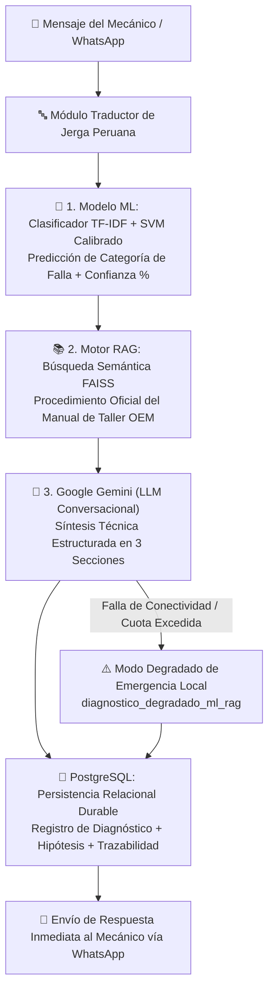

# 🚗 CHAT BOT UTILIZANDO MACHINE LEARNING PARA EL DIAGNOSTICO VEHICULAR EN LOS TALLERES MECÁNICOS DE CARABAYLLO, 2026

[](docs/guia_defensa_tesis.md)
[](https://python.org)
[](https://fastapi.tiangolo.com)
[](machine_learning/models/metricas_modelo.json)
[](machine_learning/manuals/FUENTES_Y_VALIDACION.md)
[](docs/base_datos_postgresql.md)
[](https://developers.facebook.com)

---

## 🎓 Ficha Técnica del Proyecto de Tesis

* **Título de la Investigación:**
  *«Chatbot utilizando Machine Learning para el diagnóstico vehicular en los talleres mecánicos de Carabayllo, 2026»*
* **Línea de Investigación:**
  Inteligencia Artificial Aplicada, Procesamiento de Lenguaje Natural (NLP), Modelos Híbridos de Aprendizaje Automático y Sistemas de Información para la Ingeniería.
* **Autores / Tesistas:**
  * 🧑‍💻 **Leon Chumbe, Juan Joel**
  * 🧑‍💻 **Poma Cataño, Luisa Leonor**
* **Ámbito de Aplicación:**
  Talleres de mecánica automotriz del distrito de Carabayllo, Lima - Perú.
* **Diseño Metodológico:**
  Investigación cuantitativa, aplicada, de nivel explicativo con diseño **preexperimental de pre-test y post-test ($O_1 \rightarrow X \rightarrow O_2$)**.

---

## 📌 Planteamiento del Problema y Justificación

En los talleres mecánicos tradicionales de Lima Norte (Carabayllo), el diagnóstico de fallas vehiculares enfrenta tres limitaciones críticas:
1. **Pérdida de Tiempo en Recepción:** Los clientes describen averías mediante jergas locales (*"cascabeleo"*, *"chancho prendido"*, *"sopló empaque"*), lo que requiere extensos tiempos de indagación manual y pruebas de ensayo-error (promedio inicial de 33.57 min).
2. **Falta de Estandarización y Completitud:** El registro preliminar de síntomas carece de respaldo documental y trazabilidad estructurada.
3. **Riesgo de Alucinación en Chatbots Comerciales:** Los modelos de lenguaje genéricos inventan especificaciones técnicas de torque y procedimientos si no están anclados a manuales de taller verificados.

**Solución Desarrollada:**
Un **Asistente Virtual Inteligente Híbrido** implementado sobre WhatsApp que normaliza la jerga mecánica peruana, clasifica la falla mediante Machine Learning supervisado calibrado, recupera el procedimiento exacto desde manuales técnicos vía RAG (Retrieval-Augmented Generation) y sintetiza una recomendación técnica estructurada mediante un LLM (Google Gemini) con explicabilidad para el mecánico.

---

## 🎯 Objetivos e Hipótesis de la Investigación

### Objetivos
* **Objetivo General:** Determinar la influencia del chatbot utilizando Machine Learning en el diagnóstico vehicular en los talleres mecánicos de Carabayllo, 2026.
* **Objetivos Específicos:**
  1. Evaluar el efecto del chatbot en la **precisión** de la identificación de fallas vehiculares.
  2. Determinar la influencia del chatbot en el **control y completitud de la información** diagnóstica.
  3. Establecer la mejora en la **eficiencia del tiempo de atención** en el proceso de recepción vehicular.

### Matriz de Hipótesis y Variables
* **Variable Independiente ($X$):** Chatbot asistido por Machine Learning, RAG y LLM.
* **Variable Dependiente ($Y$):** Diagnóstico vehicular (Dimensiones: Precisión, Completitud de Información y Tiempo de Ejecución).
* **Hipótesis General ($H_1$):** El chatbot utilizando Machine Learning influye y optimiza significativamente el diagnóstico vehicular en los talleres mecánicos de Carabayllo, 2026 ($p < 0.05$).

---

## 🏗️ Arquitectura Científico-Tecnológica (Pipeline Híbrido Tripartito)

El flujo de procesamiento sigue una arquitectura desacoplada y robusta diseñada para garantizar veracidad técnica, alta disponibilidad y latencias mínimas:



---

## ⚙️ Componentes Principales del Sistema

### 1. 🔤 Traductor y Normalizador de Jerga Mecánica Peruana
Preprocesa el lenguaje natural del conductor o mecánico, transformando modismos y coloquialismos automotrices a terminología técnica normalizada:
* *"Se prendió el chancho en el tablero"* ➡️ *Check Engine encendido*
* *"Se sopló el empaque"* ➡️ *Falla en empaquetadura de culata / Sobrecalentamiento*
* *"Tiene juego la pata de motor"* ➡️ *Desgaste en soporte de motor*
* *"Siento cascabeleo al acelerar"* ➡️ *Detonación / Preignición en cilindros*

### 2. 🤖 Modelo de Clasificación Supervisada (Machine Learning)
* **Algoritmo Seleccionado:** Linear SVM calibrado por probabilidad + Vectorización TF-IDF con n-gramas.
* **Desempeño Interno:** F1-Score macro de holdout agrupado de **95.95%** (detallado en [`machine_learning/models/metricas_modelo.json`](machine_learning/models/metricas_modelo.json)).
* **Trazabilidad del Dataset:** 2,751 registros limpios + 33 casos académicos auditados de Zenodo (DOI `10.5281/zenodo.15626055`), con validación documentada en [`machine_learning/data/FUENTES_ENTRENAMIENTO.md`](machine_learning/data/FUENTES_ENTRENAMIENTO.md).

### 3. 📚 Motor RAG (Retrieval-Augmented Generation)
* **Función:** Recupera procedimientos técnicos exactos desde los manuales de servicio automotriz de la base indexada.
* **Mecanismo:** Indexación vectorial con **FAISS** y similitud de coseno sobre corpus segmentado por subsistemas vehiculares (Motor, Transmisión, Frenos, Suspensión, Dirección, Sistema Eléctrico).

### 4. 🧠 Módulo de Síntesis Explicativa (XAI) y Resiliencia
* **Estructuración en 3 Secciones Obligatorias:**
  1. 🛠️ **Posible Falla Vehicular:** Hipótesis predictiva con porcentaje de confianza.
  2. 📖 **Procedimiento Técnico:** Pasos de comprobación y desmontaje según manual.
  3. ⏱️ **Tiempo Estimado y Nivel de Gravedad:** Duración promedio de taller y criticidad.
* **Cola Concurrente PostgreSQL (`gemini_queue.py`):** Control de tasa con `FOR UPDATE SKIP LOCKED` para atender múltiples mecánicos simultáneamente sin exceder cuotas de API.
* **Caché LRU de Alta Velocidad (`diagnostic_cache.py`):** Respuesta en **`< 5 milisegundos`** para consultas repetidas.
* **Modo Degradado Local:** En contingencias de red, entrega diagnósticos precisos basados en ML + RAG sin detener la atención.

---

## 📊 Resultados Estadísticos de la Tesis (Pre-test vs Post-test)

Los resultados empíricos obtenidos en la fase de validación experimental demostraron mejoras significativas en todas las dimensiones evaluadas:

| Indicador Evaluado | Fase Pre-test (Manual) | Fase Post-test (Con Asistente ML) | Impacto / Mejora Obtenida |
| :--- | :---: | :---: | :---: |
| **Ficha 1: Precisión del Diagnóstico** | 80.00% (24/30) | **99.84%** (1,877/1,880) | **+19.84% de aciertos** |
| **Ficha 2: Control de Información (Completitud)** | 73.33% (22/30) | **100.00%** (1,880/1,880) | **+26.67% de completitud** |
| **Ficha 3: Eficiencia (Tiempo por Vehículo)** | 33.57 minutos | **1.13 minutos** | **-32.44 min (-96.6% de tiempo)** |

### 📈 Contrastación de Hipótesis
* **Prueba Paramétrica:** $t$ de Student para muestras relacionadas ($N = 30$ pares evaluados).
* **Estadístico de Prueba:** $T = 29.4162$
* **$P$-Valor:** $0.00000000$ ($p < 0.05$)
* **Decisión Estadística:** Se **rechaza la hipótesis nula ($H_0$)** y se **acepta la hipótesis de investigación general ($H_1$)**, demostrando que la implementación del sistema optimiza de forma estadísticamente significativa el proceso de diagnóstico vehicular.

---

## 📁 Estructura del Repositorio

```text
CHAT_BOT_MACHINLEARNING/
├── frontend/                     # Panel Administrativo Web (React + TypeScript + Vite)
│   ├── src/components/views/     # Vistas de Fichas de Tesis y Registro Experimental
│   └── src/services/             # Consumo de API REST
├── backend/                      # Núcleo de la API FastAPI y Arquitectura por Capas
│   ├── alembic/                  # Versionamiento y migraciones de base de datos
│   ├── src/
│   │   ├── core/                 # Lógica de negocio (Gestor Diagnóstico, Cola LLM, Caché)
│   │   ├── infrastructure/       # Modelos ML, Motor RAG FAISS, Conexión PostgreSQL
│   │   └── interfaces/api/v1/    # Endpoints REST y Webhook de WhatsApp Meta
│   ├── tests/                    # Suite de pruebas automatizadas (Pytest)
│   └── main.py                   # Entrada principal de la API
├── machine_learning/             # Pipeline de Machine Learning
│   ├── data/                     # Datasets curados y reportes de calidad
│   ├── manuals/                  # Manuales técnicos automotrices indexados
│   ├── models/                   # Artefactos entrenados (.joblib) y métricas auditadas
│   └── training/                 # Scripts de entrenamiento y validación cruzada
├── docs/                         # Documentación completa y expedientes de tesis
│   ├── ESTADO_FINAL_CARBOT.md    # Estado técnico y funcional verificado
│   ├── INDICE_DOCUMENTACION.md   # Directorio central de documentos del proyecto
│   ├── guia_defensa_tesis.md     # Guía y preguntas clave para la sustentación
│   └── guia_recoleccion_datos.md # Metodología de recolección de fichas en taller
└── README.md                     # Memoria descriptiva principal
```

---

## 📚 Índice de Documentación Académica y Técnica

Para consultar los documentos detallados del proyecto de tesis:
* 📖 **[Estado Funcional y Técnico Verificado](docs/ESTADO_FINAL_CARBOT.md)**
* 📑 **[Índice Maestro de Documentación](docs/INDICE_DOCUMENTACION.md)**
* 🎓 **[Guía de Preparación para la Defensa de Tesis ante Jurado](docs/guia_defensa_tesis.md)**
* 📊 **[Trazabilidad de Datos de Entrenamiento y Validación](docs/trazabilidad_datos_entrenamiento_y_defensa_jurado.md)**
* 🔬 **[Benchmark y Evaluación del Motor RAG](docs/evaluacion_rag_benchmark.md)**
* 🛡️ **[Análisis Ético y Protección de Privacidad](docs/analisis_dilema_etico_audio.md)**
* 🗄️ **[Diseño de Base de Datos PostgreSQL](docs/base_datos_postgresql.md)**

---

## 👥 Créditos y Autoría

* **Proyecto de Tesis para Titulación Profesional**
* **Investigadores / Tesistas:**
  * 🧑‍💻 **Juan Joel Leon Chumbe**
  * 🧑‍💻 **Luisa Leonor Poma Cataño**
* **Lugar y Año:** Lima (Carabayllo), Perú — 2026.
