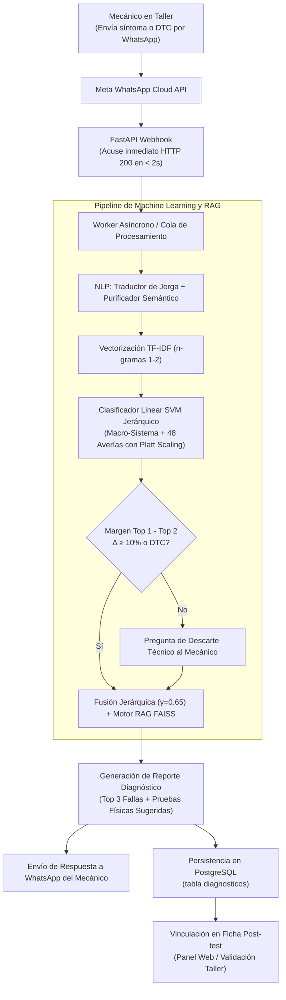
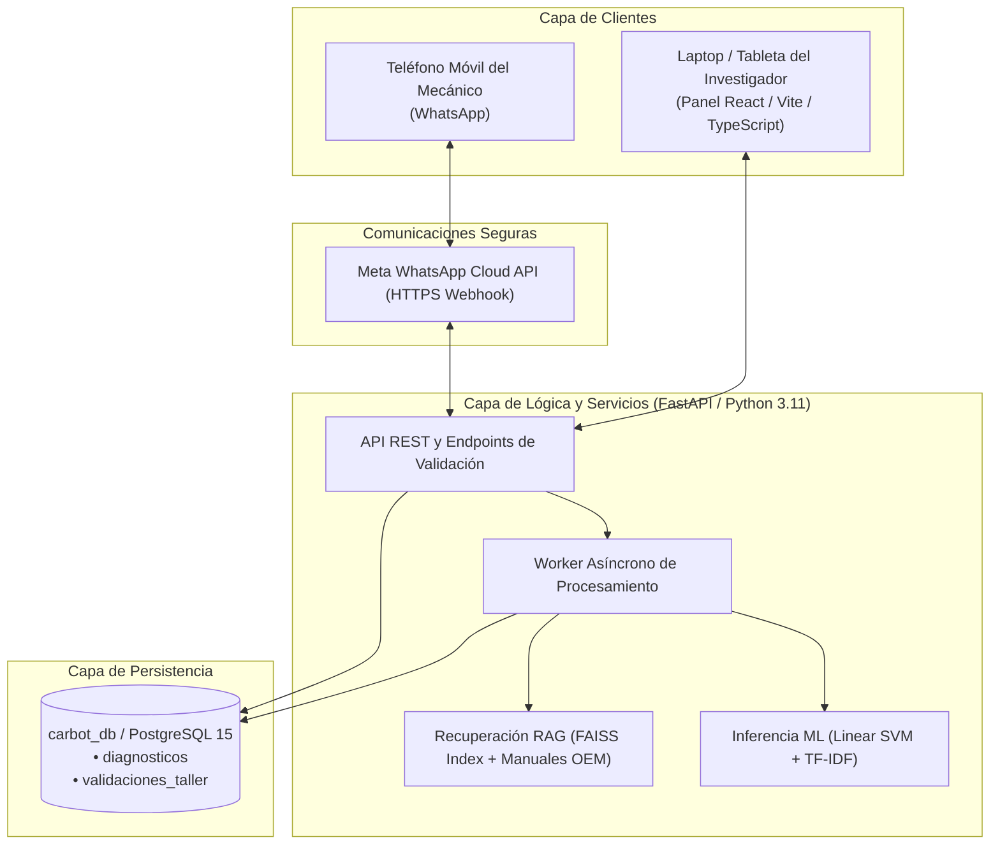

# ANEXO METODOLÓGICO: METODOLOGÍA DE DESARROLLO DEL SISTEMA CARBOT MEDIANTE LA INTEGRACIÓN HÍBRIDA SCRUM Y CRISP-DM

**Título de la Tesis:** *"Chatbot utilizando machine learning para el diagnóstico vehicular en talleres mecánicos en Carabayllo 2026"*  
**Sede de Aplicación Experimental:** Taller Automotriz CARTER MOTOR'S E.I.R.L. (Carabayllo, Lima - Perú)  
**Diseño de la Investigación:** Preexperimental con Pre-test ($O_1$) y Post-test ($O_2$) sobre 60 casos reales  
**Clasificación del Documento:** Anexo Metodológico y Técnico de Ingeniería de Software e Inteligencia Artificial  

---

## 1. Qué resuelve

En el taller mecánico CARTER MOTOR'S E.I.R.L. de Carabayllo, el diagnóstico vehicular se realizaba tradicionalmente de forma empírica y manual, lo que generaba demoras promedio superiores a 40 minutos en inspección preliminar, dispersión de criterios entre técnicos y ausencia de registros estandarizados de fallas. Para solucionar esta problemática, el proyecto desarrolló CarBot, una plataforma integral que asiste al mecánico en tiempo real vía WhatsApp y centraliza el registro experimental de la tesis. El sistema implementa procesamiento de lenguaje natural con traducción de jerga automotriz, clasificación multiclase mediante Linear SVM con vectorización TF-IDF jerárquica en 48 averías, enriquecimiento procedimental con RAG (FAISS) y un panel web en React/FastAPI con PostgreSQL para la medición preexperimental comparativa (Pre-test y Post-test) sobre una muestra de 60 casos reales.

---

## 2. Alcance y Arquitectura del Sistema

### 2.1 Módulos y Tecnologías del Sistema

| Módulo | Qué hace | Tecnología / Componente Clave |
| :--- | :--- | :--- |
| **Asistencia vía WhatsApp** | Recepción de consultas por WhatsApp Cloud API, emisión de acuse preliminar inmediato y entrega de reporte con Top 3 fallas y pruebas físicas. | FastAPI Webhooks, Meta Cloud API, Worker asíncrono. |
| **Procesamiento de Lenguaje Natural (NLP)** | Traducción de jerga peruana (*"cascabelea"*, *"se chupa"*), extracción de códigos DTC OBD-II (`P0301`, `P0420`) y normalización léxica. | `traductor_jerga.py`, `semantic_purifier.py`, `text_processor.py`. |
| **Clasificación con Machine Learning** | Vectorización TF-IDF y clasificación multiclase con **Linear SVM** jerárquico calibrado (7 Macro-Sistemas y 48 averías específicas). | `linear_svm_diagnostico.joblib`, `tfidf_diagnostico.joblib`, Scikit-Learn. |
| **Base de Conocimiento RAG** | Recuperación contextual de tolerancias eléctricas (13.8V - 14.4V), torques y pruebas metrológicas desde manuales de servicio OEM. | `index.faiss`, `metadata.json`, FAISS Vectorstore. |
| **Instrumentos de Validación (Anexo 2)** | Registro y control de fichas Pre-test (manual) y Post-test (asistido por CarBot) evaluando PPCF (Ficha 1), PRDC (Ficha 2) y TPRD (Ficha 3). | React 18, TypeScript, SQLAlchemy async, `validaciones_taller`. |
| **Aislamiento de Muestra y Exportación** | Blindaje contra contaminación entre datos PILOTO y OFICIAL (0/60) y exportación oficial en formato LONG (CSV) para contraste estadístico. | PostgreSQL 15 (`carbot_db`), Alembic `20260919_04`, Pandas/CSV. |

### 2.2 Fuera de alcance

- **Interacción directa con clientes o conductores particulares:** Diseñado para uso exclusivo del personal técnico y mecánicos en bahía de trabajo.
- **Sustitución de pruebas físicas o metrológicas:** CarBot sugiere hipótesis y pruebas metrológicas, pero la confirmación física real siempre la realiza el mecánico en taller.
- **Reentrenamiento automático desatendido:** El modelo Linear SVM y el índice FAISS están congelados criptográficamente (`CARBOT_PRECAMPO_FINAL_HASH_MANIFEST.json`) para garantizar reproducibilidad en la tesis.
- **Alteración de registros históricos:** La base de datos no realiza borrados físicos de fichas auditadas, preservando la trazabilidad.

### 2.3 Roles del Sistema y del Equipo

| Rol en Plataforma / Equipo | Responsabilidad Principal |
| :--- | :--- |
| **Mecánico de Taller** | Consulta diagnósticos en tiempo real por WhatsApp, reporta síntomas coloquiales o códigos DTC y ejecuta las pruebas de confirmación física en el vehículo. |
| **Investigador / Tesista (Product Owner)** | Administra el panel web de validación, registra las fichas de Pre-test y Post-test, audita la completitud de campos, controla tiempos y exporta datos oficiales. |
| **Asesor de Tesis / Administrador (Scrum Master)** | Supervisa el avance del trabajo de campo (0/60 casos), audita la integridad de datos, verifica el aislamiento del entorno piloto y valida las métricas de investigación. |

### 2.4 Diagramas Principales del Sistema

#### Flujo del Diagnóstico Vehicular en la Plataforma

#### Arquitectura del Sistema Desplegado

---

## 3. Modelado Predictivo y Reglas Canónicas de Decisión (CRISP-DM)

La fase analítica de minería de datos procesó un dataset canónico de **5,374 casos estructurados** sobre una taxonomía jerárquica de **7 Macro-Sistemas** vehiculares y **48 averías específicas**, aplicando el clasificador **Linear SVM** calibrado probabilísticamente mediante regresión logística sigmoide (*Platt Scaling*):

### Ecuaciones Canónicas de Decisión

1. **Ponderación Jerárquica Suave:**
   $$P_{\text{comb}}(F_i) = P(F_i) \times [P(S_k)]^{\gamma}$$
   *Donde $\gamma = 0.65$ es el exponente calibrado que suprime hipótesis absurdas fuera de sistema sin penalizar averías que comparten sintomatología entre subsistemas conexos.*

2. **Multiplicador de Autoridad DTC:**
   $$P_{\text{dtc}}(F_i) = \min(1.0, P_{\text{comb}}(F_i) \times 2.5) \quad \text{si } F_i \in \text{Candidatos}(DTC)$$
   *Garantiza que la evidencia electrónica digital del escáner OBD-II prevalezca sobre la subjetividad coloquial del usuario.*

3. **Regla del Margen Canónico de Incertidumbre:**
   $$\Delta = P(\text{Top 1}) - P(\text{Top 2})$$
   *Si $\Delta \ge 10\%$ o $P(\text{Top 1}) \ge 70\%$, el sistema responde de forma directa y asertiva; si $\Delta < 10\%$, se activa una repregunta técnica estructurada de descarte.*

### Resultados de Evaluación Técnica (Holdout Ciego) y Congelamiento
- **Exactitud Global en Falla Específica (48 clases):** **93.07%**.
- **Exactitud en Macro-Sistema (7 sistemas):** **98.71%**.
- **Top-3 Accuracy:** **98.71%** (en 98.71% de los casos la avería real estuvo dentro del Top 3 recomendado).
- **F1-Score Macro:** $>0.91$.
- **Congelamiento Criptográfico:** 13 artefactos sellados con firmas SHA-256 en `CARBOT_PRECAMPO_FINAL_HASH_MANIFEST.json`.

---

## 4. Matriz Metodológica (CRISP-DM ⟷ SCRUM) y Definition of Done (DoD)

### 4.1 Cronograma de Integración por Sprints

| Sprint | Duración | Fases CRISP-DM | Objetivo del Sprint (*Sprint Goal*) | Entregables e Incrementos de Software |
| :---: | :---: | :---: | :--- | :--- |
| **Sprint 0** | 2 sem. | I. Comprensión Negocio | Requisitos de taller, arquitectura base y variables de tesis. | • Documento de Arquitectura. • Matriz de variables e hipótesis. • Entorno FastAPI + Postgres + React. |
| **Sprint 1** | 2 sem. | II. Comprensión Datos | Corpus automotriz y taxonomía jerárquica de 48 averías. | • Dataset canónico preliminar (5,374 casos). • Taxonomía 7 Macro-Sistemas y 48 averías. • Diccionario de jerga automotriz. |
| **Sprint 2** | 2 sem. | III. Preparación Datos | Pipeline de NLP (traductor, purificador, procesador) y TF-IDF. | • `text_processor.py` y `traductor_jerga.py`. • Extractor de códigos DTC (`semantic_purifier.py`). • Vectorizador `tfidf_diagnostico.joblib`. |
| **Sprint 3** | 2 sem. | IV. Modelado Predictivo | Clasificador Linear SVM multiclase, Platt Scaling y Macro-Sistema. | • Modelo `linear_svm_diagnostico.joblib`. • Clasificador de Macro-Sistemas. • Fusión jerárquica con $\gamma = 0.65$. |
| **Sprint 4** | 2 sem. | IV (RAG) y V (Evaluación) | Vectorstore FAISS con manuales OEM, fusión DTC y holdout. | • Índice `index.faiss` y `metadata.json`. • `politica_fusion.py` (DTC $2.5\times$). • Holdout verificado: 93.07% Accuracy. |
| **Sprint 5** | 2 sem. | VI. Despliegue Backend | API REST en FastAPI, PostgreSQL, migraciones Alembic y WhatsApp. | • Endpoints `/diagnostico` y `/webhook`. • Worker de colas y rate limiter preventivo. • Conexión validada con Meta Cloud API. |
| **Sprint 6** | 2 sem. | VI. Despliegue Frontend | Panel web React/Vite para visualización y fichas de taller (Anexo 2). | • Interfaz web responsive en React/TypeScript. • Módulo de Fichas 1 (PPCF), 2 (PRDC) y 3 (TPRD). • Medición de completitud y tiempos. |
| **Sprint 7** | 2 sem. | V y VI: Hardening Final | Congelamiento criptográfico, aislamiento de muestra (0/60) y check pre-campo. | • Manifiesto SHA-256 inmutable. • Aislamiento estricto de casos PILOTO vs OFICIAL. • Exportador LONG CSV de Anexo 2. • Dictamen `APTO_PARA_PILOTO_PRESENCIAL`. |

### 4.2 Criterios Técnicos de Definition of Done (DoD)
1. **Modularidad Estricta:** Ningún archivo de código supera las 400 líneas (Clean Architecture).
2. **Pruebas Unitarias de Backend:** Aprobadas al 100% en Pytest (`pytest -q`).
3. **Cobertura de Código:** Cobertura superior al 55% en `backend/src`.
4. **Validación Frontend:** Compilación TypeScript limpia (`npm run build`) y arnés de pruebas superado (`npm run test:harness`).
5. **Cero Regresiones:** Ausencia total de regresiones en funcionalidades existentes.
6. **Esquema de Base de Datos:** Migraciones Alembic al día en head (versión `20260919_04`).
7. **Congelamiento ML:** Inmutabilidad estricta de los modelos contra el manifiesto SHA-256.

---

## 5. Historias de Usuario (Alineadas a los Instrumentos de Tesis)

| ID | Historia de Usuario | Módulo / Ficha Vinculada | Criterios de Aceptación Técnicos |
| :---: | :--- | :--- | :--- |
| **HU-01** | **Como** mecánico, **quiero** redactar síntomas con jerga peruana (*"cascabelea"*, *"se chupa"*), **para que** el sistema reconozca la falla sin forzarme a tecnicismos. | NLP y Jerga | 1. Mapeo a términos estandarizados. 2. Eliminación de tildes y signos. 3. Latencia léxica $< 5$ ms. |
| **HU-02** | **Como** mecánico, **quiero** ingresar un código OBD-II (ej. `P0301`) junto al síntoma, **para que** el sistema priorice la evidencia digital del escáner. | Purificador Semántico | 1. Aislamiento exacto del patrón DTC. 2. Multiplicador de autoridad $2.5\times$. 3. Fijación del Macro-Sistema correspondiente. |
| **HU-03** | **Como** técnico en bahía, **quiero** consultar el diagnóstico desde mi celular por WhatsApp, **para** obtener orientación técnica inmediata sin ir a una PC. | Asistencia WhatsApp | 1. Acuse preliminar en $< 2$ segundos. 2. Reporte con Top 3 fallas y pruebas sugeridas. 3. Fallback degradado local si la API externa demora. |
| **HU-04** | **Como** mecánico, **quiero** recibir tolerancias de fábrica (13.8V - 14.4V) y pruebas OEM, **para** descartar la falla con instrumental de taller. | Base RAG (FAISS) | 1. Recuperación de manuales OEM con FAISS. 2. Inclusión de rangos de carga y torques. 3. Sugerencia de prueba física metrológica. |
| **HU-05** | **Como** investigador, **quiero** registrar fichas Pre-test del método tradicional sin CarBot, **para** capturar la línea base del taller sin sesgo. | Validación Pre-test | 1. Formulario autónomo sin `diagnostico_id`. 2. Registro de hipótesis y falla real confirmada. 3. Cronometraje manual en minutos. |
| **HU-06** | **Como** investigador, **quiero** vincular una consulta de WhatsApp a la ficha Post-test, **para** auditar la Ficha 1 (PPCF) con inmutabilidad de predicción. | Ficha 1: Predicción (PPCF) | 1. Precarga automática de predicción y confianza. 2. Falla predicha bloqueada en backend. 3. Asociación atómica del `diagnostico_id`. |
| **HU-07** | **Como** investigador, **quiero** auditar los campos obligatorios del registro técnico, **para** medir el ratio de completitud de la Ficha 2 (PRDC). | Ficha 2: Información (PRDC) | 1. Validación de 8 campos estructurados mínimos. 2. Cálculo automático del indicador PRDC. 3. Almacenamiento binario del cumplimiento. |
| **HU-08** | **Como** investigador, **quiero** registrar el tiempo del proceso diagnóstico, **para** calcular el tiempo promedio de respuesta de la Ficha 3 (TPRD). | Ficha 3: Tiempo (TPRD) | 1. Registro independiente de `tiempo_diagnostico_minutos`. 2. Separación de telemetría de software y latencia ML. 3. Cálculo de la sumatoria y promedio de tiempos. |
| **HU-09** | **Como** tesista, **quiero** disponer de un entorno PILOTO independiente del OFICIAL, **para que** los ensayos de práctica no contaminen la muestra de 60 casos. | Aislamiento de Datos | 1. Selector explícito (`PILOTO` vs `OFICIAL`). 2. Modal de confirmación obligatorio para oficial. 3. Muestra oficial en 0/60 previa al campo. |
| **HU-10** | **Como** asesor o tesista, **quiero** exportar la data en formato LONG cumpliendo el Anexo 2, **para** realizar el análisis estadístico inferencial. | Exportador Oficial | 1. Exportación CSV con columnas metodológicas. 2. Inclusión exclusiva de registros verificados oficiales. 3. Exclusión total de desarrollo y piloto. |

---

## 6. Gestión de Riesgos e Impedimentos Técnicos

| Riesgo / Impedimento Detectado | Impacto en la Investigación | Estrategia de Mitigación y Solución Implementada en SCRUM |
| :--- | :--- | :--- |
| **Fuga de Información (*Data Leakage*) en ML** | Sobreestimación artificial del rendimiento del modelo en producción. | Ajuste (*fit*) del vectorizador TF-IDF exclusivo en el 80% de entrenamiento. Validación ciega sobre el 20% de holdout sin contacto previo. |
| **Caídas o agotamiento de cuotas en APIs externas de lenguaje** | Bloqueo del mecánico en WhatsApp y consultas huérfanas sin diagnóstico. | Implementación de la Invariante de Entrega con modo degradado local obligatorio: fusión directa de Linear SVM y motor FAISS en milisegundos. |
| **Contaminación de la Muestra Oficial de 60 casos** | Invalidez académica de los resultados preexperimentales de la tesis. | Blindaje de triple capa: Modal de confirmación en Frontend, validación de tipo de registro en Backend y `CheckConstraint` en PostgreSQL. |
| **Manipulación accidental de modelos congelados** | Pérdida de trazabilidad y reproducibilidad ante el jurado de tesis. | Manifiesto criptográfico de 13 artefactos sellados con firmas SHA-256 (`CARBOT_PRECAMPO_FINAL_HASH_MANIFEST.json`). |
| **Confusión entre latencia computacional y tiempo de taller** | Distorsión metodológica en la Ficha 3 (eficiencia del diagnóstico). | Separación estricta de columnas: `tiempo_inferencia_ml_ms` (ML), `duracion_sistema_segundos` (Pipeline) y `tiempo_diagnostico_minutos` (Taller). |
