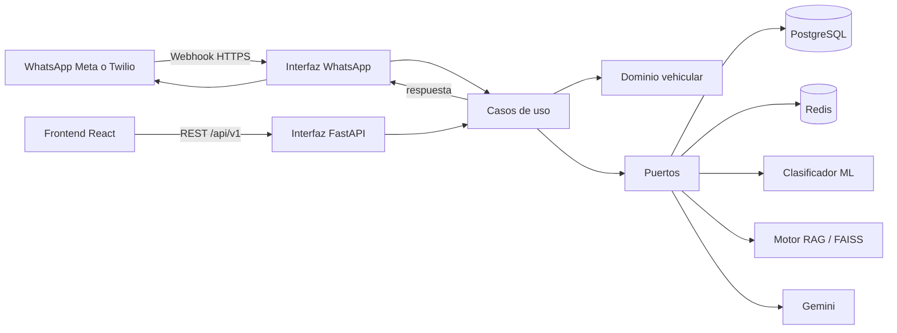
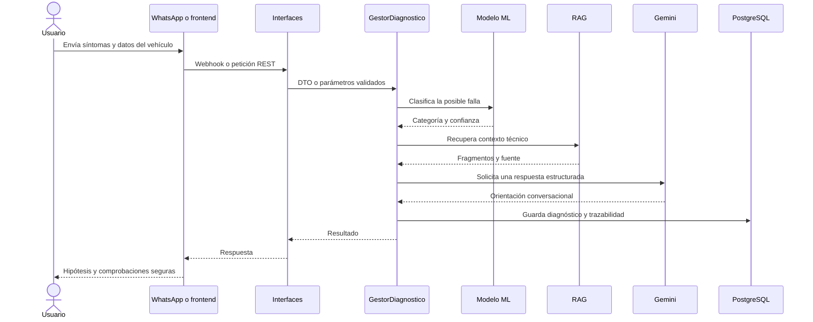

# Conexiones entre los módulos

## Vista general

## Flujo de un diagnóstico

Machine Learning propone una clasificación; RAG aporta evidencia recuperada;
Gemini redacta y organiza la respuesta. El gestor de diagnóstico coordina los
tres y conserva las reglas de seguridad. Ninguno reemplaza la validación física
del mecánico.

## Ubicación de las conexiones

| Responsabilidad | Punto de entrada canónico |
| --- | --- |
| Cliente HTTP del frontend | `frontend/src/shared/api/` |
| Contratos compartidos del frontend | `frontend/src/shared/types/` |
| Caso de uso de diagnóstico | `backend/src/application/services/` |
| Cola y límites de Gemini | `backend/src/application/jobs/` |
| Canal WhatsApp | `backend/src/interfaces/messaging/whatsapp/` |
| Adaptador ML | `backend/src/infrastructure/ml/` |
| Adaptador RAG | `backend/src/infrastructure/rag/` |
| PostgreSQL y repositorios | `backend/src/infrastructure/database/` |
| Artefactos ML/RAG | `machine_learning/` |
| PostgreSQL para despliegue | `infrastructure/database/postgresql/` |

Las claves se cargan desde variables de entorno centralizadas por
`backend/src/config.py`; `.env.example` documenta los nombres y `.env` no debe
versionarse.
