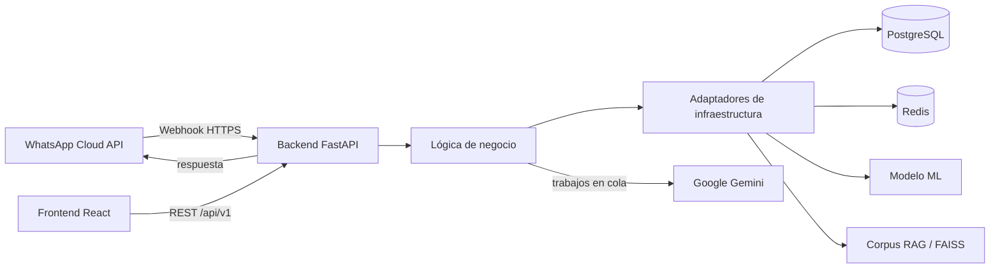

# Conexiones entre los módulos

CarBot es un monorepo modular. No necesita una carpeta genérica `conexion/`:
cada integración pertenece al módulo que la implementa.

## Frontend hacia backend

- Cliente HTTP: `frontend/src/services/api.ts`.
- Contratos TypeScript: `frontend/src/types/api.ts`.
- Desarrollo local: `frontend/vite.config.ts` redirige `/api` al puerto `8000`.
- Producción: `VITE_API_BASE_URL` define la URL pública del backend.

El frontend no importa Python ni accede directamente a PostgreSQL o a los
modelos. Toda operación pasa por la API autenticada.

## Backend hacia Machine Learning y RAG

- Adaptador ML: `backend/src/infrastructure/modelo_ml.py`.
- Adaptador RAG: `backend/src/infrastructure/motor_rag.py`.
- Rutas de artefactos: `backend/src/config.py`.
- Datos y modelos: `machine_learning/data/`, `machine_learning/models/` y
  `machine_learning/manuals/`.

`machine_learning/` produce y conserva artefactos. El backend los carga y los
usa en ejecución; no existe una llamada HTTP adicional entre ambos.

## Backend hacia infraestructura

- Conexión PostgreSQL: `backend/src/infrastructure/database/connection.py`.
- Repositorios: `backend/src/infrastructure/database/repositories/`.
- Ensamblaje de dependencias: `backend/src/infrastructure/container.py`.
- Servicios Docker: `docker-compose.yml`.
- Inicialización PostgreSQL: `infrastructure/database/postgresql/`.

El directorio superior `infrastructure/` contiene recursos de despliegue. El
código adaptador permanece dentro de `backend/src/infrastructure/` para respetar
la arquitectura por capas.

## WhatsApp y servicios externos

- Entrada webhook: `backend/src/interfaces/api/v1/endpoints/webhook.py`.
- Orquestación: `backend/src/core/services/webhook_service.py`.
- Salida WhatsApp: `backend/src/core/services/whatsapp_provider.py`.
- Configuración y secretos: `.env` local, tomando `.env.example` como plantilla.

