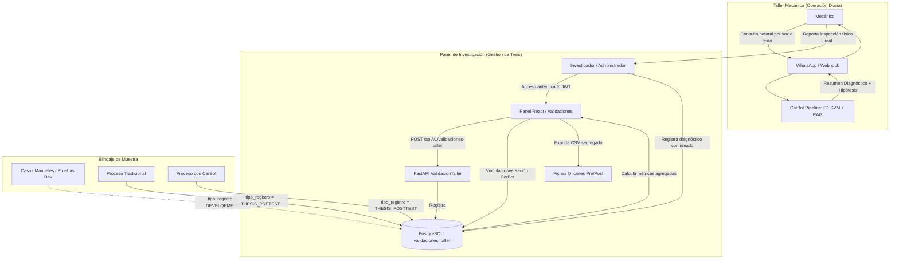

# FASE 11.5 — AUDITORÍA DE DATOS DE TESIS E INSTRUMENTOS DE INVESTIGACIÓN

**Proyecto:** CarBot — Chatbot con Machine Learning para Diagnóstico Vehicular  
**Tesis:** "Chatbot utilizando machine learning para el diagnóstico vehicular en talleres mecánicos en Carabayllo 2026"  
**Diseño Metodológico:** Preexperimental $O_1 - X - O_2$ ($O_1$: Pre-test tradicional, $X$: Implementación CarBot, $O_2$: Post-test asistido)  
**Fecha:** 2026-09-19  
**Estado:** AUDITORÍA Y REMEDIACIÓN COMPLETADA  

---

## 1. Inventario General de Componentes y Estado Inicial vs. Remediado

A continuación se detalla la matriz de auditoría de componentes previa a la Fase 11.5 y su estado tras la implementación:

| Feature / Métrica | Frontend | API / Endpoint | Database (PostgreSQL) | Estado Operativo (Working) | Visibilidad Frontend | Diagnóstico de Deficiencia Inicial / Corrección Implementada |
|---|---|---|---|---|---|---|
| **Selector de Fase (Pre-test / Post-test)** | Sí (`ValidacionTallerPage`) | Sí (`GET /api/v1/validaciones-taller`) | Parcial (`ValidacionTaller.fase` existía, pero sin separación de `DEVELOPMENT` vs `THESIS`) | Parcial | Visible | **Corregido:** Se añadió campo discriminador estricto `tipo_registro` (`DEVELOPMENT`, `REGRESSION`, `THESIS_PRETEST`, `THESIS_POSTTEST`) para blindar el aislamiento muestral. |
| **Separación de Casos de Desarrollo vs Tesis** | No (No existía filtro) | No (Se agregaban todos los registros) | No (Solo existía campo `fase` 'PRE' o 'POST') | No | No visible | **Implementado:** Migración `20260919_01_separacion_fases_tesis.py` agrega `tipo_registro` con Check Constraint. Los registros de desarrollo jamás entran en métricas de tesis. |
| **Predicción ML (Top 1, Top 3, Sistema)** | Parcial (Modal detalle) | Sí (`ValidacionTaller`, `Diagnostico`) | Sí (`Diagnostico.prediccion_ml`, `ValidacionTaller.prediccion_sistema`) | Sí | Visible en modal | **Corregido:** Vinculación explícita `diagnostico_id` y `conversacion_id` en `ValidacionTaller`. |
| **Diagnóstico Físico Confirmado (Ground Truth)** | Sí (Formulario y tabla) | Sí (`ValidacionTaller.diagnostico_fisico`) | Sí (`ValidacionTaller.diagnostico_fisico`) | Sí | Visible | **Operativo:** Permite al mecánico/investigador registrar la falla real comprobada en elevador/taller. |
| **Verificación de Acierto (PPCF)** | Sí (`es_correcta`) | Sí (`ValidacionTaller.es_correcta`) | Sí (`ValidacionTaller.es_correcta`) | Sí | Visible | **Operativo:** `ServicioValidacionTaller.metricas_variable_independiente` y `resumen_por_fase` calculan PPCF exclusivamente sobre `THESIS_PRETEST` y `THESIS_POSTTEST`. |
| **Control de Información (8 Campos / RDC)** | Sí (`campos_completos`, RDC %) | Sí (`ValidacionTaller.campos_completos`) | Sí (`ValidacionTaller.campos_completos`) | Parcial | Visible | **Advertencia Metodológica:** Los 8 campos exactos requieren confirmación formal con el asesor de tesis (`DEFINICION_8_CAMPOS_REQUIERE_CONFIRMACION_METODOLOGICA`). |
| **Tiempo de Respuesta Diagnóstica (TPRD)** | Sí (`duracion_minutos`) | Sí (`ValidacionTaller.duracion_minutos`) | Sí (`ValidacionTaller.duracion_minutos`) | Sí | Visible | **Clarificado:** Diferenciación estricta entre `tiempo_inferencia_ms` (telemetría de vectorización + SVM) y `duracion_minutos` (proceso de diagnóstico en taller). |
| **Trazabilidad Conversación / Caso WhatsApp** | No en UI | Parcial (Solo en logs) | Incompleto (No había FK o columna formal en `ValidacionTaller`) | No | No visible | **Implementado:** Columnas `conversacion_id` (UUID) y `diagnostico_id` (UUID) añadidas a `ValidacionTaller` e integradas en DTOs y UI. |
| **Exportación de Datos para Tesis (CSV)** | Sí (Botón exportar) | Sí (`GET /api/v1/validaciones-taller/exportar`) | Sí (PostgreSQL streaming) | Sí | Visible | **Reforzado:** Limpieza de inyección de fórmulas CSV (`=`, `+`, `-`, `@`) y orden cronológico descendente estricto (`fecha DESC, item DESC`). |

---

## 2. Diferenciación Crítica: Logged vs. Persisted vs. Queryable vs. Visible vs. Exportable

Antes de la Fase 11.5, existía confusión operativa entre lo que se registraba en logs de ejecución y lo que estaba debidamente persistido en base de datos:

| Dato / Métrica | En Logs (Worker/API) | Persistido en DB | Consultable por API | Visible en Frontend | Exportable a CSV | Estado Final Fase 11.5 |
|---|---|---|---|---|---|---|
| **Top 1 Predicción ML** | Sí | Sí (`diagnosticos`, `validaciones_taller`) | Sí | Sí | Sí | **PERSISTIDO & AUDITABLE** |
| **Top 3 Diagnóstico Diferencial** | Sí | Sí (`diagnosticos.probabilidades_top3`) | Sí | Sí (Modal) | Sí | **PERSISTIDO & AUDITABLE** |
| **Confianza / Probabilidad ML (%)** | Sí | Sí (`diagnosticos.confianza_ml`) | Sí | Sí | Sí | **PERSISTIDO & AUDITABLE** |
| **Hora Inicio y Fin de Consulta** | Sí | Sí (`conversaciones.creado_en`, `actualizado_en`) | Sí | Parcial | No en CSV anterior | **Mapeado a `duracion_minutos`** |
| **Duración del Proceso Diagnóstico (min)**| No | Sí (`validaciones_taller.duracion_minutos`) | Sí | Sí | Sí | **MÉTRICA OFICIAL TPRD** |
| **Falla Confirmada Físicamente** | No | Sí (`validaciones_taller.diagnostico_fisico`) | Sí | Sí | Sí | **GROUND TRUTH AUDITADO** |
| **Acierto de la Predicción (`es_correcta`)**| No | Sí (`validaciones_taller.es_correcta`) | Sí | Sí | Sí | **MÉTRICA OFICIAL PPCF** |
| **Completitud de Campos (8 campos)** | No | Sí (`validaciones_taller.campos_completos`) | Sí | Sí | Sí | **MÉTRICA OFICIAL RDC** |
| **Tipo de Registro (`tipo_registro`)** | No | Sí (Nueva columna PostgreSQL) | Sí | Sí (Modal) | Sí | **AISLAMIENTO MUESTRAL RIGUROSO** |
| **UUID de Conversación WhatsApp** | Sí | Sí (Nueva columna `conversacion_id`) | Sí | Sí (Modal) | Sí | **TRAZABILIDAD END-TO-END** |

---

## 3. Estado de los Instrumentos de Recolección de Datos (Fichas)

### Ficha 1: Predicción de Fallas Vehiculares (Dimensión 1)
- **Fórmula:** $\text{PPCF} = \left(\frac{\text{Total Predicciones Correctas}}{\text{Total Predicciones Realizadas}}\right) \times 100$
- **Unidad Metodológica:** 1 registro de validación oficial en taller = 1 predicción principal contrastada contra el diagnóstico físico confirmado.
- **Protección Antisesgo:** El sistema **no** permite autocalificación del modelo. `es_correcta` es evaluada contra la comprobación física registrada por el mecánico/investigador.
- **División entre Cero:** Protegida en backend (`0.0%` si $N=0$) con tipificación `None` o `0.0`.

### Ficha 2: Control de Información Diagnóstica Vehicular (Dimensión 2)
- **Fórmula:** $\text{RDC} = \left(\frac{\text{Registros con los 8 campos completos}}{\text{Total Registros Evaluados}}\right) \times 100$
- **Estado de los 8 Campos:**
  > **[!IMPORTANT]**
  > **`DEFINICION_8_CAMPOS_REQUIERE_CONFIRMACION_METODOLOGICA`**
  > En la revisión exhaustiva de la documentación técnica y notas de tesis (`docs/proyecto/historial_y_evaluacion.md`), se constató que la tesis especifica la fórmula basada en "8 campos", pero los instrumentos originales no enumeran de forma unívoca cuáles son dichos 8 campos (ej. Placa, Kilometraje, Síntoma, Falla confirmada, Sistema afectado, Procedimiento, etc.).
  > La arquitectura actual almacena `campos_completos` (booleano) y `detalles_campos` (JSON estructurado). Se mantiene esta estructura flexible hasta la aprobación formal de la lista de los 8 campos por parte del asesor metodológico.

### Ficha 3: Eficiencia del Diagnóstico Vehicular (Dimensión 3)
- **Fórmula:** $\text{TPRD} = \frac{\sum \text{Duración en minutos}}{\text{Total Diagnósticos Evaluados}}$
- **Delimitación Operativa:**
  - $\text{TPRD}$ mide el tiempo en minutos del proceso diagnóstico de taller (desde recepción del vehículo hasta determinación de la avería).
  - La latencia técnica de inferencia ML ($\text{vectorización TF-IDF} + \text{Linear SVM} \approx 5-25\text{ ms}$) y la latencia del pipeline de orquestación ($\approx 1-3\text{ s}$) son métricas complementarias de telemetría y **no sustituyen ni alteran** el $\text{TPRD}$ de la ficha de tesis.

---

## 4. Registro y Flujo Operativo Separado (UX / Roles)

1. **Pre-test (Proceso Tradicional):** El investigador registra los tiempos, campos y diagnósticos de los vehículos evaluados con el método tradicional del taller (sin CarBot). `tipo_registro = 'THESIS_PRETEST'`.
2. **Post-test (Proceso con CarBot):** El mecánico utiliza CarBot vía WhatsApp. El investigador vincula el `conversacion_id` y `diagnostico_id` al caso de validación, registrando el diagnóstico confirmado tras la prueba física. `tipo_registro = 'THESIS_POSTTEST'`.
3. **Desarrollo y Regresión:** Todas las pruebas de bugs, regresiones de pipeline (como los casos de Arranque y Frenos de la Fase 11) se registran con `tipo_registro = 'DEVELOPMENT'` o `'REGRESSION'`, quedando **estrictamente excluidas** de cualquier cálculo de PPCF, RDC o TPRD.

---

## 5. Resumen de Correcciones Realizadas en Fase 11.5

1. **Migración Alembic `20260919_01_separacion_fases_tesis.py`**:
   - Agregada columna `tipo_registro` con Check Constraint a tablas `validaciones_taller` y `diagnosticos`.
   - Agregadas columnas `conversacion_id` y `diagnostico_id` en `validaciones_taller`.
2. **Repositorio `ValidacionTallerRepository`**:
   - `resumen_por_fase`, `metricas_variable_independiente`, `distribuciones` y `listar_todos(solo_verificados=True)` filtran estrictamente por `tipo_registro.in_(('THESIS_PRETEST', 'THESIS_POSTTEST'))`.
   - `listar` soporta filtro explícito por `tipo_registro`.
   - Ordenamiento descendente estricto (`fecha DESC, item DESC, id DESC`).
3. **DTOs y Controladores API**:
   - Añadido `tipo_registro`, `conversacion_id` y `diagnostico_id` en esquemas Pydantic `ValidacionTallerCreate`, `ValidacionTallerUpdate`, `ValidacionTallerResponse`.
4. **Frontend React**:
   - Tipos actualizados en `frontend/src/types/api.ts`.
   - Modal de detalle en `ValidacionCasosTable.tsx` ampliado con metadatos de investigación (`tipo_registro`, `conversacion_id`, `diagnostico_id`).
5. **Aislamiento Absoluto de Datos**:
   - Los datos oficiales de tesis jamás se tocan ni se usan para entrenamiento o re-entrenamiento del clasificador SVM C1 ni para el índice FAISS.
