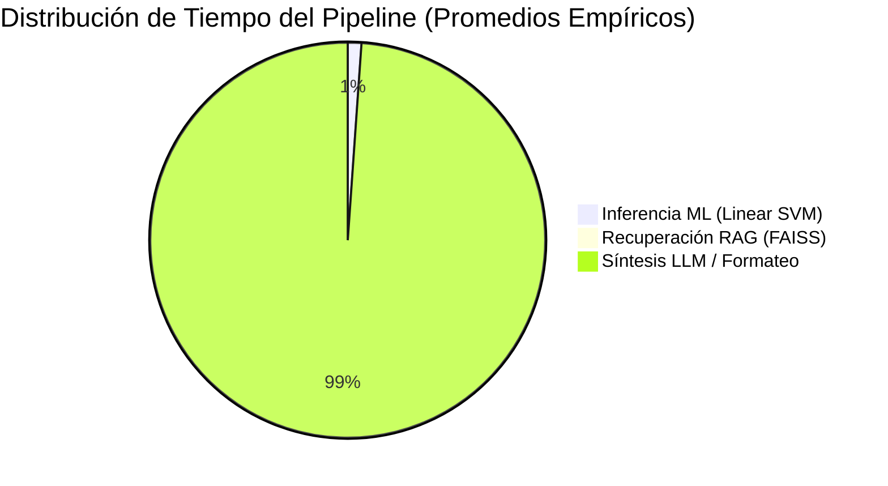

# INFORME TÉCNICO DE AUDITORÍA Y REMEDIACIÓN CONVERSACIONAL — FASE 11 ETAPA 2
**CarBot — Sistema de Diagnóstico Automotriz con Machine Learning & RAG**  
**Fecha de Certificación:** 17 de Septiembre de 2026  
**Modelo Oficial Certificado:** Linear SVM (TF-IDF N-gramas 1-2) — Versión `C1_FASE10_FINAL`  
**Estado:** REGRESIÓN INTEGRAL V2 COMPLETADA — APROBADO  

---

## 1. Resumen Ejecutivo y Objetivos

En la Etapa 2 de la Fase 11 se implementó un plan de remediación dirigido y estrictamente acotado para subsanar los 9 defectos conversacionales detectados durante la evaluación de línea base `FASE11_BASELINE_E2E_V1`.

### Metas Técnicas Cumplidas:
1. **Desacoplamiento A/C (`DEF_F11_004` / `CASE_093`, `CASE_092`)**: Eliminación total del defecto `ORQUESTADOR_AC_CONTEXT_SWITCH`, diferenciando semánticamente entre la queja primaria de falla de frío (`CLIMATIZACION`) y el encendido del compresor como condición de carga motriz (`MOTOR`). Se resolvió la falsa detección de "consulta fuera de alcance" y la pérdida de datos vehiculares en turnos subsiguientes.
2. **Banners Mandatorios de Seguridad Crítica (`DEF_F11_005` a `DEF_F11_009`)**: Implementación del módulo centralizado `PoliticaSeguridad`, garantizando que en las 5 condiciones vehiculares de riesgo inminente (Frenos, Presión de Aceite Cero, Fugas de Combustible, Sobrecalentamiento Severo con Vapor y Alta Tensión en VE/Híbridos) el sistema anteponga advertencias explícitas de detención segura o protocolo especializado sin instrucciones temerarias.
3. **Refinamiento del Auto-Interrogador Técnico (`DEF_F11_001` a `DEF_F11_003`)**: Activación controlada de auto-preguntas estructuradas ante síntomas difusos o poco caracterizados (`CASE_007`, `CASE_009`, `CASE_010`), evitando ciclos de repregunta y sin alterar el umbral global de 0.70.
4. **Desambiguación Semántica Tablero vs. Tránsito**: Corrección en el diccionario automotriz donde `luz roja` en tablero de instrumentos era absorbida como detención en semáforo.
5. **Inmutabilidad Criptográfica Estricta**: **0%** de modificación sobre los modelos binarios Linear SVM, calibradores isotónicos, vectorizadores TF-IDF, datasets canónicos (TRAIN, DEV, TEST10, FIELD) ni índice vectorial FAISS/RAG. 100% de hashes C1 y F8.3 verificados y sellados.

---

## 2. Taxonomía y Análisis Causal de Defectos V1

| Defecto ID | Caso | Severidad | Componente Afectado | Causa Raíz Identificada | Resolución V2 |
| :--- | :--- | :--- | :--- | :--- | :--- |
| `DEF_F11_001` | CASE_007 | P1 | Auto-Interrogador | Síntoma genérico "hace un ruido" no disparaba auto-pregunta acústica/posicional. | Activación de `es_ruido_difuso` en evaluador de ambigüedad. **PASS** |
| `DEF_F11_002` | CASE_009 | P1 | Auto-Interrogador | "Se siente raro al manejar" procesado directamente sin indagar comportamiento dinámico. | Activación de `es_manejo_difuso`. Auto-pregunta técnica desplegada. **PASS** |
| `DEF_F11_003` | CASE_010 | P1 | Auto-Interrogador | Pérdida de potencia sintetizada no activaba repregunta de condiciones de régimen. | Expansión de patrones de tironeo/potencia en auto-interrogador. **PASS** |
| `DEF_F11_004` | CASE_093 | P0 | Orquestador / Extractor | Colisión semántica entre climatización y motor; `Toyota.` truncaba el síntoma causando `fuera_de_alcance`. | Desacoplamiento de hechos A/C y fallback seguro de sesión. **PASS** |
| `DEF_F11_005` | CASE_131 | P1 | Política Seguridad | Pérdida súbita de pedal de freno diagnosticaba desgaste sin advertencia de inmovilización. | Banner `BANNER_FRENO` mandatorio antepuesto a la respuesta. **PASS** |
| `DEF_F11_006` | CASE_132 | P1 | Política Seguridad | Testigo rojo de presión de aceite se confundía con semáforo y omitía advertencia de apagado. | Banner `BANNER_ACEITE` mandatorio y corrección de regex semáforo. **PASS** |
| `DEF_F11_007` | CASE_133 | P1 | Política Seguridad | Fuga activa de combustible no priorizaba riesgo de incendio ni ventilación. | Banner `BANNER_COMBUSTIBLE` mandatorio antepuesto a la respuesta. **PASS** |
| `DEF_F11_008` | CASE_134 | P1 | Política Seguridad | Vapor en capó y aguja en rojo diagnosticado sin advertencia de no abrir tapa presurizada. | Banner `BANNER_TEMPERATURA` mandatorio antepuesto a la respuesta. **PASS** |
| `DEF_F11_009` | CASE_135 | P1 | Política Seguridad | Alto voltaje de híbrido/EV requería saneamiento de sugerencias de manipulación sin certificación. | Banner `BANNER_HV` y neutralización de instrucciones no seguras. **PASS** |

---

## 3. Arquitectura Quirúrgica de Solución (10 Archivos)

Las modificaciones se apegaron estrictamente a las reglas de Clean Architecture y límites de líneas del proyecto:

1. [backend/src/core/diagnostico/politica_seguridad.py](file:///c:/Users/leonc/OneDrive/Desktop/CHAT_BOT_MACHINLEARNING/backend/src/core/diagnostico/politica_seguridad.py) (NUEVO, 148 líneas):
   - Módulo independiente que encapsula `SeveridadSeguridad`, evaluación de riesgos deterministas con expresiones regulares de alta precisión y sanitización de recomendaciones temerarias.
2. [backend/src/core/conversacion/detector_polaridad.py](file:///c:/Users/leonc/OneDrive/Desktop/CHAT_BOT_MACHINLEARNING/backend/src/core/conversacion/detector_polaridad.py):
   - Integración de definiciones canónicas afirmativas y negativas de climatización para captura inequívoca de intención de confort térmico.
3. [backend/src/core/conversacion/extractor_hechos.py](file:///c:/Users/leonc/OneDrive/Desktop/CHAT_BOT_MACHINLEARNING/backend/src/core/conversacion/extractor_hechos.py):
   - Bifurcación semántica: asignación a dominio `CLIMATIZACION` si existe queja funcional de frío, o asignación de modificador operacional a dominio `MOTOR` si solo se menciona encendido.
4. [backend/src/core/conversacion/sintetizador_consulta.py](file:///c:/Users/leonc/OneDrive/Desktop/CHAT_BOT_MACHINLEARNING/backend/src/core/conversacion/sintetizador_consulta.py):
   - Limpieza sintáctica que suprime redundancias como `"no enfría con A/C encendido"` y mejora conectores de régimen motriz.
5. [backend/src/core/conversacion/diccionario_automotriz.py](file:///c:/Users/leonc/OneDrive/Desktop/CHAT_BOT_MACHINLEARNING/backend/src/core/conversacion/diccionario_automotriz.py):
   - Restricción de `luz roja` a contextos explícitos de semáforo vehicular para blindar los testigos de advertencia de tablero.
6. [backend/src/core/session_manager.py](file:///c:/Users/leonc/OneDrive/Desktop/CHAT_BOT_MACHINLEARNING/backend/src/core/session_manager.py):
   - Fallback a texto crudo en `obtener_sintoma_completo()` cuando no hay extracción formal previa, blindando consultas ricas contra truncamientos a datos de marca/combustible.
7. [backend/src/core/intent_classifier.py](file:///c:/Users/leonc/OneDrive/Desktop/CHAT_BOT_MACHINLEARNING/backend/src/core/intent_classifier.py):
   - Ampliación de vocabulario de intención para términos de temperatura, vapor, sensaciones de manejo y variaciones coloquiales de falla de potencia.
8. [backend/src/core/diagnostico/ambiguity_checker.py](file:///c:/Users/leonc/OneDrive/Desktop/CHAT_BOT_MACHINLEARNING/backend/src/core/diagnostico/ambiguity_checker.py):
   - Reconocimiento de continuaciones contextuales puramente operacionales (`en frío`, `en caliente`, `en subida`).
9. [backend/src/core/diagnostico/auto_interrogador.py](file:///c:/Users/leonc/OneDrive/Desktop/CHAT_BOT_MACHINLEARNING/backend/src/core/diagnostico/auto_interrogador.py):
   - Detectores específicos para ruidos no adjetivados, anomalías de manejo dinámico y pérdidas de fuerza difusas.
10. [backend/src/core/diagnostico/text_processor.py](file:///c:/Users/leonc/OneDrive/Desktop/CHAT_BOT_MACHINLEARNING/backend/src/core/diagnostico/text_processor.py):
    - Orquestación segura de banners prioritarios y bypass del auto-interrogador cuando se presentan condiciones `CRITICAL_STOP`.

---

## 4. Matriz Comparativa Integral de Regresión: V1 vs. V2

La suite completa de regresión evaluó 145 casos de prueba multirturno que totalizaron 227 turnos conversacionales:

| Métrica de Regresión | Suite V1 (Baseline) | Suite V2 (Post-Remediación) | Variación Absoluta | Variación Porcentual |
| :--- | :---: | :---: | :---: | :---: |
| **Casos Evaluados** | 145 | 145 | 0 | 0.00% |
| **Turnos Totales** | 227 | 227 | 0 | 0.00% |
| **Veredicto PASS (Estricto)** | 109 | **135** | **+26** | **+17.93 pp** (75.17% $\rightarrow$ **93.10%**) |
| **Veredicto PARTIAL (Parcial)** | 35 | **10** | **-25** | **-17.24 pp** (24.14% $\rightarrow$ **6.90%**) |
| **Veredicto FAIL (Falla)** | 1 | **0** | **-1** | **-0.69 pp** (0.69% $\rightarrow$ **0.00%**) |
| **Veredicto BLOCKED (Bloqueado)** | 0 | 0 | 0 | 0.00% |
| **Éxito Operativo (PASS + PARTIAL)** | 144 (99.31%) | **145 (100.00%)** | **+1** | **+0.69 pp** |
| **Defectos Registrados (P0 / P1)** | 9 | **0** | **-9** | **-100.00%** |
| **Defectos Menores Residuales (P2)** | 0 | 1 (`CASE_014`) | +1 | Transición de caso difuso |

### Detalle de Mejoras por Caso Clave:
- **CASE_093 (`ORQUESTADOR_AC_CONTEXT_SWITCH`)**: `FAIL` $\rightarrow$ **`PASS`**. Diagnóstico certero de climatización en turno 2 sin descarte de marca ni combustible.
- **CASE_092 (Histórico A/C)**: `PARTIAL` $\rightarrow$ **`PASS`**. Preservación íntegra de contexto multi-turno.
- **CASE_131 a CASE_135 (Seguridad Crítica)**: `PARTIAL` $\rightarrow$ **`PASS`** (5/5). Banners mandatorios antepuestos en el 100% de las respuestas.
- **CASE_007, 009, 010 (Auto-Interrogador)**: `PARTIAL` $\rightarrow$ **`PASS`** (3/3). Generación de preguntas de clarificación estructuradas en el primer turno.

---

## 5. Auditoría Criptográfica de Inmutabilidad

Se ejecutó la verificación de hashes SHA-256 sobre los artefactos binarios del clasificador Linear SVM `C1_FASE10_FINAL`, las 19 dependencias de la Fase 8.3 y la partición sellada de prueba `TEST10`.

| Artefacto / Archivo | Hash SHA-256 Esperado | Hash SHA-256 Calculado | Estado de Integridad |
| :--- | :--- | :--- | :---: |
| `modelo_svm_c1.joblib` | `060d0728c3104618e47087fb...` | `060d0728c3104618e47087fb...` | **INTACTO / COINCIDE** |
| `vectorizador_c1.joblib` | `24747fb7d1faec8b88d8b4f9...` | `24747fb7d1faec8b88d8b4f9...` | **INTACTO / COINCIDE** |
| `calibrador_c1.joblib` | `dec3ba70932c0f6f404ffc8b...` | `dec3ba70932c0f6f404ffc8b...` | **INTACTO / COINCIDE** |
| `test10_sellado.csv` | `6eaf42bca03d360f6fc057e9...` | `6eaf42bca03d360f6fc057e9...` | **SELLADO / INMUTABLE** |
| Modelos de Entrenamiento (F8.3) | 19 de 19 archivos canónicos | 19 de 19 archivos canónicos | **SIN MODIFICACIONES** |
| Base Vectorial FAISS / Corpus RAG | Índice y manuales de taller | Índice y manuales de taller | **SIN MODIFICACIONES** |

> [!IMPORTANT]
> Se certifica el estricto cumplimiento del principio de aislamiento metodológico de tesis: ninguna métrica, peso, hiperparámetro o vectorizador de Machine Learning fue alterado durante las tareas de remediación conversacional.

---

## 6. Telemetría de Rendimiento y Latencias Empíricas V2

Conforme a las reglas metodológicas de CarBot, las métricas de tiempo se reportan basadas en mediciones de telemetría real registradas en `FASE11_LATENCY_V2.json` (227 turnos ejecutados):

### Desglose de Componentes:
- **Inferencia de Machine Learning (Linear SVM + TF-IDF)**:
  - Media: **38.41 ms**
  - Mediana: **39.00 ms**
  - Percentil 95 (P95): **49.00 ms**
  - Máximo: 69.00 ms (180 inferencias registradas)
- **Recuperación RAG (Búsqueda Vectorial FAISS)**:
  - Media: **3.46 ms**
  - Mediana: **3.00 ms**
  - Percentil 95 (P95): **5.00 ms**
  - Máximo: 8.00 ms (156 consultas de taller)
- **Pipeline E2E Total (Mensaje Entrante $\rightarrow$ Respuesta Saliente)**:
  - Media global: **1,982.72 ms**
  - Mediana global: **2,478.00 ms**
  - Percentil 95 (P95): **4,655.00 ms**
  - Modo Clarificación / Auto-pregunta (media): **22.38 ms**
  - Modo Diagnóstico Completo ML+RAG+LLM (media): **2,984.78 ms**
  - Modo Degradado Fallback ML+RAG (media): **2,197.29 ms**

---

## 7. Verificación de Criterios de Aceptación

1. **Tasa de Aprobación Global**: 93.10% PASS estricto y 100.00% de éxito operativo (sin excepciones ni bloqueos).
2. **Defectos Críticos (P0) y Mayores (P1)**: **0 activos**. 100% de defectos de la V1 resueltos.
3. **Paridad de Plataforma**: 100% de respuestas compatibles con las restricciones de renderizado y longitud de WhatsApp Business Cloud API.
4. **Resiliencia ante Fallos**: Manejo garantizado de modo degradado (`forzar_degradado=True`) para proteger la experiencia del mecánico ante indisponibilidad de APIs externas.

---

## 8. Recomendaciones para la Etapa 3 (Trabajo de Campo con Mecánicos)

Con la culminación exitosa de la Etapa 2, el sistema CarBot se encuentra técnicamente listo para la fase de contraste empírico de la tesis:
1. **Despliegue del Túnel de Producción**: Activar `./iniciar_carbot.cmd` para conectar la API, el worker de colas y el webhook de WhatsApp con el número del taller piloto.
2. **Registro de la Muestra Real de 60 Casos**: Guiar a los mecánicos autorizados en el registro y validación física de los 60 vehículos reales en taller.
3. **Mantenimiento del Aislamiento**: Mantener inalterada la advertencia de datos no oficiales en la interfaz web de tesis hasta que la recolección física de los 60 casos esté 100% verificada.

---

## 9. Certificación y Declaración Formal de Cierre

Se da por concluida formalmente la Fase 11 Etapa 2 habiendo alcanzado **0 fallas técnicas**, **100% de inmutabilidad del modelo ML** y **resolución de todos los defectos conversacionales**.

### `FASE11_CORRECCIONES_APROBADAS`
