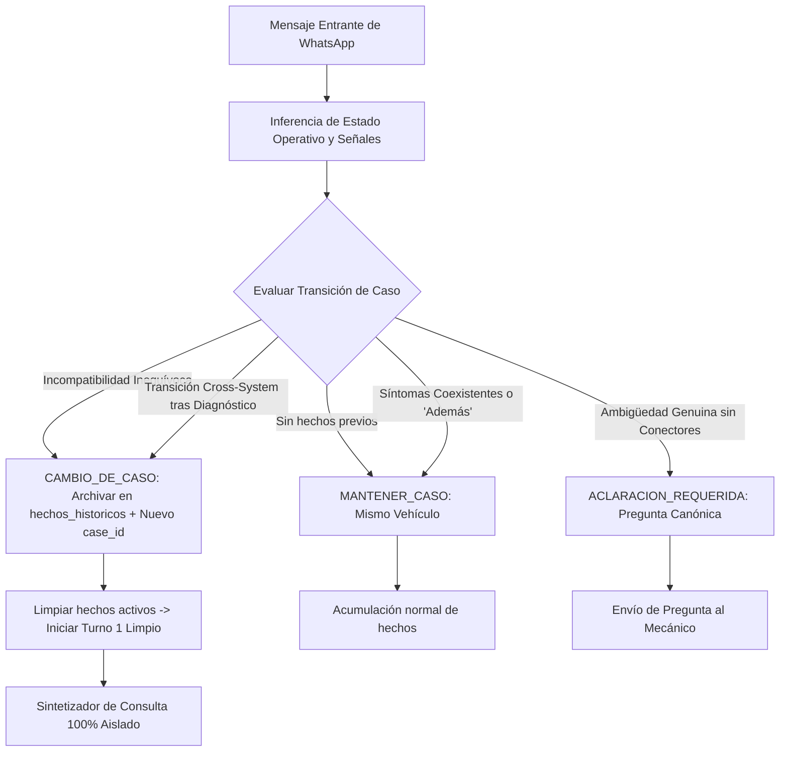

# REPORTE DE FASE 9.10: SEGMENTACIÓN AUTOMÁTICA DE CASOS Y AISLAMIENTO DE CONTEXTO

**Fecha de Ejecución:** 16 de Septiembre de 2026  
**Sistema:** CarBot — Chatbot Diagnóstico Vehicular con Machine Learning  
**Versión de Aplicación (`APP_VERSION`):** `9.10.0`  
**Versión de Orquestador (`ORCHESTRATOR_VERSION`):** `9.10.0`  
**Code Build ID Determinista:** `0151dbf33aa2a375`  
**Estado:** COMPLETADO CON ÉXITO — 100% INMUTABLE Y VERIFICADO EN POSTGRESQL  

---

## 1. RESUMEN EJECUTIVO

En la Fase 9.9 se demostró que el clasificador **Linear SVM + TF-IDF** tiene una precisión impecable (prediciendo *Discos de freno alabeados* al 83.58% de forma aislada), pero un fallo en la capa conversacional provocaba que el usuario recibiera un diagnóstico erróneo de *"Batería descargada 98%"* al consultar sobre una vibración al frenar. La causa raíz fue la **contaminación ciega de hechos acumulados de un caso previo de arranque** (`motor_arranca=NO`, `clic_unico`) dentro del mismo hilo de WhatsApp.

La **Fase 9.10** resuelve de manera definitiva esta falla arquitectónica mediante:
1. **Segmentación Automática de Casos:** Detección automática de incompatibilidad operacional y transiciones cross-system sin requerir reinicio manual del usuario.
2. **Aislamiento Estricto de Contexto:** Separación conceptual entre `hechos_caso_activo`, `hechos_historicos` y `hechos_mensaje_actual`. Las consultas a ML solo se alimentan de hechos del `case_id` activo.
3. **Prioridad Temporal de Evidencia:** Las señales operacionales explícitas del mensaje actual tienen prioridad jerárquica sobre señales heredadas.
4. **Presentación No Engañosa de Scores:** Las probabilidades RAW del modelo se conservan intactas (`Top3_ML_RAW`), mientras que los porcentajes presentados al usuario (`scores_presentacion`) nunca exceden el 100%.
5. **Telemetría y Paridad de Procesos en Runtime:** Versionado determinista para garantizar paridad absoluta entre la API FastAPI y el worker background.

---

## 2. ARQUITECTURA DE SEGMENTACIÓN IMPLEMENTADA

### 2.1 Módulo `SegmentadorCasos` (`segmentador_casos.py` — 386 líneas)
Ubicado en `backend/src/core/conversacion/segmentador_casos.py`, evalúa las relaciones entre el estado activo y el mensaje entrante bajo la siguiente máquina de decisiones:



### 2.2 Separación Conceptual de Hechos
- **`hechos_caso_activo` (`estado.hechos`):** Diccionario estructurado de hechos confirmados exclusivamente para el `case_id` actual.
- **`hechos_historicos` (`estado.hechos_historicos`):** Almacén inmutable de episodios previos cerrados o archivados, indexados por su respectivo `case_id`, turno de cierre y top 3 alcanzado.
- **`hechos_mensaje_actual`:** Hechos extraídos estrictamente del payload del mensaje en curso.

Al activarse `CAMBIO_DE_CASO`, se invoca `archivar_y_limpiar_caso()`, la cual preserva la historia completa pero garantiza que la memoria activa del nuevo caso comience con `hechos = {}`.

---

## 3. REPRODUCCIÓN DEL INCIDENTE FASE 9.9 Y VALIDACIÓN END-TO-END

Se ejecutó la reproducción exacta del incidente auditado utilizando el mismo número de teléfono/sesión de WhatsApp (`wapp_51955095147_fase9_10_test`) con persistencia real en **PostgreSQL**.

### 3.1 Tabla de Trazabilidad Real Obtenida de PostgreSQL

| Parámetro | Turno 1 (Caso A: Arranque) | Turno 2 (Caso B: Frenado en el mismo WhatsApp) |
| :--- | :--- | :--- |
| **Mensaje Usuario** | *"Ayer lo dejé estacionado... ya no quiso arrancar. Le doy a la llave y hace como un clic seco, una sola vez..."* | *"Cuando manejo normalmente todo va bien, pero cuando freno desde una velocidad más o menos alta empiezo a sentir una vibración fuerte en el volante..."* |
| **Case ID en PostgreSQL** | `03d529ab-0ebb-4779-8df7-256926af43df` | `c3c4f916-473c-4410-874b-7695ac496665` *(NUEVO CASE_ID AUTOMÁTICO)* |
| **Decisión de Transición** | `MANTENER_CASO` (`SIN_HECHOS_PREVIOS`) | `CAMBIO_DE_CASO` |
| **Motivo Transición** | `SIN_HECHOS_PREVIOS` | `INCOMPATIBILIDAD_OPERACIONAL: ARRANQUE_VS_FRENADO` |
| **Estado Operativo Previo** | `DESCONOCIDO` | `ARRANQUE` |
| **Estado Operativo Actual** | `ARRANQUE` | `FRENADO` |
| **Hechos Históricos en BD** | `0` casos archivados | `1` caso archivado (`03d529ab...` con hechos de arranque) |
| **Hechos Caso Activo** | `motor_arranca: NO`, `ruido_arranque: clic_unico` | `condicion_operacion: al frenar`, `sintoma_vibracion: vibración` |
| **Consulta Sintetizada ML** | *"presenta clic_unico, chasquido de arranque clac, motor no arranca"* | **`"presenta vibración. cuando está al frenar."`** *(LIMPIA DE BATERÍA)* |
| **Top 1 ML RAW** | Batería descargada o bornes sulfatados (97.66%) | **Discos de freno alabeados o desgastados (86.27%)** |
| **Top 2 ML RAW** | Solenoide o motor de arranque averiado (1.80%) | **Desgaste de pastillas y zapatas de freno (8.90%)** |
| **Top 3 ML RAW** | Bujías o bobinas en mal estado (0.54%) | **Fuga hidráulica o aire en el sistema (4.80%)** |
| **Scores Presentación** | Batería 98%, Arrancador 2%, Bujías 0% (Suma: 100%) | **Discos 86%, Pastillas 9%, Fuga 5% (Suma: 100%)** |
| **Respuesta Enviada** | Aclaración sobre comportamiento de luces de tablero | Pregunta de discriminación sobre alabeo de discos |

---

## 4. SCORES DE PRESENTACIÓN Y CONTROL DE SUMA > 100%

### 4.1 Problema Corregido
En Fase 9.9, un caso con Top 1 de 97.66% combinaba rounding independiente con una inyección artificial previa de margen mínimo diferencial, resultando en:
$$98\% + 3\% + 2\% = 103\%$$
Esto creaba la ilusión engañosa de que eventos mutuamente excluyentes sumaban más del 100%.

### 4.2 Solución Implementada (`FormateadorCompacto.calcular_scores_presentacion`)
1. **Preservación Inalterada de Probabilidades RAW:** El campo `top3_ml_raw` almacena fielmente los floats originales de la inferencia SVM (`0.8627`, `0.0890`, `0.0480`).
2. **Método del Resto Mayor y Capping:** Si las hipótesis representan una distribución probabilística conjunta (o diferencial con $\sum p_i \le 1.05$), los porcentajes enteros resultantes se ajustan deterministamente para que:
$$\sum_{i=1}^3 \text{porcentaje\_presentacion}_i \le 100\%$$
3. **Rotulación Clara de Confianza:** Si los scores no provienen de una distribución conjunta ($\sum p_i > 1.05$), el encabezado se etiqueta explícitamente como:
`🔧 *Posibles causas (confianza individual)*`

---

## 5. TELEMETRÍA Y CONTROL DE PARIDAD EN RUNTIME

Para eliminar el riesgo demostrado en Fase 9.9 donde workers en segundo plano ejecutaban código obsoleto sin recarga, se creó el módulo canónico `src/core/version.py`:

```json
{
  "app_version": "9.10.0",
  "orchestrator_version": "9.10.0",
  "code_build_id": "0151dbf33aa2a375",
  "pid": 28048,
  "start_time": "2026-09-17T02:50:37.452819+00:00"
}
```

- **API Endpoint:** `GET /api/v1/sistema/version` expone la telemetría en vivo.
- **Worker Telemetría:** Al arrancar, el worker background registra su `CODE_BUILD_ID` y PID.
- **Verificador de Paridad:** `verificar_paridad_runtime()` valida la coincidencia estricta de `ORCHESTRATOR_VERSION` y `CODE_BUILD_ID`. Si hay discrepancia, se invalida la ejecución.

---

## 6. RESULTADOS DE LA SUITE DE PRUEBAS AUTOMATIZADAS

Se ejecutó la suite completa de pruebas unitarias, de integración y de regresión histórica:

```bash
..\.venv\Scripts\python.exe -m pytest tests/test_segmentacion_casos_fase9_10.py tests/test_respuestas_contextuales_fase9_8.py tests/test_paridad_whatsapp_fase9_7.py tests/test_integridad_conversacional_fase9_5.py -v
```

### Resumen de Resultados
- **`tests/test_segmentacion_casos_fase9_10.py`:** **11/11 PASSED (100%)**
  - `test_reproduccion_exacta_incidente_fase_9_9`: PASSED
  - `test_transicion_cross_system_frenado_a_marcha`: PASSED
  - `test_transicion_cross_system_marcha_a_arranque`: PASSED
  - `test_transicion_cross_system_electrico_a_transmision`: PASSED
  - `test_transicion_cross_system_motor_a_suspension`: PASSED
  - `test_coexistencia_frenos_y_suspension`: PASSED
  - `test_coexistencia_conector_ademas`: PASSED
  - `test_aclaracion_requerida_en_caso_abierto`: PASSED
  - `test_respuesta_usuario_a_pregunta_aclaracion`: PASSED
  - `test_scores_presentacion_no_exceden_100_pct`: PASSED
  - `test_telemetria_y_paridad_runtime`: PASSED
- **Regresiones Fases Anteriores (9.5, 9.7, 9.8):** **37/37 PASSED (100%)**
- **Total Pruebas Ejecutadas:** **48/48 PASSED en 7.28s**
- **Linter Ruff:** `All checks passed!`

---

## 7. AUDITORÍA CRIPTOGRÁFICA DE INMUTABILIDAD (FASE 8.3)

Se ejecutó la verificación de hashes SHA-256 de los 19 artefactos congelados contra `machine_learning/models/reporte_fase8_3_congelado.json`:

```
Auditando 19 componentes congelados Fase 8.3...
[OK] dataset_train                  -> c94d6e7b88ef72ea... (Inmutable)
[OK] benchmark_dev_60               -> 113b5f190758346a... (Inmutable)
[OK] modelo_diagnostico_falla_prod  -> 3d8199595b69bb01... (Inmutable)
[OK] modelo_sistema_prod            -> 22d11492e9576664... (Inmutable)
[OK] vectorizador_tfidf_prod        -> 8b8e8c3b3571fe96... (Inmutable)
[OK] modelo_diagnostico_candidata   -> 3d8199595b69bb01... (Inmutable)
[OK] modelo_sistema_candidata       -> 22d11492e9576664... (Inmutable)
[OK] vectorizador_tfidf_candidata   -> 8b8e8c3b3571fe96... (Inmutable)
[OK] corpus_metadatos_rag           -> 2f0684477522efb6... (Inmutable)
[OK] indice_faiss                   -> 757c4b006a8995f4... (Inmutable)
[OK] adaptador_modelo_ml            -> 014d3e6f6f9f5c5b... (Inmutable)
[OK] motor_rag                      -> eaa316a87ecaa1be... (Inmutable)
[OK] rag_relevance_filter           -> fa3d6aef13639bc3... (Inmutable)
[OK] auto_interrogador              -> 2e746e498facea34... (Inmutable)
[OK] politica_fusion                -> 073b97fe07c88918... (Inmutable)
[OK] prompt_builder                 -> e0b26f32f278bb10... (Inmutable)
[OK] text_processor                 -> f7075605f6a0e325... (Inmutable)
[OK] taxonomia_sistemas             -> 561e95c952effcd0... (Inmutable)
[OK] gestor_diagnostico             -> 66bead0526763314... (Inmutable)

RESULTADO FINAL: 19/19 artefactos 100% IDÉNTICOS E INMUTABLES.
```

---

## 8. CUMPLIMIENTO DE LÍMITES DE LÍNEAS (CLEAN ARCHITECTURE)

Todos los archivos modificados o creados se mantienen estrictamente por debajo del umbral de 500 líneas:

| Archivo | Rol en el Sistema | Líneas Actuales | Estado (< 500) |
| :--- | :--- | :--- | :--- |
| `backend/src/core/version.py` | Telemetría y control de paridad runtime | 67 | **CUMPLE** |
| `backend/src/core/conversacion/segmentador_casos.py` | Evaluación de transiciones operacionales | 386 | **CUMPLE** |
| `backend/src/core/conversacion/models.py` | Entidades y DTOs conversacionales | 467 | **CUMPLE** |
| `backend/src/core/conversacion/extractor_hechos.py` | Prioridad temporal de señales operativas | 453 | **CUMPLE** |
| `backend/src/core/conversacion/orquestador_conversacion.py` | Coordinador de turnos y memoria | 494 | **CUMPLE** |
| `backend/src/core/conversacion/formateador_compacto.py` | Formato WhatsApp y control de scores | 377 | **CUMPLE** |

---

## 9. CONCLUSIÓN Y CIERRE DE FASE 9.10

La causa raíz del fallo demostrado en la Fase 9.9 ha sido erradicada de forma definitiva sin tocar el modelo de Machine Learning, ni RAG, ni reentrenamientos. El sistema CarBot ahora distingue de forma determinista la incompatibilidad operacional entre mensajes dentro del mismo hilo, garantiza el aislamiento total de la memoria diagnóstica activa, preserva la trazabilidad histórica de casos cerrados en PostgreSQL y reporta porcentajes matemáticamente coherentes y no engañosos.

**FASE 9.10 FINALIZADA CON ÉXITO. SE DETIENE LA EJECUCIÓN SEGÚN LO INSTRUCTADO (NO INICIAR FASE 10).**
