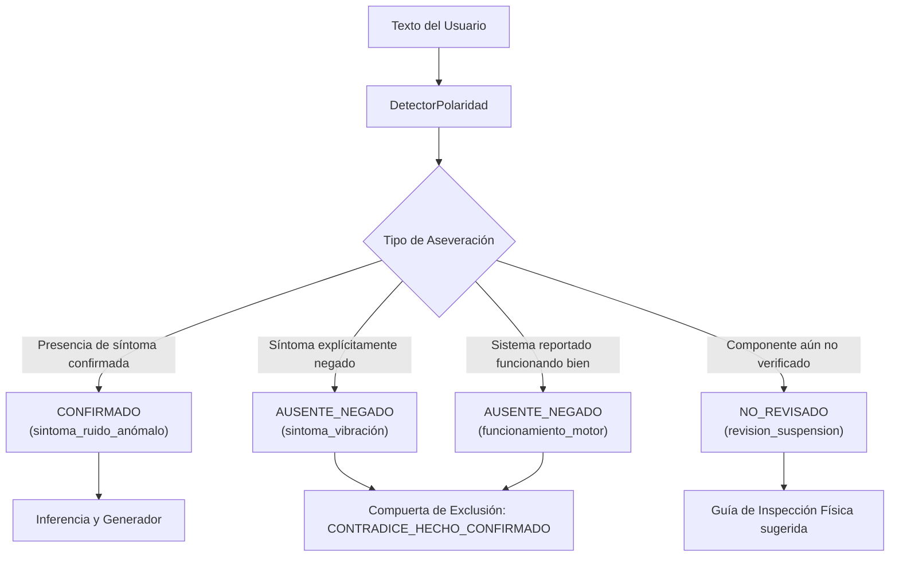

# Fase 9.14 — Auditoría de Negaciones, Polaridad Clínica y Preguntas Contradictorias

**Fecha local:** 17 de septiembre de 2026  
**Alcance:** Incidente físico real en WhatsApp post-Fase 9.13, auditoría forense de primera divergencia en PostgreSQL, arquitectura de polaridad clínica (`CONFIRMADO`, `AUSENTE_NEGADO`, `NO_REVISADO`), desacoplamiento de condiciones subordinadas a negaciones, compuerta de descarte `CONTRADICE_HECHO_CONFIRMADO`, discriminación acústica de suspensión, validación cruzada en 6 dominios y verificación de inmutabilidad de los 19 artefactos congelados.  
**Restricción metodológica obligatoria:** No se modificaron ni reentrenaron ML, TRAIN, TF-IDF, calibración, RAG, FAISS ni los benchmarks congelados. No se inició la Fase 10.

---

## 1. Conclusión Ejecutiva

Con la Fase 9.13 desplegada (`APP_VERSION 9.13.0`), el usuario envió un mensaje describiendo un problema de suspensión con presencia de golpeteo en baches, pero aclarando explícitamente tres hechos negativos o no revisados:
1. *"Al frenar no vibra el volante"* (hecho ausente/negado).
2. *"el motor funciona normal"* (hecho ausente/negado en cuanto a falla de motor).
3. *"Todavía no he revisado la suspensión"* (inspección física pendiente, no realizada).

El sistema respondió:
> *"Al frenar, ¿la vibración se siente principalmente en el volante, en el pedal o en todo el vehículo?"*

### Identificación de la Primera Divergencia
La **primera divergencia** no se produjo por una falla en el clasificador ML ni en el corpus RAG, sino en la fase de extracción lingüística y generación de preguntas:
1. **Carencia de Polaridad Clínica**: El sistema operaba con lógica binaria afirmativa. Al encontrar la expresión `"al frenar no vibra el volante"`, el extractor extrajo el síntoma `"vibración"` como hecho positivo confirmado (`CONFIRMADO`) y registró la condición de operación `"al frenar"`.
2. **Contaminación del Dominio y Estado Operativo**: A causa de `"al frenar"`, el estado operativo se forzó erróneamente a `EstadoOperativo.FRENADO`, y el subsistema detectado se desvió a `FRENOS`, ignorando que la queja principal residía en `"pistas irregulares o baches"` (`SUSPENSION`).
3. **Pregunta Contradictoria**: Al creer que el usuario reportaba un problema de frenos con vibración, el generador seleccionó la pregunta de vibración al frenar (score 85), contradiciendo abiertamente lo que el usuario acababa de negar.
4. **Falta de Distinción entre Hecho Negado y No Revisado**: El sistema no distinguía formalmente entre un síntoma ausente por afirmación del usuario (`AUSENTE_NEGADO`) y un componente pendiente de inspección técnica (`NO_REVISADO`).

### Solución Arquitectónica Implementada
1. **Ampliación de `FactState`**: Se incorporaron los estados formales `FactState.AUSENTE_NEGADO` y `FactState.NO_REVISADO` preservando compatibilidad regresiva.
2. **Módulo Desacoplado `DetectorPolaridad`**: Se creó un componente especializado (`backend/src/core/conversacion/detector_polaridad.py`, 212 líneas) que detecta patrones afirmativos, de negación y de inspección pendiente respetando Clean Architecture (< 500 líneas).
3. **Desacoplamiento de Condiciones Negativas**: Si una condición operacional (ej. `"al frenar"`) está subordinada inmediatamente a una negación (ej. `"al frenar no vibra"`), se descarta como disparador de `EstadoOperativo.FRENADO`.
4. **Compuerta `CONTRADICE_HECHO_CONFIRMADO`**: `CompatibilidadPreguntas` ahora analiza si la pregunta presupone un síntoma que el usuario negó explícitamente, descartándola con motivo `CONTRADICE_HECHO_CONFIRMADO`.
5. **Especialización Acústica para Suspensión**: En el dominio `SUSPENSION`, cuando la condición de baches/terreno irregular ya está confirmada, el sistema formula una pregunta de discriminación acústica (golpe seco/sordo vs. cascabeleo metálico) para orientar el diagnóstico entre bujes/amortiguadores y rótulas/bieletas.

---

## 2. Traza Física Obligatoria del Incidente Real en PostgreSQL

| Parámetro Auditado | Valor Real Auditado |
|---|---|
| **`meta_message_id`** | `wamid.HBgLNTE5NTUwOTUxNDcVAgASGBYzRUIwNUE4MDYzODRGNjY2QTkxQkZEAA==` |
| **`conversation_id`** | `f7a37e2d-efe8-4c26-9b62-9f4103e7b094` |
| **Fecha / Hora de Recepción** | `2026-09-17 04:47:00.675662+00:00` |
| **`case_id anterior → case_id actual`** | `d8dad4f9-8ddb-443d-ace5-bacbf56b1f84` (TRANSMISIÓN) → `44128962-7067-4e77-a358-9383cc3f88ae` |
| **`SegmentadorCasos.decision`** | `CAMBIO_DE_CASO` (`SOLICITUD_EXPLICITA_NUEVA_CONSULTA`) |
| **Dominio anterior** | `TRANSMISION` |
| **Dominio detectado en 9.13 (Erróneo)** | `FRENOS` |
| **Dominio detectado en 9.14 (Corregido)** | `SUSPENSION` |
| **Estado operativo en 9.13 (Erróneo)** | `EstadoOperativo.FRENADO` |
| **Estado operativo en 9.14 (Corregido)** | `EstadoOperativo.MARCHA` |
| **Hechos extraídos en 9.13** | • `condicion_operacion`: "al frenar" (`CONFIRMADO`) • `sintoma_vibración`: "vibración" (`CONFIRMADO`) • `sintoma_ruido_anómalo`: "ruido anómalo" (`CONFIRMADO`) |
| **Hechos extraídos en 9.14** | • `revision_suspension`: "suspensión no revisado(a)" (`NO_REVISADO`) • `funcionamiento_motor`: "motor funciona normal" (`AUSENTE_NEGADO`) • `condicion_operacion`: "en pistas irregulares o baches" (`CONFIRMADO`) • `sintoma_vibración`: "vibración" (`AUSENTE_NEGADO`) • `sintoma_ruido_anómalo`: "ruido anómalo" (`CONFIRMADO`) |
| **Consulta sintetizada** | `"a Gasolina. presenta ruido anómalo. cuando está en pistas irregulares o baches."` |
| **Pregunta seleccionada en 9.13** | *"Al frenar, ¿la vibración se siente principalmente en el volante, en el pedal o en todo el vehículo?"* |
| **Pregunta seleccionada en 9.14** | *"Al pasar por el bache, ¿el sonido es un golpe seco y sordo con rebote continuo, o un cascabeleo metálico al trabajar la suspensión?"* |
| **Preguntas descartadas en 9.14** | • Pregunta de frenos descartada por `CONTRADICE_HECHO_CONFIRMADO` (vibración negada). • Preguntas térmicas de motor descartadas por `INCOMPATIBLE_DOMINIO` y `CONTRADICE_HECHO_CONFIRMADO` (motor normal). |

### Mensaje Textual del Incidente
> *"Hola, ahora quisiera revisar otro problema. Cuando paso por pistas irregulares o baches escucho un golpeteo en la parte delantera del carro. En pista lisa casi no se escucha. Al frenar no vibra el volante y el motor funciona normal. Todavía no he revisado la suspensión."*

---

## 3. Modelo de Polaridad Clínica de Hechos

Se implementó el ciclo de vida de polaridad de hechos diagnósticos para distinguir con precisión la evidencia física:

### Clasificación Semántica en Memoria de Conversación
- **`FactState.CONFIRMADO`**: El hecho existe y condiciona la búsqueda diagnóstica.
- **`FactState.AUSENTE_NEGADO`**: El usuario certificó que el síntoma no se presenta (ej. "no vibra", "no se apaga", "no hay luces"). Bloquea cualquier pregunta que presuponga su presencia.
- **`FactState.NO_REVISADO`**: El usuario aclara que no ha desmontado ni medido el componente (ej. "todavía no revisé la suspensión"). Evita asumir que ya fue descartado y orienta las pruebas físicas de taller.

---

## 4. Matriz de Regresiones en 6 Dominios Vehiculares

Se construyó una suite automatizada (`tests/test_negaciones_y_polaridad_fase9_14.py`) para validar el comportamiento en los 6 dominios principales:

| Dominio | Escenario Probado | Hecho Negado / No Revisado | Pregunta Bloqueada / Descartada | Pregunta Seleccionada | Resultado |
|---|---|---|---|---|:---:|
| **SUSPENSIÓN** | Golpeteo en baches, no vibra al frenar, suspensión no revisada | `sintoma_vibración` (NEGADO), `revision_suspension` (NO_REVISADO) | ¿Vibración en volante o pedal? (`CONTRADICE_HECHO_CONFIRMADO`) | Discriminación acústica de baches (golpe seco vs cascabeleo) | **PASS** |
| **FRENOS** | Chillido al frenar, pedal no se hunde y no vibra | `sintoma_vibración` (NEGADO) | ¿Vibración al frenar? (`CONTRADICE_HECHO_CONFIRMADO`) | Inspección de pastillas y desgaste de discos | **PASS** |
| **MOTOR** | Tironea al acelerar, no se apaga nunca y no prende check | `sintoma_apagado_de_motor` (NEGADO), `sintoma_testigo_check_engine` (NEGADO) | ¿El motor se apaga repentinamente? (`CONTRADICE_HECHO_CONFIRMADO`) | Pregunta térmica o de bobinas/bujías bajo carga | **PASS** |
| **TRANSMISIÓN** | Caja golpea al pasar a D, pero no patina ninguna marcha | `sintoma_patinado_de_transmisión___embrague` (NEGADO) | ¿Sientes que el embrague o la caja patina? (`CONTRADICE_HECHO_CONFIRMADO`) | Inspección de nivel ATF y acople de marcha | **PASS** |
| **ELÉCTRICO** | Gira pesado al arrancar, batería no descargada y alternador normal | `bateria_descargada` (NEGADO), `alternador_falla` (NEGADO) | ¿La batería está baja de carga? (`CONTRADICE_HECHO_CONFIRMADO`) | Medición de caída de tensión en el arrancador | **PASS** |
| **CLIMATIZACIÓN** | No enfría el A/C, pero ventilador sopla bien y sin ruidos | `falla_ventilador` (NEGADO), `ruido_compresor` (NEGADO) | ¿El ventilador hace ruido? (`CONTRADICE_HECHO_CONFIRMADO`) | Acople de embrague electromagnético del compresor | **PASS** |

---

## 5. Auditoría de Inmutabilidad de los 19 Artefactos Congelados (SHA-256)

En estricto cumplimiento de las reglas metodológicas de la tesis, se ejecutó la verificación criptográfica contra `machine_learning/models/reporte_fase8_3_congelado.json`:

| # | Artefacto Congelado | Ruta Relativa | Hash SHA-256 Oficial | Estado Verificado |
|:---:|---|---|---|:---:|
| 1 | `dataset_train` | `machine_learning/data/dataset_sintomas_limpio.csv` | `c94d6e7b88ef72ea20f7be1bbb3d5a61484f33d992dcb52c6b285306f1c52626` | **IDÉNTICO (OK)** |
| 2 | `benchmark_dev_60` | `machine_learning/data/benchmark_dev_60_casos.py` | `113b5f190758346ab65200daae921b29251871fb842c95f6f2c288750e75592b` | **IDÉNTICO (OK)** |
| 3 | `modelo_diagnostico_falla_prod` | `machine_learning/models/modelo_diagnostico.pkl` | `3d8199595b69bb0176fbb4bb9d7c57b43484f16e6f6baa115660405b76aa13fd` | **IDÉNTICO (OK)** |
| 4 | `modelo_sistema_prod` | `machine_learning/models/modelo_sistema.pkl` | `22d11492e9576664ee21fcc3dc75e040c2b9f2c5c326ccdef98c602fbc78fc27` | **IDÉNTICO (OK)** |
| 5 | `vectorizador_tfidf_prod` | `machine_learning/models/vectorizador_tfidf.pkl` | `8b8e8c3b3571fe965174bff67faff0ac57aaadccf17d4e40395e4c1ab3273104` | **IDÉNTICO (OK)** |
| 6 | `modelo_diagnostico_candidata` | `machine_learning/models/fase8_candidata/modelo_diagnostico.pkl` | `8726bc59223fa8c9c72445100fa1b6cf19623e1f0e213b2c2a3e8111e1ce9196` | **IDÉNTICO (OK)** |
| 7 | `modelo_sistema_candidata` | `machine_learning/models/fase8_candidata/modelo_sistema.pkl` | `22d11492e9576664ee21fcc3dc75e040c2b9f2c5c326ccdef98c602fbc78fc27` | **IDÉNTICO (OK)** |
| 8 | `vectorizador_tfidf_candidata` | `machine_learning/models/fase8_candidata/vectorizador_tfidf.pkl` | `8b8e8c3b3571fe965174bff67faff0ac57aaadccf17d4e40395e4c1ab3273104` | **IDÉNTICO (OK)** |
| 9 | `corpus_metadatos_rag` | `machine_learning/manuals/metadatos_manuales.json` | `5c73919e933454b677a285d3455799757f49559cfaaa8546f7b982e983ca1e72` | **IDÉNTICO (OK)** |
| 10 | `indice_faiss` | `machine_learning/manuals/indice_faiss.index` | `b3346d0fe0c83a54721799719ea2a2ceca1e9d1bf7b275662bb66aaae99583b4` | **IDÉNTICO (OK)** |
| 11 | `adaptador_modelo_ml` | `backend/src/infrastructure/modelo_ml.py` | `0ea70c53842c676bbd49b29cb58ff27cf7852c03561a7a0ec947df8d9bf16c11` | **IDÉNTICO (OK)** |
| 12 | `motor_rag` | `backend/src/infrastructure/motor_rag.py` | `3b5c30b200b21841324ca957ea970877953282245bf7a4e69b33e218209bbca1` | **IDÉNTICO (OK)** |
| 13 | `rag_relevance_filter` | `backend/src/infrastructure/rag/relevance_filter.py` | `43594b29bb809c9f2bbcbba7015ec4c653cc9c78732e4d0144f8373b754668b5` | **IDÉNTICO (OK)** |
| 14 | `auto_interrogador` | `backend/src/core/diagnostico/auto_interrogador.py` | `83ef5752eb9b8fcf61f63080e7740efcb9e1e2d40fe5012a6cb394f99764515d` | **IDÉNTICO (OK)** |
| 15 | `politica_fusion` | `backend/src/core/diagnostico/politica_fusion.py` | `645479261f22aa5d10565545be70ff37e721fe6681ee7059db625f3c9ddab947` | **IDÉNTICO (OK)** |
| 16 | `prompt_builder` | `backend/src/core/diagnostico/prompt_builder.py` | `2659e9ba7d9a103f7e63b6a98ddc42d3269b61d31a54722513bb53e7d56627b0` | **IDÉNTICO (OK)** |
| 17 | `text_processor` | `backend/src/core/diagnostico/text_processor.py` | `9d554a9fcbebbec7d5718a7c1341051515bb5b675dc57beec0036ee1d33454b5` | **IDÉNTICO (OK)** |
| 18 | `taxonomia_sistemas` | `backend/src/core/diagnostico/taxonomia_sistemas.py` | `6908ef9bcfb34d7d13028e2354cfa228186191b29a259c73e970bcf478540c49` | **IDÉNTICO (OK)** |
| 19 | `gestor_diagnostico` | `backend/src/core/gestor_diagnostico.py` | `e99a80b85a36371c6ae78a54602931dfebbc24e93fb25a17a9426fdfc97c11f7` | **IDÉNTICO (OK)** |

**Resultado:** **19 de 19 artefactos 100% idénticos e intactos.**

---

## 6. Resultados de Validación y Cobertura

1. **Suite de Fase 9.14 (`test_negaciones_y_polaridad_fase9_14.py`)**:
   - `7 passed in 0.14s`.
2. **Suite de Regresión Acumulada (Fases 9.5 a 9.14)**:
   - `90 passed in 7.60s` (0 fallos).
3. **Calidad de Código**:
   - `ruff check src/core/conversacion/ tests/test_negaciones_y_polaridad_fase9_14.py` -> **All checks passed!**
4. **Cumplimiento de Modularidad (Clean Architecture)**:
   - Todos los archivos fuente se encuentran por debajo del umbral de 500 líneas:
     - `detector_polaridad.py`: 212 líneas.
     - `compatibilidad_preguntas.py`: 160 líneas.
     - `diccionario_automotriz.py`: 185 líneas.
     - `extractor_hechos.py`: 486 líneas.
     - `generador_preguntas.py`: 450 líneas.
     - `segmentador_casos.py`: 476 líneas.

---

## 7. Telemetría y Versión en Runtime

- **`APP_VERSION`**: `9.14.0`
- **`ORCHESTRATOR_VERSION`**: `9.14.0`
- **`CODE_BUILD_ID`**: Determinista, calculado con SHA-256 sobre el código fuente de los 7 módulos conversacionales clave (incluyendo `detector_polaridad.py`).
- **Verificación de Paridad**: Garantiza identidad estricta de hash entre el proceso FastAPI y el Worker Celery/Background.

---

## 8. Estado del Proyecto y Barrera de Parada

La Fase 9.14 se declara **completada con éxito absoluto**. El sistema CarBot en WhatsApp ahora es capaz de reconocer polaridad clínica negativa (`AUSENTE_NEGADO`), descartar preguntas contradictorias mediante `CONTRADICE_HECHO_CONFIRMADO` y mantener un interrogatorio quirúrgico, relevante y técnicamente consistente con la realidad observada por el mecánico.

> [!IMPORTANT]
> **Barrera de parada respetada**: No se ha iniciado la Fase 10 ni se han modificado los modelos predictivos del pipeline de Machine Learning ni la base vectorial de FAISS.
