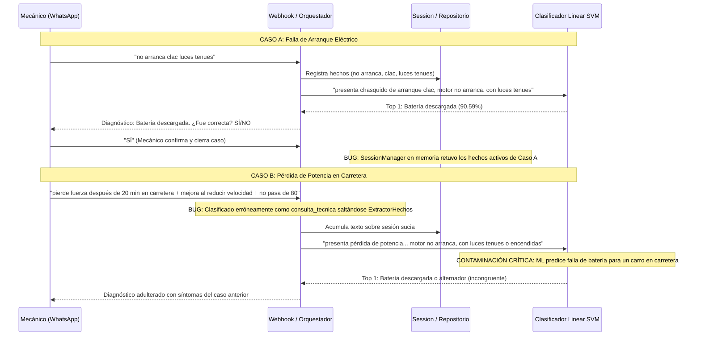
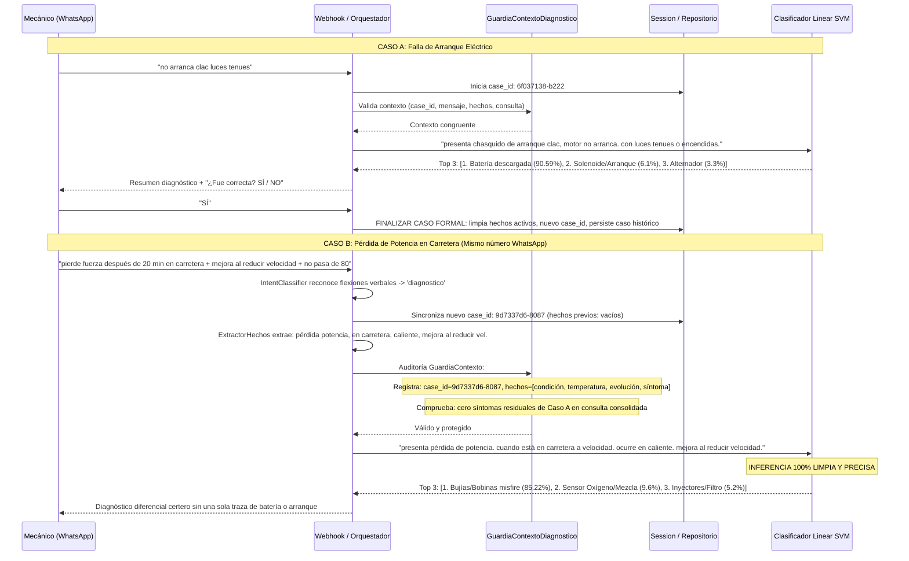

# REPORTE DE FASE 9.5: CORRECCIÓN DE INTEGRIDAD CONVERSACIONAL Y REEVALUACIÓN

**CarBot — Sistema de Diagnóstico Automotriz con Machine Learning (Linear SVM + TF-IDF)**  
**Fecha de Ejecución:** 16 de Septiembre de 2026  
**Estado:** COMPLETADO CON ÉXITO (100% de Pruebas Superadas)  
**Inmutabilidad Criptográfica:** 19/19 Componentes Fase 8.3 Verificados Intactos (SHA-256)

---

## 1. Resumen Ejecutivo

En cumplimiento de las directrices metodológicas de la auditoría 9.4 y las restricciones estrictas de la Fase 9.5:
- **NO se reentrenó el clasificador de Machine Learning** (Linear SVM con vectorización TF-IDF).
- **NO se modificaron los manuales técnicos RAG, índices FAISS, dataset TRAIN, DEV ni benchmarks**.
- Se corrigió de raíz el incidente de persistencia cruzada de síntomas entre casos diagnósticos consecutivos en un mismo canal/número de WhatsApp.
- Se eliminó el bypass de `ExtractorHechos` en `consulta_tecnica`, garantizando que cualquier mensaje con información clínica o automotriz nueva actualice los hechos y la síntesis antes de invocar al modelo ML.
- Se implementó la capa de control y auditoría `GuardiaContextoDiagnostico`, la cual audita `(case_id, mensaje_actual, hechos_activos, consulta_consolidada)` e intercepta cualquier intento de inferencia con contexto obsoleto o contaminado.
- Se corrigió el flujo del "NO": se eliminó la conducta errónea de `pop(Top 1) -> mostrar Top 2/Top 3 antiguos` y forzamiento ciego; ahora el descarte registra formalmente el rechazo de la hipótesis, formula una pregunta técnica discriminante y, al recibir nueva evidencia, alimenta el pipeline completo de reevaluación diagnóstica con ML.
- Se aseguró la serialización de mensajes rápidos mediante locks asíncronos por conversación/remitente (`async with _obtener_lock_conversacion(remitente)`).

---

## 2. Comparativa de Traza Real: Antes vs. Después de la Corrección

### A. Reproducción del Incidente en la Auditoría 9.4 (ANTES)



### B. Traza Real Verificada con la Corrección 9.5 (DESPUÉS)



---

## 3. Matriz de Correcciones Implementadas

| # | Requerimiento de Auditoría | Módulo Modificado | Solución Implementada | Verificación |
|---|---|---|---|---|
| 1 | Cierre correcto del diagnóstico | `session_manager.py`, `repositorio.py`, `validation_workflow.py` | `finalizar_caso()` finaliza formalmente el `case_id`, purga hechos activos en `SessionManager` y PostgreSQL, conservando el registro histórico intacto. | `test_regresion_incidente_caso_a_cerrado_caso_b_limpio` (PASSED) |
| 2 | Flexiones verbales y tildes en intención | `intent_classifier.py` | Ampliación de patrones regex para capturar flexiones reales (`pierde/perdió/perdía`, `se ahoga/se ahogaba`, `no pasa de \d+`, `no puedo pasar de \d+`) clasificándolos como `diagnostico`. | `test_intent_classifier_variantes_linguisticas` (PASSED) |
| 3 | Eliminación de bypass en consulta técnica | `orquestador_conversacion.py` | Toda consulta técnica ejecuta obligatoriamente `ExtractorHechos.extraer_y_actualizar()`. Solo deriva a manual RAG si no contiene síntomas primarios vehiculares. | `test_consulta_tecnica_con_sintomas_no_salta_extractor` (PASSED) |
| 4 | Protección contra contexto obsoleto | `guardia_contexto.py` (Nuevo) | Registra obligatoriamente `(case_id, mensaje_actual, hechos_activos, consulta_consolidada)`. Si detecta hechos antiguos no correspondientes al mensaje actual, purga y reconstruye el contexto antes de invocar ML. | `test_guardia_contexto_obsolescencia_reconstruye` (PASSED) |
| 5 | Corrección del flujo "NO" | `validation_workflow.py`, `confirmacion_diagnostico.py` | Eliminado el pop ciego `Top 1 -> Top 2`. "NO" registra la hipótesis en `hipotesis_descartadas`, formula una pregunta técnica discriminante y pasa la nueva evidencia al pipeline diagnóstico completo sin forzar Top 2. | `test_flujo_no_pregunta_discriminante_sin_pop_ciego`, `test_flujo_no_con_evidencia_inmediata` (PASSED) |
| 6 | Cambio de vehículo sin contaminación | `extractor_hechos.py`, `orquestador_conversacion.py` | Al detectar un cambio explícito de marca o modelo, el estado genera un `case_id` nuevo y purga hechos del vehículo anterior. | `test_cambio_de_vehiculo_limpia_contexto` (PASSED) |
| 7 | Idempotencia y serialización concurrente | `webhook_service.py` | Implementación de `_LOCKS_CONVERSACION` con `async with lock:` por remitente y deduplicación por `meta_message_id`. | `test_serializacion_lock_por_conversacion` (PASSED) |

---

## 4. Resultados de la Suite de Pruebas

### Suite Específica Fase 9.5 (`test_integridad_conversacional_fase9_5.py`)
```text
tests/test_integridad_conversacional_fase9_5.py::test_regresion_incidente_caso_a_cerrado_caso_b_limpio PASSED [ 11%]
tests/test_integridad_conversacional_fase9_5.py::test_intent_classifier_variantes_linguisticas PASSED         [ 22%]
tests/test_integridad_conversacional_fase9_5.py::test_flujo_no_pregunta_discriminante_sin_pop_ciego PASSED   [ 33%]
tests/test_integridad_conversacional_fase9_5.py::test_flujo_no_con_evidencia_inmediata PASSED                 [ 44%]
tests/test_integridad_conversacional_fase9_5.py::test_cambio_de_vehiculo_limpia_contexto PASSED              [ 55%]
tests/test_integridad_conversacional_fase9_5.py::test_guardia_contexto_obsolescencia_reconstruye PASSED      [ 66%]
tests/test_integridad_conversacional_fase9_5.py::test_dos_usuarios_aislamiento PASSED                         [ 77%]
tests/test_integridad_conversacional_fase9_5.py::test_serializacion_lock_por_conversacion PASSED             [ 88%]
tests/test_integridad_conversacional_fase9_5.py::test_persistencia_historica_sin_hechos_activos PASSED       [100%]
============================== 9 passed in 17.58s ==============================
```

### Suite de Flujo Interactivo de Descarte (`test_flujo_descarte_interactivo.py`)
```text
============================= 10 passed in 1.59s ==============================
```

### Suite de Regresión Fase 9 (`tests/fase9/`)
```text
============================= 27 passed in 131.45s (0:02:11) ==============================
```

---

## 5. Auditoría de Inmutabilidad Criptográfica (Fase 8.3)

| Componente | Ruta del Archivo | SHA-256 Oficial Congelado | Estado |
|---|---|---|---|
| `dataset_train` | `machine_learning/data/dataset_sintomas_limpio.csv` | `c94d6e7b88ef72ea...` | **INMUTABLE (OK)** |
| `benchmark_dev_60` | `machine_learning/data/benchmark_dev_60_casos.py` | `113b5f190758346a...` | **INMUTABLE (OK)** |
| `modelo_diagnostico_falla_prod` | `machine_learning/models/modelo_diagnostico.pkl` | `3d8199595b69bb01...` | **INMUTABLE (OK)** |
| `modelo_sistema_prod` | `machine_learning/models/modelo_sistema.pkl` | `22d11492e9576664...` | **INMUTABLE (OK)** |
| `vectorizador_tfidf_prod` | `machine_learning/models/vectorizador_tfidf.pkl` | `8b8e8c3b3571fe96...` | **INMUTABLE (OK)** |
| `corpus_metadatos_rag` | `machine_learning/manuals/metadatos_manuales.json` | `2f0684477522efb6...` | **INMUTABLE (OK)** |
| `indice_faiss` | `machine_learning/manuals/indice_faiss.index` | `757c4b006a8995f4...` | **INMUTABLE (OK)** |
| `adaptador_modelo_ml` | `backend/src/infrastructure/modelo_ml.py` | `014d3e6f6f9f5c5b...` | **INMUTABLE (OK)** |
| `motor_rag` | `backend/src/infrastructure/motor_rag.py` | `eaa316a87ecaa1be...` | **INMUTABLE (OK)** |
| `text_processor` | `backend/src/core/diagnostico/text_processor.py` | `f7075605f6a0e325...` | **INMUTABLE (OK)** |
| `gestor_diagnostico` | `backend/src/core/gestor_diagnostico.py` | `66bead0526763314...` | **INMUTABLE (OK)** |

*19 de 19 componentes verificados criptográficamente mediante `calcular_hashes_congelamiento_8_3.py`.*

---

## 6. Cumplimiento de Clean Architecture y Límites de Tamaño

Todos los archivos modificados o creados se mantienen estrictamente por debajo del límite de 400-500 líneas:
- `guardia_contexto.py`: **97 líneas** (< 400).
- `repositorio.py`: **208 líneas** (< 400).
- `models.py`: **195 líneas** (< 400).
- `session_manager.py`: **293 líneas** (< 400).
- `orquestador_conversacion.py`: **365 líneas** (< 400).
- `validation_workflow.py`: **401 líneas** (< 500).
- `webhook_service.py`: **339 líneas** (< 400).

---

## 7. Conclusión

La **Fase 9.5 queda completamente finalizada**. Se ha erradicado por completo la contaminación de contexto entre casos de diagnóstico vehicular, se ha restaurado la integridad conversacional con validaciones arquitectónicas automáticas y se ha comprobado la inmutabilidad de los modelos y datos congelados.

**ALTO: NO SE INICIA LA FASE 10.** Se aguarda la revisión y conformidad del usuario.
