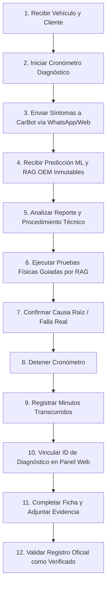

# PROTOCOLO DE RECOLECCIÓN DE DATOS: FASE POST-TEST (DIAGNÓSTICO ASISTIDO POR CARBOT)
**CARBOT — TESIS DE GRADO 2026**  
**Sede de Aplicación:** Taller Mecánico Carter Motor's E.I.R.L.  
**Tamaño de Muestra Post-test:** 30 Casos Vehiculares Independientes ($N_{post} = 30$)  
**Condición Metodológica:** DIAGNÓSTICO ASISTIDO POR MACHINE LEARNING (LINEAR SVM) + RAG OEM (FAISS)  

---

## 1. PROPÓSITO Y CONDICIÓN EXPERIMENTAL

El presente protocolo estandariza la recolección de los 30 casos de la fase **Post-test**. En esta fase, el mecánico utiliza la plataforma tecnológica **CarBot** (a través del canal de WhatsApp o la interfaz web) para ingresar los síntomas del automóvil, recibir la predicción multiclase del modelo Linear SVM (con 61 clases vehiculares y 7 macro-sistemas) y consultar el procedimiento técnico recuperado por el módulo RAG de manuales OEM.

---

## 2. PROCEDIMIENTO PASO A PASO (12 PASOS OPERATIVOS)

### Paso 1: Recepción del Vehículo y Entrevista Inicial
El vehículo ingresa al taller Carter Motor's. Se documentan los datos generales (placa, marca, modelo, año, kilometraje, tipo de combustible y transmisión).

### Paso 2: Inicio de la Medición Cronometrada
El observador o mecánico activa el cronómetro al momento de dar inicio a la sesión de diagnóstico.

### Paso 3: Ingreso de Síntomas a CarBot
El mecánico interactúa con CarBot mediante WhatsApp o la consola web de diagnóstico:
- Transmite los síntomas descritos por el cliente y las observaciones mecánicas preliminares.
- Si existen códigos de falla OBD-II (DTC), se incluyen en el mensaje.

### Paso 4: Recepción y Preservación de la Predicción Original
CarBot procesa el texto a través del pipeline NLP, extrae características TF-IDF, clasifica con el modelo Linear SVM congelado (Top-1 y Top-3) y recupera el procedimiento del corpus RAG OEM:
- **INMUTABILIDAD ABSOLUTA:** La predicción emitida por el modelo y su telemetría quedan guardadas inalterablemente en la tabla `diagnosticos` de PostgreSQL con su identificador UUID único.

### Paso 5: Revisión del Reporte Técnico y Diagnóstico Diferencial
El mecánico analiza la sugerencia del chatbot:
- Evalúa la probabilidad asignada a la falla Top-1 y los diagnósticos diferenciales Top-2 y Top-3.
- Lee las tolerancias eléctricas, rangos de presión y pruebas específicas recuperadas por el RAG.

### Paso 6: Ejecución de Pruebas Físicas Dirigidas
Guiado por la sugerencia técnica de CarBot, el mecánico realiza las comprobaciones físicas en la unidad:
- Inspección metrológica o pruebas dinámicas.
- Medición de voltajes, resistencias o presiones en puntos clave indicados por el manual de servicio.

### Paso 7: Confirmación Definitiva de la Falla Real en Taller
Se corrobora de manera concluyente la avería física que ocasionaba el problema.

### Paso 8: Detención del Cronómetro
Se detiene la medición del tiempo en el instante en que la falla real queda plenamente confirmada.

### Paso 9: Cálculo y Registro de Minutos
Se anota el valor entero en minutos en el campo `tiempo_diagnostico_minutos`.

### Paso 10: Vinculación del Diagnóstico en el Panel Web
En el panel de validación (`/validaciones`):
1. Pulsar **"Registrar Caso"**.
2. Seleccionar entorno **OFICIAL DE TESIS (N=60)** (o **PILOTO** si es prueba preliminar).
3. Seleccionar fase **Post-test**.
4. Hacer clic en **"Vincular Diagnóstico CarBot"** y seleccionar la consulta correspondiente de la lista.
5. El sistema asociará automáticamente el `diagnostico_id`, el `conversacion_id`, importará la predicción original de CarBot en modo de solo lectura (`readOnly`) y recuperará la latencia `tiempo_inferencia_ml_ms`.

### Paso 11: Diligenciamiento de la Ficha y Registro de Evidencia
- Verificar completitud de los 8 campos de la Ficha 2.
- Indicar si la predicción de CarBot fue acertada respecto a la falla confirmada físicamente (`prediccion_correcta = 1` o `0`).
- Evaluar los indicadores del pipeline: `sintoma_registrado_correctamente` (1/0) y etapas de procesamiento (`normalizacion_correcta`, `extraccion_correcta`, `clasificacion_procesada`).
- Ingresar la referencia del respaldo físico o digital en `evidencia_ref`.

### Paso 12: Confirmación y Verificación del Registro
1. Seleccionar estado **verificado**.
2. Al pulsar "Guardar Caso", el sistema mostrará el **Modal de Confirmación Oficial de Tesis (Escudo Rojo)**.
3. Confirmar la operación. El registro queda formalizado en PostgreSQL con `estado_registro = 'verificado'` y `tipo_registro = 'THESIS_POSTTEST'`.
