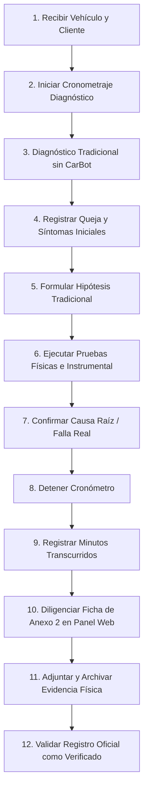

# PROTOCOLO DE RECOLECCIÓN DE DATOS: FASE PRE-TEST (DIAGNÓSTICO TRADICIONAL)
**CARBOT — TESIS DE GRADO 2026**  
**Sede de Aplicación:** Taller Mecánico Carter Motor's E.I.R.L.  
**Tamaño de Muestra Pre-test:** 30 Casos Vehiculares Independientes ($N_{pre} = 30$)  
**Condición Metodológica:** DIAGNÓSTICO TRADICIONAL ESTRICTAMENTE SIN ASISTENCIA DE CARBOT  

---

## 1. PROPÓSITO Y CONDICIÓN EXPERIMENTAL

El presente protocolo define el procedimiento estandarizado para la recolección de los 30 casos correspondientes a la fase **Pre-test**. Esta fase representa la **línea base (diagnóstico tradicional)** del taller automotriz, ejecutada por los mecánicos utilizando sus métodos habituales (inspección sensorial, criterio empírico, manuales genéricos o escaneo OBD tradicional) **sin interactuar ni consultar el sistema CarBot**.

---

## 2. PROCEDIMIENTO PASO A PASO (12 PASOS OPERATIVOS)

### Paso 1: Recepción del Vehículo y Entrevista Inicial
El vehículo ingresa al área de recepción de Carter Motor's. El mecánico o recepcionista escucha la queja del cliente y anota la manifestación inicial de la avería en la orden preliminar de taller.

### Paso 2: Inicio de la Medición Cronometrada
El observador técnico o investigador activa el cronómetro en el instante exacto en que el mecánico comienza a recopilar la información del vehículo y procede a la evaluación técnica.

### Paso 3: Diagnóstico Tradicional en Taller (Sin CarBot)
El mecánico aplica exclusivamente sus métodos habituales de trabajo:
- Inspección visual, auditiva y táctil en bahía de trabajo.
- Uso de herramientas convencionales de taller.
- Consulta de manuales o esquemas disponibles por cuenta propia.
- **PROHIBICIÓN ESTRICTA:** Queda prohibido abrir WhatsApp para consultar CarBot o ingresar datos en el motor de inferencia ML.

### Paso 4: Registro de Síntomas y Condiciones Operativas
Se anotan los síntomas detallados del vehículo: kilometraje actual, tipo de combustible, condiciones en que se manifiesta la falla (en frío, caliente, ralentí, aceleración o frenado).

### Paso 5: Formulación de la Hipótesis Diagnóstica Tradicional
El mecánico establece su hipótesis técnica inicial sobre cuál es el componente o subsistema averiado (e.g., *"Sospecha de bobina de ignición defectuosa"* o *"Discos de freno alabeados"*). Esta hipótesis se registrará posteriormente como `chatbot_prediccion` / `prediccion_inicial` en la base de datos para evaluar su acierto contra la falla final.

### Paso 6: Ejecución de Pruebas Físicas e Inspección Mecánica
Se traslada el vehículo al elevador hidráulico o banco de pruebas para ejecutar las comprobaciones físicas concluyentes:
- Desmontaje e inspección metrológica (reloj comparador, micrómetro).
- Pruebas eléctricas (multímetro, pinza amperimétrica, caída de tensión).
- Pruebas hidráulicas (manómetro de presión de combustible).

### Paso 7: Confirmación Definitiva de la Falla Real
Se determina con certeza física e incontrovertible la avería real del automóvil (e.g., *"Bobina del cilindro N°2 con devanado secundario en cortocircuito"* o *"Discos delanteros con alabeo superior a 0.08 mm"*).

### Paso 8: Detención del Cronómetro
En el momento en que se confirma físicamente la falla y se concluye el proceso de diagnóstico, el observador detiene la medición del tiempo.

### Paso 9: Cálculo y Registro de Minutos
Se convierte el tiempo cronometrado a minutos enteros redondeados (e.g., 34 minutos y 20 segundos $\rightarrow$ 34 minutos) para el campo metodológico `tiempo_diagnostico_minutos`.

### Paso 10: Diligenciamiento de la Ficha Digital (Anexo 2)
En el panel web de CarBot (`/validaciones`):
1. Hacer clic en **"Registrar Caso"**.
2. En el selector de entorno, seleccionar **OFICIAL DE TESIS (N=60)** (o **PILOTO** si es prueba preparatoria).
3. Seleccionar fase **Pre-test**.
4. Completar los 8 campos obligatorios: datos generales del vehículo, síntoma, descripción, hipótesis del mecánico, falla real confirmada y tiempo en minutos.
5. Indicar si la hipótesis inicial coincidió con la falla real (`prediccion_correcta = 1` o `0`).
6. Dejar vacíos `diagnostico_id` y `conversacion_id`.

### Paso 11: Registro y Archivo de Evidencia Técnica
Ingresar en el campo `evidencia_ref` el código identificador de la prueba de confirmación física (e.g., `EVIDENCIA_PRE_001.jpg` o `INFORME_METROLOGIA_001.pdf`) y guardar el archivo en la carpeta de respaldos de campo.

### Paso 12: Confirmación y Verificación del Registro
1. En el estado del registro, seleccionar **verificado**.
2. Al pulsar "Guardar Caso", el sistema desplegará el **Modal de Confirmación Oficial de Tesis (Escudo Rojo)**.
3. Confirmar la acción para que el caso quede formalmente registrado en PostgreSQL con `estado_registro = 'verificado'` y `tipo_registro = 'THESIS_PRETEST'`.
