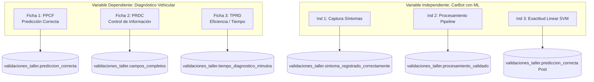

# FASE 12.0 — AUDITORÍA PRE-CAMPO DEL FLUJO EXPERIMENTAL PRETEST / POSTTEST

**Proyecto:** CarBot — Chatbot con Machine Learning para Diagnóstico Vehicular en Talleres Mecánicos  
**Tesis:** *"Chatbot utilizando machine learning para el diagnóstico vehicular en talleres mecánicos en Carabayllo 2026"*  
**Fecha de Ejecución:** 2026-09-19  
**Estado del Motor de Diagnóstico:** `CARBOT_PRECAMPO_FROZEN` (Congelado, hashes inmutables)  
**Carácter de la Fase:** AUDITORÍA EXCLUSIVA DE INFRAESTRUCTURA EXPERIMENTAL (Sin modificaciones al motor ML, TF-IDF, RAG, FAISS ni lógica de diagnóstico)  
**Dictamen Final:** `REQUIERE_CORRECCIONES_PRECAMPO`

---

## 1. Revisión del Diseño Experimental Implementado

### 1.1 Estructura Metodológica ($O_1 \rightarrow X \rightarrow O_2$)
La investigación sigue un diseño preexperimental con pretest y posttest sobre un grupo de estudio en el taller mecánico CARTER MOTOR'S E.I.R.L. en Carabayllo:
- **$O_1$ (Pre-test):** Diagnóstico automotriz bajo la metodología convencional del taller (sin asistencia de inteligencia artificial). Se evalúan los tiempos con cronómetro manual y se completan fichas técnicas manuales.
- **$X$ (Intervención):** Habilitación e implementación del sistema CarBot (motor Linear SVM + TF-IDF y asistente técnico RAG).
- **$O_2$ (Post-test):** Diagnóstico asistido por CarBot a través de WhatsApp / Panel Web, con captura sistemática de las consultas, predicciones, tiempos y confirmación física.

### 1.2 Implementación en Frontend, Backend y PostgreSQL

| Componente | PRETEST ($O_1$) | POSTTEST ($O_2$) |
| :--- | :--- | :--- |
| **Frontend (React)** | Formulario modal en `ValidacionTallerView` con `fase = 'Pre-test'`. El usuario digita la "Hipótesis inicial del mecánico". | Formulario modal con `fase = 'Post-test'`. El usuario digita o pega la "Predicción original del chatbot". |
| **Backend (FastAPI)** | `ServicioValidacionTaller.crear()` clasifica el registro con `fase = 'Pre-test'`, asignando `tipo_registro = 'THESIS_PRETEST'`. | `ServicioValidacionTaller.crear()` clasifica el registro con `fase = 'Post-test'`, asignando `tipo_registro = 'THESIS_POSTTEST'`. |
| **PostgreSQL** | Fila en `validaciones_taller` con `fase = 'Pre-test'`, `tipo_registro = 'THESIS_PRETEST'`, `conversacion_id = NULL`, `diagnostico_id = NULL`. | Fila en `validaciones_taller` con `fase = 'Post-test'`, `tipo_registro = 'THESIS_POSTTEST'`, `chatbot_prediccion = Top 1 SVM`. |

### 1.3 Auditoría de la Relación y Emparejamiento Pre-Post ($PRE_i \leftrightarrow POST_i$)

> [!CAUTION]
> **HALLAZGO CRÍTICO (H-01): AUSENCIA DE CLAVE DE EMPAREJAMIENTO EXPERIMENTAL**  
> En la base de datos relacional PostgreSQL actual, la tabla `validaciones_taller` almacena cada registro como una entidad vertical univariada e independiente. Cada caso posee un identificador único `id` (UUID) y un `item` (BigInteger autoincremental).  
> **No existe ninguna columna de emparejamiento (`pareja_id`, `caso_estudio_id`, `relacion_pre_post_id` ni `sujeto_id`).**

#### Implicancia Metodológica y Estadística:
1. **Documentación ante Jurado vs. Estructura de Datos:**
   En los documentos de sustento de tesis (`docs/notas/preguntas_jurado_tesis_i.md`, Preguntas 18 y 23, y `scripts/generar_word_preguntas_tecnicas.py`) se declara textualmente que se aplicará la prueba paramétrica **$t$ de Student para muestras relacionadas (emparejadas)** o la prueba no paramétrica de **Rangos con Signo de Wilcoxon**.
2. **Requisito de Muestras Relacionadas:**
   Para contrastar hipótesis con muestras relacionadas, cada observación $O_{1,i}$ debe estar vinculada de forma unívoca y determinista con $O_{2,i}$ ($i = 1, \dots, 30$).
3. **Falla de Dependencia en Vehículo / Mecánico:**
   - En el taller real, los 30 vehículos atendidos en el Pretest no son los mismos 30 vehículos que llegarán semanas después en el Posttest. Como indica la pregunta 18 de la defensa: *"Evaluamos otros 30 vehículos usando el chatbot"*.
   - Si los vehículos tienen placas distintas (`placa_hash` no coincide), el sistema no tiene ningún criterio determinista para decidir qué registro Pretest se compara contra cuál registro Posttest.
   - Emparejar por el índice ordinal de inserción ($i$-ésimo Pre con $i$-ésimo Post) es una asunción arbitraria no formalizada en el código.

---

## 2. Auditoría de los Indicadores de la Tesis

Se auditó la totalidad de los indicadores declarados formalmente en `TESIS_INSTRUMENTOS_DATA_MAPPING.md` y `AGENTS.md`:



### Matriz de Auditoría de Indicadores

| Indicador Oficial | Dimensión / Variable | Dato Necesario | Campo Frontend | Endpoint Backend | Columna BD | Fórmula | Pre-test | Post-test | Estado |
| :--- | :--- | :--- | :--- | :--- | :--- | :--- | :--- | :--- | :--- |
| **PPCF** | VD - Predicción (Ficha 1) | Acierto binario entre hipótesis/predicción y falla física real | `¿Fue Acierto? (1 / 0)` | `GET /validaciones/metricas` | `validaciones_taller.prediccion_correcta` | $\frac{\sum \text{aciertos}}{\text{Total}} \times 100$ | Hipótesis mecánico vs Falla real | Predicción Top 1 CarBot vs Falla real | **OK** |
| **PRDC / RDC** | VD - Información (Ficha 2) | Cumplimiento de los 8 campos requeridos | Formulario completo (8 bloques) | `GET /validaciones/metricas` | `validaciones_taller.campos_completos` | $\frac{\sum \text{completos}}{\text{Total}} \times 100$ | Ficha técnica manual (8 campos) | Ficha digital (8 campos) | **OK** *(Requiere confirmación asesora)* |
| **TPRD** | VD - Eficiencia (Ficha 3) | Duración del diagnóstico en minutos de taller | `Tiempo Empleado (min)` | `GET /validaciones/metricas` | `validaciones_taller.tiempo_diagnostico_minutos` | $\frac{\sum \text{minutos}}{\text{Total}}$ | Cronómetro manual en taller | Minutos ingresados manualmente | **INCOMPLETO** *(Sin timestamps auditables)* |
| **Ind 1 (VI)** | VI - CarBot ML | Correspondencia entre queja original y registro estructurado | `Indicador 1: ¿Síntoma registrado correctamente?` | `GET /validaciones/metricas` | `validaciones_taller.sintoma_registrado_correctamente` | $\frac{\sum \text{sint\_ok}}{\text{Total Verif}} \times 100$ | No aplica (exclusivo CarBot) | Validador contrasta relato vs texto | **OK** |
| **Ind 2 (VI)** | VI - CarBot ML | Procesamiento integral (Normalización + Extracción + Clasificación) | `Checkboxes: Etapas del Pipeline` | `GET /validaciones/metricas` | `validaciones_taller.procesamiento_validado` | $\frac{\sum \text{proc\_ok}}{\text{Total Verif}} \times 100$ | No aplica | $1 \iff \text{Norm} \land \text{Ext} \land \text{Clas}$ | **OK** |
| **Ind 3 (VI)** | VI - CarBot ML | Exactitud del clasificador Linear SVM en campo | Tarjeta KPI Variable Independiente | `GET /validaciones/metricas` | `validaciones_taller.prediccion_correcta` | $\frac{\sum \text{aciertos\_post}}{\text{Total Post Verif}} \times 100$ | No aplica | Acierto verificado en taller | **OK** |

---

## 3. Trazabilidad del Tiempo (Eficiencia / TPRD)

Se auditó minuciosamente el ciclo de vida de la medición temporal:

1. **¿Cuándo empieza y termina el cronómetro?**
   - **En el Pretest:** El cronómetro físico del taller es iniciado por el mecánico/evaluador al recibir el vehículo y detenido cuando el mecánico emite su dictamen diagnóstico.
   - **En el Posttest:** En el diseño teórico, comprende el tiempo desde que el mecánico inicia la interacción con CarBot hasta que concluye el diagnóstico. Sin embargo, en el software actual no existe un cronómetro digital interactivo.
2. **¿Quién controla el tiempo?**
   El tiempo es controlado externamente por el evaluador humano y luego digitado como un número entero en el campo `tiempo_diagnostico_minutos` del modal web (`<Input type="number" min={1} max={600} />`).
3. **¿Unidad almacenada y columnas BD?**
   - Tabla `validaciones_taller`: Columna `tiempo_diagnostico_minutos` (Integer, minutos enteros).
   - Tabla `diagnosticos`: Columnas `tiempo_inferencia_ml_ms` (milisegundos de inferencia SVM) y `duracion_ms` (milisegundos totales del webhook HTTP).
4. **¿Pre y Post utilizan la misma definición temporal?**
   Sí, ambos se miden en minutos de taller.
5. **¿Recargar la página o abandonar la sesión altera el cronómetro?**
   No altera la medición externa porque no depende del navegador; no obstante, si el evaluador está llenando el formulario y recarga la página, pierde los datos ingresados en el formulario reactivo.
6. **¿Existen timestamps suficientes para auditar posteriormente el tiempo registrado?**
   > [!WARNING]
   > **HALLAZGO ALTO (H-04): FALTA DE TIMESTAMPS FORENSES DE INICIO Y FIN**  
   > En `validaciones_taller` sólo se almacenan `creado_en` y `fecha_validacion`. No existen columnas `inicio_diagnostico_at` ni `fin_diagnostico_at` tipo `timestamptz`.  
   > Esto representa una debilidad frente al jurado: la cifra de minutos es una declaración manual que no puede auditarse contra la telemetría del servidor.

---

## 4. Exactitud y Ground Truth Real en Campo

1. **Diagnóstico inicial y síntomas:**
   Se persisten en las columnas `sintoma` (queja corta) y `descripcion_sintoma` (contexto operativo amplio, carga, velocidad, temperatura).
2. **Predicción CarBot:**
   Almacenada en `chatbot_prediccion` (Top 1). En el Pre-test, este mismo campo se utiliza para almacenar la hipótesis previa manual del mecánico.
3. **Diagnóstico final comprobado:**
   Se almacena en `falla_real` tras la verificación física (desarme, reloj comparador, osciloscopio, escáner, multímetro).
4. **Validación técnica y responsables:**
   - `mecanico_id`: UUID del mecánico que ejecutó el diagnóstico.
   - `validado_por_id`: UUID del investigador / asesor que auditó la prueba física.
   - `metodo_confirmacion`: Texto obligatorio para casos verificados (ej. *"Inspección en elevador"*, *"Prueba de presión con manómetro"*).
   - `evidencia_ref`: Código de orden de trabajo o referencia visual inmutable (ej. *"OT-2026-088"*, *"Foto sensor rueda contaminado con ferrita"*).
5. **Cálculo de acierto:**
   `prediccion_correcta` se almacena como valor binario ($1$ o $0$). Se garantiza que `correcto = (predicción == diagnóstico final comprobado)` pueda ser auditado a posteriori sin modificar retroactivamente la predicción emitida originalmente por CarBot.

---

## 5. Completitud del Registro (Ficha 2 / PRDC)

Se verificó la lógica algorítmica de los 8 campos formales implementada en `backend/src/application/services/validacion_taller.py`:

```
Campo 1: Código de registro (item autoincremental)
Campo 2: Fecha de atención (ISO YYYY-MM-DD)
Campo 3: Datos generales del vehículo (marca_modelo, anio, kilometraje, combustible, transmision)
Campo 4: Síntomas reportados (sintoma)
Campo 5: Descripción del síntoma (descripcion_sintoma)
Campo 6: Sistema afectado probable (sistema_afectado_probable)
Campo 7: Diagnóstico confirmado por el mecánico (falla_real)
Campo 8: Tiempo de atención registrado (tiempo_diagnostico_minutos)
```

- **Regla determinista:**  
  $$\text{campos\_completos} = \begin{cases} 1 & \text{si } \text{cantidad\_campos\_completos} = 8 \\ 0 & \text{en caso contrario} \end{cases}$$
- **Subcampos del vehículo (Campo 3):**  
  Requiere obligatoriamente que `marca_modelo`, `anio`, `kilometraje`, `combustible` y `transmision` no sean nulos ni vacíos.
- **Auditoría JSON:**  
  La columna `detalles_campos` almacena el desglose booleano y el valor de resumen de cada uno de los 8 campos, permitiendo verificar objetivamente en PostgreSQL por qué un registro fue marcado como incompleto (ej. `campo_3.completo = false` por falta de kilometraje).

---

## 6. Aislamiento de Datos y Blindaje Muestral

Se comprobó la separación de entornos en la base de datos PostgreSQL:

```sql
ALTER TABLE validaciones_taller 
ADD CONSTRAINT chk_validaciones_tipo_registro 
CHECK (tipo_registro IN ('DEVELOPMENT', 'REGRESSION', 'THESIS_PRETEST', 'THESIS_POSTTEST'));
```

1. **Aislamiento en Consultas y Métricas:**
   - `resumen_por_fase()` y `metricas_variable_independiente()` filtran estrictamente:
     `estado_registro = 'verificado' AND tipo_registro IN ('THESIS_PRETEST', 'THESIS_POSTTEST')`.
   - Los registros de prueba, stress tests y los 1,930 borradores históricos sintéticos quedan 100% excluidos.
2. **Vulnerabilidad Detectada en Inserción Web (Hallazgo H-02):**
   - En `ServicioValidacionTaller.crear()`, si la petición no incluye `tipo_registro`, se infiere por nombre de fase (`Pre-test` $\rightarrow$ `THESIS_PRETEST`, `Post-test` $\rightarrow$ `THESIS_POSTTEST`).
   - Dado que el modal de frontend `ValidacionNuevoCasoModal` no posee selector de entorno y viene por defecto en `estado_registro = 'verificado'`, un usuario que pruebe el formulario en el navegador insertará registros oficiales de tesis por accidente.

---

## 7. Auditoría de Frontend y Flujo de Usuario

### 7.1 Capacidades Funcionales Verificadas
- ✅ Iniciar registro desde el botón *"Registrar caso"*.
- ✅ Seleccionar Pre-test o Post-test en el selector de fase.
- ✅ Capturar síntomas, descripción y características del vehículo.
- ✅ Registrar falla real, método de confirmación física y evidencia de taller.
- ✅ Bloqueo de envío si `prediccion_correcta` no ha sido seleccionado.
- ✅ Exigencia de método de confirmación y evidencia si el estado es `'verificado'`.
- ✅ Mensaje de confirmación visual tras el guardado exitoso.

### 7.2 Discrepancias entre Frontend, Backend y BD

| Campo / Función | Estado en Backend / BD | Estado en Frontend | Observación |
| :--- | :--- | :--- | :--- |
| `tipo_registro` | Columna con CheckConstraint | No expuesto en el formulario | El frontend no permite alternar entre `DEVELOPMENT` y `THESIS_*`. |
| `diagnostico_id` | Columna FK a `diagnosticos` | No expuesto en el formulario | No se puede vincular un diagnóstico previo de CarBot desde el modal. |
| `conversacion_id` | Columna FK a `conversaciones` | No expuesto en el formulario | Se pierde la trazabilidad de la conversación de WhatsApp. |
| `origen_clave` | Columna String(64) Unique | No expuesto en el formulario | Permanece `NULL` en los registros manuales. |
| `tiempo_inferencia_ml_ms` | Columna Integer telemetría | No se muestra en la tabla | Solo visible en diagnósticos técnicos. |
| `campos_completos` | Recalculado por backend | Enviado fijo como `1` por el hook | Redundancia menor en el payload JSON. |

---

## 8. Prueba End-to-End Simulada (PostgreSQL)

Se ejecutó una prueba de ciclo completo sin contaminar registros oficiales (utilizando `tipo_registro = 'DEVELOPMENT'` y placas hash `SIM-*`):

### Resultados de la Simulación:

1. **CASO A (Pretest y Posttest Completos):**
   - Pretest (`item=1788224539302650136`): 8 de 8 campos completos, `campos_completos = 1`, tiempo = 38 min, acierto = 1, estado = `verificado`.
   - Posttest (`item=1788224539302650137`): 8 de 8 campos completos, `campos_completos = 1`, tiempo = 8 min, acierto = 1, estado = `verificado`.
   - **Resultado:** Inserción limpia y cálculo exacto de completitud en PostgreSQL.
2. **CASO B (Pretest Incompleto y Posttest Completo):**
   - Pretest (`item=1788224539302650138`): Falta año, km, combustible y descripción. El backend evaluó `cantidad_campos_completos = 6` y fijó `campos_completos = 0` (`campo3_completo = false`, `campo5_completo = false`).
   - Posttest (`item=1788224539302650139`): 8 de 8 campos completos, `campos_completos = 1`, tiempo = 11 min, acierto = 1.
   - **Resultado:** Demostración exitosa de discriminación objetiva de completitud sin intervención manual.
3. **CASO C (Interrupción / Error de Restricción):**
   - Se envió `tiempo_diagnostico_minutos = 999` (violando `CHECK tiempo BETWEEN 1 AND 600`).
   - **Resultado:** La validación Pydantic y la restricción de base de datos abortaron atómicamente la transacción (`ValidationError`), impidiendo inconsistencias o registros huérfanos.
4. **Limpieza posterior:**
   Todos los registros de prueba simulada fueron purgados de PostgreSQL al finalizar la verificación.

---

## 9. Exportación para SPSS / Excel y Análisis Estadístico

Se evaluaron los endpoints de exportación existentes (`/exportar-csv` y `/exportar-fichas-anexo2-csv`):

### 9.1 Diagnóstico del Formato de Salida Actual:
- Genera un archivo CSV con 32 columnas sanitizadas contra inyecciones de fórmulas (`=`, `+`, `-`, `@`).
- **Estructura: Formato LONG (Vertical univariado):**
  Cada fila representa una ficha de diagnóstico individual (un registro Pre-test O un registro Post-test).

### 9.2 Requerimiento para SPSS / R:
Para realizar contrastes de hipótesis pareadas en SPSS:
- Procedimiento: `Analyze > Compare Means > Paired-Samples T Test...`
- SPSS exige **Formato WIDE (Horizontal emparejado)**:

| case_id | pre_correctitud | post_correctitud | pre_completitud | post_completitud | pre_tiempo | post_tiempo |
| :---: | :---: | :---: | :---: | :---: | :---: | :---: |
| `CASO_01` | 1 | 1 | 1 | 1 | 42 | 19 |
| `CASO_02` | 0 | 1 | 1 | 1 | 35 | 17 |
| `CASO_03` | 1 | 1 | 0 | 1 | 48 | 22 |

Actualmente, **no existe un endpoint ni script en el sistema que genere esta matriz horizontal emparejada**. El investigador tendría que transformar los datos manualmente en hojas de cálculo, con alto riesgo de desfasar los pares.

---

## 10. Resumen de Hallazgos y Plan de Remediación

Se compilaron 8 hallazgos técnicos y metodológicos en [`FASE12_0_HALLAZGOS.csv`](file:///c:/Users/leonc/OneDrive/Desktop/CHAT_BOT_MACHINLEARNING/docs/fase12/FASE12_0_HALLAZGOS.csv):

| ID | Severidad | Módulo | Problema Detectado | Efecto Metodológico |
| :--- | :--- | :--- | :--- | :--- |
| **H-01** | **CRÍTICO** | Persistencia BD | Falta columna de emparejamiento experimental (`caso_pareja_id`) | Imposibilita formalizar la prueba $t$ de Student para muestras relacionadas sin ordenamientos arbitrarios. |
| **H-02** | **ALTO** | Servicio Validación | Inferencia por defecto de `THESIS_PRETEST` / `THESIS_POSTTEST` | Pruebas accidentales en el panel web pueden contaminar la muestra oficial de 60 casos. |
| **H-03** | **ALTO** | Webhook WhatsApp | Desconexión entre confirmación de chat y `validaciones_taller` | El evaluador debe redigitar a mano todo el diagnóstico en la web, generando fricción y errores. |
| **H-04** | **ALTO** | Persistencia BD | `tiempo_diagnostico_minutos` es manual sin timestamps de inicio/fin | Vulnerable ante observaciones del jurado sobre auditoría temporal de servidores. |
| **H-05** | **MEDIO** | Interfaces Exportación | Falta exportación en formato WIDE para SPSS | Dificulta el procesamiento estadístico automatizado en software econométrico. |
| **H-06** | **MEDIO** | Modal Frontend | Imposibilidad de vincular `diagnostico_id` desde el formulario web | Se pierde la relación directa entre la predicción de CarBot y la validación en taller. |
| **H-07** | **MEDIO** | Persistencia BD | Falta persistencia de hipótesis Top-2 y Top-3 en `validaciones_taller` | Dificulta evaluar el diagnóstico diferencial sin hacer JOIN con `diagnosticos`. |
| **H-08** | **BAJO** | Frontend Hook | Envío redundante de `campos_completos = 1` en payload de creación | Inconsistencia contractual menor (el backend lo recalcula dinámicamente). |

---

## 11. Dictamen Final de la Fase 12.0

De conformidad con los criterios de auditoría pre-campo y las directrices metodológicas de la tesis:

```
=======================================================================
                        DICTAMEN FINAL
=======================================================================

            >>> REQUIERE_CORRECCIONES_PRECAMPO <<<

El motor de Machine Learning y el corpus RAG permanecen 100% congelados
(CARBOT_PRECAMPO_FROZEN). No se requiere ningún reentrenamiento de SVM.

Sin embargo, el sistema NO debe salir a trabajo de campo presencial
hasta resolver los hallazgos H-01 (clave de emparejamiento experimental),
H-02 (blindaje contra contaminación accidental de la muestra oficial)
y H-05 (matriz de exportación WIDE para SPSS).
=======================================================================
```

---
*Documento de auditoría generado conforme a las Normas Metodológicas y de Integridad Académica de CarBot 2026.*
