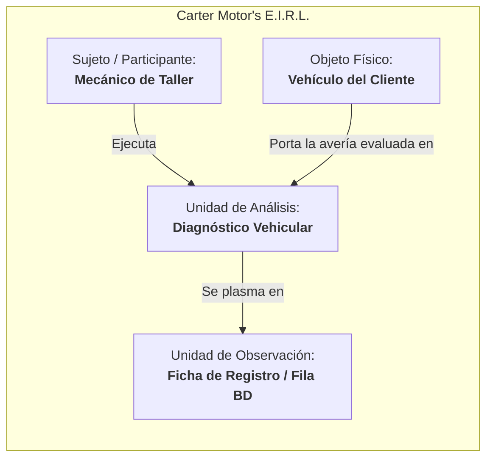

# FASE 12.1.1 — RESOLUCIÓN EXCLUSIVA DE LA UNIDAD DE ANÁLISIS Y ESTRUCTURA PRE/POST
## Auditoría Metodológica de Solo Lectura — Tesis CarBot 2026

**Fecha de Ejecución:** 19 de Septiembre de 2026  
**Carácter de la Fase:** SOLO LECTURA (Cero modificaciones de código, esquemas ni modelos)  
**Alcance:** Exclusivamente resolver qué representan los 60 registros de la muestra y si el diseño Pretest/Posttest constituye datos pareados o muestras independientes.  
**Artefactos Vinculados:**
- Auditoría E2E: [`docs/fase12/FASE12_1_AUDITORIA_SISTEMA_COMPLETO_E2E.md`](file:///c:/Users/leonc/OneDrive/Desktop/CHAT_BOT_MACHINLEARNING/docs/fase12/FASE12_1_AUDITORIA_SISTEMA_COMPLETO_E2E.md)
- Auditoría Pre/Post 12.0: [`docs/fase12/FASE12_0_AUDITORIA_PREPOST.md`](file:///c:/Users/leonc/OneDrive/Desktop/CHAT_BOT_MACHINLEARNING/docs/fase12/FASE12_0_AUDITORIA_PREPOST.md)
- Mapeo de Instrumentos: [`docs/auditorias/fase11/TESIS_INSTRUMENTOS_DATA_MAPPING.md`](file:///c:/Users/leonc/OneDrive/Desktop/CHAT_BOT_MACHINLEARNING/docs/auditorias/fase11/TESIS_INSTRUMENTOS_DATA_MAPPING.md)
- Banco de Respuestas ante Jurado: [`docs/notas/preguntas_jurado_tesis_i.md`](file:///c:/Users/leonc/OneDrive/Desktop/CHAT_BOT_MACHINLEARNING/docs/notas/preguntas_jurado_tesis_i.md)

---

## 1. Evidencia Documental Oficial en el Repositorio

Se realizó un rastreo exhaustivo en todos los documentos metodológicos, notas de sustentación, matrices y guías del proyecto. A continuación se presentan las definiciones textuales exactas localizadas:

### 1.1 Muestra y Procedimiento Experimental ($O_1 - X - O_2$)
- **Archivo:** [`docs/notas/preguntas_jurado_tesis_i.md`](file:///c:/Users/leonc/OneDrive/Desktop/CHAT_BOT_MACHINLEARNING/docs/notas/preguntas_jurado_tesis_i.md#L102-L112)
- **Sección:** *BLOQUE 4: DISEÑO METODOLÓGICO Y MUESTRAL*, Preguntas 18 y 19.
- **Texto Oficial:**
  > *"Consta de tres fases secuenciales sobre un único grupo de estudio:*  
  > *1. **$O_1$ (Pre-test)**: Registramos cómo se diagnostican **30 vehículos sin usar el bot** (tiempos con cronómetro y fichas manuales).*  
  > *2. **$X$ (Estímulo)**: Introducción y habilitación del chatbot en WhatsApp en el taller.*  
  > *3. **$O_2$ (Post-test)**: Evaluamos **otros 30 vehículos usando el chatbot**, capturando los datos automáticamente en el backend."* (Pregunta 18).
  > 
  > *"Seleccionamos una muestra representativa de **60 registros** del taller colaborador que cuenta con las autorizaciones institucionales (Anexos 3 y 4) y que representa fallas mecánicas comunes del alcance de nuestro estudio."* (Pregunta 19).
- **Interpretación:**  
  La investigación define taxativamente que la muestra total consta de **60 registros de diagnóstico**, divididos en **30 vehículos en Pre-test** y **otros 30 vehículos diferentes en Post-test**.

---

### 1.2 Diseño Preexperimental y Pruebas Estadísticas Declaradas
- **Archivo:** [`docs/notas/preguntas_jurado_tesis_i.md`](file:///c:/Users/leonc/OneDrive/Desktop/CHAT_BOT_MACHINLEARNING/docs/notas/preguntas_jurado_tesis_i.md#L129-L136) y [`docs/guia_defensa_tesis.md`](file:///c:/Users/leonc/OneDrive/Desktop/CHAT_BOT_MACHINLEARNING/docs/guia_defensa_tesis.md#L41-L47)
- **Sección:** *BLOQUE 5: CONFIABILIDAD, VALIDEZ Y ESTADÍSTICA*, Preguntas 23 y 24.
- **Texto Oficial:**
  > *"¿Por qué se menciona el uso de la prueba estadística t de Student para muestras relacionadas?*  
  > *Respuesta: Es el test estadístico paramétrico indicado para comparar dos medias obtenidas del mismo grupo en condiciones diferentes (Pre-test vs Post-test)..."* (Pregunta 23).
  > 
  > *"¿Qué pasa si sus datos de tiempos de diagnóstico no tienen una distribución normal? ¿Qué prueba estadística usaría?*  
  > *Respuesta: Tal como declaramos en nuestro informe (Pág. 27 del PDF), primero aplicaremos una prueba de normalidad (como Shapiro-Wilk). Si los datos no siguen una distribución normal, no usaremos T-Student; en su lugar, aplicaremos la prueba no paramétrica de **Rangos con Signo de Wilcoxon** para muestras relacionadas."* (Pregunta 24).
- **Interpretación:**  
  En el discurso de defensa se declaró una prueba pareada ($t$ relacionada / Wilcoxon) bajo el argumento teórico de que el taller y los mecánicos constituyen "un único grupo evaluado en dos momentos". Sin embargo, los datos numéricos provienen de vehículos físicamente distintos.

---

### 1.3 Regla Metodológica Superior del Repositorio
- **Archivo:** [`AGENTS.md`](file:///c:/Users/leonc/OneDrive/Desktop/CHAT_BOT_MACHINLEARNING/AGENTS.md#L60-L75)
- **Sección:** *Reglas Metodológicas de Tesis y Arquitectura CarBot (Obligatorias)*, Reglas 2 y 5.
- **Texto Oficial:**
  > *Regla 2: "Avance actual: {reales} de 60 registros".*  
  > *Regla 5: "Pruebas Estadísticas de Contraste: **No fijar la prueba inferencial como 'pareada' por defecto.** Mantener el contraste como 'Pendiente de definición con el asesor estadístico según la naturaleza de la muestra (pareada vs. muestras independientes)'."*
- **Interpretación:**  
  La directriz metodológica central del proyecto ya advertía que no debía asumirse el carácter pareado de los datos de forma dogmática sin antes validar con el asesor la naturaleza de las observaciones.

---

## 2. Determinación de la Estructura Muestral ("Muestra = 60")

Al contrastar las opciones planteadas:
- **Opción A (60 registros totales: 30 PRE + 30 POST):** ✅ **CONFIRMADA Y RESPALDADA POR DOCUMENTACIÓN.**
- **Opción B (60 PRE + 60 POST = 120 registros):** ❌ Descartada. Ningún documento menciona 120 atenciones.
- **Opción C (30 unidades evaluadas dos veces = 60 registros):** ❌ Descartada a nivel de vehículo, porque los vehículos del Pretest no se repiten en el Posttest.
- **Opción D (60 diagnósticos PRE y 60 diagnósticos POST):** ❌ Descartada. Excedería la capacidad operativa del taller colaborador.

> [!IMPORTANT]
> **CONCLUSIÓN DE TAMAÑO MUESTRAL:**  
> La muestra de la tesis está constituida formalmente por **60 diagnósticos vehiculares en total**:
> - **$N_{\text{pre}} = 30$ registros** obtenidos mediante diagnóstico convencional.
> - **$N_{\text{post}} = 30$ registros** obtenidos mediante diagnóstico asistido con CarBot.
> - **Total de filas esperadas en la base de datos (`validaciones_taller`) = 60 filas.**

---

## 3. Delimitación Rigurosa de la Unidad de Análisis

Para evitar confusiones terminológicas, se delimitan los conceptos metodológicos del estudio:



1. **Unidad de Análisis: El Diagnóstico Vehicular**
   - Es el proceso técnico e intelectual mediante el cual el mecánico inspecciona un vehículo, interpreta síntomas, formula una hipótesis de falla y dicta una conclusión técnica.
   - **Justificación:** Las tres dimensiones de la Variable Dependiente (*Efectividad de la predicción, Control de la información y Eficiencia temporal*) son propiedades del **acto de diagnosticar**, no del vehículo. Un automóvil no tiene "tiempo de respuesta en minutos" ni "porcentaje de acierto"; es el proceso diagnóstico el que posee esas métricas.
2. **Sujeto / Participante: El Mecánico de Taller**
   - El profesional técnico que realiza la labor diagnóstica, interactúa con el cliente (y con CarBot) y verifica físicamente la avería en el elevador.
3. **Objeto Físico: El Vehículo Automotor**
   - La entidad material (portadora de la placa de rodaje, marca, modelo y kilometraje) que presenta la avería mecánica o eléctrica.
4. **Unidad de Observación: La Ficha de Registro de Taller**
   - El instrumento documental (Fichas 1, 2 y 3 del Anexo 2 o registro digital en `validaciones_taller`) que captura los datos empíricos del diagnóstico.

---

## 4. Resolución de $O_1 - X - O_2$ y la Relación entre Observaciones

- **$O_1$ (Observación Pretest):** Medición de 30 diagnósticos vehiculares convencionales realizados por los mecánicos del taller sin asistencia de inteligencia artificial.
- **$X$ (Estímulo Experimental):** Implementación operativa de CarBot (Linear SVM + TF-IDF + RAG) en los teléfonos de los mecánicos vía WhatsApp.
- **$O_2$ (Observación Posttest):** Medición de 30 diagnósticos vehiculares asistidos por CarBot realizados por los mecánicos del taller.

### ¿La MISMA unidad que produce $O_1$ produce posteriormente $O_2$?

| Nivel de Análisis | ¿Es la misma unidad en Pre y Post? | Explicación Técnica y Operativa |
| :--- | :---: | :--- |
| **A nivel de Vehículo** | **NO** | Como declara textualmente la Pregunta 18: *"Evaluamos otros 30 vehículos usando el chatbot"*. Los 30 autos del Pretest son reparados y entregados a sus dueños; no regresan para ser diagnosticados de nuevo en el Posttest. |
| **A nivel de Avería / Falla** | **NO** | Cada vehículo llega al taller con un problema particular y fortuito (uno con pastillas de freno gastadas, otro con bobina en corto, otro con fuga de refrigerante). No hay identidad de avería entre el auto $i$ de Pre y el auto $i$ de Post. |
| **A nivel de Taller / Mecánico** | **SÍ** | El taller (Carter Motor's) y su personal mecánico son los mismos que trabajan antes de CarBot ($O_1$) y después de CarBot ($O_2$). |

> [!CAUTION]
> **DICTAMEN METODOLÓGICO SOBRE PAREAMIENTO:**  
> A nivel de la unidad empírica de recolección (el vehículo atendido y la falla diagnosticada), **NO SON DATOS PAREADOS NATURALES**. Son **dos muestras cronológicas independientes de diagnósticos** ($n_1 = 30$ y $n_2 = 30$) efectuadas sobre el mismo entorno de taller.

---

## 5. Análisis de la Contradicción Metodológico-Estadística

Existe una contradicción documentada en los borradores previos de sustentación:

```
[Defensa Teórica en Diapositivas]                [Realidad Operativa de Taller]
"Diseño preexperimental O1-X-O2"                "30 vehículos antes y OTROS 30 vehículos después"
            ↓                                                      ↓
"Muestras Relacionadas / Pareadas"               "Casos vehiculares y averías totalmente distintos"
            ↓                                                      ↓
Exige: d_i = Post_i - Pre_i                      ¿Contra cuál de los 30 Pre se resta el Post #1?
(Requiere par biunívoco natural)                 (No existe criterio determinista de emparejamiento)
```

### Tabla Comparativa de Pruebas Estadísticas

| Prueba Estadística | Archivo / Fuente | Requisitos Estadísticos | Compatibilidad con los Datos Reales |
| :--- | :--- | :--- | :--- |
| **$t$ de Student para muestras relacionadas** | `preguntas_jurado_tesis_i.md` (Preg. 23) | Observaciones pareadas sobre el mismo sujeto ($Post_i - Pre_i$). Normalidad de diferencias. | ⚠️ **DUDOSA / ARTIFICIAL**: Exigiría emparejar arbitrariamente el auto 1 con el 31 por orden de llegada, lo que viola el supuesto de pareamiento natural. |
| **Rangos con Signo de Wilcoxon** | `preguntas_jurado_tesis_i.md` (Preg. 24) | Pares relacionados ordinales o continuos no normales. | ⚠️ **DUDOSA / ARTIFICIAL**: Comparte la misma limitación que la $t$ pareada. |
| **$t$ de Student para muestras independientes** | Derivada de la estructura real ($n_1=30, n_2=30$) | Dos grupos independientes. Homocedasticidad y normalidad de cada grupo. | ✅ **100% COMPATIBLE**: Compara la media de tiempo de los 30 diagnósticos tradicionales vs la media de tiempo de los 30 diagnósticos con CarBot. |
| **$U$ de Mann-Whitney (Wilcoxon rank-sum)** | Alternativa no paramétrica para muestras independientes | Dos muestras independientes no normales o variables ordinales. | ✅ **100% COMPATIBLE**: Ideal para comparar las medianas de tiempos o aciertos entre Pre y Post si fallan las pruebas de normalidad. |
| **Prueba de Normalidad (Shapiro-Wilk)** | `preguntas_jurado_tesis_i.md` (Preg. 24) | $n < 50$ casos por muestra. | ✅ **100% COMPATIBLE**: Se aplica a la muestra Pre ($n=30$) y a la muestra Post ($n=30$). |

---

## 6. Dictamen sobre `H-01` (`caso_pareja_id`)

- **Propuesta Evaluada:** Incorporar una columna `caso_pareja_id` en la tabla `validaciones_taller` para forzar que cada caso Posttest esté atado a un caso Pretest.
- **Dictamen:** **`REQUIERE_CONFIRMACION_ASESOR`** (Técnicamente **NO RECOMENDADO** por riesgo de emparejamiento espurio).
- **Fundamentación Científica:**
  1. No se puede crear una relación forzada en la base de datos únicamente para que el software SPSS permita ejecutar la opción *"Paired-Samples T Test"*.
  2. Si el caso Pre #1 es un *"Toyota Yaris 2018 con chillido de frenos"* y el caso Post #1 es un *"Nissan Versa 2019 que se apaga en mínimo"*, emparejarlos es una falacia metodológica: sus tiempos y complejidades diagnósticas no son correlativos.
  3. Si el asesor metodológico insiste en mantener la prueba pareada declarada en el plan de tesis, el asesor deberá definir explícitamente el **criterio de emparejamiento**:
     - *Criterio A:* Emparejamiento por orden cronológico de atención ($1^{\circ}$ Pre con $1^{\circ}$ Post, $2^{\circ}$ con $2^{\circ}\dots$).
     - *Criterio B:* Emparejamiento por cuotas de macro-sistema (Freno Pre $\leftrightarrow$ Freno Post; Motor Pre $\leftrightarrow$ Motor Post).
  4. Si el asesor reconoce que los vehículos son diferentes y autoriza el análisis de **muestras independientes**, la columna `caso_pareja_id` es **completamente innecesaria**.

---

## 7. Dictamen sobre el Exportador WIDE para SPSS

- **Dictamen:** **`DEPENDE_DE_CONFIRMACION_ASESOR`**.
- **Comportamiento Actual del Exportador:**
  El archivo generado por `GET /api/v1/validacion-taller/exportar-fichas-anexo2-csv` entrega el formato **LONG (vertical)**, donde cada fila es una evaluación y existe la columna `Fase` (`Pre-test` / `Post-test`).
- **Análisis:**
  - El formato **LONG actual es el formato canónico y nativo** que utiliza SPSS para realizar la prueba $t$ de Student para **muestras independientes** (`Analyze > Compare Means > Independent-Samples T Test...` usando `Fase` como variable de agrupación) y la prueba de **Mann-Whitney**.
  - Por lo tanto, el sistema actual **ya está preparado** para el análisis estadístico más sólido y coherente con la naturaleza de los datos.
  - Solo si el asesor impone el formato pareado, se generará el script de pivoteo a formato WIDE en Fase 12.2.

---

## 8. Elementos Separados y Aprobados para Fase 12.2

Independientemente del dilema estadístico (pareado vs independiente), los siguientes componentes son necesarios y quedan listos para su implementación tras aprobación:

1. **Blindaje contra contaminación muestral:**
   - Añadir control visual de entorno en `ValidacionNuevoCasoModal.tsx` (`Modo Pruebas / Piloto` vs `Muestra Oficial de Tesis`).
   - Evitar que el backend autodeduzca `THESIS_PRETEST` o `THESIS_POSTTEST` en formularios web informales.
2. **Saneamiento de los 20 registros piloto:**
   - Ejecutar script SQL de saneamiento para reclasificar los registros con `origen_clave` tipo `PILOTO_TEMPORAL_...` a `tipo_registro = 'DEVELOPMENT'` y `estado_registro = 'borrador'`.
   - Garantizar que el contador del dashboard inicie en **`0 de 60 casos reales en taller`**.
3. **Selector y Precarga de `diagnostico_id`:**
   - Permitir vincular consultas de CarBot en `ValidacionNuevoCasoModal.tsx` para no dejar `diagnostico_id` nulo en Post-test.
   - Botón de precarga en `DiagnosticoDetalleModal.tsx`.
4. **Enriquecimiento visual en tabla de casos:**
   - Visualización de año, kilometraje y combustible en la tabla `ValidacionCasosTable.tsx`.

---

## 9. Ficha Síntesis de Resolución Metodológica

```
====================================================================================================
                       FICHA OFICIAL DE RESOLUCIÓN METODOLÓGICA (FASE 12.1.1)
====================================================================================================

UNIDAD DE ANÁLISIS:               Diagnóstico vehicular (atención técnica de taller automotriz)
TAMAÑO MUESTRAL:                  60 diagnósticos vehiculares en total
NÚMERO DE REGISTROS PRE:          30 diagnósticos tradicionales (método manual / cronómetro)
NÚMERO DE REGISTROS POST:         30 diagnósticos asistidos con CarBot (WhatsApp / backend)
TOTAL DE FILAS ESPERADAS EN BD:   60 filas en la tabla validaciones_taller
PRE/POST PAREADOS:                INDETERMINADO / CONTRADICTORIO
                                  (A nivel de taller es el mismo grupo antes/después; 
                                   a nivel de vehículo son 30 autos distintos en Pre y 30 en Post)
ENTIDAD REAL DE EMPAREJAMIENTO:   No existe identidad física a nivel de vehículo.
                                  Requeriría definición de criterio por el asesor o tratarse 
                                  como muestras independientes.
PRUEBA ESTADÍSTICA DECLARADA:     t de Student para muestras relacionadas / Wilcoxon (en preguntas)
                                  vs t de Student independientes / Mann-Whitney (en consistencia real)
COMPATIBILIDAD ESTADÍSTICA:       CONTRADICTORIA (Declaración de muestras pareadas vs Datos 
                                  recolectados sobre vehículos y averías no homogéneas)
caso_pareja_id:                   REQUIERE_CONFIRMACION_ASESOR
EXPORTACIÓN WIDE:                 DEPENDIENTE_DE_ASESOR (El formato actual LONG es el idóneo 
                                  para muestras independientes)

----------------------------------------------------------------------------------------------------
DICTAMEN FINAL:                   >>> REQUIERE_CONFIRMACION_CON_ASESOR <<<
----------------------------------------------------------------------------------------------------
Se prohíbe forzar emparejamientos artificiales en la base de datos hasta que el tesista defina 
con su asesor estadístico si el contraste se procesará como:
  Opción 1: Muestras independientes (30 Pre vs 30 Post sin emparejar, formato LONG actual).
  Opción 2: Muestras pareadas bajo criterio explícito de correspondencia (orden cronológico o cuotas).
====================================================================================================
```
