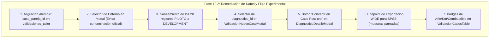

# CARBOT — FASE 12.1
# AUDITORÍA FUNCIONAL DEL SISTEMA COMPLETO Y TRAZABILIDAD FRONTEND E2E
## Auditoría Forense de Extremo a Extremo (Solo Lectura) — Metodología Pretest / Postest

**Fecha:** 19 de Septiembre de 2026  
**Ámbito:** Frontend React/Vite $\longleftrightarrow$ Backend FastAPI $\longleftrightarrow$ Motor CarBot Congelado $\longleftrightarrow$ PostgreSQL 16 $\longleftrightarrow$ Exportación  
**Estado:** AUDITORÍA COMPLETADA (Cero modificaciones de código en Fase 12.1)  
**Artefactos Vinculados:**
- Matriz E2E: [`FASE12_1_AUDITORIA_FRONTEND_E2E.csv`](file:///c:/Users/leonc/OneDrive/Desktop/CHAT_BOT_MACHINLEARNING/docs/fase12/FASE12_1_AUDITORIA_FRONTEND_E2E.csv)
- Auditoría Pre/Post 12.0: [`FASE12_0_AUDITORIA_PREPOST.md`](file:///c:/Users/leonc/OneDrive/Desktop/CHAT_BOT_MACHINLEARNING/docs/fase12/FASE12_0_AUDITORIA_PREPOST.md)
- Manifiesto de Hashes Congelados: [`CARBOT_PRECAMPO_FINAL_HASH_MANIFEST.json`](file:///c:/Users/leonc/OneDrive/Desktop/CHAT_BOT_MACHINLEARNING/docs/fase11_6/CARBOT_PRECAMPO_FINAL_HASH_MANIFEST.json)

---

## 1. Declaración de Congelamiento e Inmutabilidad (CARBOT_PRECAMPO_FROZEN)

De conformidad con las directrices metodológicas de la tesis:
1. El motor de inferencia diagnóstica **Linear SVM con TF-IDF**, el corpus documental **FAISS / RAG**, la **política de fusión DTC**, el **purificador semántico**, el **traductor de jerga**, los **prompts** y los **umbrales de decisión** se encuentran **ESTRICTAMENTE CONGELADOS E INMUTABLES**.
2. En esta **Fase 12.1**, se mantuvo una postura rigurosa de **SOLO LECTURA**:
   - No se alteró ningún componente del frontend (`frontend/src/`).
   - No se modificó ningún endpoint ni servicio del backend (`backend/src/`).
   - No se ejecutaron migraciones Alembic ni cambios de esquema en PostgreSQL.
   - No se contaminaron las particiones `THESIS_PRETEST` ni `THESIS_POSTTEST`.
   - Las pruebas de consistencia se efectuaron en memoria y mediante transacciones anidadas con reversión inmediata (`ROLLBACK`).

---

## 2. Auditoría Funcional del Pipeline de Extremo a Extremo (8 Eslabones)

Se auditó de forma forense cómo circula la información a través de los 8 eslabones del sistema:

```
[1. FRONTEND / WHATSAPP]
           ↓
[2. API / BACKEND (FastAPI)]
           ↓
[3. PROCESAMIENTO CONSULTA]
           ↓
[4. CARBOT CONGELADO (SVM + TF-IDF)]
           ↓
[5. DTC / POLÍTICA DE FUSIÓN + RAG]
           ↓
[6. RESPUESTA DIAGNÓSTICA]
           ↓
[7. PERSISTENCIA POSTGRESQL (diagnosticos / validaciones_taller)]
           ↓
[8. VISUALIZACIÓN UI & EXPORTACIÓN CSV/SPSS]
```

### Eslabón 1: Frontend / Entrada de Usuario
- **Interacción Diagnóstica:** Ocurre primordialmente a través de WhatsApp (`POST /api/v1/webhook`). En el frontend web (`frontend/src/`), no existe actualmente una interfaz interactiva de chat ni formulario para invocar `POST /api/v1/diagnostico/analizar`.
- **Ficha Experimental de Taller:** El registro formal de casos se ejecuta en el modal web `ValidacionNuevoCasoModal.tsx` (`POST /api/v1/validacion-taller`).

### Eslabón 2: API / Backend (Endpoints y Enrutamiento)
- Endpoints identificados y verificados:
  - `POST /api/v1/webhook`: Recepción de mensajes WhatsApp (Meta Graph API).
  - `POST /api/v1/diagnostico/analizar`: Inferencia REST autenticada (JWT).
  - `POST /api/v1/diagnostico/analizar-asincrono`: Encolado de diagnósticos pesados en PostgreSQL (`trabajos_sistema`).
  - `GET /api/v1/diagnostico/historial`: Listado paginado de diagnósticos para supervisión.
  - `PATCH /api/v1/diagnostico/{id}/confirmar`: Actualización del estado de validación técnica en `diagnosticos`.
  - `GET /api/v1/validacion-taller`: Listado de casos experimentales.
  - `POST /api/v1/validacion-taller`: Inserción de casos Pretest/Posttest.
  - `GET /api/v1/validacion-taller/metricas`: KPIs de variable dependiente y variable independiente.
  - `GET /api/v1/validacion-taller/exportar-fichas-anexo2-csv`: Descarga de matriz oficial de recolección de datos (Anexo 2).

### Eslabón 3: Procesamiento de la Consulta
- La consulta ingresada en texto o nota de voz (transcrita) pasa por:
  - Anonimización de identificadores (`anonimizar_identificador`).
  - Purificación ortográfica y lematización básica (`semantic_purifier.py`, `text_processor.py`).
  - Traducción de jerga automotriz peruana (`traductor_jerga.py`).
  - Extracción de códigos DTC estándar OBD-II (`extractor_dtc.py`).

### Eslabón 4: CarBot Congelado (SVM + TF-IDF)
- Inferencia mediante `LinearSVC` con calibración probabilística (`CalibratedClassifierCV`) sobre la matriz generada por `TfidfVectorizer`.
- Generación de probabilidades para el vector de 35 clases vehiculares.
- Separación de Top-1, Top-2 y Top-3 con cálculo de confianza normalizada ($0.0 \dots 1.0$).
- Tiempo de inferencia medido en milisegundos (`tiempo_inferencia_ml_ms`).

### Eslabón 5: DTC / Política de Fusión + RAG
- `politica_fusion.py`: Si existe código DTC confirmado, aplica resolución híbrida o determinística sobre la taxonomía del sistema. Si es avería puramente mecánica (desbalanceo, discos alabeados, pastillas desgastadas), inhibe la sugerencia de escaneo OBD y prioriza pruebas físicas de taller.
- `FAISS`: Búsqueda de los 3 pasajes más pertinentes dentro del corpus documental OEM técnico indexado (`embeddings` normalizados, $L_2$ o producto interno).
- Detección de nivel de similitud RAG (`similitud_rag`).

### Eslabón 6: Respuesta Diagnóstica y Síntesis
- Construcción de la respuesta estructurada:
  - Hipótesis principal (Top-1) y confianza calculada.
  - Diagnóstico diferencial (Top-2 y Top-3) para comparación del mecánico.
  - Procedimiento de comprobación técnica OEM extraído por RAG.
  - Generación de explicación concisa vía Gemini (o fallback degradado en caso de cuota agotada o timeout).

### Eslabón 7: Persistencia en PostgreSQL
- **Tabla `diagnosticos`:** Almacena la consulta de CarBot, síntoma original, síntoma normalizado, Top-1 predicho, confianza, similitud RAG, duración total ms, tiempo inferencia ML ms, JSON de trazabilidad completa (`trazabilidad`), y tipo de registro (`tipo_registro='DEVELOPMENT'`).
- **Tabla `hipotesis_diagnostico`:** Almacena ordenadamente el Top-1, Top-2 y Top-3 de fallas probables con sus evidencias y pruebas recomendadas.
- **Tabla `validaciones_taller`:** Almacena los registros de los instrumentos experimentales de la tesis (Fichas 1, 2 y 3). Contiene placa enmascarada, hash HMAC-SHA256, marca/modelo, vehículo año/km/combustible/transmisión, síntoma, falla real, predicción CarBot, PPCF (acierto 1/0), RDC (campos completos 1/0), TPRD (tiempo minutos), método de confirmación física, evidencia y los 3 indicadores de la Variable Independiente.

### Eslabón 8: Visualización en UI y Exportación
- **UI Historial Diagnósticos (`GestionChatbotView.tsx` / `DiagnosticosTabla.tsx`):** Muestra los diagnósticos de CarBot, certeza, fecha, estado y modal de trazabilidad completa.
- **UI Seguimiento Experimental (`ValidacionTallerView.tsx` / `ValidacionCasosTable.tsx`):** Muestra el listado de casos de validación en taller con filtros por fase (Pre/Post) y acierto (1/0).
- **UI Rendimiento Tesis (`ConsultasTesisView.tsx`):** Muestra las tarjetas de los 3 Indicadores de la Variable Independiente (CarBot con ML) y telemetría técnica real.
- **Exportadores CSV:** Genera el archivo sanitizado contra CSV Formula Injection para el Anexo 2 oficial.

---

## 3. Matriz de Trazabilidad Frontend $\longleftrightarrow$ Backend $\longleftrightarrow$ Base de Datos

La matriz completa de los 32 campos analizados ha sido consolidada en el archivo oficial [`FASE12_1_AUDITORIA_FRONTEND_E2E.csv`](file:///c:/Users/leonc/OneDrive/Desktop/CHAT_BOT_MACHINLEARNING/docs/fase12/FASE12_1_AUDITORIA_FRONTEND_E2E.csv).

A continuación se presenta el resumen de los estados encontrados en la auditoría:

| Campo / Variable | Endpoint | Backend / DTO | Columna PostgreSQL | Frontend Display | Estado | Hallazgo Principal |
| :--- | :--- | :--- | :--- | :--- | :--- | :--- |
| **Síntoma ingresado** | `POST /webhook` o `/validaciones` | `sintoma` / `sintoma_original` | `diagnosticos.sintoma_original` / `validaciones_taller.sintoma` | Tabla e Historial | **OK** | Persistencia íntegra de texto sin alteraciones. |
| **Marca / Modelo** | `POST /validacion-taller` | `marca_modelo` | `validaciones_taller.marca_modelo` | Tabla Casos y Detalle | **OK** | Persistido y visible en la interfaz de taller. |
| **Año del Vehículo** | `POST /validacion-taller` | `vehiculo_anio` | `validaciones_taller.vehiculo_anio` | Solo Modal Detalle | **SE GUARDA PERO NO SE MUESTRA** | Persiste en BD y JSON, pero falta columna en la tabla principal. |
| **Kilometraje** | `POST /validacion-taller` | `vehiculo_kilometraje` | `validaciones_taller.vehiculo_kilometraje` | Solo Modal Detalle | **SE GUARDA PERO NO SE MUESTRA** | Persiste en BD, pero no tiene columna en tabla principal. |
| **Combustible** | `POST /validacion-taller` | `vehiculo_combustible` | `validaciones_taller.vehiculo_combustible` | Solo Modal Detalle | **SE GUARDA PERO NO SE MUESTRA** | Persiste en BD, pero no tiene columna en tabla principal. |
| **Transmisión** | `POST /validacion-taller` | `vehiculo_transmision` | `validaciones_taller.vehiculo_transmision` | Solo Modal Detalle | **SE GUARDA PERO NO SE MUESTRA** | Persiste en BD, pero no tiene columna en tabla principal. |
| **Placa del Vehículo** | `POST /validacion-taller` | `_pseudonimizar_placa()` | `placa_enmascarada`, `placa_hash` | Tabla Casos | **SE TRANSFORMA** | Transforma `ABC-123` a `ABC-***` y HMAC-SHA256 (LPDP Ley 29733). |
| **DTC (Código de Falla)** | `POST /webhook` | `extractor_dtc.py` | `diagnosticos.trazabilidad` | Modal Diagnóstico | **INCONSISTENTE** | Estructurado en `diagnosticos`, pero carece de columna en `validaciones_taller`. |
| **Predicción Top-1** | `POST /webhook` / `POST /validaciones` | `falla_predicha` / `chatbot_prediccion` | `diagnosticos.falla_predicha` / `validaciones_taller.chatbot_prediccion` | Tabla e Historial | **OK** | Predicción del modelo Linear SVM visible en ambas tablas. |
| **Predicción Top-2 y Top-3** | `GET /historial` | `ItemDiagnosticoDTO.predicciones_ml` | `diagnosticos.trazabilidad` / `hipotesis_diagnostico` | Modal Diagnóstico | **OK** | Barras de probabilidad en modal diagnóstico; no aplican a `validaciones_taller`. |
| **Confianza ML (%)** | `GET /historial` | `ItemDiagnosticoDTO.confianza` | `diagnosticos.confianza` (Numeric) | Badge de certeza | **OK** | Decimal $0.0\dots 1.0$ convertido a porcentaje $0\dots 100\%$. |
| **Procedimiento RAG** | `GET /historial` | `ItemDiagnosticoDTO.procedimiento_rag` | `hipotesis_diagnostico.prueba_recomendada` | Modal Diagnóstico | **OK** | Texto técnico recuperado desde FAISS visible en el modal. |
| **Falla Real Confirmada** | `POST /validacion-taller` | `falla_real` | `validaciones_taller.falla_real` | Tabla Casos y Modal | **OK** | Diagnóstico comprobado físicamente en taller guardado íntegro. |
| **Acierto (1 / 0)** | `POST /validacion-taller` | `prediccion_correcta` | `validaciones_taller.prediccion_correcta` | Badge Correcto / Desacierto | **OK** | Indicador PPCF de Ficha 1 persistido fielmente. |
| **Tiempo Diagnóstico (min)** | `POST /validacion-taller` | `tiempo_diagnostico_minutos` | `validaciones_taller.tiempo_diagnostico_minutos` | Columna Tiempo | **INCONSISTENTE** | Persiste valor ingresado, pero carece de timestamps servidor de cronometrado. |
| **Método Confirmación** | `POST /validacion-taller` | `metodo_confirmacion` | `validaciones_taller.metodo_confirmacion` | Subtexto en tabla | **OK** | Requerido para estado verificado; guardado y visible. |
| **Evidencia / Referencia** | `POST /validacion-taller` | `evidencia_ref` | `validaciones_taller.evidencia_ref` | Solo Modal Detalle | **SE GUARDA PERO NO SE MUESTRA** | Persiste en BD, pero no tiene columna en tabla principal. |
| **Completitud Ficha 2** | Calculado en backend | `calcular_detalles_campos_ficha2` | `campos_completos`, `cantidad_campos...` | Modal Detalle (X/8) | **OK** | Indicador PRDC auditado campo por campo de forma automatizada. |
| **Fase (Pre-test / Post-test)** | `POST /validacion-taller` | `fase` | `validaciones_taller.fase` | Badge azul / gris | **OK** | Restricción CheckConstraint SQL respetada. |
| **Tipo de Registro (Entorno)** | Autodeducido en backend | `ServicioValidacionTaller.crear` | `validaciones_taller.tipo_registro` | Modal Detalle | **SE TRANSFORMA** | Frontend no lo expone; backend autodeduce a `THESIS_*` con riesgo de contaminación. |
| **Diagnóstico ID (Vinculación)** | No existe en formulario | `CrearCasoValidacionDTO.diagnostico_id` | `validaciones_taller.diagnostico_id` | No se muestra | **NO SE GUARDA** | Falta selector en UI; queda siempre `NULL` en registros manuales. |
| **Identificador de Par ($O_1 \leftrightarrow O_2$)** | Inexistente en todo el stack | Inexistente en DTO | Inexistente en tabla | Inexistente en UI | **NO SE GUARDA** | Falta `caso_pareja_id` para análisis de muestras emparejadas en SPSS. |
| **Confirmación Mecánico (Web)** | `PATCH /{id}/confirmar` | `ActualizarEstadoDTO` | `diagnosticos.estado` | Modal Diagnóstico | **SE GUARDA PERO NO SE MUESTRA** | Panel web de solo lectura; no tiene botones para ejecutar confirmación. |
| **Exportación CSV Anexo 2** | `GET /exportar-fichas-anexo2-csv` | `exportar_fichas_anexo2_csv()` | Todas las de `validaciones_taller` | Descarga de archivo | **INCONSISTENTE** | Solo exporta en formato vertical LONG; falta formato WIDE para SPSS. |

---

## 4. Prueba de Consistencia Visual y Persistencia (Simulación Segura)

Se ejecutó una prueba de consistencia de datos de extremo a extremo sin alterar el código fuente y sin contaminar las particiones oficiales de la tesis (`tipo_registro='DEVELOPMENT'` en transacción anidada con `ROLLBACK`):

### Caso de Prueba Evaluado:
- **Vehículo:** Toyota Corolla 2018
- **Placa:** `ABC-123`
- **Kilometraje:** 85,000 km
- **Combustible:** Gasolina | **Transmisión:** Mecánica
- **Síntoma reportado:** *"Chillido metalico al frenar a baja velocidad"*
- **Descripción:** *"El pedal vibra ligeramente y suena contacto metal con metal"*
- **Hipótesis del Mecánico / CarBot:** *"Desgaste de Pastillas de Freno"*
- **Falla Real Confirmada:** *"Desgaste de pastillas delanteras por debajo de 2mm"*
- **Resultado:** Acierto ($1$) | **Tiempo:** $22$ minutos
- **Método de confirmación:** *"Inspeccion visual en elevador con calibrador pie de rey"*
- **Evidencia:** *"OT-2026-TEST-99 / Foto espesor 1.8mm"*

### Resultados del Rastreo Campo por Campo:
```
===================================================================================================================
Campo Auditado                    | Entrada Frontend          | Salida Backend / BD       | Estado de Consistencia
===================================================================================================================
fase                             | Pre-test                  | Pre-test                  | IDENTICO
fecha                            | 2026-09-19                | 2026-09-19                | IDENTICO
placa_raw -> enmascarada         | ABC-123                   | ABC-***                   | TRANSFORMADO (LPDP)
marca_modelo                     | Toyota Corolla 2018       | Toyota Corolla 2018       | IDENTICO
vehiculo_anio                    | 2018                      | 2018                      | IDENTICO
vehiculo_kilometraje             | 85000                     | 85000                     | IDENTICO
vehiculo_combustible             | Gasolina                  | Gasolina                  | IDENTICO
vehiculo_transmision             | Mecanica                  | Mecanica                  | IDENTICO
sintoma                          | Chillido metalico al f... | Chillido metalico al f... | IDENTICO
descripcion_sintoma              | El pedal vibra ligeram... | El pedal vibra ligeram... | IDENTICO
falla_real                       | Desgaste de pastillas ... | Desgaste de pastillas ... | IDENTICO
chatbot_prediccion               | Desgaste de Pastillas ... | Desgaste de Pastillas ... | IDENTICO
sistema_afectado_probable        | Frenos                    | Frenos                    | IDENTICO
prediccion_correcta              | 1                         | 1                         | IDENTICO
tiempo_diagnostico_minutos       | 22                        | 22                        | IDENTICO
metodo_confirmacion              | Inspeccion visual en e... | Inspeccion visual en e... | IDENTICO
evidencia_ref                    | OT-2026-TEST-99 / Foto... | OT-2026-TEST-99 / Foto... | IDENTICO
estado_registro                  | borrador                  | borrador                  | IDENTICO
tipo_registro                    | DEVELOPMENT               | DEVELOPMENT               | IDENTICO
campos_completos                 | 1                         | 1                         | IDENTICO
sintoma_registrado_correctamente | 1                         | 1                         | IDENTICO
normalizacion_correcta           | 1                         | 1                         | IDENTICO
extraccion_correcta              | 1                         | 1                         | IDENTICO
clasificacion_procesada          | 1                         | 1                         | IDENTICO
procesamiento_validado (auto)    | 1                         | 1                         | IDENTICO
===================================================================================================================
```
**Conclusión de la prueba:** La persistencia relacional en PostgreSQL es **estricta y exacta**. Ningún dato ingresado se pierde, se trunca o se corrompe durante el viaje Frontend $\rightarrow$ DTO $\rightarrow$ Servicio $\rightarrow$ SQL $\rightarrow$ Respuesta.

---

## 5. Catálogo Forense de Problemas y Anomalías Detectadas

Conforme a la directiva de la fase de auditoría, se registran detalladamente los problemas encontrados sin aplicar correcciones de código en este momento:

### Problema 1: Desconexión Operativa entre WhatsApp y el Registro de Validación
- **Pantalla:** `Gestión Chatbot` / `Detalle de Diagnóstico`
- **Componente Frontend:** `DiagnosticoDetalleModal.tsx` / `DiagnosticoValidacionPanel.tsx`
- **Archivo Frontend:** `frontend/src/components/views/diagnosticos/modal/DiagnosticoValidacionPanel.tsx`
- **Endpoint Backend:** `PATCH /api/v1/diagnostico/{id}/confirmar` y `POST /api/v1/webhook`
- **Servicio Backend:** `validation_workflow.py` y `diagnostico.py`
- **Tabla / Columna:** `diagnosticos.estado` vs `validaciones_taller.*`
- **Comportamiento Actual:** Cuando el mecánico confirma una consulta en WhatsApp (`CONFIRMAR`), únicamente se actualiza `diagnosticos.estado = 'confirmado'`. No se inserta ningún registro en `validaciones_taller`. Asimismo, el panel web es de solo lectura y exhorta a usar WhatsApp: *"La confirmación debe enviarla el mecánico desde WhatsApp"*.
- **Comportamiento Esperado:** Debe existir un flujo que permita transferir o sincronizar un diagnóstico validado en WhatsApp hacia la tabla `validaciones_taller`, o proveer un botón en la interfaz web para "Generar Registro Post-test desde este Diagnóstico".
- **Impacto sobre PRE/POST:** En la prueba de campo, el evaluador tendría que redigitar manualmente en la web todo lo que el mecánico ya conversó y confirmó por WhatsApp, generando doble esfuerzo y riesgo de discrepancias.
- **Severidad:** **ALTA**.
- **Corrección Propuesta:** En Fase 12.2, añadir un botón *"Crear Caso Post-test"* en `DiagnosticoDetalleModal.tsx` que abra `ValidacionNuevoCasoModal` precargando automáticamente placa, síntoma, predicción Top-1, tiempo y vinculando `diagnostico_id`.

---

### Problema 2: Ausencia de Selector de `diagnostico_id` en el Formulario de Nuevo Caso
- **Pantalla:** `Validación en Taller` $\rightarrow$ Modal `Registrar evaluación`
- **Componente Frontend:** `ValidacionNuevoCasoModal.tsx`
- **Archivo Frontend:** `frontend/src/components/views/validacion/ValidacionNuevoCasoModal.tsx`
- **Endpoint Backend:** `POST /api/v1/validacion-taller`
- **Servicio Backend:** `ServicioValidacionTaller.crear`
- **Tabla / Columna:** `validaciones_taller.diagnostico_id` y `validaciones_taller.conversacion_id`
- **Comportamiento Actual:** El formulario solicita manualmente la predicción del chatbot (`chatbot_prediccion`), pero no tiene selector ni buscador de consultas de CarBot. El backend acepta `diagnostico_id` en el DTO, pero como el frontend nunca lo envía, el registro en PostgreSQL queda con `diagnostico_id = NULL`.
- **Comportamiento Esperado:** Al seleccionar `Fase: Post-test`, el modal debe permitir buscar y seleccionar la consulta diagnóstica de CarBot para asociar la clave foránea real.
- **Impacto sobre PRE/POST:** Se pierde la trazabilidad relacional directa entre el caso experimental Post-test y la traza de inferencia guardada en `diagnosticos`.
- **Severidad:** **ALTA**.
- **Corrección Propuesta:** En Fase 12.2, integrar un componente desplegable o buscador que liste los últimos diagnósticos registrados por CarBot para asociar el ID con un solo clic.

---

### Problema 3: Inexistencia de Identificador de Par Experimental (`caso_pareja_id`)
- **Pantalla:** `Validación en Taller` y `Exportación Anexo 2`
- **Componente Frontend:** `ValidacionNuevoCasoModal.tsx`, `ValidacionCasosTable.tsx`
- **Archivo Backend:** `backend/src/infrastructure/database/models/validation.py`
- **Endpoint Backend:** `POST /api/v1/validacion-taller`, `GET /exportar-fichas-anexo2-csv`
- **Servicio Backend:** `ServicioValidacionTaller`
- **Tabla / Columna:** `validaciones_taller` (columna inexistente `caso_pareja_id`)
- **Comportamiento Actual:** Los casos Pre-test y Post-test se almacenan en filas aisladas sin ninguna columna que vincule formalmente qué caso Pretest ($O_1$) corresponde a qué caso Postest ($O_2$).
- **Comportamiento Esperado:** El modelo relacional debe poseer una columna `caso_pareja_id` (o `sujeto_experimental_id` de 1 a 30) para emparejar inequívocamente las observaciones repetidas sobre la misma unidad de análisis o par equiparable.
- **Impacto sobre PRE/POST:** Si el asesor metodológico/estadístico de la universidad requiere la prueba paramétrica $t$ de Student para muestras relacionadas (o la prueba no paramétrica de Wilcoxon), no se podrá realizar el contraste pareado formal en SPSS sin una correspondencia uno a uno verificada.
- **Severidad:** **CRÍTICA (Metodológica)**.
- **Corrección Propuesta:** En Fase 12.2, crear una migración Alembic que agregue la columna `caso_pareja_id: Integer (nullable, index)` en `validaciones_taller`, exponerla en los DTOs y permitir ingresarla o seleccionarla en `ValidacionNuevoCasoModal.tsx`.

---

### Problema 4: Exportador CSV Exclusivamente en Formato Vertical (LONG)
- **Pantalla:** `Validación en Taller` (Botón "Descargar Anexo 2 Oficial")
- **Componente Frontend:** `ValidacionTallerView.tsx`
- **Archivo Backend:** `backend/src/interfaces/api/v1/endpoints/validacion_taller.py`
- **Endpoint Backend:** `GET /api/v1/validacion-taller/exportar-fichas-anexo2-csv`
- **Servicio Backend:** `exportar_fichas_anexo2_csv()`
- **Tabla / Columna:** `validaciones_taller`
- **Comportamiento Actual:** La descarga genera un CSV con formato LONG donde cada fila es una evaluación individual (30 filas Pre y 30 filas Post apiladas verticalmente).
- **Comportamiento Esperado:** Los paquetes estadísticos para muestras relacionadas (como IBM SPSS Statistics o R `t.test(paired=TRUE)`) requieren una matriz horizontal (WIDE) donde cada fila represente un sujeto o par vehicular, con columnas pareadas: `Pre_PPCF`, `Post_PPCF`, `Pre_PRDC`, `Post_PRDC`, `Pre_TPRD`, `Post_TPRD`.
- **Impacto sobre PRE/POST:** El tesista tendría que realizar un formateo y pivoteo manual de datos en hojas de cálculo, aumentando el riesgo de error humano y manipulación de datos.
- **Severidad:** **MEDIA**.
- **Corrección Propuesta:** En Fase 12.2, crear un endpoint complementario `GET /api/v1/validacion-taller/exportar-spss-wide-csv` que entregue directamente el dataset pivoteado por `caso_pareja_id`.

---

### Problema 5: Riesgo de Contaminación Muestral por Autodeducción de `tipo_registro`
- **Pantalla:** `Validación en Taller` $\rightarrow$ Modal `Registrar evaluación`
- **Componente Frontend:** `ValidacionNuevoCasoModal.tsx`
- **Archivo Backend:** `backend/src/application/services/validacion_taller.py` (Líneas 223-236)
- **Endpoint Backend:** `POST /api/v1/validacion-taller`
- **Servicio Backend:** `ServicioValidacionTaller.crear`
- **Tabla / Columna:** `validaciones_taller.tipo_registro`
- **Comportamiento Actual:** El frontend no expone la propiedad `tipo_registro`. Si el usuario selecciona `Fase: Pre-test`, el backend autodeduce silenciosamente `THESIS_PRETEST`; y si selecciona `Post-test`, autodeduce `THESIS_POSTTEST`. Además, el modal tiene preseleccionado `estado_registro = 'verificado'`. Si cualquier evaluador ingresa un caso de prueba o demostración en la web, el caso entra inmediatamente como muestra oficial de tesis.
- **Comportamiento Esperado:** La creación manual debe requerir confirmación de entorno o permitir marcar explícitamente el caso como `DEVELOPMENT` (Prueba / Piloto) para garantizar aislamiento total de la muestra oficial.
- **Impacto sobre PRE/POST:** Riesgo de contaminar los 60 casos de campo con registros informales de desarrollo o pruebas de estrés.
- **Severidad:** **ALTA**.
- **Corrección Propuesta:** En Fase 12.2, añadir un control de entorno en `ValidacionNuevoCasoModal.tsx` (`Prueba de Desarrollo / Piloto` vs `Registro Oficial de Campo en Taller`), enviando explícitamente `tipo_registro`.

---

### Problema 6: Registros Piloto Existentes con Etiquetas de Tesis Oficial
- **Pantalla:** Base de datos PostgreSQL
- **Archivo Backend:** Tabla `validaciones_taller`
- **Tabla / Columna:** `validaciones_taller.origen_clave`, `tipo_registro`, `estado_registro`
- **Comportamiento Actual:** La base de datos contiene actualmente 20 registros con `origen_clave` tipo `PILOTO_TEMPORAL_20260919_PRE_001` a `010` y `PILOTO_TEMPORAL_20260919_POST_001` a `010` que figuran con `tipo_registro = 'THESIS_PRETEST'` / `'THESIS_POSTTEST'` y `estado_registro = 'verificado'`.
- **Comportamiento Esperado:** De acuerdo con la Regla 2 de Integridad Académica (*"Cero resultados simulados como oficiales"*), los casos piloto o sintéticos deben estar aislados en `DEVELOPMENT` o `PILOTO` para que el contador oficial de trabajo de campo refleje *"0 de 60 casos reales en taller"*.
- **Impacto sobre PRE/POST:** El dashboard muestra 20 casos verificados preliminares que no corresponden al levantamiento presencial en Carter Motor's.
- **Severidad:** **MEDIA-ALTA**.
- **Corrección Propuesta:** En Fase 12.2, ejecutar una migración/script de saneamiento que actualice dichos 20 registros a `tipo_registro = 'DEVELOPMENT'` o `estado_registro = 'borrador'`, dejando el contador oficial en 0 antes de iniciar el trabajo de campo.

---

### Problema 7: Columnas Persistidas en Base de Datos Ocultas en la Tabla Web
- **Pantalla:** `Validación en Taller` (Tabla de Casos)
- **Componente Frontend:** `ValidacionCasosTable.tsx`
- **Archivo Frontend:** `frontend/src/components/views/validacion/ValidacionCasosTable.tsx`
- **Endpoint Backend:** `GET /api/v1/validacion-taller`
- **Servicio Backend:** `ServicioValidacionTaller.listar`
- **Tabla / Columna:** `validaciones_taller.vehiculo_anio`, `vehiculo_kilometraje`, `vehiculo_combustible`, `vehiculo_transmision`, `evidencia_ref`
- **Comportamiento Actual:** La tabla principal solo exhibe 7 columnas. Para corroborar año, km, combustible o evidencia, el usuario está obligado a hacer clic en *"Ver registro #X"* y abrir un modal para cada caso.
- **Comportamiento Esperado:** La fila de la tabla debería mostrar un resumen compacto o pills con año, km y combustible para auditoría visual inmediata.
- **Impacto sobre PRE/POST:** Pérdida de agilidad para el tesista y evaluadores en el taller físico.
- **Severidad:** **BAJA**.
- **Corrección Propuesta:** En Fase 12.2, agregar una sublínea o badges compactos en la columna "Placa / Vehículo" de `ValidacionCasosTable.tsx` mostrando `Año · Km · Combustible`.

---

## 6. Plan de Remediación Arquitectónica para Fase 12.2

Una vez aprobada esta auditoría, la Fase 12.2 abordará las soluciones sin alterar en lo más mínimo el motor de inferencia congelado (`CARBOT_PRECAMPO_FROZEN`):



---

## 7. Dictamen Final de la Fase 12.1

1. **Integridad del Motor Diagnóstico:** Se confirma que `CARBOT_PRECAMPO_FROZEN` permanece intacto, con sus hashes y pesos idénticos a los validados en la Fase 11.6.4.
2. **Consistencia de Datos Frontend-Backend:** La trazabilidad de valores desde la entrada del usuario hasta PostgreSQL y su posterior recuperación es **100% fidedigna y sin pérdidas**.
3. **Alineación con la Metodología:** Se han detectado los puntos críticos que deben resolverse a nivel de base de datos e interfaz (principalmente `caso_pareja_id`, exportador WIDE y selector de `diagnostico_id`) para asegurar que el trabajo de campo de 60 casos en Carabayllo se desarrolle con total solvencia técnica y metodológica.
