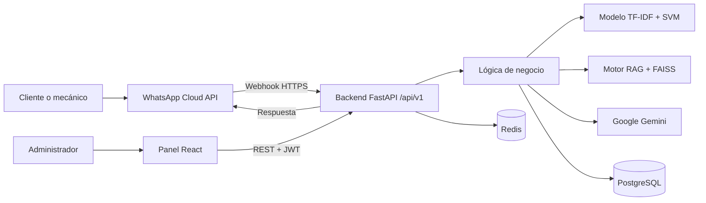
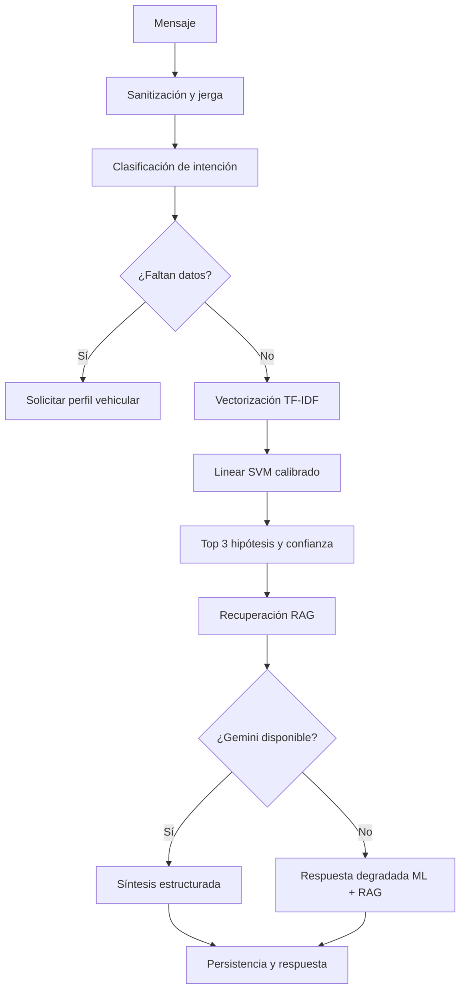

# Documentación general del sistema CarBot

**Proyecto:** Chatbot utilizando Machine Learning para el diagnóstico vehicular en los talleres mecánicos de Carabayllo, 2026  
**Fecha de actualización:** 21 de agosto de 2026  
**Tipo de documento:** Descripción funcional, técnica y arquitectónica  
**Estado:** Sistema de apoyo al diagnóstico preliminar; requiere validación humana

## 1. Resumen ejecutivo

CarBot es un sistema inteligente que recibe consultas automotrices mediante
WhatsApp y ayuda a organizar el proceso inicial de diagnóstico vehicular. Su
función no es reemplazar al mecánico, sino recopilar información, interpretar
síntomas, proponer hipótesis y registrar evidencia para que un profesional
realice la comprobación física correspondiente.

El sistema combina cuatro capacidades:

1. procesamiento de lenguaje natural y normalización de jerga mecánica;
2. clasificación de fallas mediante Machine Learning;
3. recuperación de procedimientos mediante RAG;
4. generación de una respuesta estructurada mediante un modelo de lenguaje.

El mecánico utiliza WhatsApp. El panel web queda reservado para el
administrador del taller, quien gestiona accesos, revisa diagnósticos y consulta
métricas.

## 2. Problema que busca resolver

En la recepción de un taller, los síntomas suelen expresarse de forma ambigua:
“pierde fuerza”, “cascabelea”, “se prendió el chancho” o “se sopló el empaque”.
Además, frecuentemente faltan datos como marca, modelo, año, motor, combustible
o kilometraje.

Esto puede producir:

- registros incompletos;
- pérdida de tiempo durante la indagación inicial;
- hipótesis apresuradas;
- falta de trazabilidad sobre lo consultado y lo comprobado;
- respuestas genéricas que no consideran las diferencias entre vehículos.

CarBot busca estandarizar esa primera etapa y hacer explícito cuándo todavía no
existe información suficiente para orientar una revisión.

## 3. Objetivos del sistema

### 3.1 Objetivo general

Apoyar el diagnóstico vehicular preliminar mediante un chatbot con Machine
Learning, evaluando su influencia sobre la precisión, la completitud de la
información y el tiempo inicial de atención.

### 3.2 Objetivos funcionales

- Atender consultas desde WhatsApp.
- Distinguir clientes de mecánicos autorizados.
- Interpretar síntomas y jerga automotriz peruana.
- Solicitar los datos faltantes del vehículo.
- Clasificar posibles fallas y comunicar su confianza estimada.
- Recuperar evidencia técnica relacionada.
- Registrar cada diagnóstico para revisión administrativa.
- Permitir que el administrador confirme, corrija o descarte resultados.
- Conservar trazabilidad sin exponer innecesariamente datos personales.

## 4. Alcance y usuarios

| Usuario | Canal | Funciones principales |
| --- | --- | --- |
| Cliente | WhatsApp | Consultar servicios, citas, ubicación y solicitar acceso técnico. |
| Mecánico autorizado | WhatsApp | Realizar consultas técnicas y diagnósticos preliminares. |
| Administrador | Panel web y WhatsApp | Autorizar mecánicos, administrar personas, revisar diagnósticos y métricas. |

Los mecánicos no necesitan una cuenta para entrar al panel web. Su autorización
se asocia a su identidad de WhatsApp. El backend y el frontend bloquean el panel
para cualquier rol no administrativo.

## 5. Cómo se construyó CarBot

El proyecto evolucionó en etapas incrementales:

### Etapa 1: definición del problema

Se identificaron las variables de la tesis y las necesidades del taller:
precisión del diagnóstico, completitud de la información y eficiencia del
tiempo de atención.

### Etapa 2: diseño modular

El repositorio se organizó como monorepo, separando el panel, la API, los
artefactos de Machine Learning, la infraestructura, los scripts y la
documentación. Esto evita mezclar código de interfaz, reglas de negocio y datos
de entrenamiento.

### Etapa 3: backend y persistencia

Se construyó una API REST con FastAPI y una capa de persistencia asíncrona con
PostgreSQL, SQLAlchemy y asyncpg. Alembic controla la evolución del esquema.

### Etapa 4: canal de WhatsApp

Se integró WhatsApp Cloud API mediante webhooks. El sistema identifica al
contacto, persiste el mensaje, procesa la intención y utiliza un outbox para
enviar respuestas con posibilidad de reintento.

### Etapa 5: motor de inteligencia artificial

Se preparó una taxonomía de fallas, se limpiaron los síntomas, se compararon
algoritmos y se seleccionó Linear SVM calibrado con representación TF-IDF. Se
añadió un traductor de jerga, contexto del vehículo y control de baja confianza.

### Etapa 6: RAG y síntesis

Se incorporó un corpus técnico multimarca, recuperación vectorial con FAISS y
síntesis controlada mediante Google Gemini. El sistema mantiene un modo
degradado basado en ML y RAG si el servicio generativo no está disponible.

### Etapa 7: panel administrativo

Se desarrolló una aplicación React y TypeScript para gestionar personas,
accesos, diagnósticos, métricas y seguimiento experimental.

### Etapa 8: profesionalización

Se añadieron autenticación JWT con renovación, permisos por rol, limitación de
peticiones, pseudonimización, auditoría, pruebas automatizadas, Docker, Redis,
CI, documentación y organización profesional de carpetas.

## 6. Arquitectura general



No existe una carpeta genérica llamada `conexion` porque cada conexión pertenece
a la capa que la implementa:

- el frontend se conecta por REST mediante `frontend/src/services/api.ts`;
- PostgreSQL se conecta desde `backend/src/infrastructure/database/connection.py`;
- ML se carga mediante `backend/src/infrastructure/modelo_ml.py`;
- RAG se carga mediante `backend/src/infrastructure/motor_rag.py`;
- WhatsApp se integra mediante los endpoints y servicios del webhook.

## 7. Componentes principales

| Componente | Responsabilidad | Ubicación |
| --- | --- | --- |
| Panel administrativo | Interfaz exclusiva para administradores. | `frontend/` |
| API REST | Expone autenticación, diagnósticos, personas y métricas. | `backend/src/interfaces/api/` |
| Núcleo de negocio | Orquesta sesiones, intención, diagnóstico, caché y colas. | `backend/src/core/` |
| Persistencia | Modelos, conexión y repositorios PostgreSQL. | `backend/src/infrastructure/database/` |
| Adaptador ML | Carga el vectorizador y el clasificador entrenado. | `backend/src/infrastructure/modelo_ml.py` |
| Motor RAG | Indexa y recupera evidencia del corpus técnico. | `backend/src/infrastructure/motor_rag.py` |
| Pipeline de entrenamiento | Limpieza, comparación, evaluación y exportación. | `machine_learning/training/` |
| Datasets | Datos base, fuentes abiertas y reportes de calidad. | `machine_learning/data/` |
| Corpus técnico | Procedimientos, manuales y metadatos de procedencia. | `machine_learning/manuals/` |
| Infraestructura | PostgreSQL, Docker y utilidades operativas. | `infrastructure/`, `docker-compose.yml` |
| Documentación | Arquitectura, tesis, operación y evidencias. | `docs/` |

## 8. Backend

El backend utiliza Python, FastAPI, Uvicorn y Pydantic. Sigue una separación por
capas:

### 8.1 Interfaces

Contienen los endpoints HTTP y los contratos de entrada y salida. Todas las
rutas funcionales se agrupan bajo `/api/v1`.

Módulos principales:

- `auth`: login, renovación y cambio de contraseña;
- `webhook`: recepción de Meta y compatibilidad con Twilio;
- `diagnostico`: análisis, historial y revisión;
- `mecanicos`: administración del equipo;
- `clientes`: clientes y solicitudes de acceso;
- `metricas`: indicadores del taller;
- `validacion-taller`: seguimiento experimental y exportación CSV.

### 8.2 Núcleo

Incluye las reglas que no deben depender directamente de la interfaz:

- `gestor_diagnostico.py`: coordina ML, RAG y síntesis;
- `intent_classifier.py`: distingue diagnóstico, consulta técnica y texto fuera de alcance;
- `vehicle_profile.py`: extrae y completa el perfil del vehículo;
- `traductor_jerga.py`: normaliza expresiones locales;
- `session_manager.py`: conserva contexto conversacional;
- `diagnostic_cache.py`: caché LRU de hasta 2,000 entradas y TTL de dos horas;
- `gemini_queue.py`: controla trabajos y cuotas del modelo generativo;
- `security.py`: tokens, contraseñas y autorización;
- `sanitizer.py`: saneamiento de entradas.

### 8.3 Infraestructura interna

Implementa adaptadores concretos para base de datos, modelos, secretos y
servicios externos. El contenedor de dependencias ensambla repositorios y
servicios sin obligar al núcleo a conocer detalles de conexión.

## 9. Flujo de WhatsApp

### 9.1 Cliente normal

Un número no autorizado recibe opciones informativas. Este flujo no debe
ejecutar un diagnóstico técnico completo.

### 9.2 Solicitud de acceso

1. El cliente selecciona la opción `4`.
2. Se registra una solicitud pendiente.
3. El administrador la revisa desde el panel.
4. Si se aprueba, el número obtiene acceso como mecánico.
5. Si se rechaza o revoca, conserva únicamente el flujo de cliente.

### 9.3 Mecánico autorizado

El sistema clasifica el mensaje como:

- **diagnóstico:** existe un síntoma o una avería que debe registrarse;
- **consulta técnica:** pregunta informativa que no representa una avería;
- **fuera de alcance:** mensaje que no debe forzarse como problema automotriz.

Los mensajes se vinculan a conversaciones y se protegen contra procesamiento
duplicado mediante el identificador enviado por Meta.

## 10. Perfil del vehículo y contexto conversacional

El bot puede extraer datos expresamente escritos:

- marca;
- modelo;
- año;
- motor o cilindrada;
- tipo de combustible;
- sistema GNV o GLP;
- kilometraje.

Si faltan datos relevantes, conserva el síntoma y solicita la información antes
de completar el análisis. Esto permite continuar la conversación sin obligar al
mecánico a escribir nuevamente todo el problema.

La marca, el modelo y el año mejoran el contexto, pero no garantizan certeza. Un
procedimiento específico requiere una fuente aplicable a esa versión, motor y
mercado.

## 11. Pipeline de diagnóstico



La respuesta puede incluir:

- posible falla;
- confianza estimada;
- hipótesis alternativas;
- datos que todavía faltan;
- verificaciones iniciales seguras;
- gravedad preliminar;
- procedencia de la evidencia cuando existe.

## 12. Machine Learning

El modelo vigente está identificado como `2.2.0-external-audited`.

| Elemento | Estado documentado |
| --- | --- |
| Representación | TF-IDF con unigramas y bigramas |
| Clasificador ganador | Linear SVM calibrado |
| Registros de entrenamiento | 2,894 |
| Registros base | 2,861 |
| Registros externos incorporados | 33 |
| Clases | 48 |
| Exactitud del holdout agrupado | 97.54 % |
| F1 macro del holdout agrupado | 95.95 % |
| F1 ponderado | 97.03 % |
| Umbral de baja confianza | 0.50 |

Estas cifras son evaluaciones internas sobre particiones controladas. El propio
artefacto de métricas declara que el modelo **no está aprobado para diagnóstico
autónomo**, debido a clases con poco soporte, una clase con F1 inferior al
objetivo y un error de calibración ECE de aproximadamente 24.81 %.

Por esa razón, CarBot presenta hipótesis y exige validación mecánica. No debe
afirmarse que el sistema tiene 97.54 % de certeza para cualquier consulta real.

## 13. RAG y corpus técnico

El subsistema RAG recupera fragmentos relacionados antes de generar la respuesta.
El corpus está organizado por marca, modelo, año y categorías generales,
incluyendo Toyota, Nissan, Hyundai, Kia y GNV/GLP.

El catálogo actual contiene 64 registros de procedimientos con campos de
trazabilidad como fuente, edición, página, URL, licencia y hash SHA-256 del
fragmento.

El benchmark RAG de 10/10 corresponde únicamente a diez consultas controladas:
siete positivas y tres negativas. Sirve para verificar el comportamiento básico
del recuperador, no demuestra efectividad universal.

Cuando la similitud no supera el umbral configurado, el sistema debe reconocer
que el corpus no ofrece respaldo suficiente.

## 14. Google Gemini

Gemini no sustituye al modelo clasificador. Su función es organizar la
información producida por ML y RAG en una respuesta conversacional.

La cola de trabajos:

- controla solicitudes por minuto y por día;
- coordina múltiples workers mediante PostgreSQL;
- registra estados, tiempos y consumo;
- permite un modo degradado cuando no existe cuota o conectividad.

No se deben enviar secretos, credenciales ni datos personales innecesarios al
servicio externo.

## 15. Panel administrativo

El frontend utiliza React, TypeScript y Vite. Sus vistas principales son:

| Vista | Función |
| --- | --- |
| Login | Autenticación y cambio obligatorio de contraseña. |
| Inicio | Métricas y estado general del sistema. |
| Personas y accesos | Solicitudes, clientes y equipo del taller. |
| Diagnósticos | Historial, filtros, detalle y validación de resultados. |
| Validación de taller | Seguimiento experimental, métricas y exportación. |
| Fichas de tesis | Presentación de instrumentos y resultados académicos. |

El historial de diagnósticos permite búsqueda, filtros, ordenamiento,
paginación y estados de revisión. Para descartar un diagnóstico se exige una
observación técnica.

El detalle presenta la entrada original, texto normalizado, hipótesis ML,
confianza, evidencia RAG, síntesis, tiempos, etapas y uso de caché cuando esos
datos están disponibles.

## 16. Autenticación y permisos

- El access token JWT dura dos horas.
- El refresh token dura siete días.
- El frontend intenta renovar automáticamente una sesión expirada.
- Las renovaciones simultáneas comparten una única petición.
- Las contraseñas administrativas deben tener al menos 12 caracteres,
  mayúscula, minúscula y número.
- El backend valida los permisos; ocultar botones en React no es la única defensa.
- Solo `administrador` o `admin` puede usar el panel.
- La última ruta válida se conserva para restaurar la navegación.

## 17. Persistencia y modelo de datos

PostgreSQL almacena, entre otros:

- talleres y roles;
- usuarios administrativos;
- identidades de WhatsApp;
- solicitudes de acceso;
- vehículos;
- conversaciones y mensajes;
- diagnósticos e hipótesis;
- trabajos y cuotas de Gemini;
- uso de APIs y auditoría;
- operaciones pendientes del outbox.

Los repositorios aíslan el acceso a datos. Alembic contiene 16 migraciones desde
el esquema inicial hasta la incorporación de nombre de usuario administrativo.

## 18. Seguridad y privacidad

El sistema incorpora:

- JWT firmado para sesiones administrativas;
- PBKDF2-HMAC-SHA256 para contraseñas;
- HMAC-SHA256 para pseudonimizar teléfonos y placas;
- Fernet para datos que necesitan recuperarse de forma segura;
- validación criptográfica de la firma del webhook de Meta;
- rate limiting con soporte Redis;
- CORS configurable;
- prevención de mensajes duplicados;
- aislamiento por `taller_id` en el tracker experimental;
- sanitización contra CSV Formula Injection;
- escrituras atómicas y bloqueo entre procesos;
- política de retención de datos configurable.

Los secretos se guardan en `.env` o en un gestor externo y nunca deben subirse a
Git. `.env.example` documenta únicamente los nombres de configuración.

## 19. APIs principales

| Método y ruta | Función |
| --- | --- |
| `POST /api/v1/auth/login` | Iniciar sesión. |
| `POST /api/v1/auth/refresh` | Renovar tokens. |
| `POST /api/v1/auth/cambiar-password` | Cambiar contraseña. |
| `GET/POST /api/v1/webhook` | Verificar y recibir mensajes. |
| `POST /api/v1/diagnostico/analizar` | Analizar un síntoma. |
| `GET /api/v1/diagnostico/historial` | Consultar diagnósticos. |
| `PATCH /api/v1/diagnostico/{id}/confirmar` | Revisar un diagnóstico. |
| `GET/POST /api/v1/mecanicos` | Consultar o registrar personal. |
| `GET /api/v1/clientes` | Consultar clientes. |
| `POST /api/v1/clientes/solicitudes/{id}/aprobar` | Autorizar acceso técnico. |
| `GET /api/v1/metricas/resumen` | Obtener indicadores del taller. |
| `GET/POST /api/v1/validacion-taller` | Consultar o registrar casos experimentales. |
| `GET /api/v1/validacion-taller/exportar-csv` | Exportar datos sanitizados. |
| `GET /health/live` | Comprobar que el proceso está vivo. |
| `GET /health/ready` | Comprobar PostgreSQL, ML, RAG y worker Gemini. |

## 20. Infraestructura y despliegue

El entorno Docker Compose define:

- PostgreSQL 17;
- Redis 7;
- API FastAPI;
- perfil opcional de pruebas.

En desarrollo, Vite sirve el frontend y redirige `/api` al backend local. ngrok
puede exponer temporalmente el puerto 8000 para que Meta entregue webhooks.

GitHub Pages aloja únicamente páginas estáticas como política de privacidad e
instrucciones de eliminación de datos. No ejecuta el backend, la base de datos
ni el modelo.

## 21. Tecnologías y herramientas

| Área | Tecnologías |
| --- | --- |
| Backend | Python, FastAPI, Uvicorn, Pydantic |
| Frontend | React, TypeScript, Vite, Recharts, Lucide React |
| Base de datos | PostgreSQL, SQLAlchemy Async, asyncpg, Alembic |
| Machine Learning | scikit-learn, NumPy, pandas, joblib |
| RAG | FAISS, TF-IDF y corpus técnico local |
| IA generativa | Google Gemini |
| Mensajería | WhatsApp Cloud API y compatibilidad Twilio |
| Caché y límites | Redis, SlowAPI y caché LRU local |
| Seguridad | PyJWT, cryptography, HMAC y PBKDF2 |
| Infraestructura | Docker Compose, ngrok y GitHub Actions |
| Calidad | Pytest, Coverage, Ruff, Oxlint y TypeScript |

Las versiones exactas se encuentran en `backend/requirements.txt` y
`frontend/package.json`.

## 22. Verificación actual

Verificación local realizada el 21 de agosto de 2026:

- backend: 173 pruebas aprobadas, 46 omitidas y 0 fallos;
- módulo del tracker experimental: 10 pruebas aprobadas;
- Ruff: 0 errores;
- Oxlint: 0 errores y 0 advertencias;
- compilación TypeScript y build Vite: aprobados;
- harnesses de rutas y edición de perfiles: aprobados;
- `git diff --check`: limpio.

Las pruebas omitidas corresponden a integraciones opcionales o entornos que
requieren servicios específicos; no se contabilizan como fallos.

## 23. Limitaciones actuales

- El modelo no está aprobado para diagnóstico autónomo.
- Se necesitan más casos reales confirmados e independientes del entrenamiento.
- Algunas clases tienen poco soporte o bajo F1 individual.
- La calibración de probabilidades todavía debe mejorar.
- El corpus RAG necesita más fuentes OEM verificables por marca, modelo, motor y año.
- Los recalls deben mostrarse como evidencia oficial separada, no como una falla aprendida.
- Gemini y ngrok dependen de cuotas y servicios externos.
- Una URL temporal de ngrok deja de funcionar si el túnel se cierra o cambia.
- El sistema no puede confirmar una reparación sin pruebas físicas.

## 24. Estructura del repositorio

```text
CHAT_BOT_MACHINLEARNING/
├── backend/             API, negocio, persistencia e integraciones
├── frontend/            panel administrativo
├── machine_learning/    datos, modelos, corpus y entrenamiento
├── infrastructure/      recursos de base de datos y despliegue
├── scripts/             automatización y operación
├── docs/                documentación técnica y académica
├── docker-compose.yml   servicios coordinados
└── README.md            presentación pública del proyecto
```

## 25. Responsabilidad de uso

CarBot es una herramienta de apoyo y de investigación. Toda hipótesis debe ser
confirmada mediante inspección, escáner, mediciones y procedimientos adecuados.
Ante síntomas relacionados con frenos, dirección, combustible, alta tensión,
temperatura extrema u otros riesgos críticos, se debe detener el uso del
vehículo y priorizar una evaluación profesional segura.

## 26. Documentos relacionados

- `docs/arquitectura/conexiones_modulos.md`
- `docs/arquitectura/estructura_proyecto.md`
- `docs/base_datos_postgresql.md`
- `docs/evaluacion_rag_benchmark.md`
- `docs/trazabilidad_datos_entrenamiento_y_defensa_jurado.md`
- `machine_learning/data/FUENTES_ENTRENAMIENTO.md`
- `machine_learning/manuals/FUENTES_Y_VALIDACION.md`
- `SECURITY.md`

